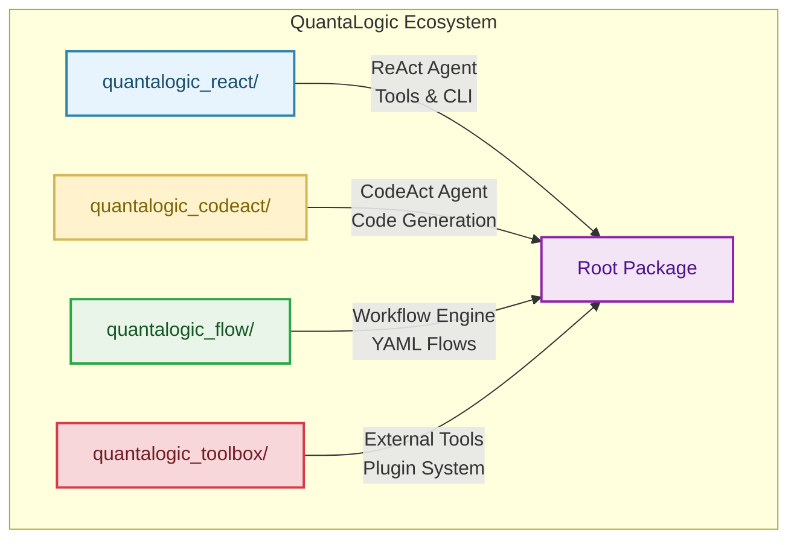

# Contributing Guide

Thank you for your interest in contributing to QuantaLogic! We welcome contributions from everyone. This guide covers our multi-component architecture and development workflow.

---

## 🏗️ Project Architecture

QuantaLogic is organized into focused components, each with specific responsibilities:



### Component Responsibilities

- **quantalogic_react/**: Core ReAct agent implementation with 40+ tools
- **quantalogic_codeact/**: Specialized coding agent with advanced code generation
- **quantalogic_flow/**: YAML-based workflow engine for complex task orchestration
- **quantalogic_toolbox/**: External tool integrations and plugin system
- **Root Package**: User interface layer that re-exports all components

---

## 🚀 Getting Started

### 1. Fork and Clone
```bash
git clone https://github.com/yourusername/quantalogic.git
cd quantalogic
```

### 2. Set Up Development Environment

#### Option A: Full Development (All Components)
```bash
# Create virtual environment
python -m venv venv
source venv/bin/activate  # On Windows: venv\Scripts\activate

# Install main project in development mode
pip install -e .

# Install component dependencies
cd quantalogic_codeact && poetry install && cd ..
cd quantalogic_flow && poetry install && cd ..
cd quantalogic_toolbox && poetry install && cd ..
```

#### Option B: Component-Specific Development
```bash
# For React component development
cd quantalogic_react
poetry install
poetry shell

# For CodeAct component development  
cd quantalogic_codeact
poetry install
poetry shell

# For Flow component development
cd quantalogic_flow
poetry install
poetry shell
```

### 3. Verify Installation
```bash
# Test main package
python -c "from quantalogic import Agent; print('✅ Main package works')"

# Test CLI
quantalogic --help
quantalogic_codeact --help
quantalogic-flow --help
```

---

## 🛠️ Development Workflow

### Component-Specific Development

#### React Agent Development
```bash
cd quantalogic_react/
# Main agent logic in quantalogic/
# Add new tools to quantalogic/tools/
# Update CLI in quantalogic/main.py
```

#### CodeAct Agent Development  
```bash
cd quantalogic_codeact/
# Specialized coding agent
# Independent development cycle
poetry install && poetry shell
```

#### Flow Engine Development
```bash
cd quantalogic_flow/
# YAML workflow definitions
# Flow execution engine
poetry install && poetry shell
```

#### Toolbox Development
```bash
cd quantalogic_toolbox/
# External tool integrations
# Plugin system components
poetry install && poetry shell
```

### Making Changes

1. **Choose Your Component**: Identify which component your changes affect
2. **Create Feature Branch**: 
   ```bash
   git checkout -b feature/component-feature-name
   ```
3. **Make Changes**: Work within the appropriate component directory
4. **Test Locally**: Use component-specific testing (see Testing section)
5. **Update Documentation**: Update relevant README files and docs

---

## 🧪 Testing Strategy

### Component Testing

#### React Agent Testing
```bash
cd quantalogic_react/
pytest tests/  # Component-specific tests

# Test tool integration
python -c "from quantalogic.tools import PythonTool; print('✅ Tools work')"

# Test agent functionality
python -c "from quantalogic import Agent; agent = Agent('gpt-3.5-turbo'); print('✅ Agent works')"
```

#### CodeAct Testing
```bash
cd quantalogic_codeact/
poetry run pytest tests/
```

#### Flow Testing
```bash  
cd quantalogic_flow/
poetry run pytest tests/
```

### Integration Testing
```bash
# Test cross-component integration
pytest tests/  # Root-level integration tests

# Test user-facing imports
python -c "from quantalogic import Agent; from quantalogic.tools import Tool; print('✅ Integration works')"
```

### Full Test Suite
```bash
# Run all tests across components
./run_all_tests.sh  # If available, or manually run each component's tests
```

---

## 📝 Code Style

We use `ruff` for consistent code style across all components:

### Linting and Formatting
```bash
# Check style issues
ruff check .

# Format code automatically  
ruff format .

# Component-specific linting
cd quantalogic_react/ && ruff check .
cd quantalogic_codeact/ && ruff check .
cd quantalogic_flow/ && ruff check .
```

### Style Guidelines
- Follow [PEP 8](https://peps.python.org/pep-0008/) for Python code
- Use type hints for function parameters and return values
- Keep functions ≤20 lines, ≤3 parameters when possible
- Use descriptive names for variables and functions
- Document complex logic with comments explaining **WHY**, not WHAT

### Component-Specific Patterns

#### Tool Development (React Agent)
```python
from quantalogic.tools import Tool, ToolArgument

class MyTool(Tool):
    def __init__(self):
        super().__init__(
            name="my_tool",
            description="Clear description of what the tool does",
            arguments=[
                ToolArgument(name="param", type="str", description="Parameter description")
            ]
        )
    
    def execute(self, **kwargs) -> str:
        """Execute the tool with given arguments."""
        # Implementation here
        return "Result"
```

#### Agent Integration
```python
from quantalogic import Agent

# Always use descriptive variable names
analysis_agent = Agent(model_name="gpt-4")
result = analysis_agent.run("Clear task description")
```

---

## 🔄 Pull Request Guidelines

### Branch Strategy
```bash
# Feature branches by component
git checkout -b feature/react-new-tool        # React component
git checkout -b feature/codeact-enhancement   # CodeAct component  
git checkout -b feature/flow-yaml-parser      # Flow component
git checkout -b feature/integration-fix       # Cross-component
```

### PR Checklist
Before submitting your PR, ensure:

- [ ] **Component Tests Pass**: All tests in your component pass
- [ ] **Integration Tests Pass**: Cross-component functionality works
- [ ] **Documentation Updated**: README files and inline docs updated
- [ ] **Examples Work**: Any new features have working examples
- [ ] **User API Preserved**: No breaking changes to user-facing APIs
- [ ] **Performance Check**: No significant performance regressions

### PR Template
```markdown
## Component
- [ ] quantalogic_react
- [ ] quantalogic_codeact  
- [ ] quantalogic_flow
- [ ] quantalogic_toolbox
- [ ] Cross-component/Integration

## Change Type
- [ ] New Feature
- [ ] Bug Fix
- [ ] Documentation
- [ ] Performance Improvement
- [ ] Refactoring

## Description
Brief description of changes and motivation.

## Testing
- [ ] Added/updated tests
- [ ] All tests pass
- [ ] Tested with real scenarios

## Breaking Changes
List any breaking changes and migration path.
```

---

## 🏗️ Common Development Tasks

### Adding a New Tool (React Agent)
1. Create tool file in `quantalogic_react/quantalogic/tools/`
2. Implement tool class inheriting from `Tool`
3. Add tool to `__init__.py` exports
4. Write tests in `tests/tools/`
5. Update tool documentation

### Enhancing CodeAct Agent
1. Work in `quantalogic_codeact/` directory
2. Use Poetry for dependency management
3. Test with coding-specific scenarios
4. Ensure compatibility with React agent tools

### Creating Flow Templates
1. Add YAML templates to `quantalogic_flow/templates/`
2. Test flow execution with sample data
3. Document flow parameters and outputs
4. Add integration examples

### Adding External Tool Integrations
1. Work in `quantalogic_toolbox/` directory
2. Follow plugin architecture patterns
3. Handle API credentials securely
4. Provide clear setup instructions

---

## 📚 Documentation Standards

### README Files
- Each component has comprehensive README.md
- Include architecture diagrams (Mermaid preferred)
- Provide usage examples and API references
- Keep performance metrics updated

### Code Documentation
```python
def complex_function(param: str) -> str:
    """
    Brief description of what the function does.
    
    Args:
        param: Description of parameter
        
    Returns:
        Description of return value
        
    Raises:
        SpecificError: When this error occurs
    """
    # Explain WHY, not WHAT
    # This approach was chosen because...
    return result
```

### API Documentation
- Document all public APIs with docstrings
- Include type hints for all parameters
- Provide usage examples in docstrings
- Keep examples simple and focused

---

## 🐛 Debugging and Troubleshooting

### Common Development Issues

#### Import Errors
```bash
# Check component installation
pip list | grep quantalogic

# Verify development installation
pip install -e .
```

#### Tool Loading Issues
```bash
# Debug tool discovery
python -c "from quantalogic.tools import get_available_tools; print(get_available_tools())"
```

#### Agent Configuration
```bash
# Test basic agent functionality
python -c "from quantalogic import Agent; agent = Agent('gpt-3.5-turbo'); print('Agent created successfully')"
```

### Performance Profiling
```bash
# Profile import performance
python -c "import time; start = time.time(); from quantalogic import Agent; print(f'Import time: {time.time() - start:.3f}s')"

# Profile agent execution
python -m cProfile -s cumulative your_test_script.py
```

---

## 🤝 Community Guidelines

### Code of Conduct
We are committed to fostering a welcoming and inclusive community. By participating in this project, you agree to abide by our [Code of Conduct](CODE_OF_CONDUCT.md).

### Getting Help
- **Documentation**: Check component README files first
- **Issues**: Search existing GitHub issues before creating new ones
- **Discussions**: Use GitHub Discussions for questions and ideas
- **Component-Specific Help**: Tag issues with component labels

### Contribution Recognition
- All contributors are acknowledged in release notes
- Significant contributions earn collaborator status
- Component maintainers guide development in their areas

---

## 🚀 Release Process

### Version Management
- **Major**: Breaking changes to user APIs
- **Minor**: New features, component additions
- **Patch**: Bug fixes, documentation updates

### Component Versioning
- Components maintain independent version numbers
- Root package version tracks major milestones
- Breaking changes are carefully managed and communicated

---

**Thank you for contributing to QuantaLogic!** 

Your efforts help build a powerful, modular AI agent ecosystem that serves developers and researchers worldwide. 🌟

---

*This guide reflects the reorganized QuantaLogic architecture (v0.94+). For questions about the development process, please open a GitHub Discussion.*