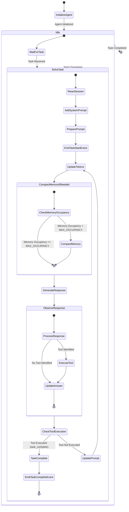
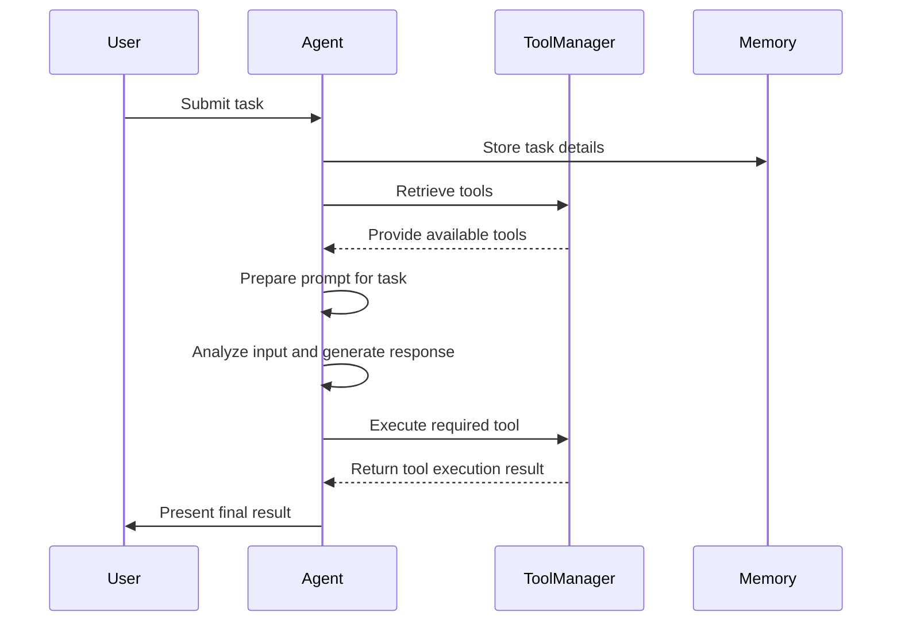

# QuantaLogic

[](https://opensource.org/licenses/Apache-2.0)
[](https://www.python.org/downloads/)
[](https://quantalogic.github.io/quantalogic/)


QuantaLogic is a  ReAct (Reasoning & Action) framework for building advanced AI agents. 

It seamlessly integrates large language models (LLMs) with a robust tool system, enabling agents to understand, reason about, and execute complex tasks through natural language interaction.

The `cli` version include coding capabilities comparable to Aider.

[📖 Documentation](https://quantalogic.github.io/quantalogic/)


[HowTo Guide](./docs/howto/howto.md)

## Why QuantaLogic?

We created [QuantaLogic](https://www.quantalogic.app) because we saw a significant gap between the advanced AI models developed by companies like OpenAI, Anthropic, DeepSeek and their practical implementation in everyday business processes. 

> Our mission is to bridge this gap, making the power of generative AI accessible and actionable for businesses of all sizes.


## 🌟 Highlights

- **ReAct Framework**: Advanced implementation combining LLM reasoning with concrete actions
- **Universal LLM Support**: Integration with OpenAI, Anthropic, LM Studio, Bedrock, Ollama, DeepSeek V3, via LiteLLM
- **Secure Tool System**: Docker-based code execution and file manipulation tools
- **Real-time Monitoring**: Web interface with SSE-based event visualization
- **Memory Management**: Intelligent context handling and optimization
- **Enterprise Ready**: Comprehensive logging, error handling, and validation system

## 📋 Table of Contents

- [Release Notes](#release-notes)

- [Installation](#-installation)
- [Quick Start](#-quickstart)
- [Key Components](#-key-components)
- [Agent System](#-agent-system)
- [Tool System](#-tool-system)
- [Web Interface](#-web-interface)
- [Examples](#-examples)
- [Development](#-development)
- [Contributing](#-contributing)
- [License](#-license)
- [Documentation Development](#-documentation-development)

## Release Notes

See our [Release Notes](RELEASE_NOTES.MD) for detailed version history and changes.

[TODO List](TODO.md)

## 📦 Installation

### Prerequisites

- Python 3.12+
- Docker (optional for code execution tools)

### Via pip

```bash
# Basic installation
pip install quantalogic
```

### From Source

```bash
git clone https://github.com/quantalogic/quantalogic.git
cd quantalogic
python -m venv .venv
source ./venv/bin/activate 
poetry install
```

## Using pipx

```
pipx install quantalogic
```


## 🚀 Quickstart

### Basic Usage

## 📖 CLI Reference

The QuantaLogic CLI provides powerful command-line capabilities:

```bash
Usage: quantalogic [OPTIONS] COMMAND [ARGS]...
  QuantaLogic AI Assistant - A powerful AI tool for various tasks.

Options:
  --version                       Show version information.
  --model-name TEXT               Specify the model (litellm format, e.g., "openrouter/deepseek/deepseek-chat").
  --log [info|debug|warning]      Set logging level.
  --verbose                       Enable verbose output.
  --mode [code|basic|interpreter|full|code-basic|search|search-full]  Agent mode.
  --vision-model-name TEXT        Specify the vision model (litellm format, e.g., "openrouter/A/gpt-4o-mini").
  --max-iterations INTEGER        Maximum iterations for task solving (default: 30).
  --max-tokens-working-memory INTEGER Maximum tokens to keep in working memory (default: 4000).
  --compact-every-n-iteration INTEGER Compact memory every N iterations (default: 5).
  --help                          Show this message and exit.

Commands:
  task  Execute a task with the QuantaLogic AI Assistant.
```

### Commands
task    Execute a task with the QuantaLogic AI Assistant

**Usage:** `quantalogic task [OPTIONS] [TASK]`  
**Description:** Execute a task with the QuantaLogic AI Assistant.  
**Options:**  
- `--file PATH`: Path to task file.  
- `--model-name TEXT`: Specify the model (litellm format, e.g., `openrouter/deepseek/deepseek-chat`).  
- `--verbose`: Enable verbose output.  
- `--mode [code|basic|interpreter|full|code-basic|search|search-full]`: Agent mode.  
- `--log [info|debug|warning]`: Set logging level.  
- `--vision-model-name TEXT`: Specify the vision model (litellm format).  
- `--max-iterations INTEGER`: Maximum iterations for task solving (default: 30).  
- `--max-tokens-working-memory INTEGER`: Maximum tokens to keep in working memory (default: 4000).  
- `--compact-every-n-iteration INTEGER`: Compact memory every N iterations (default: 5).  
- `--no-stream`: Disable streaming output (default: enabled).  
- `--help`: Show this message and exit.

**Detailed Parameter Descriptions:**

- **--model-name**: Specifies the LLM model to use (e.g., "openrouter/deepseek/deepseek-chat")
- **--mode**: Selects agent capabilities:
  - *code*: Coding-focused with basic capabilities
  - *basic*: General-purpose without coding tools
  - *interpreter*: Interactive code execution
  - *full*: All capabilities enabled
  - *code-basic*: Coding with basic reasoning
  - *search*: Web search integration
- **--log**: Controls logging verbosity (info, debug, warning)
- **--vision-model-name**: Specifies vision model for image processing
- **--max-iterations**: Limits task-solving attempts (default: 30)
- **--max-tokens-working-memory**: Controls memory usage (default: None)
- **--compact-every-n-iteration**: Memory optimization frequency (default: None)
- **--no-stream**: Disables real-time output streaming


### Detailed Usage

#### Agent Modes
- code: Coding-focused agent with basic capabilities
- basic: General-purpose agent without coding tools
- interpreter: Interactive code execution agent
- full: Full-featured agent with all capabilities
- code-basic: Coding agent with basic reasoning
- search: Web search agent with Wikipedia, DuckDuckGo and SERPApi integration

#### Task Execution

Tasks can be provided:

1. Directly via `task` parameter
2. Through a file using --file parameter
3. Interactively via standard input


#### Examples


Using a task file:
```bash
quantalogic task --file tasks/example.md --verbose
```

Selecting agent mode:
```bash
quantalogic --mode interpreter task "Explain quantum computing"
```

Interactive mode:
```bash
quantalogic
```

### Using QuantaLogic With code

```python
from quantalogic import Agent

# Initialize agent with default configuration
agent = Agent(model_name="deepseek/deepseek-chat")

# Execute a task
result = agent.solve_task(
    "Create a Python function that calculates the Fibonacci sequence"
)
print(result)
```

### Environment Configuration Example

```python
import os

from quantalogic import Agent

# Verify that DEEPSEEK_API_KEY is set
if not os.environ.get("DEEPSEEK_API_KEY"):
    raise ValueError("DEEPSEEK_API_KEY environment variable is not set")

# Initialize the AI agent with default configuration
agent = Agent(model_name="deepseek/deepseek-chat")

# Execute a sample task
result = agent.solve_task("Create a Python function that calculates the Fibonacci sequence")
print(result)
```

## 📖 Examples

Watch how QuantaLogic can generate complete tutorials from simple prompts:

[](./examples/generated_tutorials/python/quantalogic_long.mp4)

Example prompt: [04-write-a-tutorial.md](./examples/tasks/04-write-a-tutorial.md)

Here are some practical examples to help you get started:

Here is the markdown table based on the provided directory listing:

| Example | Description | File |
|---------|-------------|------|
| Simple Agent | A basic example of an agent implementation. | [examples/01-simple-agent.py](examples/01-simple-agent.py) |
| Agent with Event Monitoring | An example of an agent with event monitoring capabilities. | [examples/02-agent-with-event-monitoring.py](examples/02-agent-with-event-monitoring.py) |
| Agent with Interpreter | An example of an agent that includes an interpreter. | [examples/03-agent-with-interpreter.py](examples/03-agent-with-interpreter.py) |
| Agent Summary Task | An example of an agent performing a summary task. | [examples/04-agent-summary-task.py](examples/04-agent-summary-task.py) |
| Code Example | A general code example. | [examples/05-code.py](examples/05-code.py) |


## 🔨 Key Components

### Agent System

The core agent implements the `ReAct`paradigm, combining:

- Language model reasoning
- Tool execution capabilities
- Memory management
- Event handling
- Task validation

```python
from quantalogic import Agent
from quantalogic.tools import PythonTool, ReadFileTool

# Create agent with specific tools
agent = Agent(
    model_name="openrouter/deepseek/deepseek-chat",
    tools=[
        PythonTool(),
        ReadFileTool()
    ]
)

```

### How it works


The ReAct (Reasoning & Action) framework represents a significant advancement in the development of intelligent agents capable of autonomously reasoning through tasks and taking appropriate actions. 

QuantaLogic implements this framework, allowing integration with large language models (LLMs) to construct sophisticated agents that can tackle complex problems through natural language interaction. 

## What is a ReAct Agent?

### Basic Concept

A ReAct agent utilizes the synergy of reasoning and action. It not only processes natural language inputs but also executes actions in response to these inputs, utilizing various available tools. This functionality is particularly beneficial for environments where complex tasks can be decomposed into manageable subtasks.

### The QuantaLogic Implementation

QuantaLogic provides an effective implementation of the ReAct framework with several core components:

- **Generative Model**: This serves as the agent's brain, enabling it to interpret tasks and generate human-like text responses.
- **Memory Management**: This capability allows the agent to maintain context, keeping track of previous inputs and interactions to provide coherent responses.
- **Tool Management**: The agent has access to a diverse range of tools, enabling it to perform actions such as code execution, file manipulation, and API communication.

## How the ReAct Framework Works

### Workflow of a ReAct Agent

The following state diagram shows the core workflow of a QuantaLogic agent:



The following sequence diagram illustrates the workflow of a ReAct agent as it processes and solves a task:



### Key Components Explained

1. **User Input**: The agent begins by receiving a task or question from the user, which initiates the interaction.
2. **Memory Management**: Before tackling the task, the agent logs relevant task details into its memory, ensuring it has the necessary context for processing.
3. **Tool Retrieval**: The agent communicates with the ToolManager to inquire about available tools that can facilitate the required actions.
4. **Prompt Generation**: The agent constructs a prompt that outlines the task specifics, available tools, and any other pertinent context information.
5. **Analysis and Response Generation**: The agent uses its generative model to analyze the task input and formulate a response.
6. **Tool Execution**: If certain tools are needed for the task, the agent instructs the ToolManager to execute those tools, fetching the results for processing.
7. **Output to User**: Finally, the agent compiles and presents the results back to the user.

### Tool System

The QuantaLogic framework incorporates a well-defined tool system that enhances the functionality of AI agents by enabling them to perform a variety of tasks efficiently. Each tool is designed to address specific needs that arise in the context of complex problem-solving and task execution:

1. **Core Functionality**: Tools such as **AgentTool** and **LLMTool** are fundamental to the agent's operation, allowing it to manage tasks and interact with large language models. The integration of these tools enables the agent to process natural language inputs and execute corresponding actions effectively. **AgentTool** enables the agent to delegate tasks to specialized agents, and **LLMTool** provides the agent to explore a specific area of a latent space using role play.

2. **Code Execution**: Tools like **PythonTool**, **NodeJsTool**, and **ElixirTool** are vital for executing code in different programming languages. This capability allows the agent to handle programming tasks directly, facilitating real-time coding assistance and code evaluation.

3. **File Operations**: The framework includes tools for file management, such as **ReadFileTool**, **WriteFileTool**, and **ReplaceInFileTool**. These tools are essential for enabling the agent to read from and write to files, as well as update file content dynamically. This functionality supports scenarios where agents need to manipulate data or configuration files as part of the task execution process.

4. **Search Capabilities**: Tools like **RipgrepTool** and **SearchDefinitionNames** enhance the agent's ability to search through codebases and identify relevant definitions. This is crucial when dealing with large volumes of code, allowing the agent to quickly locate information necessary for problem-solving.

5. **Utility Functions**: Additional tools such as **DownloadHttpFileTool**, **ListDirectoryTool**, and **ExecuteBashCommandTool** provide broader functionality that supports various tasks, from fetching external resources to executing system commands. These utilities expand the operational scope of agents, allowing them to perform diverse actions beyond simple text processing.

6. **Documentation and Representation**: Tools like **MarkitdownTool** facilitate the generation of documentation, ensuring that output from the agent can be formatted and presented clearly. This is particularly beneficial for creating reports or guides based on the agent's findings and actions.

By integrating these tools into its architecture, QuantaLogic allows agents to perform a wide range of tasks autonomously while ensuring that they have the necessary resources and capabilities to do so effectively. This tool system is fundamental to the agent's ability to reason and act in sophisticated ways, thereby enhancing the overall utility of the framework in complex scenarios.

 

### Development

### Tools Documentation

For detailed documentation of all available tools, please see [REFERENCE_TOOLS.md](REFERENCE_TOOLS.md).
## 🔧 Development
### Setup Development Environment

```bash
# Clone repository
git clone https://github.com/quantalogic/quantalogic.git
cd quantalogic

# Create virtual environment
python -m venv venv
source venv/bin/activate  # Windows: venv\Scripts\activate

# Install dependencies
poetry install

```

### Run Tests

```bash
# Run all tests
pytest

# With coverage
pytest --cov=quantalogic

# Run specific tests
pytest tests/unit
```

### Code Quality

```bash
# Format code
ruff format

# Type checking
mypy quantalogic

# Linting
ruff check quantalogic
```

## 🤝 Contributing

1. Fork the repository
2. Create a feature branch
3. Write tests
4. Implement changes
5. Submit pull request

See [CONTRIBUTING.md](CONTRIBUTING.md) for detailed guidelines.

## 📄 License

Copyright 2024 QuantaLogic Contributors

Licensed under the Apache License, Version 2.0. See [LICENSE](LICENSE) for details.

## Project Growth
[](https://star-history.com/#quantalogic/quantalogic&Date)

Initiated with ❤️ by Raphaël MANSUY. Founder of [Quantalogic](https://www.quantalogic.app). 
