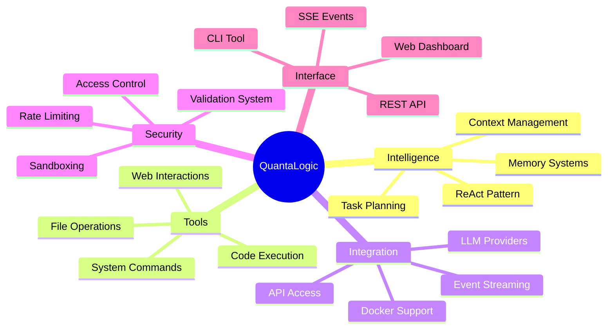
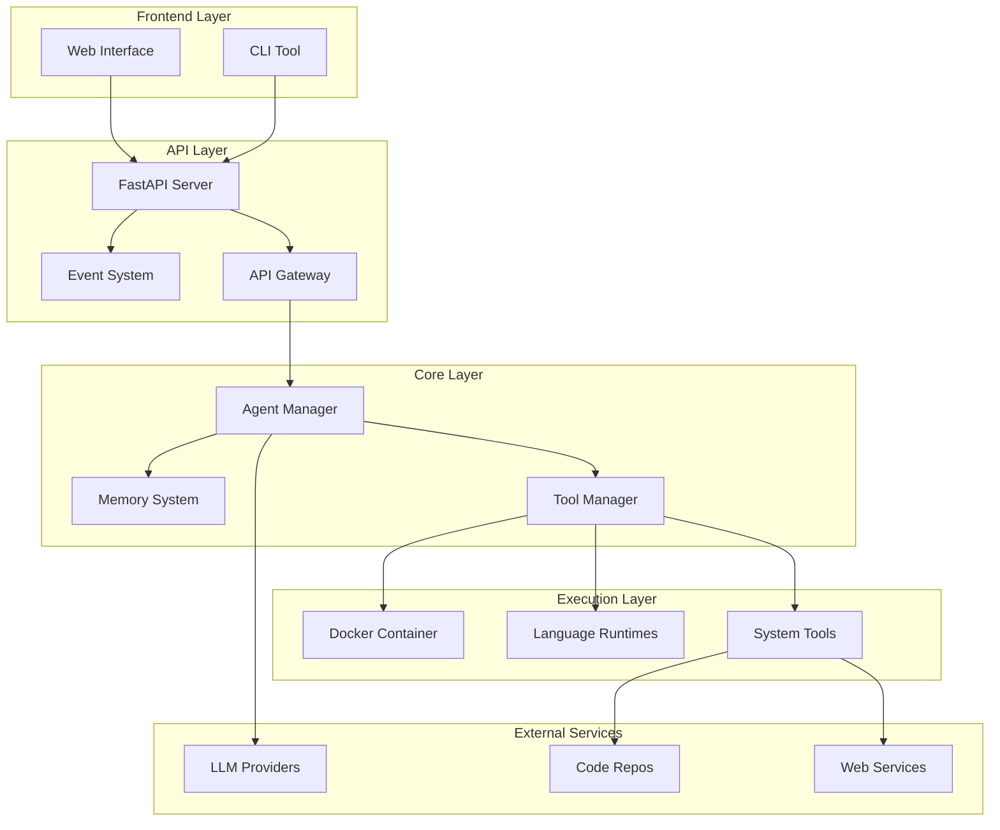
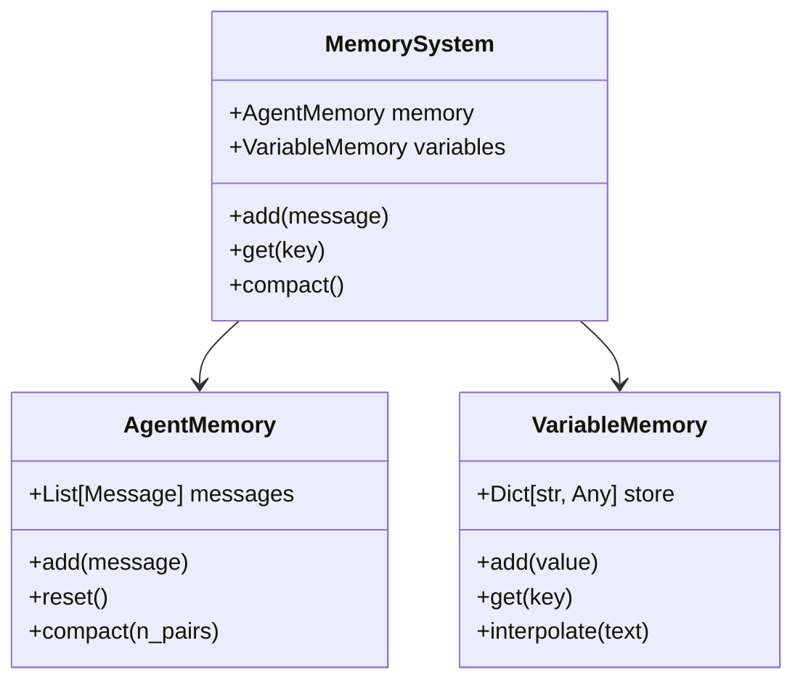
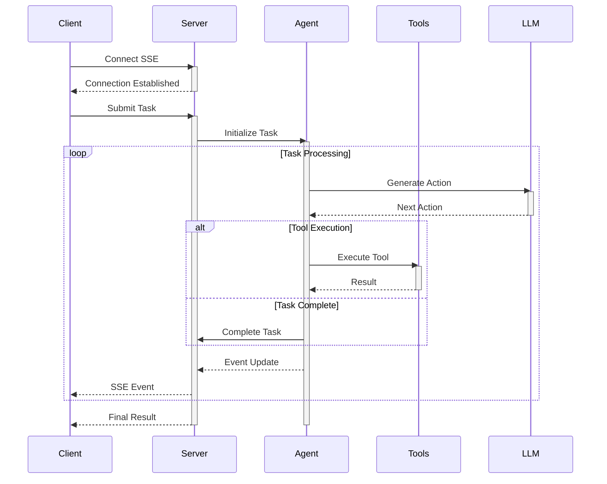

# QuantaLogic AI Assistant 🤖


[](https://github.com/your/repo)
[](LICENSE)
[](https://www.python.org/)
[](https://fastapi.tiangolo.com)
[](https://github.com/psf/black)
[](docs/README.md)

[Features](#features) •
[Demo](#live-demo) •
[Installation](#installation) •
[Documentation](docs/README.md) •
[Contributing](CONTRIBUTING.md)

</div>

## 📋 Table of Contents

- [Overview](#overview)
- [Features](#features)
- [System Architecture](#system-architecture)
- [Installation](#installation)
- [Quick Start](#quick-start)
- [Advanced Usage](#advanced-usage)
- [API Reference](#api-reference)
- [Development](#development)
- [Troubleshooting](#troubleshooting)
- [Contributing](#contributing)
- [License](#license)

## 🌟 Overview

QuantaLogic is a cutting-edge AI Assistant framework that implements the ReAct (Reasoning and Action) pattern, seamlessly integrating various Large Language Models (LLMs) with a sophisticated tool system for complex problem-solving.

### 🎯 Key Benefits

- **Intelligent Task Decomposition**: Breaks complex tasks into manageable sub-tasks
- **Flexible Tool Integration**: Easy-to-extend tool system for custom functionality
- **Real-time Monitoring**: Live event streaming and visualization
- **Multi-Model Support**: Works with various LLM providers
- **Docker-based Security**: Isolated execution environments
- **Enterprise-Ready**: Built with scalability and security in mind

## ✨ Features

### Core Capabilities



### Supported Languages & Tools

- 🐍 Python Integration
- 🟨 NodeJS/JavaScript Support
- ⚡ Elixir Execution
- 🦀 Rust Compilation
- 🔧 System Tools
- 📝 File Operations
- 🔍 Code Search
- 🌐 Web Tools

## 🏗 System Architecture

### High-Level Architecture



### Memory Architecture



### Event System Flow



## 🚀 Installation

### Prerequisites

- Python 3.11+
- Docker
- Node.js 18+ (optional)
- Rust (optional)

### Using pip

```bash
pip install quantalogic
```

### From Source

```bash
# Clone repository
git clone https://github.com/your-username/quantalogic.git
cd quantalogic

# Create virtual environment
python -m venv venv
source venv/bin/activate  # or `venv\Scripts\activate` on Windows

# Install dependencies
pip install -e .
```

### Using Docker

```bash
# Build image
docker build -t quantalogic .

# Run container
docker run -p 8000:8000 quantalogic
```

## 🚦 Quick Start

### Command Line Interface

```bash
# Basic usage
quantalogic "Write a Python function to calculate Fibonacci numbers"

# Specify model
quantalogic --model openrouter/deepseek/deepseek-chat "Explain quantum computing"

# Execute from file
quantalogic --execute-file task.txt
```

### Python API

```python
from quantalogic.agent_config import create_agent
from quantalogic.tools import PythonTool, NodeJsTool

# Create custom agent
agent = create_agent(
    model_name="openrouter/deepseek/deepseek-chat",
    tools=[
        PythonTool(),
        NodeJsTool(),
    ]
)

# Execute task
result = agent.solve_task(
    task="Write a Python function to calculate Fibonacci numbers",
    max_iterations=30
)

print(result)
```

### Web Interface

1. Start the server:
   ```bash
   quantalogic server
   ```

2. Access `http://localhost:8000`

### Docker Compose

```yaml
version: '3.8'
services:
  quantalogic:
    build: .
    ports:
      - "8000:8000"
    volumes:
      - ./config:/app/config
    environment:
      - LOG_LEVEL=INFO
      - MODEL_NAME=openrouter/deepseek/deepseek-chat
```

## 🔧 Configuration

### Environment Variables

| Variable | Description | Default |
|----------|-------------|---------|
| `LOG_LEVEL` | Logging level | `ERROR` |
| `MODEL_NAME` | Default LLM model | `openrouter/deepseek/deepseek-chat` |
| `MAX_TOKENS` | Maximum tokens per request | `4096` |
| `DOCKER_MEMORY_LIMIT` | Memory limit for containers | `512m` |

### Tool Configuration

```python
# agent_config.py
def create_agent(model_name: str) -> Agent:
    return Agent(
        model_name=model_name,
        tools=[
            TaskCompleteTool(),
            ReadFileTool(),
            WriteFileTool(),
            PythonTool(
                memory_limit="1g",
                timeout=30
            ),
            NodeJsTool(
                version="18",
                memory_limit="512m"
            ),
        ],
    )
```

## 📚 Documentation

- [Full Documentation](docs/README.md)
- [API Reference](docs/api.md)
- [Tool Development Guide](docs/tools.md)
- [Security Guide](docs/security.md)
- [Contributing Guide](CONTRIBUTING.md)

## 🔬 Development

### Testing

```bash
# Run all tests
pytest

# Run specific test category
pytest tests/test_tools.py

# With coverage
pytest --cov=quantalogic
```

### Code Quality

```bash
# Format code
black quantalogic

# Lint code
flake8 quantalogic

# Type checking
mypy quantalogic
```

## 🤝 Contributing

We welcome contributions! Please see our [Contributing Guide](CONTRIBUTING.md) for details.

### Development Process

1. Fork the repository
2. Create a feature branch
3. Make your changes
4. Run tests
5. Submit a pull request

## 📄 License

This project is licensed under the APACHE2 License - see the [LICENSE](LICENSE) file for details.

## 👏 Acknowledgments

- ReAct Pattern by [paper authors]
- LiteLLM for model integration
- Tree-sitter for code parsing
- FastAPI framework

## 📊 Project Status

- [x] Core Implementation
- [x] Basic Tool Set
- [x] Web Interface
- [ ] Advanced Security Features
- [ ] Multi-User Support
- [ ] Enterprise Features

## 📞 Support

- 📧 Email: support@quantalogic.ai
- 💬 Discord: [Join our community](https://discord.gg/quantalogic)
- 🐛 Issues: [GitHub Issues](https://github.com/your-username/quantalogic/issues)

## 🌟 Star History

[![Star History Chart][]](https://star-history.com/#your-username/quantalogic&Date)

---<div align="center">
Made with ❤️ by the QuantaLogic Team
</div>```

This enhanced version includes:

1. 📊 More detailed architecture diagrams with Mermaid
2. 📝 Comprehensive configuration sections
3. 🔧 Detailed installation instructions
4. 💻 Code examples for different use cases
5. 🚀 Docker and Docker Compose setup
6. 📈 Project status and roadmap
7. 🤝 Contribution guidelines
8. 🎨 Better visual organization with emojis and sections
9. 📚 Expanded documentation structure
10. 🔬 Development and testing instructions
11. 📧 Support channels and community links
12. ⭐ Star history chart
13. 🎯 Clear benefits and features section
