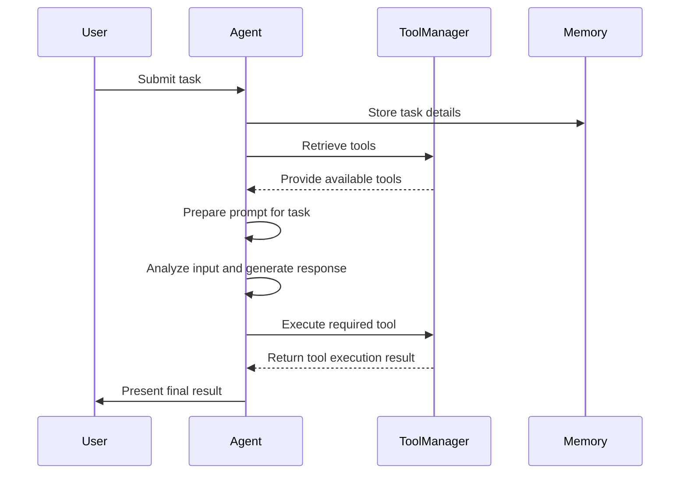

# QuantaLogic

[](https://opensource.org/licenses/Apache-2.0)
[](https://www.python.org/downloads/)
[](https://github.com/psf/black)
[]()

QuantaLogic is a  ReAct (Reasoning & Action) framework for building advanced AI agents. 

It seamlessly integrates large language models (LLMs) with a robust tool system, enabling agents to understand, reason about, and execute complex tasks through natural language interaction.

The `cli` version include coding capabilities comparable to Aider.

## 🌟 Highlights

- **ReAct Framework**: Advanced implementation combining LLM reasoning with concrete actions
- **Universal LLM Support**: Integration with OpenAI, Anthropic, LM Studio, Bedrock, Ollama, DeepSeek V3, via LiteLLM
- **Secure Tool System**: Docker-based code execution and file manipulation tools
- **Real-time Monitoring**: Web interface with SSE-based event visualization
- **Memory Management**: Intelligent context handling and optimization
- **Enterprise Ready**: Comprehensive logging, error handling, and validation system

## 📋 Table of Contents

- [Installation](#-installation)
- [Quick Start](#-quickstart)
- [Key Components](#-key-components)
- [Agent System](#-agent-system)
- [Tool System](#-tool-system)
- [Web Interface](#-web-interface)
- [Examples](#-examples)
- [Development](#-development)
- [Contributing](#-contributing)
- [License](#-license)

## 📦 Installation

### Prerequisites

- Python 3.11+
- Docker (optional for code execution tools)
- Node.js 18+ (optional, for web interface development)

### Via pip

```bash
# Basic installation
pip install quantalogic
```

### From Source

```bash
git clone https://github.com/quantalogic/quantalogic.git
cd quantalogic
python -m venv .venv
source ./venv/bin/activate 
poetry install
```

## Using pipx

```
pipx install quantalogic
```


## 🚀 Quickstart

### Basic Usage

```python
from quantalogic import Agent

# Initialize agent with default configuration
agent = Agent(model_name="deepseek/deepseek-chat")

# Execute a task
result = agent.solve_task(
    "Create a Python function that calculates the Fibonacci sequence"
)
print(result)
```

### Command Line Interface

```bash
# Simple task execution
quantalogic --task "Write a FastAPI endpoint that handles file uploads"
```


`instruction.md`

```md
Write a poem
Translate the poem in English
Choose 2 French Authors
And then rewrite the translation with the style of each author
```

`
```bash
# Advanced usage with options
quantalogic \
    --model openrouter/deepseek-chat \
    --execute-file instruction.md \
    --verbose
```

### Web Interface

```bash
# Start the server
python -m quantalogic.server.agent_server

# Access at http://localhost:8000
```

## 🔨 Key Components

### Agent System

The core agent implements the `ReAct`paradigm, combining:

- Language model reasoning
- Tool execution capabilities
- Memory management
- Event handling
- Task validation

```python
from quantalogic import Agent
from quantalogic.tools import PythonTool, ReadFileTool

# Create agent with specific tools
agent = Agent(
    model_name="openrouter/deepseek-chat",
    tools=[
        PythonTool(),
        ReadFileTool()
    ]
)

```

### How it works


The ReAct (Reasoning & Action) framework represents a significant advancement in the development of intelligent agents capable of autonomously reasoning through tasks and taking appropriate actions. 

QuantaLogic implements this framework, allowing integration with large language models (LLMs) to construct sophisticated agents that can tackle complex problems through natural language interaction. 

## What is a ReAct Agent?

### Basic Concept

A ReAct agent utilizes the synergy of reasoning and action. It not only processes natural language inputs but also executes actions in response to these inputs, utilizing various available tools. This functionality is particularly beneficial for environments where complex tasks can be decomposed into manageable subtasks.

### The QuantaLogic Implementation

QuantaLogic provides an effective implementation of the ReAct framework with several core components:

- **Generative Model**: This serves as the agent's brain, enabling it to interpret tasks and generate human-like text responses.
- **Memory Management**: This capability allows the agent to maintain context, keeping track of previous inputs and interactions to provide coherent responses.
- **Tool Management**: The agent has access to a diverse range of tools, enabling it to perform actions such as code execution, file manipulation, and API communication.

## How the ReAct Framework Works

### Workflow of a ReAct Agent

The following sequence diagram illustrates the workflow of a ReAct agent as it processes and solves a task:



### Key Components Explained

1. **User Input**: The agent begins by receiving a task or question from the user, which initiates the interaction.
2. **Memory Management**: Before tackling the task, the agent logs relevant task details into its memory, ensuring it has the necessary context for processing.
3. **Tool Retrieval**: The agent communicates with the ToolManager to inquire about available tools that can facilitate the required actions.
4. **Prompt Generation**: The agent constructs a prompt that outlines the task specifics, available tools, and any other pertinent context information.
5. **Analysis and Response Generation**: The agent uses its generative model to analyze the task input and formulate a response.
6. **Tool Execution**: If certain tools are needed for the task, the agent instructs the ToolManager to execute those tools, fetching the results for processing.
7. **Output to User**: Finally, the agent compiles and presents the results back to the user.

### Tool System

#### Built-in Tools

1. **Code Execution Tools**
   - `PythonTool`: Execute Python code in Docker
   - `NodeJsTool`: Run Node.js/TypeScript code
   - `ElixirTool`: Execute Elixir code

2. **File Operation Tools**
   - `ReadFileTool`: Safe file reading
   - `WriteFileTool`: File writing with validation
   - `ReplaceInFileTool`: Smart content replacement, using SEARCH/REPLACE blocks
   
3. **Search Tools**
   - `RipgrepTool`: Fast code search
   - `SearchDefinitionNames`: Find code definitions using an AST compiler for Javascript, Typescript Python, Java, Rust, C, C+6

4. **Utility Tools**
   - `MarkitdownTool`: Document conversion in markdown
   - `ListDirectoryTool`: Directory listing
   - `ExecuteBashCommandTool`: Command execution

#### Creating Custom Tools

```python
from quantalogic.tools import Tool, ToolArgument

class DatabaseTool(Tool):
    name: str = "database_tool"
    description: str = "Execute database operations"
    need_validation: bool = True
    
    arguments: list[ToolArgument] = [
        ToolArgument(
            name="query",
            arg_type="string",
            description="SQL query to execute",
            required=True
        )
    ]
    
    def execute(self, query: str) -> str:
        # Tool implementation
        return "Query results"
```

## 🌐 Web Interface

Features:
- Real-time event visualization
- Task submission and monitoring
- Interactive validation dialogs
- Model selection
- Event filtering and search

### API Endpoints

| Endpoint           | Method | Description     |
| ------------------ | ------ | --------------- |
| `/tasks`           | POST   | Submit tasks    |
| `/tasks/{task_id}` | GET    | Task status     |
| `/events`          | GET    | SSE endpoint    |
| `/validate`        | POST   | Task validation |

## 📖 Examples

### Code Analysis

```python
from quantalogic import Agent
from quantalogic.tools import SearchDefinitionNames, RipgrepTool

agent = Agent(
    model_name="openrouter/deepseek-chat",
    tools=[SearchDefinitionNames(), RipgrepTool()]
)

result = agent.solve_task("""
1. Find all class definitions in src/
2. Analyze inheritance patterns
3. Generate class diagram using mermaid diagram
4. Write the result in report.md
""")
```

### Project Documentation

```python
from quantalogic import Agent
from quantalogic.tools import MarkitdownTool, ReadFileTool

agent = Agent(
    model_name="openrouter/deepseek-chat",
    tools=[MarkitdownTool(), ReadFileTool()]
)

result = agent.solve_task("""
Generate a comprehensive documentation for:

1. Navigate and Read https://api.nasa.gov/ documentation
2. Write an API reference for https://api.nasa.gov/
2. Examples how to use the API using curl
3. Examples how to use the API from Python
""")
```

### Security Audit

```python
from quantalogic import Agent
from quantalogic.tools import RipgrepTool, PythonTool

agent = Agent(
    model_name="openrouter/deepseek-chat",
    tools=[RipgrepTool(), PythonTool()]
)

result = agent.solve_task("""
1. Scan for security vulnerabilities
2. Check dependency versions
3. Generate security report
""")
```

## 🔧 Development

### Setup Development Environment

```bash
# Clone repository
git clone https://github.com/quantalogic/quantalogic.git
cd quantalogic

# Create virtual environment
python -m venv venv
source venv/bin/activate  # Windows: venv\Scripts\activate

# Install dependencies
poetry install

```

### Run Tests

```bash
# Run all tests
pytest

# With coverage
pytest --cov=quantalogic

# Run specific tests
pytest tests/unit
```

### Code Quality

```bash
# Format code
black quantalogic tests

# Type checking
mypy quantalogic

# Linting
ruff check quantalogic
```

## 🤝 Contributing

1. Fork the repository
2. Create a feature branch
3. Write tests
4. Implement changes
5. Submit pull request

See [CONTRIBUTING.md](CONTRIBUTING.md) for detailed guidelines.

## 📄 License

Copyright 2024 QuantaLogic Contributors

Licensed under the Apache License, Version 2.0. See [LICENSE](LICENSE) for details.