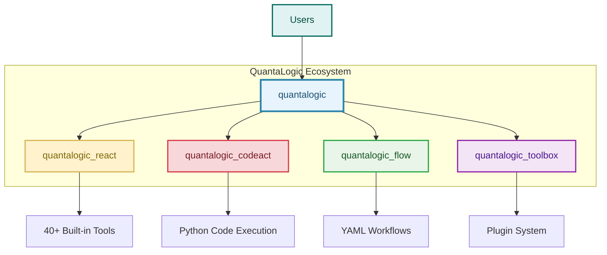
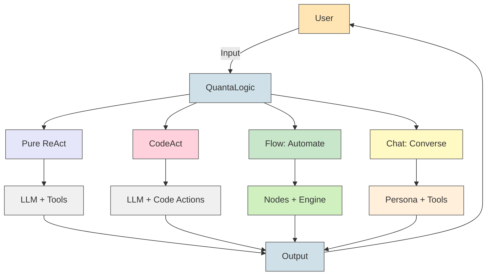
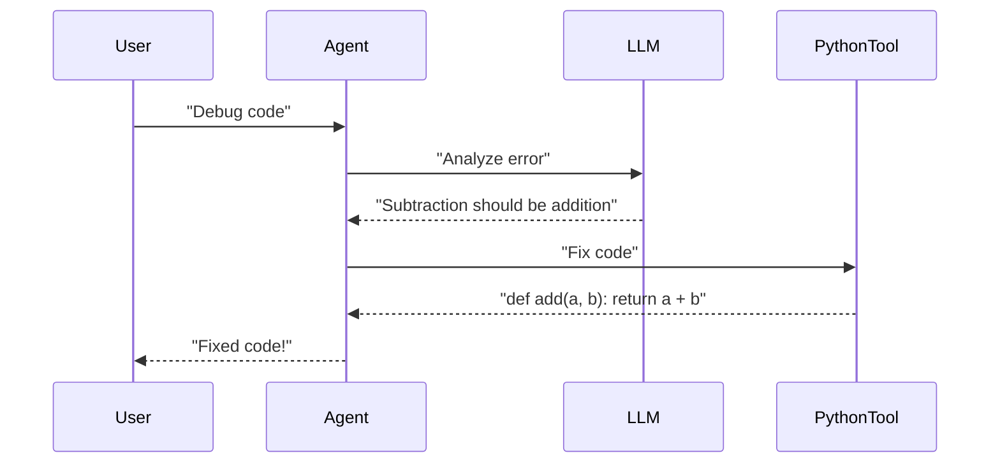
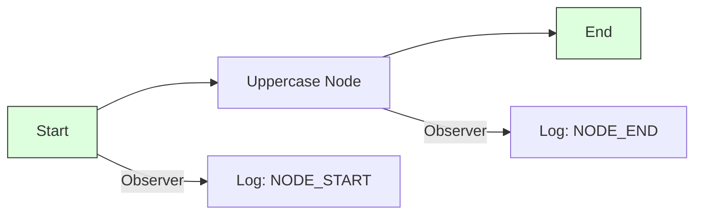
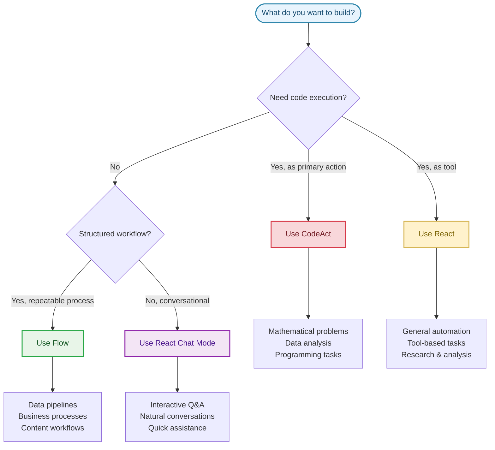

# QuantaLogic: Unleash AI for Coding, Automation, and Conversations

**QuantaLogic** is your all-in-one AI framework for building smart agents that code, automate workflows, and chat like pros. Powered by large language models (LLMs) and a versatile toolset, it offers three killer modes: **ReAct** for tackling tough tasks, **Flow** for streamlined processes, and **Chat** for natural, tool-savvy conversations. Whether you’re a coder, a business innovator, or an AI enthusiast, QuantaLogic delivers fast, flexible, and fun solutions. Let’s blast off!

> **New: CodeAct**
>
> QuantaLogic CodeAct is a powerful, modular extension for creating AI agents that not only reason and act (ReAct) but also use **executable code as their primary action language**. Inspired by the latest research, CodeAct enables agents to solve complex, multi-step tasks by generating, running, and iterating on Python code, all while maintaining context and leveraging a robust tool system. This makes it ideal for advanced automation, mathematical problem-solving, and user-friendly conversational interfaces.

[📖 Full Docs](https://quantalogic.github.io/quantalogic/) | [⚡ Quick Guide](./docs/howto/howto.md)


---

## Why QuantaLogic?

**Why pick QuantaLogic?** It turns the complexity of LLMs into practical magic, making AI work for *you*. From coding scripts to automating business tasks or chatting about the universe, QuantaLogic is your creative sidekick, saving time and unlocking possibilities.

- **Versatile Power**: Code, automate, or converse—handle any task.
- **Your Rules**: Customize agents and tools to match your needs.
- **Scales Big**: From CLI hacks to enterprise workflows.
- **Free & Open**: Apache 2.0 license—use it, tweak it, share it.

> *“AI should spark joy, not stress. QuantaLogic makes it happen!”*

---

## What is QuantaLogic?

**What’s the vibe?** QuantaLogic is a Python framework that harnesses LLMs (like GPT-4o, Claude, or DeepSeek) to create AI agents. These agents wield tools for coding, searching, file ops, and more, all accessible via a slick CLI or Python API. With **ReAct**, **Flow**, and **Chat** modes, it adapts to any challenge—dynamic tasks, structured pipelines, or friendly chats.

### Core Features
- **ReAct Mode**: Solve problems with LLM reasoning + tool actions.
- **Flow Mode**: Craft structured workflows with nodes and transitions.
- **Chat Mode**: Converse naturally with tool-calling smarts.
- **LLM Integration**: Supports OpenAI, Anthropic, DeepSeek via LiteLLM.
- **Toolset**: Code execution, web search, file management, and custom tools.
- **Smart Memory**: Keeps context lean for long tasks or chats.
- **Real-Time Insights**: Track progress with events and logs.
- **Safe Execution**: Docker-based tool isolation.

---

## 🏗️ Component Architecture

QuantaLogic is built with a modular component architecture for maximum flexibility and extensibility:



### 🧩 Component Overview

| Component | Purpose | When to Use | Documentation |
|-----------|---------|-------------|---------------|
| **[QuantaLogic React](./quantalogic_react/README.md)** | Core ReAct agent with 40+ tools | General AI tasks, automation, tool-based workflows | [📖 Detailed Guide](./quantalogic_react/README.md) |
| **[QuantaLogic CodeAct](./quantalogic_codeact/README.md)** | Code-first agent implementation | Programming, data analysis, mathematical problems | [📖 Detailed Guide](./quantalogic_codeact/README.md) |
| **[QuantaLogic Flow](./quantalogic_flow/README.md)** | YAML-based workflow engine | Structured processes, data pipelines, automation | [📖 Detailed Guide](./quantalogic_flow/README.md) |
| **[QuantaLogic Toolbox](./quantalogic_toolbox/README.md)** | External tool integrations | Custom tools, enterprise plugins, extensions | [📖 Detailed Guide](./quantalogic_toolbox/README.md) |

### 🔧 How It Works

When you install `quantalogic`, you get:
- **Unified API**: `from quantalogic import Agent` works seamlessly
- **Component Integration**: Automatic access to all components  
- **Backward Compatibility**: All existing code continues to work
- **Modular Design**: Use only what you need, extend with custom components

The main package acts as a intelligent wrapper that delegates to the appropriate component based on your needs.

> � **Behind the Scenes**: The `quantalogic` package is a wrapper that re-exports functionality from `quantalogic_react` (the core implementation). When you import `Agent`, you're getting the proven ReAct agent with access to 40+ tools. Additional components like CodeAct and Flow extend this foundation with specialized capabilities.

> �📋 **Architecture Details**: See [docs/ARCHITECTURE.md](./docs/ARCHITECTURE.md) for complete technical specifications and component interaction patterns.

---

## CodeAct vs ReAct: What's the Difference?

QuantaLogic supports both the classic **ReAct** paradigm and its advanced extension, **CodeAct**:

- **ReAct** (Reason + Act):
  - Based on the [ReAct paper](https://arxiv.org/abs/2210.03629), this approach lets agents *reason* (think step-by-step) and *act* (use tools or code) in a loop. It's great for tasks where language models need to plan, use tools, and adapt to feedback.

- **CodeAct**:
  - Builds on ReAct by making **executable Python code** the main language for agent actions. Instead of just calling tools or outputting text, the agent writes and runs code, observes the results (including errors), and iterates until the task is solved.
  - This approach is inspired by recent research ([Yang et al., 2024](https://arxiv.org/html/2402.01030v4)) showing that executable code actions enable more capable and reliable LLM agents.
  - CodeAct is ideal for complex, multi-step tasks, advanced automation, and scenarios where precise, verifiable actions are needed.

**Summary**:
- Use **ReAct** for flexible reasoning with tool use.
- Use **CodeAct** for tasks where generating and executing code is the best way to solve a problem or automate a workflow.

Here’s how it flows:



For detailed CodeAct documentation, see [CodeAct Module](quantalogic_codeact/README.md).

---

## How to Get Started

**How do you dive in?** Install it, set it up, and start creating. We’ll guide you through setup, examples, and pro tips to master QuantaLogic in minutes.

### Installation & Setup

#### Prerequisites
- Python >= 3.10+ (required)
- Docker (optional; sandboxed execution)
- Poetry (optional; for source builds)

#### Installation
Install the core framework and (optionally) specific components:

**Core Installation** (includes React agent):
```bash
pip install quantalogic
```

**With CodeAct Extension**:
```bash
pip install quantalogic quantalogic-codeact
```

**All Components** (for comprehensive functionality):
```bash
pip install quantalogic quantalogic-codeact quantalogic-flow quantalogic-toolbox
```

**Using pipx** (recommended for CLI usage):
```bash
pipx install quantalogic
pipx inject quantalogic quantalogic-codeact  # Add CodeAct to same environment
```

> 💡 **What gets installed**: The main `quantalogic` package provides the unified API and includes the React component. Additional components add specialized capabilities while maintaining the same simple import: `from quantalogic import Agent`.

#### Developer Build (optional)
```bash
git clone https://github.com/quantalogic/quantalogic.git
cd quantalogic
python -m venv .venv
# macOS/Linux
source .venv/bin/activate
# Windows
.venv\\Scripts\\activate
poetry install
```

#### Verify Installation
```bash
quantalogic --help
quantalogic_codeact --help
```

#### Configure API Keys
```bash
cat <<EOF > .env
OPENAI_API_KEY=sk-your-key
DEEPSEEK_API_KEY=ds-your-key
EOF
```
> For advanced settings, see [docs/config.md](./docs/config.md)

---

### Quick Start Examples

Let’s see QuantaLogic shine with these quick demos.

#### CLI: Solve a Task
```bash
quantalogic task "Write a Python script to reverse a string"
```
**Output**: A clean, working string-reversal script!

#### CLI: Chat It Up
```bash
quantalogic chat --persona "You’re a cosmic guide" "What’s the tallest mountain?"
```
**Output**: A lively response, possibly with search results!

#### CLI: CodeAct Shell
```bash
quantalogic_codeact shell
```

#### CLI: CodeAct Task
```bash
quantalogic_codeact task "Solve 2 + 2" --model deepseek/deepseek-chat --timeout 60 --streaming
```

#### Python: ReAct Agent
```python
from quantalogic import Agent

agent = Agent(model_name="deepseek/deepseek-chat")
result = agent.solve_task("Write a Python function to reverse a string")
print(result)
# Output: "def reverse_string(s): return s[::-1]"
```

#### Python: Chat Mode
```python
from quantalogic import Agent, DuckDuckGoSearchTool

agent = Agent(
    model_name="gpt-4o-mini",
    chat_system_prompt="You’re a curious explorer",
    tools=[DuckDuckGoSearchTool()]
)
response = agent.chat("What’s new in quantum computing?")
print(response)
# Output: "I checked the latest news! Here’s a breakthrough in quantum computing: [details]."
```

---

### The Three Modes: Your Superpowers

#### 1. ReAct Framework: Dynamic Task-Solving
**Why**: Tackle open-ended tasks like coding or research with creative flair.  
**What**: Combines LLM reasoning with tools to iterate toward solutions.  
**How**: The agent thinks, acts, and loops until the task is complete.

**Example**: Debug some code.
```bash
quantalogic task "Debug this Python code: def add(a, b): return a - b"
```
**Flow**:


**Memorization Trick**: ReAct = **R**eason + **A**ct, like a detective solving a mystery step-by-step.

#### 2. Flow Module: Structured Automation
**Why**: Perfect for repeatable processes like data pipelines or content creation.  
**What**: A system of nodes (tasks) connected by transitions, run by an engine.  
**How**: Define nodes, link them, and let the workflow hum.

**Example**: Process text.
```python
from quantalogic.flow import Workflow, Nodes

@Nodes.define(output="processed")
def uppercase(text: str) -> str:
    return text.upper()

workflow = Workflow("uppercase").build()
result = await workflow.run({"text": "hello world"})
print(result["processed"])  # "HELLO WORLD"
```

**Diagram**:


**Memorization Trick**: Flow = a recipe—nodes are ingredients, transitions are steps, and the engine is the chef.

**Learn More**: Explore the [Flow YAML DSL Specification](./quantalogic/flow/flow_yaml.md) for advanced workflows.

#### 3. Chat Mode: Natural Conversations
**Why**: Ideal for interactive Q&A or quick info with a touch of tool power.  
**What**: A conversational AI that calls tools when needed, keeping chats smooth.  
**How**: Engages naturally, using tools via ReAct’s XML system.

**Example**: Check the weather.
```python
from quantalogic import Agent

agent = Agent(model_name="gpt-4o", chat_system_prompt="You’re a travel guide")
response = agent.chat("What’s the weather in Paris?")
print(response)
# Output: "I’ll look it up! Paris is sunny, 20°C today."
```

**Memorization Trick**: Chat = your AI bestie—talks, listens, and grabs tools like a search engine when curious.

---

### Which Mode to Pick?

| Mode       | Best For                     | Style               | Tools              |
|------------|------------------------------|---------------------|--------------------|
| **ReAct**  | Coding, research, Q&A        | Iterative, adaptive | Dynamic, on-demand |
| **Flow**   | Pipelines, automation        | Structured, orderly | Node-specific      |
| **Chat**   | Conversations, quick queries  | Free-flowing        | Contextual         |

**Pro Tip**: Combine modes! Use Chat for user input, Flow for backend automation, and ReAct for complex tasks.

---

### 🎯 Quick Component Guide

Need help choosing the right component for your project?



**Quick Decision Matrix**:
- **Complex calculations?** → CodeAct
- **Need 40+ tools?** → React  
- **Structured pipeline?** → Flow
- **Just want to chat?** → React Chat Mode

---

### CLI Mastery

The QuantaLogic CLI is your mission control. Here’s the scoop:

```bash
quantalogic [COMMAND] [OPTIONS]
```

#### Commands
- **task**: Run a task.
  ```bash
  quantalogic task "Calculate 5 + 3" --model-name gpt-4o-mini
  ```
- **chat**: Start a conversation.
  ```bash
  quantalogic chat --persona "AI expert" "What’s the latest in machine learning?"
  ```
- **list-models**: List LLMs.
  ```bash
  quantalogic list-models --search claude
  ```

#### Key Options
- `--model-name`: Select your LLM (e.g., `anthropic/claude-3.5-sonnet`).
- `--mode`: Choose ReAct, Flow, or Chat.
- `--tool-mode`: Prioritize tools in Chat (e.g., `code`).
- `--verbose`: See detailed logs.

**Insider Secret**: Add `--no-stream` for cleaner output on slow terminals!

---

### Advanced Tricks

#### Build Custom Tools
Create your own tools for unique tasks:
```python
from quantalogic.tools import Tool

class TimeTool(Tool):
    name = "time_tool"
    def execute(self) -> str:
        from datetime import datetime
        return f"Current time: {datetime.now()}"

agent = Agent(model_name="gpt-4o")
agent.add_tool(TimeTool())
```

#### Go Async
Boost performance with async:
```python
import asyncio
from quantalogic import Agent

async def main():
    agent = Agent(model_name="gpt-4o")
    result = await agent.async_chat("Tell me a joke", streaming=True)
    print(result)

asyncio.run(main())
```

#### Monitor Events
Track every step:
```python
from quantalogic import Agent, console_print_events

agent = Agent(model_name="gpt-4o")
agent.event_emitter.on(["task_start", "tool_execution_start"], console_print_events)
result = agent.solve_task("Write a poem")
```

---

### Memorization Hacks
- **Modes as Jobs**: ReAct = Freelancer (flexible tasks), Flow = Engineer (structured builds), Chat = Barista (serves up chats).
- **Tools as Toys**: `PythonTool` = LEGO for coding, `SearchTool` = binoculars for info.
- **Workflows as Maps**: Nodes = destinations, transitions = roads, engine = GPS.

---

### Simplified Concepts

**Tools 101**: Picture QuantaLogic as a handyman. You ask for a fix (task). It grabs tools—a hammer (`WriteFileTool`) or screwdriver (`SearchTool`)—to get the job done right.

**Memory Magic**: Imagine a sticky note board. As tasks or chats grow, QuantaLogic condenses old notes to keep space for new ones—efficient and clutter-free.


### Contributing

**Why**: Make AI better for everyone!  
**What**: Add features, squash bugs, or suggest ideas.  
**How**: Fork, branch, code, and PR.

📋 **Getting Started**: Our [CONTRIBUTING.md](./CONTRIBUTING.md) covers:
- Component-specific development workflows
- Multi-component architecture guidelines  
- Testing strategies across the ecosystem
- Documentation standards with professional Mermaid diagrams
- Code style and review process

🏗️ **Architecture**: Review [docs/ARCHITECTURE.md](./docs/ARCHITECTURE.md) for technical component details.

**Component-Specific Guidelines**:
- **React Agent**: Add tools, enhance reasoning, improve performance
- **CodeAct**: Extend code execution capabilities, add language support  
- **Flow**: Create workflow templates, enhance YAML DSL
- **Toolbox**: Build external integrations, create plugin systems

We welcome contributions to any component! Each has its own focused development environment while maintaining ecosystem compatibility.

---

### License

QuantaLogic is **Apache 2.0**—free to use, modify, and distribute. Built with ❤️ by Raphaël MANSUY at [QuantaLogic](https://www.quantalogic.app).

---

### API Keys & Models

Power up with LLM API keys in a `.env` file:
```bash
OPENAI_API_KEY=sk-your-key
ANTHROPIC_API_KEY=your-key
DEEPSEEK_API_KEY=ds-your-key
```

**Top Models**:
- `openai/gpt-4o-mini`: Speedy and budget-friendly.
- `anthropic/claude-3.5-sonnet`: Razor-sharp reasoning.
- `deepseek/deepseek-reasoner`: Deep problem-solving.

**Insider Secret**: Set `LM_STUDIO_API_BASE` for local LLMs—great for offline work!

---

### Let’s Build the Future

QuantaLogic is your launchpad for AI awesomeness. Install it, try the examples, and create something epic—code, workflows, or chats. Star the repo, join the community, and let’s make AI unstoppable!

[](https://star-history.com/#quantalogic/quantalogic?Date)