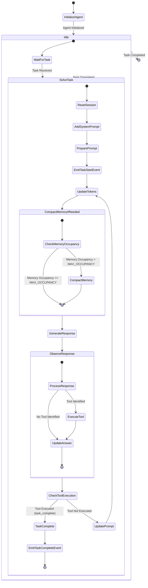
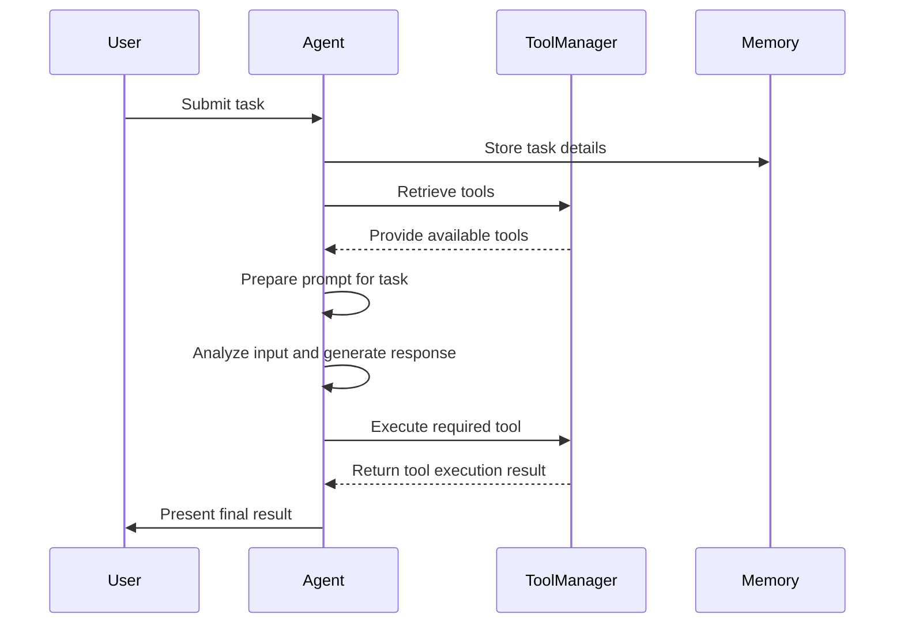

# QuantaLogic

[](https://opensource.org/licenses/Apache-2.0)
[](https://www.python.org/downloads/)
[]()

QuantaLogic is a  ReAct (Reasoning & Action) framework for building advanced AI agents. 

It seamlessly integrates large language models (LLMs) with a robust tool system, enabling agents to understand, reason about, and execute complex tasks through natural language interaction.

The `cli` version include coding capabilities comparable to Aider.


## Why QuantaLogic?

We created [QuantaLogic](https://www.quantalogic.app) because we saw a significant gap between the advanced AI models developed by companies like OpenAI, Anthropic, DeepSeek and their practical implementation in everyday business processes. 

> Our mission is to bridge this gap, making the power of generative AI accessible and actionable for businesses of all sizes.


## 🌟 Highlights

- **ReAct Framework**: Advanced implementation combining LLM reasoning with concrete actions
- **Universal LLM Support**: Integration with OpenAI, Anthropic, LM Studio, Bedrock, Ollama, DeepSeek V3, via LiteLLM
- **Secure Tool System**: Docker-based code execution and file manipulation tools
- **Real-time Monitoring**: Web interface with SSE-based event visualization
- **Memory Management**: Intelligent context handling and optimization
- **Enterprise Ready**: Comprehensive logging, error handling, and validation system

## 📋 Table of Contents

- [Installation](#-installation)
- [Quick Start](#-quickstart)
- [Key Components](#-key-components)
- [Agent System](#-agent-system)
- [Tool System](#-tool-system)
- [Web Interface](#-web-interface)
- [Examples](#-examples)
- [Development](#-development)
- [Contributing](#-contributing)
- [License](#-license)

## 📦 Installation

### Prerequisites

- Python 3.12+
- Docker (optional for code execution tools)

### Via pip

```bash
# Basic installation
pip install quantalogic
```

### From Source

```bash
git clone https://github.com/quantalogic/quantalogic.git
cd quantalogic
python -m venv .venv
source ./venv/bin/activate 
poetry install
```

## Using pipx

```
pipx install quantalogic
```


## 🚀 Quickstart

### Basic Usage

## 📖 CLI Reference

The QuantaLogic CLI provides powerful command-line capabilities:

```bash
Usage: quantalogic [OPTIONS] COMMAND [ARGS]...

  QuantaLogic AI Assistant - A powerful AI tool for various tasks.

Options:
  --version                       Show version information.
  --model-name TEXT               Specify the text model to use (litellm format,
                                  e.g. "openrouter/deepseek-chat").
  --vision-model-name TEXT        Specify the vision model to use (litellm format,
                                  e.g. "openrouter/A/gpt-4o-mini").
  --log [info|debug|warning]      Set logging level (info/debug/warning).
  --verbose                       Enable verbose output.
  --mode [code|basic|interpreter|full|code-basic|search]
                                  Agent mode (code/search/full).
  --help                          Show this message and exit.

Commands:
  task  Execute a task with the QuantaLogic AI Assistant.
```

### Commands
task    Execute a task with the QuantaLogic AI Assistant


### Detailed Usage

#### Agent Modes
- code: Coding-focused agent with basic capabilities
- basic: General-purpose agent without coding tools
- interpreter: Interactive code execution agent
- full: Full-featured agent with all capabilities
- code-basic: Coding agent with basic reasoning

#### Task Execution

Tasks can be provided:

1. Directly via `task` parameter
2. Through a file using --file parameter
3. Interactively via standard input


#### Examples


Using a task file:
```bash
quantalogic task --file tasks/example.md --verbose
```

Selecting agent mode:
```bash
quantalogic --mode interpreter task "Explain quantum computing"
```

Interactive mode:
```bash
quantalogic
```

### Using QuantaLogic With code

```python
from quantalogic import Agent

# Initialize agent with default configuration
agent = Agent(model_name="deepseek/deepseek-chat")

# Execute a task
result = agent.solve_task(
    "Create a Python function that calculates the Fibonacci sequence"
)
print(result)
```

### Environment Configuration Example

```python
import os

from quantalogic import Agent

# Verify that DEEPSEEK_API_KEY is set
if not os.environ.get("DEEPSEEK_API_KEY"):
    raise ValueError("DEEPSEEK_API_KEY environment variable is not set")

# Initialize the AI agent with default configuration
agent = Agent(model_name="deepseek/deepseek-chat")

# Execute a sample task
result = agent.solve_task("Create a Python function that calculates the Fibonacci sequence")
print(result)
```

## 📖 Examples

Here are some practical examples to help you get started:

Here is the markdown table based on the provided directory listing:

| Example | Description | File |
|---------|-------------|------|
| Simple Agent | A basic example of an agent implementation. | [examples/01-simple-agent.py](examples/01-simple-agent.py) |
| Agent with Event Monitoring | An example of an agent with event monitoring capabilities. | [examples/02-agent-with-event-monitoring.py](examples/02-agent-with-event-monitoring.py) |
| Agent with Interpreter | An example of an agent that includes an interpreter. | [examples/03-agent-with-interpreter.py](examples/03-agent-with-interpreter.py) |
| Agent Summary Task | An example of an agent performing a summary task. | [examples/04-agent-summary-task.py](examples/04-agent-summary-task.py) |
| Code Example | A general code example. | [examples/05-code.py](examples/05-code.py) |


## 🔨 Key Components

### Agent System

The core agent implements the `ReAct`paradigm, combining:

- Language model reasoning
- Tool execution capabilities
- Memory management
- Event handling
- Task validation

```python
from quantalogic import Agent
from quantalogic.tools import PythonTool, ReadFileTool

# Create agent with specific tools
agent = Agent(
    model_name="openrouter/deepseek-chat",
    tools=[
        PythonTool(),
        ReadFileTool()
    ]
)

```

### How it works


The ReAct (Reasoning & Action) framework represents a significant advancement in the development of intelligent agents capable of autonomously reasoning through tasks and taking appropriate actions. 

QuantaLogic implements this framework, allowing integration with large language models (LLMs) to construct sophisticated agents that can tackle complex problems through natural language interaction. 

## What is a ReAct Agent?

### Basic Concept

A ReAct agent utilizes the synergy of reasoning and action. It not only processes natural language inputs but also executes actions in response to these inputs, utilizing various available tools. This functionality is particularly beneficial for environments where complex tasks can be decomposed into manageable subtasks.

### The QuantaLogic Implementation

QuantaLogic provides an effective implementation of the ReAct framework with several core components:

- **Generative Model**: This serves as the agent's brain, enabling it to interpret tasks and generate human-like text responses.
- **Memory Management**: This capability allows the agent to maintain context, keeping track of previous inputs and interactions to provide coherent responses.
- **Tool Management**: The agent has access to a diverse range of tools, enabling it to perform actions such as code execution, file manipulation, and API communication.

## How the ReAct Framework Works

### Workflow of a ReAct Agent

The following state diagram shows the core workflow of a QuantaLogic agent:



The following sequence diagram illustrates the workflow of a ReAct agent as it processes and solves a task:



### Key Components Explained

1. **User Input**: The agent begins by receiving a task or question from the user, which initiates the interaction.
2. **Memory Management**: Before tackling the task, the agent logs relevant task details into its memory, ensuring it has the necessary context for processing.
3. **Tool Retrieval**: The agent communicates with the ToolManager to inquire about available tools that can facilitate the required actions.
4. **Prompt Generation**: The agent constructs a prompt that outlines the task specifics, available tools, and any other pertinent context information.
5. **Analysis and Response Generation**: The agent uses its generative model to analyze the task input and formulate a response.
6. **Tool Execution**: If certain tools are needed for the task, the agent instructs the ToolManager to execute those tools, fetching the results for processing.
7. **Output to User**: Finally, the agent compiles and presents the results back to the user.

### Tool System

The QuantaLogic framework incorporates a well-defined tool system that enhances the functionality of AI agents by enabling them to perform a variety of tasks efficiently. Each tool is designed to address specific needs that arise in the context of complex problem-solving and task execution:

1. **Core Functionality**: Tools such as **AgentTool** and **LLMTool** are fundamental to the agent's operation, allowing it to manage tasks and interact with large language models. The integration of these tools enables the agent to process natural language inputs and execute corresponding actions effectively. **AgentTool** enables the agent to delegate tasks to specialized agents, and **LLMTool** provides the agent to explore a specific area of a latent space using role play.

2. **Code Execution**: Tools like **PythonTool**, **NodeJsTool**, and **ElixirTool** are vital for executing code in different programming languages. This capability allows the agent to handle programming tasks directly, facilitating real-time coding assistance and code evaluation.

3. **File Operations**: The framework includes tools for file management, such as **ReadFileTool**, **WriteFileTool**, and **ReplaceInFileTool**. These tools are essential for enabling the agent to read from and write to files, as well as update file content dynamically. This functionality supports scenarios where agents need to manipulate data or configuration files as part of the task execution process.

4. **Search Capabilities**: Tools like **RipgrepTool** and **SearchDefinitionNames** enhance the agent's ability to search through codebases and identify relevant definitions. This is crucial when dealing with large volumes of code, allowing the agent to quickly locate information necessary for problem-solving.

5. **Utility Functions**: Additional tools such as **DownloadHttpFileTool**, **ListDirectoryTool**, and **ExecuteBashCommandTool** provide broader functionality that supports various tasks, from fetching external resources to executing system commands. These utilities expand the operational scope of agents, allowing them to perform diverse actions beyond simple text processing.

6. **Documentation and Representation**: Tools like **MarkitdownTool** facilitate the generation of documentation, ensuring that output from the agent can be formatted and presented clearly. This is particularly beneficial for creating reports or guides based on the agent's findings and actions.

By integrating these tools into its architecture, QuantaLogic allows agents to perform a wide range of tasks autonomously while ensuring that they have the necessary resources and capabilities to do so effectively. This tool system is fundamental to the agent's ability to reason and act in sophisticated ways, thereby enhancing the overall utility of the framework in complex scenarios.

 

### Tools Documentation


#### Overview of Tools

| Category               | Tools                                                                                             |
|-----------------------|---------------------------------------------------------------------------------------------------|
| 1. Search Tools        | 1.1 SerpAPI Search Tool, 1.2 Wikipedia Search Tool                                               |
| 2. Task Automation     | Agent Tool, Task Complete Tool, Input Question Tool, Execute Bash Command Tool                  |
| 3. Script Execution    | Python Tool, Node.js Tool, Elixir Tool                                                            |
| 4. File Operations     | Read File Tool, Write File Tool, Edit Whole Content Tool, Replace In File Tool                   |
| 5. Code Analysis       | Search Definition Names Tool, Ripgrep Tool                                                        |
| 6. Content Generation  | LLM Tool, LLMVisionTool                                                                           |
| 7. Utility & Management| Download HTTP File Tool, List Directory Tool, Markitdown Tool, Unified Diff Tool                 |

---

#### 1. Agent Tool

The **Agent Tool** enables task delegation to another agent, providing specialized functionality for handling tasks.

##### Parameters

| Parameter    | Type   | Description                                                                         | Example                         |
|--------------|--------|-------------------------------------------------------------------------------------|---------------------------------|
| `agent_role` | string | The role of the agent (e.g., expert, assistant)                                   | `expert`                        |
| `agent`      | Any    | The agent to delegate tasks to                                                     | `Agent` object                  |
| `task`       | string | The task to delegate to the specified agent.                                       | `Summarize the latest news.`    |

##### Example Usage
```python
agent_tool = AgentTool(agent_role="expert", agent=some_agent)
result = agent_tool.execute(task="Summarize the latest news.")
print(result)
```

---

#### 2. Task Complete Tool

The **Task Complete Tool** is used to respond to users after a task has been completed.

##### Parameters

| Parameter | Type   | Description                                     | Example                              |
|-----------|--------|-------------------------------------------------|--------------------------------------|
| `answer`  | string | The answer to the user.                         | `"The answer to the meaning of life"`|

##### Example Usage
```python
task_tool = TaskCompleteTool()
response = task_tool.execute(answer="The answer is 42.")
print(response)
```

---

#### 3. Input Question Tool

The **Input Question Tool** prompts the user with a question and captures their input.

##### Parameters

| Parameter | Type   | Description                                         | Example                       |
|-----------|--------|-----------------------------------------------------|-------------------------------|
| `question`| string | The question to ask the user.                      | `What is your favorite color?`|
| `default` | string | Optional default value if no input is provided.   | `blue`                        |

##### Example Usage
```python
input_tool = InputQuestionTool()
user_response = input_tool.execute(question="What is your favorite color?", default="blue")
print("User Response:", user_response)
```

---

#### 4. Execute Bash Command Tool

The **Execute Bash Command Tool** allows for the execution of bash commands and captures their output.

##### Parameters

| Parameter       | Type    | Description                                                          | Example                   |
|-----------------|---------|----------------------------------------------------------------------|---------------------------|
| `command`       | string  | The bash command to execute.                                        | `ls -la`                  |
| `working_dir`   | string  | The working directory where the command will be executed.           | `/path/to/directory`      |
| `timeout`       | int     | Maximum time in seconds to wait for the command to complete.       | `60`                      |

##### Example Usage
```python
bash_tool = ExecuteBashCommandTool()
output = bash_tool.execute(command="ls -la")
print(output)
```

---

#### 5. Python Tool

The **Python Tool** executes Python scripts in an isolated Docker environment.

##### Parameters

| Parameter         | Type    | Description                                                                        | Example                                    |
|-------------------|---------|------------------------------------------------------------------------------------|--------------------------------------------|
| `install_commands` | string  | Commands to install Python packages before running the script.                     | `pip install rich requests`                |
| `script`           | string  | The Python script to execute.                                                      | `print("Hello, World!")`                   |
| `version`         | string | The Python version to use in the Docker container.                               | `3.11`                                     |
| `host_dir`        | string | The absolute path on the host machine to mount for file access.                 | `./demo01/`                                |
| `memory_limit`    | string | Optional memory limit for the Docker container.                                   | `1g`                                       |
| `environment_vars`| string | Environment variables to set inside the Docker container.                         | `ENV=production DEBUG=False`                |

#### Example Usage
```python
python_tool = PythonTool()
output = python_tool.execute(
    install_commands="pip install rich requests",
    script='print("Hello, World!")',
    version="3.12",
    host_dir="./demo01/",
)
print("Script Output:", output)
```

---

### 6. Node.js Tool

The **Node.js Tool** executes Node.js scripts in an isolated Docker environment.

#### Parameters

| Parameter         | Type    | Description                                                                   | Example                                    |
|-------------------|---------|-------------------------------------------------------------------------------|--------------------------------------------|
| `install_commands`| string  | Commands to install Node.js packages before running the script.              | `npm install chalk`                         |
| `script`          | string  | The Node.js script to execute.                                              | `console.log('Hello, World!');`            |
| `version`         | string  | The Node.js version to use in the Docker container.                         | `20`                                       |
| `host_dir`        | string  | The absolute path on the host machine to mount for file access.             | `./project/`                               |
| `memory_limit`    | string  | Optional memory limit for the Docker container.                               | `1g`                                       |
| `module_type`     | string  | The module system to use: 'esm' for ECMAScript Modules or 'commonjs' for CommonJS. | `esm`                                     |

#### Example Usage
```python
node_tool = NodeJsTool()
output = node_tool.execute(
    install_commands="npm install chalk",
    script='console.log("Hello, Node.js World!");',
    version="20",
    host_dir="./project/"
)
print("Node.js Output:", output)
```

---

### 7. Elixir Tool

The **Elixir Tool** executes Elixir code in an isolated Docker environment with Mix support.

#### Parameters

| Parameter        | Type    | Description                                                                 | Example                                   |
|------------------|---------|-----------------------------------------------------------------------------|-------------------------------------------|
| `mix_commands`   | string  | Mix commands to run before executing the script.                          | `mix deps.get && mix compile`            |
| `script`         | string  | Elixir code to execute.                                                   | `IO.puts("Hello from Elixir!")`          |
| `version`        | string  | The Elixir version to use.                                               | `1.15`                                    |
| `host_dir`       | string  | Host directory to mount.                                                  | `./elixir_project/`                       |
| `memory_limit`   | string  | Container memory limit.                                                   | `512m`                                    |
| `environment_vars`| string | Environment variables to set.                                             | `MIX_ENV=prod`                           |

#### Example Usage
```python
elixir_tool = ElixirTool()
output = elixir_tool.execute(script='IO.puts("Hello from Elixir!")')
print("Elixir Output:", output)
```

---

### 8. Read File Tool

The **Read File Tool** reads content from a specified file.

#### Parameters

| Parameter    | Type   | Description                                     | Example                              |
|--------------|--------|-------------------------------------------------|--------------------------------------|
| `file_path`  | string | The path of the file to read.                  | `/path/to/file.txt`                 |

#### Example Usage
```python
read_tool = ReadFileTool()
content = read_tool.execute(file_path="/path/to/file.txt")
print("File Content:", content)
```

---

### 9. Write File Tool

The **Write File Tool** writes content to a specified file.

#### Parameters

| Parameter   | Type   | Description                                     | Example                              |
|-------------|--------|-------------------------------------------------|--------------------------------------|
| `file_path` | string | The path of the file to write to.              | `/path/to/file.txt`                 |
| `content`   | string | The content to write.                           | `Hello, World!`                     |

#### Example Usage
```python
write_tool = WriteFileTool()
result = write_tool.execute(file_path="/path/to/file.txt", content="Hello, World!")
print(result)
```

---

### 10. Edit Whole Content Tool

The **Edit Whole Content Tool** replaces the entire content of a specified file.

#### Parameters

| Parameter   | Type   | Description                                     | Example                              |
|-------------|--------|-------------------------------------------------|--------------------------------------|
| `file_path` | string | The path to the file to edit.                  | `/path/to/file.txt`                 |
| `content`   | string | The new content to write to the file.          | `New Content Here!`                 |

#### Example Usage
```python
edit_tool = EditWholeContentTool()
result = edit_tool.execute(file_path="/path/to/file.txt", content="New Content Here!")
print(result)
```

---

### 11. Replace In File Tool

The **Replace In File Tool** replaces specific content in a file with new content.

#### Parameters

| Parameter   | Type   | Description                                     | Example                              |
|-------------|--------|-------------------------------------------------|--------------------------------------|
| `file_path` | string | The path of the file to edit.                  | `/path/to/file.txt`                 |
| `search`    | string | The string to search for in the file.          | `Old Content`                        |
| `replace`   | string | The string to replace the searched content.     | `New Content`                        |

#### Example Usage
```python
replace_tool = ReplaceInFileTool()
result = replace_tool.execute(file_path="/path/to/file.txt", search="Old Content", replace="New Content")
print(result)
```

---

### 12. Search Definition Names Tool

The **Search Definition Names Tool** searches for definition names in a directory using Tree-sitter.

#### Parameters

| Parameter      | Type   | Description                                               | Example                       |
|----------------|--------|-----------------------------------------------------------|-------------------------------|
| `directory_path`| string | The path to the directory to search in.                  | `./path/to`                  |
| `language_name`| string  | The Tree-sitter language name (python, js, etc.).      | `python`                     |
| `file_pattern` | string  | Optional glob pattern to filter files (default: '*').    | `**/*.py`                    |

#### Example Usage
```python
search_tool = SearchDefinitionNames()
results = search_tool.execute(directory_path="./my_project", language_name="python", file_pattern="**/*.py")
print("Found Definitions:", results)
```

---

### 13. Ripgrep Tool

The **Ripgrep Tool** searches for text blocks in files using ripgrep.

#### Parameters

| Parameter        | Type    | Description                                                                  | Example                       |
|------------------|---------|------------------------------------------------------------------------------|-------------------------------|
| `cwd`            | string  | Base path for relative searches                                             | `.`                           |
| `directory_path` | string  | The directory path to search in.                                            | `./src`                       |
| `regex_rust_syntax`| string| The regex pattern to search for (in Rust syntax).                          | `r"\bfunction\b"`            |
| `file_pattern`   | string  | Optional glob pattern to filter files.                                      | `**/*.js`                    |
| `context_lines`  | string  | Number of context lines to include before and after matches.                | `2`                           |

#### Example Usage
```python
ripgrep_tool = RipgrepTool()
output = ripgrep_tool.execute(
    directory_path="./my_project",
    regex_rust_syntax=r"\bfunction\b",
    context_lines="2"
)
print("Ripgrep Results:", output)
```

---

#### 14. LLMVisionTool

The **LLMVisionTool** enables processing of visual inputs using vision-language models.

##### Parameters

| Parameter      | Type    | Description                                                            | Example                                    |
|----------------|---------|------------------------------------------------------------------------|--------------------------------------------|
| `image_path`   | string  | Path to the image file to process                                      | `./path/to/image.png`                      |
| `prompt`       | string  | The question or instruction for the vision model                       | `Describe the contents of this image`      |
| `temperature`  | float   | Sampling temperature between 0.0 and 1.0                              | `0.7`                                      |

##### Example Usage
```python
vision_tool = LLMVisionTool()
response = vision_tool.execute(
    image_path="./path/to/image.png",
    prompt="Describe the contents of this image",
    temperature=0.7
)
print("Vision Model Response:", response)
```

#### 15. LLM Tool

The **LLM Tool** generates answers using a specified language model.

#### Parameters

| Parameter      | Type    | Description                                                            | Example                                    |
|----------------|---------|------------------------------------------------------------------------|--------------------------------------------|
| `system_prompt`| string  | The persona or system prompt to guide the language model's behavior.  | `You are a helpful assistant.`            |
| `prompt`       | string  | The question to ask the language model.                                 | `What is the meaning of life?`            |
| `temperature`  | string  | Sampling temperature between 0.0 and 1.0.                             | `0.5`                                     |

#### Example Usage
```python
llm_tool = LLMTool(model_name="gpt-4")
response = llm_tool.execute(
    system_prompt="You are a knowledgeable assistant.",
    prompt="What is the meaning of life?",
    temperature="0.7"
)
print("LLM Response:", response)
```

---

### 16. Download HTTP File Tool

The **Download HTTP File Tool** downloads a file from a specified HTTP URL.

#### Parameters

| Parameter     | Type   | Description                                    | Example                            |
|---------------|--------|------------------------------------------------|------------------------------------|
| `url`         | string | The URL of the file to download.              | `http://example.com/file.txt`     |
| `destination` | string | The path where the file should be saved.      | `/path/to/save/file.txt`          |

#### Example Usage
```python
download_tool = DownloadHttpFileTool()
result = download_tool.execute(url="http://example.com/file.txt", destination="/path/to/save/file.txt")
print(result)
```

---

### 17. List Directory Tool

The **List Directory Tool** lists files in a specified directory.

#### Parameters

| Parameter        | Type    | Description                                    | Example                |
|------------------|---------|------------------------------------------------|------------------------|
| `directory_path` | string  | The path of the directory to list files from. | `./path/to/directory`  |

#### Example Usage
```python
list_tool = ListDirectoryTool()
result = list_tool.execute(directory_path="./path/to/directory")
print("Directory Files:", result)
```

---

### 18. Markitdown Tool

The **Markitdown Tool** processes markdown files, possibly for conversion or rendering.

#### Parameters

| Parameter        | Type    | Description                                    | Example                |
|------------------|---------|------------------------------------------------|------------------------|
| `markdown_path`  | string  | The path of the markdown file to process.      | `./path/to/file.md`    |

#### Example Usage
```python
markitdown_tool = MarkitdownTool()
result = markitdown_tool.execute(markdown_path="./path/to/file.md")
print("Processed Markdown Output:", result)
```

---

### 19. SerpAPI Search Tool

The **SerpAPI Search Tool** allows agents to perform web searches using the SerpAPI service.

##### Parameters
| Parameter | Type   | Description                     | Example                     |
|-----------|--------|---------------------------------|-----------------------------|
| query     | string | The search query to execute     | "latest AI research papers" |
| location  | string | Geographic location for results | "United States"             |
| num       | int    | Number of results to return     | 5                           |

##### Example Usage
```python
from quantalogic.tools import SerpAPISearchTool

search_tool = SerpAPISearchTool()
results = search_tool.execute(query="latest AI research", location="United States", num=5)
print(results)
```

---

### 20. Wikipedia Search Tool

The **Wikipedia Search Tool** enables agents to search and retrieve information from Wikipedia.

##### Parameters

| Parameter | Type   | Description                     | Example                     |
|-----------|--------|---------------------------------|-----------------------------|
| query     | string | The search query to execute     | "Artificial Intelligence"   |
| lang      | string | Language code for results       | "en"                        |
| sentences | int    | Number of summary sentences     | 3                           |

##### Example Usage
```python
from quantalogic.tools import WikipediaSearchTool

wiki_tool = WikipediaSearchTool()
results = wiki_tool.execute(query="Artificial Intelligence", lang="en", sentences=3)
print(results)
```
```

#### Creating Custom Tools

```python
from quantalogic.tools import Tool, ToolArgument

class DatabaseTool(Tool):
    name: str = "database_tool"
    description: str = "Execute database operations"
    need_validation: bool = True
    
    arguments: list[ToolArgument] = [
        ToolArgument(
            name="query",
            arg_type="string",
            description="SQL query to execute",
            required=True
        )
    ]
    
    def execute(self, query: str) -> str:
        # Tool implementation
        return "Query results"
```


## 🌐 Web Interface

Features:
- Real-time event visualization
- Task submission and monitoring
- Interactive validation dialogs
- Model selection
- Event filtering and search

### API Endpoints

| Endpoint           | Method | Description     |
| ------------------ | ------ | --------------- |
| `/tasks`           | POST   | Submit tasks    |
| `/tasks/{task_id}` | GET    | Task status     |
| `/events`          | GET    | SSE endpoint    |
| `/validate`        | POST   | Task validation |


## 📖 Examples

### Python Tool Integration Example

```python
import os

from quantalogic import Agent, console_print_events
from quantalogic.tools import (
    PythonTool,
)

# Verify API key is set - required for authentication with DeepSeek's API
# This check ensures the agent won't fail during runtime due to missing credentials
if not os.environ.get("DEEPSEEK_API_KEY"):
    raise ValueError("DEEPSEEK_API_KEY environment variable is not set")

# Initialize agent with DeepSeek model and Python tool
agent = Agent(model_name="deepseek/deepseek-chat", tools=[PythonTool()])

# Configure comprehensive event monitoring system
# Tracks all agent activities including:
# - Code execution steps
# - Tool interactions
# - Error conditions
# Essential for debugging and performance optimization
agent.event_emitter.on(
    "*",
    console_print_events,
)

# Execute a precision mathematics task demonstrating:
# - High-precision calculations
# - PythonTool integration
# - Real-time monitoring capabilities
result = agent.solve_task("1. Calculate PI with 10000 decimal places.")
print(result)
```

### Agent with Event Monitoring

```python
import os

from quantalogic import Agent, console_print_events
from quantalogic.tools import (
    LLMTool,
)

# Verify API key is set - required for authentication with DeepSeek's API
# This check ensures the agent won't fail during runtime due to missing credentials
if not os.environ.get("DEEPSEEK_API_KEY"):
    raise ValueError("DEEPSEEK_API_KEY environment variable is not set")

# Initialize agent with DeepSeek model and LLM tool
# The LLM tool serves dual purpose:
# 1. As a reasoning engine for the agent's cognitive processes
# 2. As a latent space explorer, enabling the agent to:
#    - Discover novel solution paths
#    - Generate creative combinations of concepts
#    - Explore alternative reasoning strategies
# Using the same model ensures consistent behavior across both roles
agent = Agent(model_name="deepseek/deepseek-chat", tools=[LLMTool(model_name="deepseek/deepseek-chat")])

# Set up event monitoring to track agent's lifecycle
# This helps in debugging and understanding the agent's behavior
agent.event_emitter.on(
    [
        "task_complete",
        "task_think_start",
        "task_think_end",
        "tool_execution_start",
        "tool_execution_end",
        "error_max_iterations_reached",
        "memory_full",
        "memory_compacted",
        "memory_summary",
    ],
    console_print_events,
)

# Execute a multi-step task showcasing agent's capabilities
# Demonstrates:
# 1. Creative content generation
# 2. Language translation
# 3. Style adaptation
# 4. Multi-step reasoning and execution
result = agent.solve_task(
    "1. Write a poem in English about a dog. "
    "2. Translate the poem into French. "
    "3. Choose 2 French authors"
    "4. Rewrite the translated poem with the style of the chosen authors. "
)
print(result)
```


### Project Documentation

```python
from quantalogic import Agent
from quantalogic.tools import MarkitdownTool, ReadFileTool

agent = Agent(
    model_name="openrouter/deepseek-chat",
    tools=[MarkitdownTool(), ReadFileTool()]
)

result = agent.solve_task("""
Generate a comprehensive documentation for:

1. Navigate and Read https://api.nasa.gov/ documentation
2. Write an API reference for https://api.nasa.gov/
2. Examples how to use the API using curl
3. Examples how to use the API from Python
""")
```


## 🔧 Development

### Setup Development Environment

```bash
# Clone repository
git clone https://github.com/quantalogic/quantalogic.git
cd quantalogic

# Create virtual environment
python -m venv venv
source venv/bin/activate  # Windows: venv\Scripts\activate

# Install dependencies
poetry install

```

### Run Tests

```bash
# Run all tests
pytest

# With coverage
pytest --cov=quantalogic

# Run specific tests
pytest tests/unit
```

### Code Quality

```bash
# Format code
ruff format

# Type checking
mypy quantalogic

# Linting
ruff check quantalogic
```

## 🤝 Contributing

1. Fork the repository
2. Create a feature branch
3. Write tests
4. Implement changes
5. Submit pull request

See [CONTRIBUTING.md](CONTRIBUTING.md) for detailed guidelines.

## 📄 License

Copyright 2024 QuantaLogic Contributors

Licensed under the Apache License, Version 2.0. See [LICENSE](LICENSE) for details.

## Project Growth
[](https://star-history.com/#quantalogic/quantalogic&Date)

Initiated with ❤️ by Raphaël MANSUY. Founder of [Quantalogic](https://www.quantalogic.app). 
