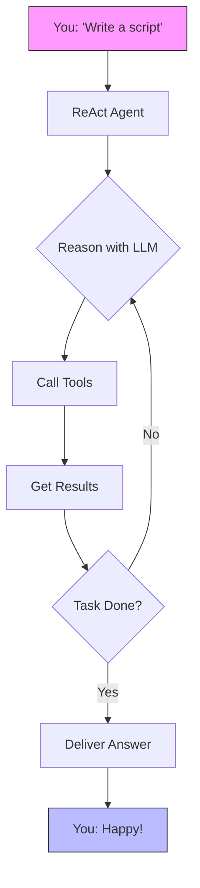
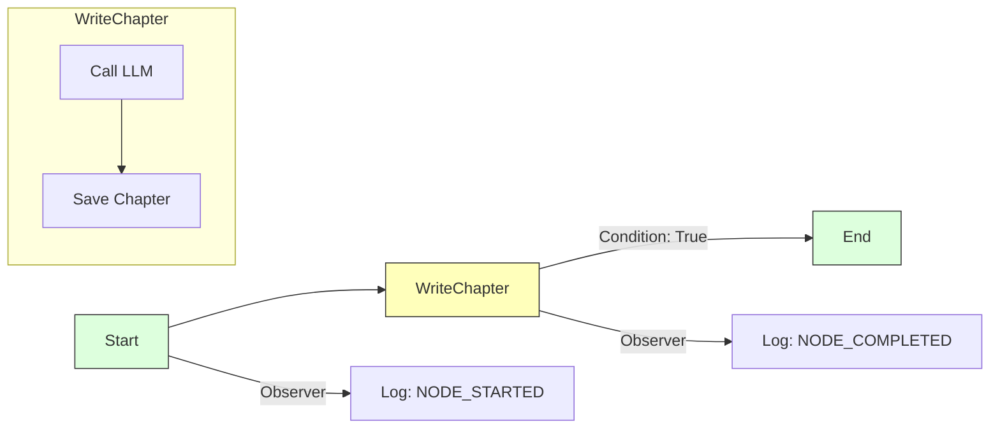

# QuantaLogic 🌌

[](https://opensource.org/licenses/Apache-2.0)
[](https://www.python.org/downloads/)
[](https://quantalogic.github.io/quantalogic/)

Hey there, welcome to **QuantaLogic**—your cosmic toolkit for crafting AI agents and workflows that shine! 🌟 Whether you’re coding up a storm, automating a business process, or dreaming up something wild, QuantaLogic is here to make it happen. We’re talking **large language models (LLMs)** fused with a stellar toolset, featuring two powerhouse approaches: the **ReAct framework** for dynamic problem-solving and the dazzling new **Flow module** for structured brilliance.

Picture this: a CLI that’s as easy as a snap, a Python API that’s pure magic, and a framework that scales from quick hacks to galactic enterprises. Ready to launch? Let’s blast off! 🚀

[📖 Full Docs](https://quantalogic.github.io/quantalogic/) | [🛠️ How-To Guide](./docs/howto/howto.md)


---

## Why QuantaLogic? 🤔

At [QuantaLogic](https://www.quantalogic.app), we spotted a black hole: amazing AI models from OpenAI, Anthropic, and DeepSeek weren’t fully lighting up real-world tasks. Our mission? Ignite that spark! We’re here to make generative AI a breeze for developers, businesses, and dreamers alike—turning ideas into action, one brilliant solution at a time.

> "AI should be your co-pilot, not a puzzle. QuantaLogic makes it happen—fast, fun, and fearless!"

---

## 🌟 Key Features

- **ReAct Framework**: Reasoning + action = unstoppable agents! 🧠💪
- **Flow Module**: Structured workflows that flow like a river. 🌊
- **LLM Galaxy**: Tap into OpenAI, DeepSeek, and more via LiteLLM. 🌍
- **Secure Tools**: Docker-powered safety for code and files. 🔒
- **Live Monitoring**: Watch it unfold with a web interface and SSE. 📡
- **Memory Magic**: Smart context keeps things snappy. ✨
- **Enterprise-Ready**: Logs, error handling, and validation—rock solid. 🏢

---

## 📋 Table of Contents

- [Why QuantaLogic?](#why-quantalogic)
- [Key Features](#key-features)
- [Installation](#installation)
- [Quick Start](#quick-start)
- [ReAct Framework: Dynamic Agents](#react-framework-dynamic-agents)
- [Flow Module: Structured Workflows](#flow-module-structured-workflows)
- [ReAct vs. Flow: Pick Your Power](#react-vs-flow-pick-your-power)
- [Using the CLI](#using-the-cli)
- [Examples That Spark Joy](#examples-that-spark-joy)
- [Core Components](#core-components)
- [Developing with QuantaLogic](#developing-with-quantalogic)
- [Contributing](#contributing)
- [License](#license)
- [Project Growth](#project-growth)
- [API Keys and Environment Configuration](#api-keys-and-environment-configuration)

---

## Installation ⚙️

Let’s get QuantaLogic orbiting your system—it’s as easy as 1-2-3!

### What You’ll Need
- **Python 3.12+**: The fuel for our rocket. 🚀
- **Docker** (optional): Locks down code execution in a safe pod. 🛡️

### Option 1: pip—Fast and Simple
```bash
pip install quantalogic
```

### Option 2: pipx—Isolated Stardust
```bash
pipx install quantalogic
```

### Option 3: Source—For Space Explorers
```bash
git clone https://github.com/quantalogic/quantalogic.git
cd quantalogic
python -m venv .venv
source .venv/bin/activate  # Windows: .venv\Scripts\activate
poetry install
```
> **Tip**: No Poetry? Grab it with `pip install poetry` and join the crew!

---

## Quick Start 🚀

Ready to see the magic? Here’s your launchpad:

### CLI: Instant Action
```bash
quantalogic task "Write a Python function for Fibonacci numbers"
```
> Boom! ReAct whips up a solution in seconds.

### Python: ReAct Agent
```python
from quantalogic import Agent

agent = Agent(model_name="deepseek/deepseek-chat")
result = agent.solve_task("Code a Fibonacci function")
print(result)
# Output: "def fib(n): return [0, 1] if n <= 2 else fib(n-1) + [fib(n-1)[-1] + fib(n-1)[-2]]"
```

### Python: Flow Workflow
```python
from quantalogic.flow import Workflow, Nodes

@Nodes.define(output="greeting")
def greet(name: str) -> str:
    return f"Hello, {name}!"

workflow = Workflow("greet").build()
result = await workflow.run({"name": "Luna"})
print(result["greeting"])  # "Hello, Luna!"
```

---

## ReAct Framework: Dynamic Agents 🧠

The **ReAct** framework is your AI sidekick—think fast, act smart. It pairs LLM reasoning with tool-powered action, perfect for tasks that need a bit of improvisation.

### How It Rolls
1. **You Say**: "Write me a script."
2. **It Thinks**: LLM plots the course.
3. **It Acts**: Tools like `PythonTool` get to work.
4. **It Loops**: Keeps going until it’s done.

Check this out:



### Example: Code Generator
```bash
quantalogic task "Create a Python script to sort a list"
```
> ReAct figures it out, writes the code, and hands it over—smooth as silk!

### Why It’s Cool
Perfect for coding, debugging, or answering wild questions on the fly.

---

## Flow Module: Structured Workflows 🌊

The **Flow module** is your architect—building workflows that hum with precision. It’s all about nodes, transitions, and a steady rhythm, ideal for repeatable missions.

### The Building Blocks
- **Nodes**: Tasks like functions or LLM calls. 🛠️
- **Transitions**: Paths with optional conditions. ➡️
- **Engine**: Runs the show with flair. ⚙️
- **Observers**: Peek at progress with events. 👀

### Example: Story Weaver
```python
from quantalogic.flow import Workflow, Nodes

@Nodes.llm_node(model="openai/gpt-4o-mini", output="chapter")
async def write_chapter(ctx: dict) -> str:
    return f"Chapter 1: {ctx['theme']}"

workflow = (
    Workflow("write_chapter")
    .then("end", condition="lambda ctx: True")
    .add_observer(lambda e: print(f"✨ {e.event_type}"))
)
engine = workflow.build()
result = await engine.run({"theme": "Cosmic Quest"})
print(result["chapter"])
```

### Flow Visualized


### Example: Data Pipeline
```python
@Nodes.define(output="processed")
def clean_data(data: str) -> str:
    return data.strip().upper()

workflow = Workflow("clean_data").build()
result = await workflow.run({"data": " hello "})
print(result["processed"])  # "HELLO"
```

### Why It Rocks
Think content pipelines, automation flows, or any multi-step task that needs order.

---

## ReAct vs. Flow: Pick Your Power ⚡

Both are stellar, but here’s the scoop:

| Feature             | ReAct Framework 🌠              | Flow Module 🌊                 |
|---------------------|--------------------------------|--------------------------------|
| **Vibe**           | Free-spirited, adaptive        | Organized, predictable         |
| **Flow**           | Loops ‘til it’s solved         | Follows a roadmap              |
| **Sweet Spot**     | Creative chaos (coding, Q&A)   | Steady workflows (pipelines)   |
| **State**          | Memory keeps it loose          | Nodes lock it down             |
| **Tools**          | Grabbed as needed              | Baked into nodes               |
| **Watch It**       | Events like `task_complete`    | Observers like `NODE_STARTED`  |

### When to Choose
- **ReAct**: Code on-the-fly, explore answers, debug like a pro.
- **Flow**: Build a pipeline, automate a process, keep it tight.

---

## Using the CLI 🎮

The CLI is your command center—fast, flexible, and fun!

### Syntax
```bash
quantalogic [OPTIONS] COMMAND [ARGS]...
```

### Commands
- **`task`**: Kick off a mission.
  ```bash
  quantalogic task "Summarize this file" --file notes.txt
  ```
- **`list-models`**: Peek at LLM options.
  ```bash
  quantalogic list-models --search "gpt"
  ```

### Options
- `--model-name TEXT`: Your LLM pick (e.g., `"openai/gpt-4o"`).
- `--mode TEXT`: Agent flavor:
  - `basic`: Simple stuff.
  - `code`: Code wizardry.
  - `full`: All the bells!
  - (More in docs!)
- `--log [info|debug|warning]`: Chatty or quiet?
- `--max-iterations INT`: Cap the loops (default: 30).
- `--no-stream`: Wait for the full reveal.

> **Hack**: `quantalogic --help` spills all the secrets!

---

## Examples That Spark Joy 🎉

Let’s light up your imagination with these gems:

### Video Magic
[](./examples/generated_tutorials/python/quantalogic_long.mp4)

### Hands-On Examples
| Name              | What’s It Do?                       | File                                       |
|-------------------|------------------------------------|--------------------------------------------|
| Code Buddy        | ReAct writes a sorting script      | [01-simple-agent.py](./examples/01-simple-agent.py) |
| Story Weaver      | Flow crafts a tale                 | [story_generator_agent.py](./examples/qflow/story_generator_agent.py) |
| Finance Guru      | ReAct crunches numbers             | [10-finance-agent.py](./examples/10-finance-agent.py) |
| File Cleaner      | Flow tidies up text                | See [Flow Example](#flow-module-structured-workflows) |
| Math Whiz         | ReAct solves equations             | Below!                                     |

### Bonus: Math Whiz
```bash
quantalogic task "Solve 2x + 5 = 15"
```
> Output: "Let’s solve it! 2x + 5 = 15 → 2x = 10 → x = 5. Done!"

---

## Core Components 🛠️

### ReAct Agents
- **Brain**: LLMs power the thinking.
- **Hands**: Tools like `PythonTool` do the work.
- **Memory**: Ties it all together.

### Flow Workflows
- **Nodes**: Your task blocks.
- **Engine**: The maestro of execution.

### Tools Arsenal
- **Code**: `PythonTool`, `NodeJsTool`.
- **Files**: `ReadFileTool`, `WriteFileTool`.
- More in [REFERENCE_TOOLS.md](./REFERENCE_TOOLS.md).

---

## Developing with QuantaLogic 👩‍💻

### Setup Your Lab
```bash
git clone https://github.com/quantalogic/quantalogic.git
cd quantalogic
python -m venv venv
source venv/bin/activate
poetry install
```

### Test the Cosmos
```bash
pytest --cov=quantalogic
```

### Polish It Up
```bash
ruff format  # Shine that code
mypy quantalogic  # Check types
ruff check quantalogic  # Lint it
```

---

## Contributing 🤝

Join the QuantaLogic galaxy!
1. Fork it.
2. Branch: `git checkout -b feature/epic-thing`.
3. Code + test.
4. PR it!

See [CONTRIBUTING.md](./CONTRIBUTING.md) for the full scoop.

---

## License 📜

© 2024 QuantaLogic Contributors. **Apache 2.0**—free and open. Check [LICENSE](./LICENSE).

Dreamed up by Raphaël MANSUY, founder of [QuantaLogic](https://www.quantalogic.app).

---

## Project Growth 📈
[](https://star-history.com/#quantalogic/quantalogic&Date)

---

## API Keys and Environment Configuration 🔑

QuantaLogic links to LLMs via API keys—here’s your guide to unlocking the universe!

### Setting Up Keys
Store keys in a `.env` file or export them:
```bash
echo "OPENAI_API_KEY=sk-your-openai-key" > .env
echo "DEEPSEEK_API_KEY=ds-your-deepseek-key" >> .env
source .env
```

### The Key Vault: Supported Models
| Model Name                              | Key Variable             | What’s It Good For?                           |
|-----------------------------------------|--------------------------|-----------------------------------------------|
| `openai/gpt-4o-mini`                   | `OPENAI_API_KEY`         | Speedy, budget-friendly tasks                 |
| `openai/gpt-4o`                        | `OPENAI_API_KEY`         | Heavy-duty reasoning                          |
| `anthropic/claude-3.5-sonnet`          | `ANTHROPIC_API_KEY`      | Balanced brilliance                           |
| `deepseek/deepseek-chat`               | `DEEPSEEK_API_KEY`       | Chatty and versatile                          |
| `deepseek/deepseek-reasoner`           | `DEEPSEEK_API_KEY`       | Deep problem-solving                          |
| `openrouter/deepseek/deepseek-r1`      | `OPENROUTER_API_KEY`     | Research-grade via OpenRouter                 |
| `mistral/mistral-large-2407`           | `MISTRAL_API_KEY`        | Multilingual mastery                          |
| `dashscope/qwen-max`                   | `DASHSCOPE_API_KEY`      | Alibaba’s power player                        |
| `lm_studio/mistral-small-24b-instruct-2501` | `LM_STUDIO_API_KEY` | Local LLM action                           |

### Local Setup (e.g., LM Studio)
```bash
export LM_STUDIO_API_BASE="http://localhost:1234/v1"
export LM_STUDIO_API_KEY="lm-your-key"
```

### Pro Tips
- **Security**: Keep keys in `.env`, not code!
- **Extras**: Add `OPENROUTER_REFERRER` for OpenRouter flair.
- **More**: Dig into [LiteLLM Docs](https://docs.litellm.ai/docs/).

---

## Final Boost 🚀

QuantaLogic is your ticket to AI awesomeness. Install it, play with it, and let’s build something unforgettable together! 🌠
