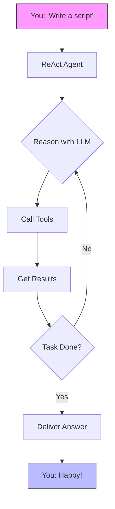
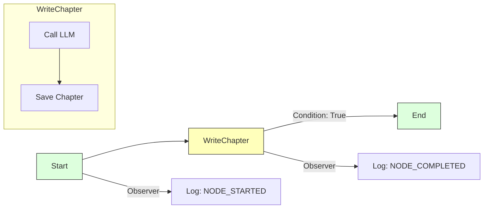

# QuantaLogic 

[](https://opensource.org/licenses/Apache-2.0)
[](https://www.python.org/downloads/)
[](https://quantalogic.github.io/quantalogic/)

Hey there, welcome to **QuantaLogic**—your cosmic toolkit for crafting AI agents and workflows that shine!  Whether you’re coding up a storm, automating a business process, or dreaming up something wild, QuantaLogic is here to make it happen. We’re talking **large language models (LLMs)** fused with a stellar toolset, featuring two powerhouse approaches: the **ReAct framework** for dynamic problem-solving and the dazzling new **Flow module** for structured brilliance.

Picture this: a CLI that’s as easy as a snap, a Python API that’s pure magic, and a framework that scales from quick hacks to galactic enterprises. Ready to launch? Let’s blast off! 

[ Full Docs](https://quantalogic.github.io/quantalogic/) | [ How-To Guide](./docs/howto/howto.md)


---
[Chinese Version](./README_CN.md)
[French Version](./README_FR.md)
[German Version](./README_DE.md)

## Why QuantaLogic? 

At [QuantaLogic](https://www.quantalogic.app), we spotted a black hole: amazing AI models from OpenAI, Anthropic, and DeepSeek weren’t fully lighting up real-world tasks. Our mission? Ignite that spark! We’re here to make generative AI a breeze for developers, businesses, and dreamers alike—turning ideas into action, one brilliant solution at a time.

> "AI should be your co-pilot, not a puzzle. QuantaLogic makes it happen—fast, fun, and fearless!"

---

##  Key Features

- **ReAct Framework**: Reasoning + action = unstoppable agents! 
- **Flow Module**: Structured workflows that flow like a river. 
- **LLM Galaxy**: Tap into OpenAI, DeepSeek, and more via LiteLLM. 
- **Secure Tools**: Docker-powered safety for code and files. 
- **Live Monitoring**: Watch it unfold with a web interface and SSE. 
- **Memory Magic**: Smart context keeps things snappy. 
- **Enterprise-Ready**: Logs, error handling, and validation—rock solid. 

---

##  Table of Contents

- [Why QuantaLogic?](#why-quantalogic)
- [Key Features](#key-features)
- [Installation](#installation)
- [Quick Start](#quick-start)
- [ReAct Framework: Dynamic Agents](#react-framework-dynamic-agents)
- [Flow Module: Structured Workflows](#flow-module-structured-workflows)
  - 📘 **[Workflow YAML DSL Specification](./quantalogic/flow/flow_yaml.md)**: Comprehensive guide to defining powerful, structured workflows using our Domain-Specific Language
  - 📚 **[Flow YAML Documentation](./quantalogic/flow/flow_yaml)**: Dive into the official documentation for a deeper understanding of Flow YAML and its applications
- [ReAct vs. Flow: Pick Your Power](#react-vs-flow-pick-your-power)
- [Using the CLI](#using-the-cli)
- [Examples That Spark Joy](#examples-that-spark-joy)
- [Core Components](#core-components)
- [Developing with QuantaLogic](#developing-with-quantalogic)
- [Contributing](#contributing)
- [License](#license)
- [Project Growth](#project-growth)
- [API Keys and Environment Configuration](#api-keys-and-environment-configuration)

---

## Installation 

Let’s get QuantaLogic orbiting your system—it’s as easy as 1-2-3!

### What You’ll Need
- **Python 3.12+**: The fuel for our rocket. 
- **Docker** (optional): Locks down code execution in a safe pod. 

### Option 1: pip—Fast and Simple
```bash
pip install quantalogic
```

### Option 2: pipx—Isolated Stardust
```bash
pipx install quantalogic
```

### Option 3: Source—For Space Explorers
```bash
git clone https://github.com/quantalogic/quantalogic.git
cd quantalogic
python -m venv .venv
source .venv/bin/activate  # Windows: .venv\Scripts\activate
poetry install
```
> **Tip**: No Poetry? Grab it with `pip install poetry` and join the crew!

---

## Quick Start 

Ready to see the magic? Here’s your launchpad:

### CLI: Instant Action
```bash
quantalogic task "Write a Python function for Fibonacci numbers"
```
> Boom! ReAct whips up a solution in seconds.

### Python: ReAct Agent
```python
from quantalogic import Agent

agent = Agent(model_name="deepseek/deepseek-chat")
result = agent.solve_task("Code a Fibonacci function")
print(result)
# Output: "def fib(n): return [0, 1] if n <= 2 else fib(n-1) + [fib(n-1)[-1] + fib(n-1)[-2]]"
```

### Synchronous Agent Example 

```python
from quantalogic import Agent

# Create a synchronous agent
agent = Agent(model_name="gpt-4o")

# Solve a task synchronously
result = agent.solve_task(
    task="Write a Python function to calculate Fibonacci numbers",
    max_iterations=10  # Optional: limit iterations
)

print(result)
```

### Async Agent Example 🌊

```python
import asyncio
from quantalogic import Agent

async def main():
    # Create an async agent
    agent = Agent(model_name="gpt-4o")
    
    # Solve a task asynchronously with streaming
    result = await agent.async_solve_task(
        task="Write a Python script to scrape top GitHub repositories",
        max_iterations=15,  # Optional: limit iterations
        streaming=True      # Optional: stream the response
    )
    
    print(result)

# Run the async function
asyncio.run(main())
```

### Event Monitoring Examples 🔍

#### Synchronous Event Monitoring with Finance Tools
```python
from quantalogic import Agent
from quantalogic.console_print_events import console_print_events
from quantalogic.console_print_token import console_print_token
from quantalogic.tools import (
    DuckDuckGoSearchTool, 
    TechnicalAnalysisTool, 
    YFinanceTool
)

# Create an agent with finance-related tools
agent = Agent(
    model_name="gpt-4o",
    tools=[
        DuckDuckGoSearchTool(),  # Web search tool
        TechnicalAnalysisTool(),  # Stock technical analysis
        YFinanceTool()            # Stock data retrieval
    ]
)

# Set up comprehensive event listeners
agent.event_emitter.on(
    event=[
        "task_complete",
        "task_think_start", 
        "task_think_end", 
        "tool_execution_start", 
        "tool_execution_end",
        "error_max_iterations_reached",
        "memory_full",
        "memory_compacted"
    ],
    listener=console_print_events
)

# Optional: Monitor streaming tokens
agent.event_emitter.on(
    event=["stream_chunk"], 
    listener=console_print_token
)

# Execute a multi-step financial analysis task
result = agent.solve_task(
    "1. Find the top 3 tech stocks for Q3 2024 "
    "2. Retrieve historical stock data for each "
    "3. Calculate 50-day and 200-day moving averages "
    "4. Provide a brief investment recommendation",
    streaming=True  # Enable streaming for detailed output
)
print(result)
```

#### Async Event Monitoring with Finance Tools
```python
import asyncio
from quantalogic import Agent
from quantalogic.console_print_events import console_print_events
from quantalogic.console_print_token import console_print_token
from quantalogic.tools import (
    DuckDuckGoSearchTool, 
    TechnicalAnalysisTool, 
    YFinanceTool
)

async def main():
    # Create an async agent with finance-related tools
    agent = Agent(
        model_name="gpt-4o",
        tools=[
            DuckDuckGoSearchTool(),  # Web search tool
            TechnicalAnalysisTool(),  # Stock technical analysis
            YFinanceTool()            # Stock data retrieval
        ]
    )

    # Set up comprehensive event listeners
    agent.event_emitter.on(
        event=[
            "task_complete",
            "task_think_start", 
            "task_think_end", 
            "tool_execution_start", 
            "tool_execution_end",
            "error_max_iterations_reached",
            "memory_full",
            "memory_compacted"
        ],
        listener=console_print_events
    )

    # Optional: Monitor streaming tokens
    agent.event_emitter.on(
        event=["stream_chunk"], 
        listener=console_print_token
    )

    # Execute a multi-step financial analysis task asynchronously
    result = await agent.async_solve_task(
        "1. Find emerging AI technology startups "
        "2. Analyze their recent funding rounds "
        "3. Compare market potential and growth indicators "
        "4. Provide an investment trend report",
        streaming=True  # Enable streaming for detailed output
    )
    print(result)

# Run the async function
asyncio.run(main())
```

### Python: Flow Workflow
```python
from quantalogic.flow import Workflow, Nodes

@Nodes.define(output="greeting")
def greet(name: str) -> str:
    return f"Hello, {name}!"

workflow = Workflow("greet").build()
result = await workflow.run({"name": "Luna"})
print(result["greeting"])  # "Hello, Luna!"
```

---

## ReAct Framework: Dynamic Agents 

The **ReAct** framework is your AI sidekick—think fast, act smart. It pairs LLM reasoning with tool-powered action, perfect for tasks that need a bit of improvisation.

### How It Rolls
1. **You Say**: "Write me a script."
2. **It Thinks**: LLM plots the course.
3. **It Acts**: Tools like `PythonTool` get to work.
4. **It Loops**: Keeps going until it’s done.

Check this out:



### Example: Code Generator
```bash
quantalogic task "Create a Python script to sort a list"
```
> ReAct figures it out, writes the code, and hands it over—smooth as silk!

### Why It’s Cool
Perfect for coding, debugging, or answering wild questions on the fly.

---

## Flow Module: Structured Workflows 

The **Flow module** is your architect—building workflows that hum with precision. It's all about nodes, transitions, and a steady rhythm, ideal for repeatable missions.

🔍 **Want to dive deeper?** Check out our comprehensive [Workflow YAML DSL Specification](./quantalogic/flow/flow_yaml.md), a detailed guide that walks you through defining powerful, structured workflows. From basic node configurations to complex transition logic, this documentation is your roadmap to mastering workflow design with QuantaLogic.

📚 **For a deeper understanding of Flow YAML and its applications, please refer to the official [Flow YAML Documentation](https://quantalogic.github.io/quantalogic/flow/flow_yaml).**

The Flow YAML documentation provides a comprehensive overview of the Flow YAML language, including its syntax, features, and best practices. It's a valuable resource for anyone looking to create complex workflows with QuantaLogic.

Additionally, the Flow YAML documentation includes a number of examples and tutorials to help you get started with creating your own workflows. These examples cover a range of topics, from simple workflows to more complex scenarios, and are designed to help you understand how to use Flow YAML to create powerful and flexible workflows.

### The Building Blocks
- **Nodes**: Tasks like functions or LLM calls. 
- **Transitions**: Paths with optional conditions. 
- **Engine**: Runs the show with flair. 
- **Observers**: Peek at progress with events. 

### Example: Story Weaver
```python
from quantalogic.flow import Workflow, Nodes

@Nodes.llm_node(model="openai/gpt-4o-mini", output="chapter")
async def write_chapter(ctx: dict) -> str:
    return f"Chapter 1: {ctx['theme']}"

workflow = (
    Workflow("write_chapter")
    .then("end", condition="lambda ctx: True")
    .add_observer(lambda e: print(f" {e.event_type}"))
)
engine = workflow.build()
result = await engine.run({"theme": "Cosmic Quest"})
print(result["chapter"])
```

### Example: Story Generator Agent

Here's a more complex example showing a complete story generation workflow using the Flow module:

```python
from typing import List
import anyio
from loguru import logger
from quantalogic.flow import Nodes, Workflow

# Define node functions with decorators
@Nodes.validate_node(output="validation_result")
async def validate_input(genre: str, num_chapters: int) -> str:
    """Validate input parameters."""
    if not (1 <= num_chapters <= 20 and genre.lower() in ["science fiction", "fantasy", "mystery", "romance"]):
        raise ValueError("Invalid input: genre must be one of science fiction, fantasy, mystery, romance")
    return "Input validated"

@Nodes.llm_node(
    model="gemini/gemini-2.0-flash",
    system_prompt="You are a creative writer specializing in story titles.",
    prompt_template="Generate a creative title for a {{ genre }} story. Output only the title.",
    output="title",
)
async def generate_title(genre: str) -> str:
    """Generate a title based on the genre (handled by llm_node)."""
    pass  # Logic handled by llm_node decorator

@Nodes.define(output="manuscript")
async def compile_book(title: str, outline: str, chapters: List[str]) -> str:
    """Compile the full manuscript from title, outline, and chapters."""
    return f"Title: {title}\n\nOutline:\n{outline}\n\n" + "\n\n".join(
        f"Chapter {i}:\n{chap}" for i, chap in enumerate(chapters, 1)
    )

# Define the workflow with conditional branching
workflow = (
    Workflow("validate_input")
    .then("generate_title")
    .then("generate_outline")
    .then("generate_chapter")
    .then("update_chapter_progress")
    .then("generate_chapter", condition=lambda ctx: ctx["completed_chapters"] < ctx["num_chapters"])
    .then("compile_book", condition=lambda ctx: ctx["completed_chapters"] >= ctx["num_chapters"])
    .then("quality_check")
    .then("end")
)

# Run the workflow
async def main():
    initial_context = {
        "genre": "science fiction",
        "num_chapters": 3,
        "chapters": [],
        "completed_chapters": 0,
    }
    engine = workflow.build()
    result = await engine.run(initial_context)
```

This example demonstrates:
- Input validation with `@Nodes.validate_node`
- LLM integration with `@Nodes.llm_node`
- Custom processing with `@Nodes.define`
- Conditional branching for iterative chapter generation
- Context management for tracking progress

The full example is available at [examples/flow/story_generator/story_generator_agent.py](./examples/flow/story_generator/story_generator_agent.py).

### Flow Visualized


### Example: Data Pipeline
```python
@Nodes.define(output="processed")
def clean_data(data: str) -> str:
    return data.strip().upper()

workflow = Workflow("clean_data").build()
result = await workflow.run({"data": " hello "})
print(result["processed"])  # "HELLO"
```

### Why It Rocks
Think content pipelines, automation flows, or any multi-step task that needs order.

---

## ReAct vs. Flow: Pick Your Power 

Both are stellar, but here’s the scoop:

| Feature             | ReAct Framework | Flow Module                 |
|---------------------|--------------------------------|--------------------------------|
| **Vibe**           | Free-spirited, adaptive        | Organized, predictable         |
| **Flow**           | Loops ‘til it’s solved         | Follows a roadmap              |
| **Sweet Spot**     | Creative chaos (coding, Q&A)   | Steady workflows (pipelines)   |
| **State**          | Memory keeps it loose          | Nodes lock it down             |
| **Tools**          | Grabbed as needed              | Baked into nodes               |
| **Watch It**       | Events like `task_complete`    | Observers like `NODE_STARTED`  |

### When to Choose
- **ReAct**: Code on-the-fly, explore answers, debug like a pro.
- **Flow**: Build a pipeline, automate a process, keep it tight.

---

## Using the CLI 

The CLI is your command center—fast, flexible, and fun!

### Syntax
```bash
quantalogic [OPTIONS] COMMAND [ARGS]...
```

### Description
QuantaLogic AI Assistant - A powerful AI tool for various tasks.

### Environment Variables
- **OpenAI**: Set `OPENAI_API_KEY` to your OpenAI API key
- **Anthropic**: Set `ANTHROPIC_API_KEY` to your Anthropic API key
- **DeepSeek**: Set `DEEPSEEK_API_KEY` to your DeepSeek API key

Use a `.env` file or export these variables in your shell for seamless integration.

### Commands
- **`task`**: Kick off a mission.
  ```bash
  quantalogic task "Summarize this file" --file notes.txt
  ```
- **`list-models`**: List supported LiteLLM models with optional fuzzy search.
  ```bash
  quantalogic list-models --search "gpt"
  ```

### Options
- **`--model-name TEXT`**: Specify the model to use (litellm format). Examples:
  - `openai/gpt-4o-mini`
  - `openai/gpt-4o`
  - `anthropic/claude-3.5-sonnet`
  - `deepseek/deepseek-chat`
  - `deepseek/deepseek-reasoner`
  - `openrouter/deepseek/deepseek-r1`
  - `openrouter/openai/gpt-4o`
- **`--mode [code|basic|interpreter|full|code-basic|search|search-full]`**: Agent mode
- **`--vision-model-name TEXT`**: Specify the vision model to use (litellm format)
- **`--log [info|debug|warning]`**: Set logging level
- **`--verbose`**: Enable verbose output
- **`--max-iterations INTEGER`**: Maximum number of iterations (default: 30)
- **`--max-tokens-working-memory INTEGER`**: Set the maximum tokens allowed in working memory
- **`--compact-every-n-iteration INTEGER`**: Set the frequency of memory compaction
- **`--thinking-model TEXT`**: The thinking model to use
- **`--version`**: Show version information

> **Tip**: Run `quantalogic --help` for the complete command reference!

---

## Examples That Spark Joy 

Explore our collection of examples to see QuantaLogic in action:

- [Flow Examples](./examples/flow/README.md): Discover practical workflows showcasing Quantalogic Flow capabilities
- [Agent Examples](./examples/agent/README.md): See dynamic agents in action with the ReAct framework
- [Tool Examples](./examples/tools/README.md): Explore our powerful tool integrations

Each example comes with detailed documentation and ready-to-run code.

### Video Magic
[](./examples/generated_tutorials/python/quantalogic_long.mp4)

### Hands-On Examples
| Name              | What’s It Do?                       | File                                       |
|-------------------|------------------------------------|--------------------------------------------|
| Simple Agent      | Basic ReAct agent demo             | [01-simple-agent.py](./examples/01-simple-agent.py) |
| Event Monitoring  | Agent with event tracking          | [02-agent-with-event-monitoring.py](./examples/02-agent-with-event-monitoring.py) |
| Interpreter Mode  | Agent with interpreter             | [03-agent-with-interpreter.py](./examples/03-agent-with-interpreter.py) |
| Agent Summary     | Task summary generation            | [04-agent-summary-task.py](./examples/04-agent-summary-task.py) |
| Code Generation   | Basic code generation              | [05-code.py](./examples/05-code.py) |
| Code Screen       | Advanced code generation           | [06-code-screen.py](./examples/06-code-screen.py) |
| Tutorial Writer   | Write technical tutorials          | [07-write-tutorial.py](./examples/07-write-tutorial.py) |
| PRD Writer        | Product Requirements Document      | [08-prd-writer.py](./examples/08-prd-writer.py) |
| Story Generator   | Flow-based story creation          | [story_generator_agent.py](./examples/flow/story_generator/story_generator_agent.py) |
| SQL Query         | Database query generation          | [09-sql-query.py](./examples/09-sql-query.py) |
| Finance Agent     | Financial analysis and tasks       | [10-finance-agent.py](./examples/10-finance-agent.py) |
| Textual Interface | Agent with textual UI               | [11-textual-agent-interface.py](./examples/11-textual-agent-interface.py) |
| Composio Test     | Composio integration demo           | [12-composio-test.py](./examples/12-composio-test.py) |
| Synchronous Agent | Synchronous agent demo             | [13-synchronous-agent.py](./examples/13-synchronous-agent.py) |
| Async Agent       | Async agent demo                   | [14-async-agent.py](./examples/14-async-agent.py) |

### Bonus: Math Whiz
```bash
quantalogic task "Solve 2x + 5 = 15"
```
> Output: "Let’s solve it! 2x + 5 = 15 → 2x = 10 → x = 5. Done!"

---

## Core Components 

### ReAct Agents
- **Brain**: LLMs power the thinking.
- **Hands**: Tools like `PythonTool` do the work.
- **Memory**: Ties it all together.

### Flow Workflows
- **Nodes**: Your task blocks.
- **Engine**: The maestro of execution.

### Tools Arsenal
- **Code**: `PythonTool`, `NodeJsTool`.
- **Files**: `ReadFileTool`, `WriteFileTool`.
- More in [REFERENCE_TOOLS.md](./REFERENCE_TOOLS.md).

---

## Developing with QuantaLogic 

### Setup Your Lab
```bash
git clone https://github.com/quantalogic/quantalogic.git
cd quantalogic
python -m venv venv
source venv/bin/activate
poetry install
```

### Test the Cosmos
```bash
pytest --cov=quantalogic
```

### Polish It Up
```bash
ruff format  # Shine that code
mypy quantalogic  # Check types
ruff check quantalogic  # Lint it
```

### Create Custom Tools
The `create_tool()` function transforms any Python function into a reusable Tool:

```python
from quantalogic.tools import create_tool

def weather_lookup(city: str, country: str = "US") -> dict:
    """Retrieve current weather for a given location.
    
    Args:
        city: Name of the city to look up
        country: Two-letter country code (default: US)
    
    Returns:
        Dictionary with weather information
    """
    # Implement weather lookup logic here
    return {"temperature": 22, "condition": "Sunny"}

# Convert the function to a Tool
weather_tool = create_tool(weather_lookup)

# Now you can use it as a Tool
print(weather_tool.to_markdown())  # Generate tool documentation
result = weather_tool.execute(city="New York")  # Execute as a tool
```

#### Using Custom Tools with ReAct Agent

Here's how to integrate custom tools with a ReAct Agent:

```python
from quantalogic import Agent
from quantalogic.tools import create_tool, PythonTool

# Create a custom stock price lookup tool
def get_stock_price(symbol: str) -> str:
    """Get the current price of a stock by its ticker symbol.
    
    Args:
        symbol: Stock ticker symbol (e.g., AAPL, MSFT)
    
    Returns:
        Current stock price information
    """
    # In a real implementation, you would fetch from an API
    prices = {"AAPL": 185.92, "MSFT": 425.27, "GOOGL": 175.43}
    if symbol in prices:
        return f"{symbol} is currently trading at ${prices[symbol]}"
    return f"Could not find price for {symbol}"

# Create an agent with standard and custom tools
agent = Agent(
    model_name="gpt-4o",
    tools=[
        PythonTool(),  # Standard Python execution tool
        create_tool(get_stock_price)  # Custom stock price tool
    ]
)

# The agent can now use both tools to solve tasks
result = agent.solve_task(
    "Write a Python function to calculate investment growth, "  
    "then analyze Apple stock's current price"
)

print(result)
```

In this example, the agent can seamlessly use both the standard `PythonTool` and your custom stock price lookup tool to complete the task.

Key features of `create_tool()`:
- 🔧 Automatically converts functions to Tools
- 📝 Extracts metadata from function signature and docstring
- 🔍 Supports both synchronous and asynchronous functions
- 🛠️ Generates tool documentation and validation

---

## Contributing 

Join the QuantaLogic galaxy!
1. Fork it.
2. Branch: `git checkout -b feature/epic-thing`.
3. Code + test.
4. PR it!

See [CONTRIBUTING.md](./CONTRIBUTING.md) for the full scoop.

---

## License 

 2024 QuantaLogic Contributors. **Apache 2.0**—free and open. Check [LICENSE](./LICENSE).

Dreamed up by Raphaël MANSUY, founder of [QuantaLogic](https://www.quantalogic.app).

---

## Project Growth 
[](https://star-history.com/#quantalogic/quantalogic&Date)

---

## API Keys and Environment Configuration 

QuantaLogic links to LLMs via API keys—here’s your guide to unlocking the universe!

### Setting Up Keys
Store keys in a `.env` file or export them:
```bash
echo "OPENAI_API_KEY=sk-your-openai-key" > .env
echo "DEEPSEEK_API_KEY=ds-your-deepseek-key" >> .env
source .env
```

### The Key Vault: Supported Models
| Model Name                              | Key Variable             | What’s It Good For?                           |
|-----------------------------------------|--------------------------|-----------------------------------------------|
| `openai/gpt-4o-mini`                   | `OPENAI_API_KEY`         | Speedy, budget-friendly tasks                 |
| `openai/gpt-4o`                        | `OPENAI_API_KEY`         | Heavy-duty reasoning                          |
| `anthropic/claude-3.5-sonnet`          | `ANTHROPIC_API_KEY`      | Balanced brilliance                           |
| `deepseek/deepseek-chat`               | `DEEPSEEK_API_KEY`       | Chatty and versatile                          |
| `deepseek/deepseek-reasoner`           | `DEEPSEEK_API_KEY`       | Deep problem-solving                          |
| `openrouter/deepseek/deepseek-r1`      | `OPENROUTER_API_KEY`     | Research-grade via OpenRouter                 |
| `mistral/mistral-large-2407`           | `MISTRAL_API_KEY`        | Multilingual mastery                          |
| `dashscope/qwen-max`                   | `DASHSCOPE_API_KEY`      | Alibaba’s power player                        |
| `lm_studio/mistral-small-24b-instruct-2501` | `LM_STUDIO_API_KEY` | Local LLM action                           |

### Local Setup (e.g., LM Studio)
```bash
export LM_STUDIO_API_BASE="http://localhost:1234/v1"
export LM_STUDIO_API_KEY="lm-your-key"
```

### Pro Tips
- **Security**: Keep keys in `.env`, not code!
- **Extras**: Add `OPENROUTER_REFERRER` for OpenRouter flair.
- **More**: Dig into [LiteLLM Docs](https://docs.litellm.ai/docs/).

---

## Final Boost 

QuantaLogic is your ticket to AI awesomeness. Install it, play with it, and let’s build something unforgettable together! 
