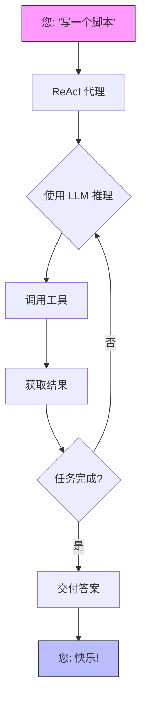
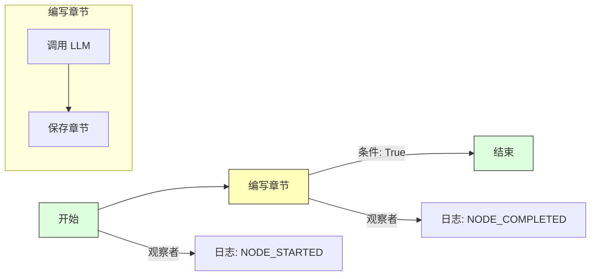

# QuantaLogic

[](https://opensource.org/licenses/Apache-2.0)
[](https://www.python.org/downloads/)
[](https://quantalogic.github.io/quantalogic/)

欢迎来到 **QuantaLogic**！这是您打造卓越 AI 代理和工作流程的宇宙工具箱！无论您是在挥洒代码、自动化业务流程，还是构想天马行空的创意，QuantaLogic 都能助您实现。我们融合了**大型语言模型 (LLM)** 和强大的工具集，其中包含两种核心方法：用于动态解决问题的 **ReAct 框架**，以及用于构建结构化卓越流程的全新 **Flow 模块**。

想象一下：一个简单易用的 CLI，一个充满魔力的 Python API，以及一个可从快速原型扩展到银河级企业的框架。准备好起飞了吗？让我们一飞冲天！

[完整文档](https://quantalogic.github.io/quantalogic/) | [使用指南](./docs/howto/howto.md)


---

## 为什么选择 QuantaLogic？

在 [QuantaLogic](https://www.quantalogic.app)，我们发现了一个黑洞：来自 OpenAI、Anthropic 和 DeepSeek 的强大 AI 模型未能充分应用于实际任务。我们的使命？点燃那颗火花！我们致力于让生成式 AI 成为开发者、企业和梦想家的福音，将想法转化为行动，一次一个卓越的解决方案。

> “AI 应该是你的副驾驶，而不是一个谜题。QuantaLogic 让这一切成为现实——快速、有趣、无所畏惧！”

---

## 主要特性

- **ReAct 框架**：推理 + 行动 = 无可阻挡的代理！
- **Flow 模块**：结构化工作流程，如行云流水。
- **LLM 星系**：通过 LiteLLM 连接 OpenAI、DeepSeek 等模型。
- **安全工具**：Docker 驱动的代码和文件安全。
- **实时监控**：通过 Web 界面和 SSE 观察进展。
- **记忆魔法**：智能上下文保持流畅。
- **企业级准备**：日志、错误处理和验证——坚如磐石。

---

## 目录

- [为什么选择 QuantaLogic？](#why-quantalogic)
- [主要特性](#key-features)
- [安装](#installation)
- [快速开始](#quick-start)
- [ReAct 框架：动态代理](#react-framework-dynamic-agents)
- [Flow 模块：结构化工作流程](#flow-module-structured-workflows)
  - 📘 **[Workflow YAML DSL 规范](./quantalogic/flow/flow_yaml.md)**：使用我们的领域特定语言定义强大、结构化工作流程的综合指南。
  - 📚 **[Flow YAML 文档](https://quantalogic.github.io/quantalogic/flow/flow_yaml)**：深入官方文档，更深入地了解 Flow YAML 及其应用。
- [ReAct vs. Flow：选择你的力量](#react-vs-flow-pick-your-power)
- [使用 CLI](#using-the-cli)
- [激发灵感的示例](#examples-that-spark-joy)
- [核心组件](#core-components)
- [使用 QuantaLogic 进行开发](#developing-with-quantalogic)
- [贡献](#contributing)
- [许可证](#license)
- [项目增长](#project-growth)
- [API 密钥和环境配置](#api-keys-and-environment-configuration)

---

## 安装

让我们让 QuantaLogic 进入您的系统——就像 1-2-3 一样简单！

### 您需要什么
- **Python 3.12+**：我们火箭的燃料。
- **Docker**（可选）：将代码执行锁定在安全的容器中。

### 选项 1：pip——快速而简单
```bash
pip install quantalogic
```

### 选项 2：pipx——隔离的星尘
```bash
pipx install quantalogic
```

### 选项 3：源码——为太空探险家准备
```bash
git clone https://github.com/quantalogic/quantalogic.git
cd quantalogic
python -m venv .venv
source .venv/bin/activate  # Windows: .venv\Scripts\activate
poetry install
```
> **提示**：没有 Poetry？使用 `pip install poetry` 获取它，加入我们的队伍！

---

## 快速开始

准备好见证奇迹了吗？这是您的发射台：

### CLI：即时行动
```bash
quantalogic task "编写一个用于计算斐波那契数列的 Python 函数"
```
> 砰！ReAct 在几秒钟内生成解决方案。

### Python：ReAct 代理
```python
from quantalogic import Agent

agent = Agent(model_name="deepseek/deepseek-chat")
result = agent.solve_task("编写一个斐波那契函数")
print(result)
# 输出: "def fib(n): return [0, 1] if n <= 2 else fib(n-1) + [fib(n-1)[-1] + fib(n-1)[-2]]"
```

### 同步代理示例

```python
from quantalogic import Agent

# 创建一个同步代理
agent = Agent(model_name="gpt-4o")

# 同步解决任务
result = agent.solve_task(
    task="编写一个 Python 函数来计算斐波那契数列",
    max_iterations=10  # 可选：限制迭代次数
)

print(result)
```

### 异步代理示例 🌊

```python
import asyncio
from quantalogic import Agent

async def main():
    # 创建一个异步代理
    agent = Agent(model_name="gpt-4o")
    
    # 异步解决任务，并进行流式传输
    result = await agent.async_solve_task(
        task="编写一个 Python 脚本来抓取 GitHub 上最受欢迎的仓库",
        max_iterations=15,  # 可选：限制迭代次数
        streaming=True      # 可选：流式传输响应
    )
    
    print(result)

# 运行异步函数
asyncio.run(main())
```

### 事件监控示例 🔍

#### 使用金融工具进行同步事件监控
```python
from quantalogic import Agent
from quantalogic.console_print_events import console_print_events
from quantalogic.console_print_token import console_print_token
from quantalogic.tools import (
    DuckDuckGoSearchTool, 
    TechnicalAnalysisTool, 
    YFinanceTool
)

# 创建一个具有金融相关工具的代理
agent = Agent(
    model_name="gpt-4o",
    tools=[
        DuckDuckGoSearchTool(),  # 网络搜索工具
        TechnicalAnalysisTool(),  # 股票技术分析
        YFinanceTool()            # 股票数据检索
    ]
)

# 设置全面的事件监听器
agent.event_emitter.on(
    event=[
        "task_complete",
        "task_think_start", 
        "task_think_end", 
        "tool_execution_start", 
        "tool_execution_end",
        "error_max_iterations_reached",
        "memory_full",
        "memory_compacted"
    ],
    listener=console_print_events
)

# 可选：监控流式传输的 token
agent.event_emitter.on(
    event=["stream_chunk"], 
    listener=console_print_token
)

# 执行一个多步骤的金融分析任务
result = agent.solve_task(
    "1. 找到 2024 年第三季度排名前 3 的科技股 "
    "2. 检索每只股票的历史数据 "
    "3. 计算 50 天和 200 天的移动平均线 "
    "4. 提供简短的投资建议",
    streaming=True  # 启用流式传输以获得详细输出
)
print(result)
```

#### 使用金融工具进行异步事件监控
```python
import asyncio
from quantalogic import Agent
from quantalogic.console_print_events import console_print_events
from quantalogic.console_print_token import console_print_token
from quantalogic.tools import (
    DuckDuckGoSearchTool, 
    TechnicalAnalysisTool, 
    YFinanceTool
)

async def main():
    # 创建一个具有金融相关工具的异步代理
    agent = Agent(
        model_name="gpt-4o",
        tools=[
            DuckDuckGoSearchTool(),  # 网络搜索工具
            TechnicalAnalysisTool(),  # 股票技术分析
            YFinanceTool()            # 股票数据检索
        ]
    )

    # 设置全面的事件监听器
    agent.event_emitter.on(
        event=[
            "task_complete",
            "task_think_start", 
            "task_think_end", 
            "tool_execution_start", 
            "tool_execution_end",
            "error_max_iterations_reached",
            "memory_full",
            "memory_compacted"
        ],
        listener=console_print_events
    )

    # 可选：监控流式传输的 token
    agent.event_emitter.on(
        event=["stream_chunk"], 
        listener=console_print_token
    )

    # 异步执行一个多步骤的金融分析任务
    result = await agent.async_solve_task(
        "1. 找到新兴的 AI 技术初创公司 "
        "2. 分析他们最近的融资轮次 "
        "3. 比较市场潜力和增长指标 "
        "4. 提供一份投资趋势报告",
        streaming=True  # 启用流式传输以获得详细输出
    )
    print(result)

# 运行异步函数
asyncio.run(main())
```

### Python：Flow 工作流程
```python
from quantalogic.flow import Workflow, Nodes

@Nodes.define(output="greeting")
def greet(name: str) -> str:
    return f"你好, {name}!"

workflow = Workflow("greet").build()
result = await workflow.run({"name": "Luna"})
print(result["greeting"])  # "你好, Luna!"
```

---

## ReAct 框架：动态代理

**ReAct** 框架是您的 AI 助手——思考迅速，行动敏捷。它将 LLM 推理与工具驱动的行动相结合，非常适合需要即兴发挥的任务。

### 运作方式
1. **您说**：“帮我写一个脚本。”
2. **它思考**：LLM 规划路线。
3. **它行动**：`PythonTool` 等工具开始工作。
4. **它循环**：持续进行，直到完成。

看看这个：



### 示例：代码生成器
```bash
quantalogic task "创建一个 Python 脚本来排序一个列表"
```
> ReAct 会找出解决方案，编写代码，并将其顺利交付！

### 它的优势
非常适合编码、调试或即时回答各种问题。

---

## Flow 模块：结构化工作流程

**Flow 模块**是您的架构师——构建精确运行的工作流程。它专注于节点、转换和稳定的节奏，非常适合可重复的任务。

🔍 **想更深入地了解吗？** 请查看我们全面的 [Workflow YAML DSL 规范](./quantalogic/flow/flow_yaml.md)，这是一个详细的指南，引导您定义强大、结构化的工作流程。从基本的节点配置到复杂的转换逻辑，本文档是您掌握 QuantaLogic 工作流程设计的路线图。

📚 **要更深入地了解 Flow YAML 及其应用，请参阅官方 [Flow YAML 文档](https://quantalogic.github.io/quantalogic/flow/flow_yaml)。**

Flow YAML 文档提供了 Flow YAML 语言的全面概述，包括其语法、特性和最佳实践。对于任何希望使用 QuantaLogic 创建复杂工作流程的人来说，它都是宝贵的资源。

此外，Flow YAML 文档还包括许多示例和教程，以帮助您开始创建自己的工作流程。这些示例涵盖了从简单工作流程到更复杂场景的一系列主题，旨在帮助您了解如何使用 Flow YAML 创建强大而灵活的工作流程。

### 构建块
- **节点**：函数或 LLM 调用等任务。
- **转换**：具有可选条件的路径。
- **引擎**：以天赋运行整个流程。
- **观察者**：通过事件查看进度。

### 示例：故事编织者
```python
from quantalogic.flow import Workflow, Nodes

@Nodes.llm_node(model="openai/gpt-4o-mini", output="chapter")
async def write_chapter(ctx: dict) -> str:
    return f"第一章: {ctx['theme']}"

workflow = (
    Workflow("write_chapter")
    .then("end", condition="lambda ctx: True")
    .add_observer(lambda e: print(f" {e.event_type}"))
)
engine = workflow.build()
result = await engine.run({"theme": "宇宙探险"})
print(result["chapter"])
```

### 示例：故事生成代理

这是一个更复杂的示例，展示了使用 Flow 模块的完整故事生成工作流程：

```python
from typing import List
import anyio
from loguru import logger
from quantalogic.flow import Nodes, Workflow

# 使用装饰器定义节点函数
@Nodes.validate_node(output="validation_result")
async def validate_input(genre: str, num_chapters: int) -> str:
    """验证输入参数。"""
    if not (1 <= num_chapters <= 20 and genre.lower() in ["science fiction", "fantasy", "mystery", "romance"]):
        raise ValueError("无效输入：类型必须是科幻、奇幻、悬疑或爱情")
    return "输入已验证"

@Nodes.llm_node(
    model="gemini/gemini-2.0-flash",
    system_prompt="你是一位擅长故事标题的创意作家。",
    prompt_template="为 {{ genre }} 故事生成一个创意标题。仅输出标题。",
    output="title",
)
async def generate_title(genre: str) -> str:
    """根据类型生成标题（由 llm_node 处理）。"""
    pass  # 逻辑由 llm_node 装饰器处理

@Nodes.define(output="manuscript")
async def compile_book(title: str, outline: str, chapters: List[str]) -> str:
    """从标题、大纲和章节编译完整的稿件。"""
    return f"标题：{title}\n\n大纲：\n{outline}\n\n" + "\n\n".join(
        f"第 {i} 章：\n{chap}" for i, chap in enumerate(chapters, 1)
    )

# 定义具有条件分支的工作流程
workflow = (
    Workflow("validate_input")
    .then("generate_title")
    .then("generate_outline")
    .then("generate_chapter")
    .then("update_chapter_progress")
    .then("generate_chapter", condition=lambda ctx: ctx["completed_chapters"] < ctx["num_chapters"])
    .then("compile_book", condition=lambda ctx: ctx["completed_chapters"] >= ctx["num_chapters"])
    .then("quality_check")
    .then("end")
)

# 运行工作流程
async def main():
    initial_context = {
        "genre": "science fiction",
        "num_chapters": 3,
        "chapters": [],
        "completed_chapters": 0,
    }
    engine = workflow.build()
    result = await engine.run(initial_context)
```

此示例演示：
- 使用 `@Nodes.validate_node` 进行输入验证
- 使用 `@Nodes.llm_node` 进行 LLM 集成
- 使用 `@Nodes.define` 进行自定义处理
- 用于迭代章节生成的条件分支
- 用于跟踪进度的上下文管理

完整的示例可在 [examples/flow/story_generator_agent.py](./examples/flow/story_generator_agent.py) 中找到。

### Flow 可视化


### 示例：数据管道
```python
@Nodes.define(output="processed")
def clean_data(data: str) -> str:
    return data.strip().upper()

workflow = Workflow("clean_data").build()
result = await workflow.run({"data": " hello "})
print(result["processed"])  # "HELLO"
```

### 它的优势
考虑内容管道、自动化流程或任何需要秩序的多步骤任务。

---

## ReAct vs. Flow：选择你的力量

两者都很出色，但这里有一些说明：

| 特性             | ReAct 框架 | Flow 模块                 |
|---------------------|--------------------------------|--------------------------------|
| **风格**           | 自由奔放，适应性强        | 有组织，可预测         |
| **流程**           | 循环直到解决         | 遵循路线图              |
| **最佳应用**     | 创造性的混乱（编码、问答）   | 稳定的工作流程（管道）   |
| **状态**          | 内存保持松散          | 节点锁定             |
| **工具**          | 根据需要获取              | 嵌入到节点中               |
| **观察**       | `task_complete` 等事件    | `NODE_STARTED` 等观察者  |

### 何时选择
- **ReAct**：即时编码、探索答案、像专业人士一样调试。
- **Flow**：构建管道、自动化流程、保持紧密。

---

## 使用 CLI

CLI 是您的指挥中心——快速、灵活、有趣！

### 语法
```bash
quantalogic [选项] 命令 [参数]...
```

### 描述
QuantaLogic AI 助手 - 一款用于各种任务的强大 AI 工具。

### 环境变量
- **OpenAI**：将 `OPENAI_API_KEY` 设置为您的 OpenAI API 密钥
- **Anthropic**：将 `ANTHROPIC_API_KEY` 设置为您的 Anthropic API 密钥
- **DeepSeek**：将 `DEEPSEEK_API_KEY` 设置为您的 DeepSeek API 密钥

使用 `.env` 文件或在您的 shell 中导出这些变量以实现无缝集成。

### 命令
- **`task`**：启动任务。
  ```bash
  quantalogic task "总结这个文件" --file notes.txt
  ```
- **`list-models`**：列出支持的 LiteLLM 模型，并可选择模糊搜索。
  ```bash
  quantalogic list-models --search "gpt"
  ```

### 选项
- **`--model-name TEXT`**：指定要使用的模型（litellm 格式）。示例：
  - `openai/gpt-4o-mini`
  - `openai/gpt-4o`
  - `anthropic/claude-3.5-sonnet`
  - `deepseek/deepseek-chat`
  - `deepseek/deepseek-reasoner`
  - `openrouter/deepseek/deepseek-r1`
  - `openrouter/openai/gpt-4o`
- **`--mode [code|basic|interpreter|full|code-basic|search|search-full]`**：代理模式
- **`--vision-model-name TEXT`**：指定要使用的视觉模型（litellm 格式）
- **`--log [info|debug|warning]`**：设置日志级别
- **`--verbose`**：启用详细输出
- **`--max-iterations INTEGER`**：最大迭代次数（默认：30）
- **`--max-tokens-working-memory INTEGER`**：设置工作内存中允许的最大 token 数
- **`--compact-every-n-iteration INTEGER`**：设置内存压缩的频率
- **`--thinking-model TEXT`**：要使用的思考模型
- **`--version`**：显示版本信息

> **提示**：运行 `quantalogic --help` 获取完整的命令参考！

---

## 激发灵感的示例

让我们用这些宝石点亮您的想象力：

### 视频魔术
[](./examples/generated_tutorials/python/quantalogic_long.mp4)

### 实践示例
| 名称              | 它的作用？                       | 文件                                       |
|-------------------|------------------------------------|--------------------------------------------|
| 简单代理      | 基本 ReAct 代理演示             | [01-simple-agent.py](./examples/01-simple-agent.py) |
| 事件监控  | 具有事件跟踪的代理          | [02-agent-with-event-monitoring.py](./examples/02-agent-with-event-monitoring.py) |
| 解释器模式  | 具有解释器的代理             | [03-agent-with-interpreter.py](./examples/03-agent-with-interpreter.py) |
| 代理总结     | 任务总结生成            | [04-agent-summary-task.py](./examples/04-agent-summary-task.py) |
| 代码生成   | 基本代码生成              | [05-code.py](./examples/05-code.py) |
| 代码屏幕       | 高级代码生成           | [06-code-screen.py](./examples/06-code-screen.py) |
| 教程编写器   | 编写技术教程          | [07-write-tutorial.py](./examples/07-write-tutorial.py) |
| PRD 编写器        | 产品需求文档      | [08-prd-writer.py](./examples/08-prd-writer.py) |
| 故事生成器   | 基于 Flow 的故事创作          | [story_generator_agent.py](./examples/flow/story_generator_agent.py) |
| SQL 查询         | 数据库查询生成          | [09-sql-query.py](./examples/09-sql-query.py) |
| 金融代理     | 金融分析和任务       | [10-finance-agent.py](./examples/10-finance-agent.py) |
| 文本界面 | 具有文本 UI 的代理               | [11-textual-agent-interface.py](./examples/11-textual-agent-interface.py) |
| Composio 测试     | Composio 集成演示           | [12-composio-test.py](./examples/12-composio-test.py) |
| 同步代理 | 同步代理演示             | [13-synchronous-agent.py](./examples/13-synchronous-agent.py) |
| 异步代理       | 异步代理演示                   | [14-async-agent.py](./examples/14-async-agent.py) |

### 奖励：数学天才
```bash
quantalogic task "解方程 2x + 5 = 15"
```
> 输出：“让我们来解一下！2x + 5 = 15 → 2x = 10 → x = 5。完成！”

---

## 核心组件

### ReAct 代理
- **大脑**：LLM 提供思考能力。
- **双手**：`PythonTool` 等工具完成工作。
- **记忆**：将所有内容联系在一起。

### Flow 工作流程
- **节点**：您的任务块。
- **引擎**：执行大师。

### 工具库
- **代码**：`PythonTool`、`NodeJsTool`。
- **文件**：`ReadFileTool`、`WriteFileTool`。
- 更多信息请参见 [REFERENCE_TOOLS.md](./REFERENCE_TOOLS.md)。

---

## 使用 QuantaLogic 进行开发

### 设置您的实验室
```bash
git clone https://github.com/quantalogic/quantalogic.git
cd quantalogic
python -m venv venv
source venv/bin/activate
poetry install
```

### 测试宇宙
```bash
pytest --cov=quantalogic
```

### 润色
```bash
ruff format  # 擦亮代码
mypy quantalogic  # 检查类型
ruff check quantalogic  # 进行代码检查
```

### 创建自定义工具
`create_tool()` 函数将任何 Python 函数转换为可重用的工具：

```python
from quantalogic.tools import create_tool

def weather_lookup(city: str, country: str = "US") -> dict:
    """检索给定位置的当前天气。
    
    Args:
        city: 要查找的城市名称
        country: 双字母国家代码（默认：US）
    
    Returns:
        包含天气信息的字典
    """
    # 在此处实现天气查找逻辑
    return {"temperature": 22, "condition": "Sunny"}

# 将函数转换为工具
weather_tool = create_tool(weather_lookup)

# 现在您可以将其用作工具
print(weather_tool.to_markdown())  # 生成工具文档
result = weather_tool.execute(city="New York")  # 作为工具执行
```

#### 将自定义工具与 ReAct 代理一起使用

以下是如何将自定义工具与 ReAct 代理集成：

```python
from quantalogic import Agent
from quantalogic.tools import create_tool, PythonTool

# 创建一个自定义股票价格查找工具
def get_stock_price(symbol: str) -> str:
    """按股票代码获取股票的当前价格。
    
    Args:
        symbol: 股票代码（例如，AAPL、MSFT）
    
    Returns:
        当前股票价格信息
    """
    # 在实际实现中，您将从 API 获取
    prices = {"AAPL": 185.92, "MSFT": 425.27, "GOOGL": 175.43}
    if symbol in prices:
        return f"{symbol} 目前的交易价格为 ${prices[symbol]}"
    return f"无法找到 {symbol} 的价格"

# 创建一个具有标准工具和自定义工具的代理
agent = Agent(
    model_name="gpt-4o",
    tools=[
        PythonTool(),  # 标准 Python 执行工具
        create_tool(get_stock_price)  # 自定义股票价格工具
    ]
)

# 该代理现在可以使用这两种工具来解决任务
result = agent.solve_task(
    "编写一个 Python 函数来计算投资增长，"  
    "然后分析苹果股票的当前价格"
)

print(result)
```

在此示例中，代理可以无缝地使用标准 `PythonTool` 和您的自定义股票价格查找工具来完成任务。

`create_tool()` 的主要特性：
- 🔧 自动将函数转换为工具
- 📝 从函数签名和文档字符串中提取元数据
- 🔍 支持同步和异步函数
- 🛠️ 生成工具文档和验证

---

## 贡献

加入 QuantaLogic 星系！
1. Fork 项目。
2. 创建分支：`git checkout -b feature/epic-thing`。
3. 编写代码 + 测试。
4. 提交 PR！

有关完整信息，请参阅 [CONTRIBUTING.md](./CONTRIBUTING.md)。

---

## 许可证

 2024 QuantaLogic 贡献者。**Apache 2.0**——免费且开源。查看 [LICENSE](./LICENSE)。

由 [QuantaLogic](https://www.quantalogic.app) 的创始人 Raphaël MANSUY 构思。

---

## 项目增长
[](https://star-history.com/#quantalogic/quantalogic&Date)

---

## API 密钥和环境配置

QuantaLogic 通过 API 密钥连接到 LLM——这是您解锁宇宙的指南！

### 设置密钥
将密钥存储在 `.env` 文件中或导出它们：
```bash
echo "OPENAI_API_KEY=sk-your-openai-key" > .env
echo "DEEPSEEK_API_KEY=ds-your-deepseek-key" >> .env
source .env
```

### 密钥库：支持的模型
| 模型名称                              | 密钥变量             | 它的优势？                           |
|-----------------------------------------|--------------------------|-----------------------------------------------|
| `openai/gpt-4o-mini`                   | `OPENAI_API_KEY`         | 快速、经济实惠的任务                 |
| `openai/gpt-4o`                        | `OPENAI_API_KEY`         | 重型推理                          |
| `anthropic/claude-3.5-sonnet`          | `ANTHROPIC_API_KEY`      | 平衡的卓越                           |
| `deepseek/deepseek-chat`               | `DEEPSEEK_API_KEY`       | 健谈且多才多艺                          |
| `deepseek/deepseek-reasoner`           | `DEEPSEEK_API_KEY`       | 深度问题解决                          |
| `openrouter/deepseek/deepseek-r1`      | `OPENROUTER_API_KEY`     | 通过 OpenRouter 进行研究级访问                 |
| `mistral/mistral-large-2407`           | `MISTRAL_API_KEY`        | 多语言精通                          |
| `dashscope/qwen-max`                   | `DASHSCOPE_API_KEY`      | 阿里巴巴的强大玩家                        |
| `lm_studio/mistral-small-24b-instruct-2501` | `LM_STUDIO_API_KEY` | 本地 LLM 行动                           |

### 本地设置（例如，LM Studio）
```bash
export LM_STUDIO_API_BASE="http://localhost:1234/v1"
export LM_STUDIO_API_KEY="lm-your-key"
```

### 专业提示
- **安全**：将密钥保存在 `.env` 中，而不是代码中！
- **额外**：添加 `OPENROUTER_REFERRER` 以获得 OpenRouter 的风格。
- **更多**：深入研究 [LiteLLM 文档](https://docs.litellm.ai/docs/)。

---

## 最后冲刺

QuantaLogic 是您通往 AI 卓越的门票。安装它，玩转它，让我们一起构建一些令人难忘的东西！
