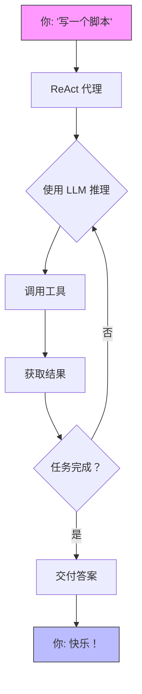
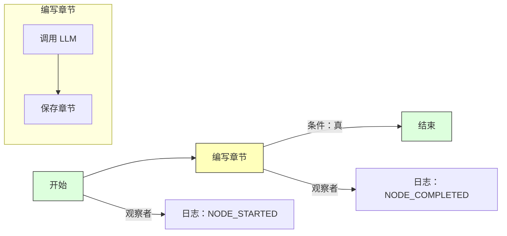

```
[](https://www.python.org/downloads/)
[](https://quantalogic.github.io/quantalogic/)

大家好，欢迎来到 **QuantaLogic**——您打造卓越 AI 代理和工作流程的宇宙工具包！无论您是在编写代码、自动化业务流程、与智能助手聊天，还是在构想一些疯狂的东西，QuantaLogic 都能助您实现。我们正在讨论**大型语言模型 (LLM)** 与强大的工具集融合，其中包含三种强大的方法：用于动态问题解决的 **ReAct 框架**，用于结构化卓越性的耀眼的新 **Flow 模块**，以及用于具有工具调用功能的对话魔法的闪亮 **Chat 模式**。

想象一下：一个像快照一样简单的 CLI，一个纯粹魔法的 Python API，以及一个可以从快速黑客攻击扩展到银河企业的框架。准备好启动了吗？让我们起飞吧！

[完整文档](https://quantalogic.github.io/quantalogic/) | [操作指南](./docs/howto/howto.md)


---
[中文版](./README_CN.md)
[法语版](./README_FR.md)
[德语版](./README_DE.md)

## 为什么选择 QuantaLogic？

在 [QuantaLogic](https://www.quantalogic.app)，我们发现了一个黑洞：来自 OpenAI、Anthropic 和 DeepSeek 的惊人 AI 模型并没有完全照亮现实世界的任务。我们的使命？点燃那个火花！我们在这里让生成式 AI 成为开发人员、企业和梦想家的福音——将想法转化为行动，一次一个辉煌的解决方案，无论是通过解决任务、结构化工作流程还是自然对话。

> “AI 应该是你的副驾驶，而不是一个难题。QuantaLogic 让它发生——快速、有趣且无所畏惧！”

---

## 主要特性

- **ReAct 框架**：推理 + 行动 = 不可阻挡的代理！
- **Flow 模块**：像河流一样流动的结构化工作流程。
- **Chat 模式**：具有工具调用能力的对话式卓越性。
- **LLM 星系**：通过 LiteLLM 利用 OpenAI、DeepSeek 等。
- **安全工具**：Docker 驱动的代码和文件安全。
- **实时监控**：通过 Web 界面和 SSE 观看展开。
- **记忆魔法**：智能上下文保持事物简洁。
- **企业就绪**：日志、错误处理和验证——坚如磐石。

---

## 目录

- [为什么选择 QuantaLogic？](#why-quantalogic)
- [主要特性](#key-features)
- [安装](#installation)
- [快速开始](#quick-start)
- [ReAct 框架：动态代理](#react-framework-dynamic-agents)
- [Flow 模块：结构化工作流程](#flow-module-structured-workflows)
  - 📘 **[Workflow YAML DSL 规范](./quantalogic/flow/flow_yaml.md)**：使用我们的领域特定语言定义强大、结构化工作流程的综合指南
  - 📚 **[Flow YAML 文档](./quantalogic/flow/flow_yaml)**：深入了解官方文档，以更深入地了解 Flow YAML 及其应用
- [Chat 模式：对话能力](#chat-mode-conversational-power)
- [ReAct vs. Flow vs. Chat：选择你的力量](#react-vs-flow-vs-chat-pick-your-power)
- [使用 CLI](#using-the-cli)
- [激发快乐的示例](#examples-that-spark-joy)
- [核心组件](#core-components)
- [使用 QuantaLogic 进行开发](#developing-with-quantalogic)
- [贡献](#contributing)
- [许可证](#license)
- [项目增长](#project-growth)
- [API 密钥和环境配置](#api-keys-and-environment-configuration)

---

## 安装

让我们让 QuantaLogic 围绕您的系统运行——就像 1-2-3 一样简单！

### 你需要什么
- **Python 3.12+**：我们火箭的燃料。
- **Docker**（可选）：将代码执行锁定在安全舱中。

### 选项 1：pip——快速而简单
```bash
pip install quantalogic
```

### 选项 2：pipx——隔离的星尘
```bash
pipx install quantalogic
```

### 选项 3：源代码——对于太空探险家
```bash
git clone https://github.com/quantalogic/quantalogic.git
cd quantalogic
python -m venv .venv
source .venv/bin/activate  # Windows: .venv\Scripts\activate
poetry install
```
> **提示**：没有 Poetry？使用 `pip install poetry` 获取它并加入团队！

---

## 快速开始

准备好见证魔法了吗？这是你的发射台：

### CLI：即时行动
```bash
quantalogic task "编写一个用于计算斐波那契数列的 Python 函数"
```
> 砰！ReAct 在几秒钟内提出了一个解决方案。

### CLI：Chat 模式
```bash
quantalogic chat --persona "你是一位诙谐的太空探险家" "用搜索告诉我关于火星的信息"
```
> Chat 模式启动，根据需要使用工具，并提供对话式响应！

### Python：ReAct 代理
```python
from quantalogic import Agent

agent = Agent(model_name="deepseek/deepseek-chat")
result = agent.solve_task("编写一个斐波那契函数")
print(result)
# 输出: "def fib(n): return [0, 1] if n <= 2 else fib(n-1) + [fib(n-1)[-1] + fib(n-1)[-2]]"
```

### Python：Chat 模式
```python
from quantalogic import Agent

agent = Agent(model_name="gpt-4o", chat_system_prompt="你是一位友好的向导")
response = agent.chat("东京的天气怎么样？")
print(response)
# 进行对话，如果配置了，可能会调用天气工具
```

### 同步代理示例
```python
from quantalogic import Agent

# 创建一个同步代理
agent = Agent(model_name="gpt-4o")

# 同步解决任务
result = agent.solve_task(
    task="编写一个 Python 函数来计算斐波那契数列",
    max_iterations=10  # 可选：限制迭代次数
)

print(result)
```

### 异步代理示例 🌊
```python
import asyncio
from quantalogic import Agent

async def main():
    # 创建一个异步代理
    agent = Agent(model_name="gpt-4o")
    
    # 异步解决任务，并进行流式传输
    result = await agent.async_solve_task(
        task="编写一个 Python 脚本来抓取 GitHub 上最受欢迎的存储库",
        max_iterations=15,  # 可选：限制迭代次数
        streaming=True      # 可选：流式传输响应
    )
    
    print(result)

# 运行异步函数
asyncio.run(main())
```

### 事件监控示例 🔍

#### 使用金融工具进行同步事件监控
```python
from quantalogic import Agent
from quantalogic.console_print_events import console_print_events
from quantalogic.console_print_token import console_print_token
from quantalogic.tools import (
    DuckDuckGoSearchTool, 
    TechnicalAnalysisTool, 
    YFinanceTool
)

# 创建一个具有金融相关工具的代理
agent = Agent(
    model_name="gpt-4o",
    tools=[
        DuckDuckGoSearchTool(),  # Web 搜索工具
        TechnicalAnalysisTool(),  # 股票技术分析
        YFinanceTool()            # 股票数据检索
    ]
)

# 设置全面的事件监听器
agent.event_emitter.on(
    event=[
        "task_complete",
        "task_think_start", 
        "task_think_end", 
        "tool_execution_start", 
        "tool_execution_end",
        "error_max_iterations_reached",
        "memory_full",
        "memory_compacted"
    ],
    listener=console_print_events
)

# 可选：监控流式传输的 token
agent.event_emitter.on(
    event=["stream_chunk"], 
    listener=console_print_token
)

# 执行多步骤的金融分析任务
result = agent.solve_task(
    "1. 找到 2024 年第三季度排名前 3 的科技股 "
    "2. 检索每只股票的历史股票数据 "
    "3. 计算 50 日和 200 日移动平均线 "
    "4. 提供一份简短的投资建议",
    streaming=True  # 启用流式传输以获得详细输出
)
print(result)
```

#### 使用金融工具进行异步事件监控
```python
import asyncio
from quantalogic import Agent
from quantalogic.console_print_events import console_print_events
from quantalogic.console_print_token import console_print_token
from quantalogic.tools import (
    DuckDuckGoSearchTool, 
    TechnicalAnalysisTool, 
    YFinanceTool
)

async def main():
    # 创建一个具有金融相关工具的异步代理
    agent = Agent(
        model_name="gpt-4o",
        tools=[
            DuckDuckGoSearchTool(),  # Web 搜索工具
            TechnicalAnalysisTool(),  # 股票技术分析
            YFinanceTool()            # 股票数据检索
        ]
    )

    # 设置全面的事件监听器
    agent.event_emitter.on(
        event=[
            "task_complete",
            "task_think_start", 
            "task_think_end", 
            "tool_execution_start", 
            "tool_execution_end",
            "error_max_iterations_reached",
            "memory_full",
            "memory_compacted"
        ],
        listener=console_print_events
    )

    # 可选：监控流式传输的 token
    agent.event_emitter.on(
        event=["stream_chunk"], 
        listener=console_print_token
    )

    # 异步执行多步骤的金融分析任务
    result = await agent.async_solve_task(
        "1. 找到新兴的 AI 技术初创公司 "
        "2. 分析他们最近的融资轮次 "
        "3. 比较市场潜力和增长指标 "
        "4. 提供一份投资趋势报告",
        streaming=True  # 启用流式传输以获得详细输出
    )
    print(result)

# 运行异步函数
asyncio.run(main())
```

### Python：Flow 工作流程
```python
from quantalogic.flow import Workflow, Nodes

@Nodes.define(output="greeting")
def greet(name: str) -> str:
    return f"你好，{name}！"

workflow = Workflow("greet").build()
result = await workflow.run({"name": "Luna"})
print(result["greeting"])  # "你好，Luna！"
```

---

## ReAct 框架：动态代理

**ReAct** 框架是您的 AI 助手——思考迅速，行动聪明。它将 LLM 推理与工具驱动的行动相结合，非常适合需要一些即兴发挥的任务。

### 它是如何运作的
1. **你说**：“为我写一个脚本。”
2. **它思考**：LLM 绘制路线。
3. **它行动**：`PythonTool` 等工具开始工作。
4. **它循环**：持续进行直到完成。

看看这个：



### 示例：代码生成器
```bash
quantalogic task "创建一个 Python 脚本来对列表进行排序"
```
> ReAct 会弄清楚它，编写代码并将其移交——如丝般顺滑！

### 为什么它很酷
非常适合编码、调试或即时回答疯狂的问题。

---

## Flow 模块：结构化工作流程

**Flow 模块**是您的架构师——构建以精确度运行的工作流程。它完全关于节点、转换和稳定的节奏，非常适合可重复的任务。

🔍 **想更深入地了解吗？** 查看我们全面的 [Workflow YAML DSL 规范](./quantalogic/flow/flow_yaml.md)，这是一个详细的指南，引导您完成定义强大、结构化工作流程的过程。从基本的节点配置到复杂的转换逻辑，本文档是您掌握 QuantaLogic 工作流程设计的路线图。

📚 **要更深入地了解 Flow YAML 及其应用，请参阅官方 [Flow YAML 文档](https://quantalogic.github.io/quantalogic/flow/flow_yaml)。**

Flow YAML 文档提供了 Flow YAML 语言的全面概述，包括其语法、特性和最佳实践。对于任何希望使用 QuantaLogic 创建复杂工作流程的人来说，它都是一个宝贵的资源。

此外，Flow YAML 文档还包括许多示例和教程，以帮助您开始创建自己的工作流程。这些示例涵盖了从简单工作流程到更复杂场景的各种主题，旨在帮助您了解如何使用 Flow YAML 创建强大而灵活的工作流程。

### 构建块
- **节点**：像函数或 LLM 调用这样的任务。
- **转换**：具有可选条件的路径。
- **引擎**：以天赋运行节目。
- **观察者**：通过事件查看进度。

### 示例：故事编织者
```python
from quantalogic.flow import Workflow, Nodes

@Nodes.llm_node(model="openai/gpt-4o-mini", output="chapter")
async def write_chapter(ctx: dict) -> str:
    return f"第一章：{ctx['theme']}"

workflow = (
    Workflow("write_chapter")
    .then("end", condition="lambda ctx: True")
    .add_observer(lambda e: print(f" {e.event_type}"))
)
engine = workflow.build()
result = await engine.run({"theme": "Cosmic Quest"})
print(result["chapter"])
```

### 示例：故事生成器代理
```python
from typing import List
import anyio
from loguru import logger
from quantalogic.flow import Nodes, Workflow

# 使用装饰器定义节点函数
@Nodes.validate_node(output="validation_result")
async def validate_input(genre: str, num_chapters: int) -> str:
    """验证输入参数。"""
    if not (1 <= num_chapters <= 20 and genre.lower() in ["science fiction", "fantasy", "mystery", "romance"]):
        raise ValueError("无效的输入：类型必须是科幻、奇幻、悬疑、浪漫之一")
    return "输入已验证"

@Nodes.llm_node(
    model="gemini/gemini-2.0-flash",
    system_prompt="你是一位专门从事故事标题的创意作家。",
    prompt_template="为 {{ genre }} 故事生成一个创意标题。仅输出标题。",
    output="title",
)
async def generate_title(genre: str) -> str:
    """根据类型生成标题（由 llm_node 处理）。"""
    pass  # 逻辑由 llm_node 装饰器处理

@Nodes.define(output="manuscript")
async def compile_book(title: str, outline: str, chapters: List[str]) -> str:
    """从标题、大纲和章节编译完整的手稿。"""
    return f"标题：{title}\n\n大纲：\n{outline}\n\n" + "\n\n".join(
        f"第 {i} 章：\n{chap}" for i, chap in enumerate(chapters, 1)
    )

# 定义带有条件分支的工作流程
workflow = (
    Workflow("validate_input")
    .then("generate_title")
    .then("generate_outline")
    .then("generate_chapter")
    .then("update_chapter_progress")
    .then("generate_chapter", condition=lambda ctx: ctx["completed_chapters"] < ctx["num_chapters"])
    .then("compile_book", condition=lambda ctx: ctx["completed_chapters"] >= ctx["num_chapters"])
    .then("quality_check")
    .then("end")
)

# 运行工作流程
async def main():
    initial_context = {
        "genre": "science fiction",
        "num_chapters": 3,
        "chapters": [],
        "completed_chapters": 0,
    }
    engine = workflow.build()
    result = await engine.run(initial_context)
```

此示例演示：
- 使用 `@Nodes.validate_node` 进行输入验证
- 使用 `@Nodes.llm_node` 进行 LLM 集成
- 使用 `@Nodes.define` 进行自定义处理
- 用于迭代章节生成的条件分支
- 用于跟踪进度的上下文管理

完整的示例位于 [examples/flow/story_generator/story_generator_agent.py](./examples/flow/story_generator/story_generator_agent.py)。

### Flow 可视化


### 示例：数据管道
```python
@Nodes.define(output="processed")
def clean_data( str) -> str:
    return data.strip().upper()

workflow = Workflow("clean_data").build()
result = await workflow.run({"data": " hello "})
print(result["processed"])  # "HELLO"
```

### 为什么它很棒
考虑内容管道、自动化流程或任何需要顺序的多步骤任务。

---

## Chat 模式：对话能力

**Chat 模式**是您的对话伴侣——引人入胜、灵活且精通工具。它建立在相同的强大 ReAct 基础上，让您可以与 AI 角色自然地聊天，同时在需要时无缝集成工具调用。非常适合交互式对话或带有实用性的快速查询。

### 它是如何运作的
1. **你聊天**：“今天天气怎么样？”
2. **它回应**：以对话的方式进行互动，决定是否需要工具（如天气查询）。
3. **工具魔法**：如果需要，它使用与 ReAct 相同的基于 XML 的系统调用工具，然后将结果编织到对话中。
4. **继续进行**：保持上下文以实现流畅的聊天。

### 示例：带有工具调用的 CLI 聊天
```bash
quantalogic chat --persona "你是一位乐于助人的旅游指南" "为我找到飞往巴黎的航班"
```
> 代理回复：“正在查找飞往巴黎的航班……以下是来自搜索工具的一些选项：[航班详情]。还有什么我可以帮忙的吗？”

### 示例：带有工具调用的 Python 聊天
```python
from quantalogic import Agent
from quantalogic.tools import DuckDuckGoSearchTool

agent = Agent(
    model_name="gpt-4o",
    chat_system_prompt="你是一位好奇的探险家",
    tools=[DuckDuckGoSearchTool()]
)
response = agent.chat("告诉我关于最高的山的信息")
print(response)
# 可能会输出：“我来查一下！根据快速搜索，最高的山是珠穆朗玛峰，海拔 8,848 米。”
```

### 工具集成
Chat 模式使用与 ReAct 相同的工具调用机制：
```xml
<action>
<duckduckgo_tool>
  <query>最高的山</query>
  <max_results>5</max_results>
</duckduckgo_tool>
</action>
```
- 工具会自动执行（可以使用 `--auto-tool-call` 进行配置），结果会以自然的方式格式化。
- 使用 `--tool-mode`（例如，`search` 或 `code`）优先考虑特定工具。

### 为什么它很棒
非常适合休闲聊天、快速信息查找或使用工具驱动的精度进行交互式辅助——而没有 ReAct 的严格任务解决结构。

---

## ReAct vs. Flow vs. Chat：选择你的力量

所有三种模式都很出色，但这里有一些提示：

| 特性             | ReAct 框架          | Flow 模块              | Chat 模式                |
|---------------------|--------------------------|--------------------------|--------------------------|
| **氛围**           | 自由奔放，适应性强  | 有组织，可预测   | 对话式，灵活 |
| **流程**           | 循环直到解决   | 遵循路线图        | 随聊天流动      |
| **最佳选择**     | 创造性的混乱（编码、问答） | 稳定的工作流程（管道） | 休闲聊天，快速查询 |
| **状态**          | 内存保持松散    | 节点锁定它       | 上下文保持流动 |
| **工具**          | 根据需要获取        | 烘焙到节点中         | 相关时调用     |
| **观看它**       | 像 `task_complete` 这样的事件 | 像 `NODE_STARTED` 这样的观察者 | 像 `chat_response` 这样的事件 |

### 何时选择
- **ReAct**：即时编码，探索答案，像专业人士一样调试。
- **Flow**：构建管道，自动化流程，保持紧密。
- **Chat**：自然对话，获取快速答案，按需使用工具。

---

## 使用 CLI

CLI 是您的指挥中心——快速、灵活且有趣！

### 语法
```bash
quantalogic [选项] 命令 [参数]...
```

### 描述
QuantaLogic AI 助手 - 一个用于各种任务的强大 AI 工具。

### 环境变量
- **OpenAI**：将 `OPENAI_API_KEY` 设置为您的 OpenAI API 密钥
- **Anthropic**：将 `ANTHROPIC_API_KEY` 设置为您的 Anthropic API 密钥
- **DeepSeek**：将 `DEEPSEEK_API_KEY` 设置为您的 DeepSeek API 密钥

使用 `.env` 文件或在您的 shell 中导出这些变量以实现无缝集成。

### 命令
- **`task`**：启动任务。
  ```bash
  quantalogic task "总结这个文件" --file notes.txt
  ```
- **`chat`**：开始对话。
  ```bash
  quantalogic chat --persona "你是一位技术专家" "AI 有什么新进展？"
  ```
- **`list-models`**：列出支持的 LiteLLM 模型，并可选择模糊搜索。
  ```bash
  quantalogic list-models --search "gpt"
  ```

### 选项
- **`--model-name TEXT`**：指定要使用的模型（litellm 格式）。示例：
  - `openai/gpt-4o-mini`
  - `openai/gpt-4o`
  - `anthropic/claude-3.5-sonnet`
  - `deepseek/deepseek-chat`
  - `deepseek/deepseek-reasoner`
  - `openrouter/deepseek/deepseek-r1`
  - `openrouter/openai/gpt-4o`
- **`--mode [code|basic|interpreter|full|code-basic|search|search-full|chat]`**：代理模式
- **`--vision-model-name TEXT`**：指定要使用的视觉模型（litellm 格式）
- **`--log [info|debug|warning]`**：设置日志记录级别
- **`--verbose`**：启用详细输出
- **`--max-iterations INTEGER`**：最大迭代次数（默认值：30，仅任务模式）
- **`--max-tokens-working-memory INTEGER`**：设置工作内存中允许的最大 token 数
- **`--compact-every-n-iteration INTEGER`**：设置内存压缩的频率
- **`--thinking-model TEXT`**：要使用的思考模型
- **`--persona TEXT`**：设置聊天角色（仅聊天模式）
- **`--tool-mode TEXT`**：优先考虑工具或工具集（仅聊天模式）
- **`--auto-tool-call`**：启用/禁用自动工具执行（仅聊天模式，默认值：True）
- **`--version`**：显示版本信息

> **提示**：运行 `quantalogic --help` 以获取完整的命令参考！

---

## 激发快乐的示例

探索我们的示例集合，了解 QuantaLogic 的实际应用：

- [Flow 示例](./examples/flow/README.md)：发现展示 Quantalogic Flow 功能的实用工作流程
- [代理示例](./examples/agent/README.md)：了解使用 ReAct 框架的动态代理的实际应用
- [工具示例](./examples/tools/README.md)：探索我们强大的工具集成

每个示例都附带详细的文档和可运行的代码。

### 视频魔法
[](./examples/generated_tutorials/python/quantalogic_long.mp4)

### 实践示例
| 名称              | 它的作用是什么？                       | 文件                                       |
|-------------------|------------------------------------|--------------------------------------------|
| 简单代理      | 基本的 ReAct 代理演示             | [01-simple-agent.py](./examples/01-simple-agent.py) |
| 事件监控  | 具有事件跟踪的代理          | [02-agent-with-event-monitoring.py](./examples/02-agent-with-event-monitoring.py) |
| 解释器模式  | 具有解释器的代理             | [03-agent-with-interpreter.py](./examples/03-agent-with-interpreter.py) |
| 代理摘要     | 任务摘要生成            | [04-agent-summary-task.py](./examples/04-agent-summary-task.py) |
| 代码生成   | 基本代码生成              | [05-code.py](./examples/05-code.py) |
| 代码屏幕       | 高级代码生成           | [06-code-screen.py](./examples/06-code-screen.py) |
| 教程编写器   | 编写技术教程          | [07-write-tutorial.py](./examples/07-write-tutorial.py) |
| PRD 编写器        | 产品需求文档      | [08-prd-writer.py](./examples/08-prd-writer.py) |
| 故事生成器   | 基于 Flow 的故事创作          | [story_generator_agent.py](./examples/flow/story_generator/story_generator_agent.py) |
| SQL 查询         | 数据库查询生成          | [09-sql-query.py](./examples/09-sql-query.py) |
| 金融代理     | 金融分析和任务       | [10-finance-agent.py](./examples/10-finance-agent.py) |
| 文本界面 | 具有文本 UI 的代理               | [11-textual-agent-interface.py](./examples/11-textual-agent-interface.py) |
| Composio 测试     | Composio 集成演示           | [12-composio-test.py](./examples/12-composio-test.py) |
| 同步代理 | 同步代理演示             | [13-synchronous-agent.py](./examples/13-synchronous-agent.py) |
| 异步代理       | 异步代理演示                   | [14-async-agent.py](./examples/14-async-agent.py) |

### 奖励：数学天才
```bash
quantalogic task "解 2x + 5 = 15"
```
> 输出：“让我们来解一下！2x + 5 = 15 → 2x = 10 → x = 5。完成！”

### 奖励：聊天查询
```bash
quantalogic chat "搜索最新的 AI 突破"
```
> 输出：“我会深入研究一下！这是我通过搜索找到的：[最新的 AI 新闻]。非常酷，对吧？”

---

## 核心组件

### ReAct 代理
- **大脑**：LLM 为思考提供动力。
- **手**：`PythonTool` 等工具完成工作。
- **记忆**：将所有内容联系在一起。

### Flow 工作流程
- **节点**：您的任务块。
- **引擎**：执行的指挥家。

### Chat 模式
- **角色**：可自定义的对话风格。
- **工具**：通过 ReAct 的系统无缝集成。
- **上下文**：保持对话流畅。

### 工具库
- **代码**：`PythonTool`、`NodeJsTool`。
- **文件**：`ReadFileTool`、`WriteFileTool`。
- 更多信息请参阅 [REFERENCE_TOOLS.md](./REFERENCE_TOOLS.md)。

---

## 使用 QuantaLogic 进行开发

### 设置您的实验室
```bash
git clone https://github.com/quantalogic/quantalogic.git
cd quantalogic
python -m venv venv
source venv/bin/activate
poetry install
```

### 测试宇宙
```bash
pytest --cov=quantalogic
```

### 润色它
```bash
ruff format  # 闪耀代码
mypy quantalogic  # 检查类型
ruff check quantalogic  # 检查代码风格
```

### 创建自定义工具
`create_tool()` 函数将任何 Python 函数转换为可重用的工具：

```python
from quantalogic.tools import create_tool

def weather_lookup(city: str, country: str = "US") -> dict:
    """检索给定位置的当前天气。
    
    Args:
        city: 要查找的城市名称
        country: 两位数的国家/地区代码（默认值：US）
    
    Returns:
        包含天气信息的字典
    """
    # 在此处实现天气查找逻辑
    return {"temperature": 22, "condition": "Sunny"}

# 将函数转换为工具
weather_tool = create_tool(weather_lookup)

# 现在您可以将其用作工具
print(weather_tool.to_markdown())  # 生成工具文档
result = weather_tool.execute(city="New York")  # 作为工具执行
```

#### 将自定义工具与 ReAct 代理一起使用
```python
from quantalogic import Agent
from quantalogic.tools import create_tool, PythonTool

# 创建一个自定义股票价格查找工具
def get_stock_price(symbol: str) -> str:
    """通过股票代码获取股票的当前价格。
    
    Args:
        symbol: 股票代码（例如，AAPL、MSFT）
    
    Returns:
        当前股票价格信息
    """
    # 在实际实现中，您将从 API 获取
    prices = {"AAPL": 185.92, "MSFT": 425.27, "GOOGL": 175.43}
    if symbol in prices:
        return f"{symbol} 目前的交易价格为 ${prices[symbol]}"
    return f"找不到 {symbol} 的价格"

# 创建一个具有标准和自定义工具的代理
agent = Agent(
    model_name="gpt-4o",
    tools=[
        PythonTool(),  # 标准 Python 执行工具
        create_tool(get_stock_price)  # 自定义股票价格工具
    ]
)

# 代理现在可以使用这两个工具来解决任务
result = agent.solve_task(
    "编写一个 Python 函数来计算投资增长，"  
    "然后分析苹果股票的当前价格"
)

print(result)
```

#### 在 Chat 模式下使用自定义工具
```python
from quantalogic import Agent
from quantalogic.tools import create_tool

# 重用股票价格工具
stock_tool = create_tool(get_stock_price)

# 创建一个聊天代理
agent = Agent(
    model_name="gpt-4o",
    chat_system_prompt="你是一位财务顾问",
    tools=[stock_tool]
)

# 使用工具进行聊天
response = agent.chat("微软股票的价格是多少？")
print(response)
# 可能会输出：“让我为您查一下！MSFT 目前的交易价格为 $425.27。”
```

`create_tool()` 的主要特性：
- 🔧 自动将函数转换为工具
- 📝 从函数签名和文档字符串中提取元数据
- 🔍 支持同步和异步函数
- 🛠️ 生成工具文档和验证

---

## 贡献

加入 QuantaLogic 星系！
1. Fork 它。
2. 分支：`git checkout -b feature/epic-thing`。
3. 编码 + 测试。
4. PR 它！

有关完整信息，请参阅 [CONTRIBUTING.md](./CONTRIBUTING.md)。

---

## 许可证

 2024 QuantaLogic 贡献者。**Apache 2.0**——免费和开放。查看 [LICENSE](./LICENSE)。

由 [QuantaLogic](https://www.quantalogic.app) 的创始人 Raphaël MANSUY 构思。

---

## 项目增长
[](https://star-history.com/#quantalogic/quantalogic&Date)

---

## API 密钥和环境配置

QuantaLogic 通过 API 密钥链接到 LLM——这是您解锁宇宙的指南！

### 设置密钥
将密钥存储在 `.env` 文件中或导出它们：
```bash
echo "OPENAI_API_KEY=sk-your-openai-key" > .env
echo "DEEPSEEK_API_KEY=ds-your-deepseek-key" >> .env
source .env
```

### 密钥库：支持的模型
| 模型名称                              | 密钥变量             | 它擅长什么？                           |
|-----------------------------------------|--------------------------|-----------------------------------------------|
| `openai/gpt-4o-mini`                   | `OPENAI_API_KEY`         | 快速、经济实惠的任务                 |
| `openai/gpt-4o`                        | `OPENAI_API_KEY`         | 重型推理                          |
| `anthropic