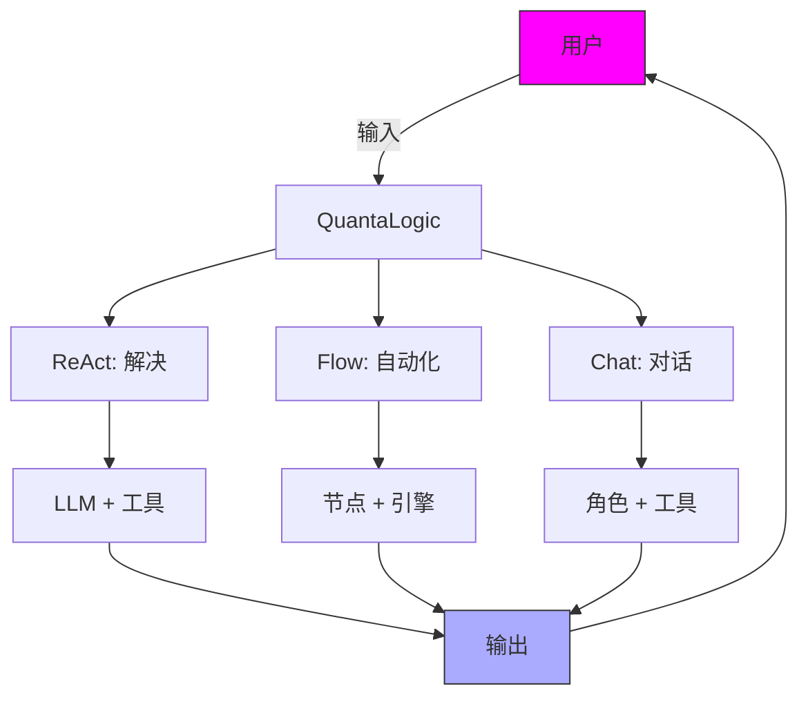
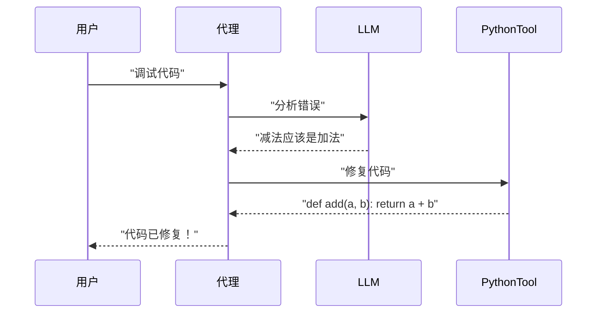
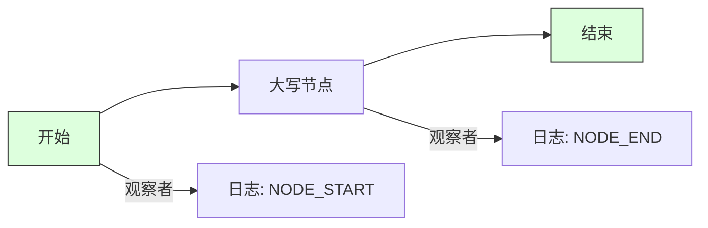

# QuantaLogic：释放 AI 用于编码、自动化和对话

**QuantaLogic** 是你的一体化 AI 框架，用于构建智能代理，它们可以像专业人士一样进行编码、自动化工作流程和聊天。它由大型语言模型 (LLM) 和多功能的工具集提供支持，提供三种强大的模式：**ReAct** 用于处理棘手的任务，**Flow** 用于简化流程，**Chat** 用于自然的、精通工具的对话。无论你是编码员、商业创新者还是 AI 爱好者，QuantaLogic 都能提供快速、灵活和有趣的解决方案。让我们开始吧！

> **新功能：CodeAct**
>
> QuantaLogic CodeAct 是一个强大的、模块化的扩展，用于创建 AI 代理，这些代理不仅可以推理和行动 (ReAct)，而且还使用**可执行代码作为其主要行动语言**。受最新研究的启发，CodeAct 使代理能够通过生成、运行和迭代 Python 代码来解决复杂的、多步骤的任务，同时保持上下文并利用强大的工具系统。这使其成为高级自动化、数学问题解决和用户友好的对话界面的理想选择。

[📖 完整文档](https://quantalogic.github.io/quantalogic/) | [⚡ 快速指南](./docs/howto/howto.md)


---

## 为什么选择 QuantaLogic？

**为什么要选择 QuantaLogic？** 它将 LLM 的复杂性转化为实用的魔法，让 AI 为*你*服务。从编码脚本到自动化业务任务或聊聊宇宙，QuantaLogic 都是你的创意助手，节省时间并释放可能性。

- **多功能性**: 编码、自动化或对话——处理任何任务。
- **你的规则**: 自定义代理和工具以满足你的需求。
- **大规模扩展**: 从 CLI 黑客到企业工作流程。
- **免费且开源**: Apache 2.0 许可证——使用它、调整它、分享它。

> *“AI 应该激发快乐，而不是压力。QuantaLogic 让它成为现实！”*

---

## 什么是 QuantaLogic？

**是什么感觉？** QuantaLogic 是一个 Python 框架，它利用 LLM（如 GPT-4o、Claude 或 DeepSeek）来创建 AI 代理。这些代理拥有用于编码、搜索、文件操作等的工具，所有这些都可以通过简洁的 CLI 或 Python API 访问。凭借 **ReAct**、**Flow** 和 **Chat** 模式，它可以适应任何挑战——动态任务、结构化管道或友好的聊天。

### 核心功能
- **ReAct 模式**: 通过 LLM 推理 + 工具操作解决问题。
- **Flow 模式**: 使用节点和转换来构建结构化的工作流程。
- **Chat 模式**: 通过工具调用智能进行自然对话。
- **LLM 集成**: 通过 LiteLLM 支持 OpenAI、Anthropic、DeepSeek。
- **工具集**: 代码执行、网络搜索、文件管理和自定义工具。
- **智能记忆**: 保持上下文精简，以用于长时间的任务或聊天。
- **实时洞察**: 通过事件和日志跟踪进度。
- **安全执行**: 基于 Docker 的工具隔离。

---

## CodeAct vs ReAct：有什么区别？

QuantaLogic 支持经典的 **ReAct** 范例及其高级扩展 **CodeAct**：

- **ReAct**（推理 + 行动）：
  - 基于 [ReAct 论文](https://arxiv.org/abs/2210.03629)，这种方法让代理可以循环地*推理*（逐步思考）和*行动*（使用工具或代码）。它非常适合语言模型需要计划、使用工具和适应反馈的任务。

- **CodeAct**：
  - 通过使**可执行的 Python 代码**成为代理行动的主要语言，在 ReAct 的基础上构建。代理不仅仅是调用工具或输出文本，而是编写和运行代码，观察结果（包括错误），并迭代直到任务解决。
  - 这种方法受到最近研究 ([Yang et al., 2024](https://arxiv.org/html/2402.01030v4)) 的启发，该研究表明可执行的代码操作使 LLM 代理更强大和可靠。
  - CodeAct 非常适合复杂的、多步骤的任务、高级自动化以及需要精确、可验证行动的场景。

**总结**：
- 使用 **ReAct** 进行灵活的推理和工具使用。
- 使用 **CodeAct** 处理生成和执行代码是解决问题或自动化工作流程的最佳方式的任务。

这是它的流程：



---

## 如何开始

**如何开始？** 安装它、设置它，然后开始创建。我们将指导你完成设置、示例和专业技巧，以便在几分钟内掌握 QuantaLogic。

### 安装

#### 你需要什么
- **Python 3.12+**: 我们 AI 引擎的燃料。
- **Docker**（可选）：用于安全工具执行。

#### 选项 1：pip（快速通道）
```bash
pip install quantalogic
```

#### 选项 2：pipx（干净的设置）
```bash
pipx install quantalogic
```

#### 选项 3：源代码（适用于黑客）
```bash
git clone https://github.com/quantalogic/quantalogic.git
cd quantalogic
python -m venv .venv
source .venv/bin/activate  # Windows: .venv\Scripts\activate
poetry install
```

**内部秘诀**：创建一个 `.env` 文件来获取 API 密钥，以解锁 LLM：
```bash
echo "OPENAI_API_KEY=sk-your-key" > .env
echo "DEEPSEEK_API_KEY=ds-your-key" >> .env
```

---

### 快速入门示例

让我们通过这些快速演示来了解 QuantaLogic 的亮点。

#### CLI：解决任务
```bash
quantalogic task "编写一个 Python 脚本来反转字符串"
```
**输出**：一个干净、可用的字符串反转脚本！

#### CLI：开始聊天
```bash
quantalogic chat --persona "你是一个宇宙向导" "最高的山是什么？"
```
**输出**：一个生动的回应，可能带有搜索结果！

#### Python：ReAct 代理
```python
from quantalogic import Agent

agent = Agent(model_name="deepseek/deepseek-chat")
result = agent.solve_task("编写一个 Python 函数来反转字符串")
print(result)
# 输出: "def reverse_string(s): return s[::-1]"
```

#### Python：聊天模式
```python
from quantalogic import Agent, DuckDuckGoSearchTool

agent = Agent(
    model_name="gpt-4o-mini",
    chat_system_prompt="你是一个好奇的探险家",
    tools=[DuckDuckGoSearchTool()]
)
response = agent.chat("量子计算领域有什么新进展？")
print(response)
# 输出: "我查看了最新消息！这是量子计算领域的一项突破：[详细信息]。"
```

---

### 三种模式：你的超能力

#### 1. ReAct 框架：动态任务解决
**原因**：以创造性的方式处理编码或研究等开放式任务。
**内容**：将 LLM 推理与工具相结合，以迭代实现解决方案。
**方式**：代理思考、行动并循环，直到任务完成。

**示例**：调试一些代码。
```bash
quantalogic task "调试这段 Python 代码：def add(a, b): return a - b"
```
**流程**：


**记忆技巧**：ReAct = **R**eason + **A**ct，就像侦探逐步解决谜团一样。

#### 2. Flow 模块：结构化自动化
**原因**：非常适合可重复的过程，如数据管道或内容创建。
**内容**：由引擎运行的、通过转换连接的节点（任务）系统。
**方式**：定义节点、链接它们，然后让工作流程运行。

**示例**：处理文本。
```python
from quantalogic.flow import Workflow, Nodes

@Nodes.define(output="processed")
def uppercase(text: str) -> str:
    return text.upper()

workflow = Workflow("uppercase").build()
result = await workflow.run({"text": "hello world"})
print(result["processed"])  # "HELLO WORLD"
```

**图表**：


**记忆技巧**：Flow = 食谱——节点是配料，转换是步骤，引擎是厨师。

**了解更多**：探索 [Flow YAML DSL 规范](./quantalogic/flow/flow_yaml.md)，以获取高级工作流程。

#### 3. Chat 模式：自然对话
**原因**：非常适合交互式问答或快速信息，并带有一点工具能力。
**内容**：一种会话式 AI，在需要时调用工具，保持聊天顺畅。
**方式**：自然地参与，通过 ReAct 的 XML 系统使用工具。

**示例**：查看天气。
```python
from quantalogic import Agent

agent = Agent(model_name="gpt-4o", chat_system_prompt="你是一个旅行指南")
response = agent.chat("巴黎的天气怎么样？")
print(response)
# 输出: "我来查一下！巴黎今天阳光明媚，20°C。"
```

**记忆技巧**：Chat = 你的 AI 好友——说话、倾听，并在好奇时像搜索引擎一样获取工具。

---

### 选择哪种模式？

| 模式       | 最适合                     | 风格               | 工具              |
|------------|------------------------------|---------------------|--------------------|
| **ReAct**  | 编码、研究、问答        | 迭代、自适应 | 动态、按需 |
| **Flow**   | 管道、自动化        | 结构化、有序 | 节点特定      |
| **Chat**   | 对话、快速查询  | 自由流动        | 上下文         |

**专业提示**：组合模式！使用 Chat 获取用户输入，使用 Flow 进行后端自动化，使用 ReAct 处理复杂任务。

---

### CLI 掌握

QuantaLogic CLI 是你的任务控制中心。以下是详细信息：

```bash
quantalogic [命令] [选项]
```

#### 命令
- **task**: 运行任务。
  ```bash
  quantalogic task "计算 5 + 3" --model-name gpt-4o-mini
  ```
- **chat**: 开始对话。
  ```bash
  quantalogic chat --persona "AI 专家" "机器学习领域的最新进展是什么？"
  ```
- **list-models**: 列出 LLM。
  ```bash
  quantalogic list-models --search claude
  ```

#### 主要选项
- `--model-name`: 选择你的 LLM（例如，`anthropic/claude-3.5-sonnet`）。
- `--mode`: 选择 ReAct、Flow 或 Chat。
- `--tool-mode`: 在 Chat 中优先考虑工具（例如，`code`）。
- `--verbose`: 查看详细日志。

**内部秘诀**：添加 `--no-stream` 以在慢速终端上获得更清晰的输出！

---

### 高级技巧

#### 构建自定义工具
创建你自己的工具来完成独特的任务：
```python
from quantalogic.tools import Tool

class TimeTool(Tool):
    name = "time_tool"
    def execute(self) -> str:
        from datetime import datetime
        return f"当前时间：{datetime.now()}"

agent = Agent(model_name="gpt-4o")
agent.add_tool(TimeTool())
```

#### 异步执行
通过异步提高性能：
```python
import asyncio
from quantalogic import Agent

async def main():
    agent = Agent(model_name="gpt-4o")
    result = await agent.async_chat("给我讲个笑话", streaming=True)
    print(result)

asyncio.run(main())
```

#### 监控事件
跟踪每个步骤：
```python
from quantalogic import Agent, console_print_events

agent = Agent(model_name="gpt-4o")
agent.event_emitter.on(["task_start", "tool_execution_start"], console_print_events)
result = agent.solve_task("写一首诗")
```

---

### 记忆技巧
- **模式作为工作**：ReAct = 自由职业者（灵活的任务），Flow = 工程师（结构化的构建），Chat = 咖啡师（提供聊天）。
- **工具作为玩具**：`PythonTool` = 用于编码的乐高积木，`SearchTool` = 用于获取信息的双筒望远镜。
- **工作流程作为地图**：节点 = 目的地，转换 = 道路，引擎 = GPS。

---

### 简化概念

**工具 101**：将 QuantaLogic 想象成一个勤杂工。你要求进行修复（任务）。它会抓取工具——锤子 (`WriteFileTool`) 或螺丝刀 (`SearchTool`)——以正确完成工作。

**记忆魔法**：想象一个便利贴板。随着任务或聊天的增长，QuantaLogic 会压缩旧笔记，以便为新笔记腾出空间——高效且整洁。

---

### 示例游乐场
深入研究我们的 [示例文件夹](./examples/) 以获取灵感：
- **代码生成**：[05-code.py](./examples/05-code.py)
- **工作流程演示**：[story_generator_agent.py](./examples/flow/story_generator/story_generator_agent.py)
- **财务任务**：[10-finance-agent.py](./examples/10-finance-agent.py)

**视频演练**：
[](./examples/generated_tutorials/python/quantalogic_long.mp4)

---

### 贡献

**原因**：让 AI 为每个人变得更好！
**内容**：添加功能、修复错误或提出建议。
**方式**：Fork、分支、编码和 PR。查看 [CONTRIBUTING.md](./CONTRIBUTING.md)。

---

### 许可证

QuantaLogic 是 **Apache 2.0**——可以免费使用、修改和分发。由 Raphaël MANSUY 在 [QuantaLogic](https://www.quantalogic.app) 用 ❤️ 构建。

---

### API 密钥和模型

在 `.env` 文件中使用 LLM API 密钥来增强功能：
```bash
OPENAI_API_KEY=sk-your-key
ANTHROPIC_API_KEY=your-key
DEEPSEEK_API_KEY=ds-your-key
```

**顶级模型**：
- `openai/gpt-4o-mini`: 快速且经济实惠。
- `anthropic/claude-3.5-sonnet`: 极其敏锐的推理能力。
- `deepseek/deepseek-reasoner`: 深入的问题解决能力。

**内部秘诀**：设置 `LM_STUDIO_API_BASE` 用于本地 LLM——非常适合离线工作！

---

### 让我们构建未来

QuantaLogic 是你实现 AI 卓越的发射台。安装它、尝试示例，并创建一些史诗级的东西——代码、工作流程或聊天。为该存储库加星标、加入社区，让我们让 AI 势不可挡！

[](https://star-history.com/#quantalogic/quantalogic?Date)
