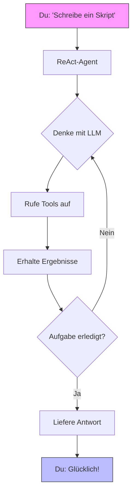
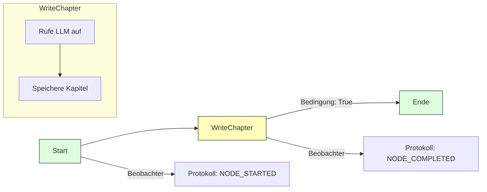

Hier ist die Übersetzung des Textes ins Deutsche:

# QuantaLogic

[](https://opensource.org/licenses/Apache-2.0)
[](https://www.python.org/downloads/)
[](https://quantalogic.github.io/quantalogic/)

Hallo zusammen, willkommen bei **QuantaLogic** – deinem kosmischen Toolkit für die Erstellung von KI-Agenten und Workflows, die glänzen! Egal, ob du wie verrückt programmierst, einen Geschäftsprozess automatisierst oder dir etwas Verrücktes ausdenkst, QuantaLogic ist hier, um es möglich zu machen. Wir sprechen von **großen Sprachmodellen (LLMs)**, die mit einem herausragenden Toolset verschmolzen sind, mit zwei leistungsstarken Ansätzen: dem **ReAct-Framework** für dynamische Problemlösung und dem umwerfenden neuen **Flow-Modul** für strukturierte Brillanz.

Stell dir Folgendes vor: eine CLI, die kinderleicht ist, eine Python-API, die pure Magie ist, und ein Framework, das von schnellen Hacks bis hin zu galaktischen Unternehmen skaliert. Bereit für den Start? Lass uns durchstarten!

[Vollständige Dokumentation](https://quantalogic.github.io/quantalogic/) | [Anleitung](./docs/howto/howto.md)


---
[Chinesische Version](./README_CN.md)
[Französische Version](./README_FR.md)

## Warum QuantaLogic?

Bei [QuantaLogic](https://www.quantalogic.app) haben wir ein Schwarzes Loch entdeckt: Erstaunliche KI-Modelle von OpenAI, Anthropic und DeepSeek brachten reale Aufgaben nicht vollständig zum Leuchten. Unsere Mission? Diesen Funken entzünden! Wir sind hier, um generative KI für Entwickler, Unternehmen und Träumer gleichermaßen zum Kinderspiel zu machen – Ideen in Aktionen zu verwandeln, eine brillante Lösung nach der anderen.

> "KI sollte dein Co-Pilot sein, nicht ein Rätsel. QuantaLogic macht es möglich – schnell, unterhaltsam und furchtlos!"

---

## Hauptmerkmale

- **ReAct-Framework**: Denken + Handeln = unaufhaltsame Agenten!
- **Flow-Modul**: Strukturierte Workflows, die wie ein Fluss fließen.
- **LLM-Galaxie**: Nutze OpenAI, DeepSeek und mehr über LiteLLM.
- **Sichere Tools**: Docker-basierte Sicherheit für Code und Dateien.
- **Live-Überwachung**: Beobachte, wie es sich entfaltet, mit einer Weboberfläche und SSE.
- **Speichermagie**: Intelligenter Kontext hält die Dinge auf Trab.
- **Unternehmenstauglich**: Protokolle, Fehlerbehandlung und Validierung – grundsolide.

---

## Inhaltsverzeichnis

- [Warum QuantaLogic?](#why-quantalogic)
- [Hauptmerkmale](#key-features)
- [Installation](#installation)
- [Schnellstart](#quick-start)
- [ReAct-Framework: Dynamische Agenten](#react-framework-dynamic-agents)
- [Flow-Modul: Strukturierte Workflows](#flow-module-structured-workflows)
  - 📘 **[Workflow YAML DSL Spezifikation](./quantalogic/flow/flow_yaml.md)**: Umfassender Leitfaden zur Definition leistungsstarker, strukturierter Workflows mit unserer Domain-Specific Language
  - 📚 **[Flow YAML Dokumentation](https://quantalogic.github.io/quantalogic/flow/flow_yaml)**: Tauche ein in die offizielle Dokumentation für ein tieferes Verständnis von Flow YAML und seinen Anwendungen
- [ReAct vs. Flow: Wähle deine Stärke](#react-vs-flow-pick-your-power)
- [Verwendung der CLI](#using-the-cli)
- [Beispiele, die Freude bereiten](#examples-that-spark-joy)
- [Kernkomponenten](#core-components)
- [Entwicklung mit QuantaLogic](#developing-with-quantalogic)
- [Mitwirken](#contributing)
- [Lizenz](#license)
- [Projektwachstum](#project-growth)
- [API-Schlüssel und Umgebungskonfiguration](#api-keys-and-environment-configuration)

---

## Installation

Lass uns QuantaLogic in dein System einschießen – es ist so einfach wie 1-2-3!

### Was du brauchst
- **Python 3.12+**: Der Treibstoff für unsere Rakete.
- **Docker** (optional): Sperrt die Codeausführung in einem sicheren Pod.

### Option 1: pip – Schnell und einfach
```bash
pip install quantalogic
```

### Option 2: pipx – Isolierter Sternenstaub
```bash
pipx install quantalogic
```

### Option 3: Source – Für Weltraumforscher
```bash
git clone https://github.com/quantalogic/quantalogic.git
cd quantalogic
python -m venv .venv
source .venv/bin/activate  # Windows: .venv\Scripts\activate
poetry install
```
> **Tipp**: Kein Poetry? Hol es dir mit `pip install poetry` und schließe dich der Crew an!

---

## Schnellstart

Bereit, die Magie zu sehen? Hier ist deine Startrampe:

### CLI: Sofortige Aktion
```bash
quantalogic task "Schreibe eine Python-Funktion für Fibonacci-Zahlen"
```
> Bumm! ReAct zaubert in Sekundenschnelle eine Lösung herbei.

### Python: ReAct-Agent
```python
from quantalogic import Agent

agent = Agent(model_name="deepseek/deepseek-chat")
result = agent.solve_task("Code a Fibonacci function")
print(result)
# Output: "def fib(n): return [0, 1] if n <= 2 else fib(n-1) + [fib(n-1)[-1] + fib(n-1)[-2]]"
```

### Synchrones Agentenbeispiel

```python
from quantalogic import Agent

# Erstelle einen synchronen Agenten
agent = Agent(model_name="gpt-4o")

# Löse eine Aufgabe synchron
result = agent.solve_task(
    task="Schreibe eine Python-Funktion zur Berechnung von Fibonacci-Zahlen",
    max_iterations=10  # Optional: Iterationsbegrenzung
)

print(result)
```

### Asynchrones Agentenbeispiel 🌊

```python
import asyncio
from quantalogic import Agent

async def main():
    # Erstelle einen asynchronen Agenten
    agent = Agent(model_name="gpt-4o")
    
    # Löse eine Aufgabe asynchron mit Streaming
    result = await agent.async_solve_task(
        task="Schreibe ein Python-Skript, um die Top-GitHub-Repositories zu scrapen",
        max_iterations=15,  # Optional: Iterationsbegrenzung
        streaming=True      # Optional: Streame die Antwort
    )
    
    print(result)

# Führe die asynchrone Funktion aus
asyncio.run(main())
```

### Beispiele zur Ereignisüberwachung 🔍

#### Synchrone Ereignisüberwachung mit Finanztools
```python
from quantalogic import Agent
from quantalogic.console_print_events import console_print_events
from quantalogic.console_print_token import console_print_token
from quantalogic.tools import (
    DuckDuckGoSearchTool, 
    TechnicalAnalysisTool, 
    YFinanceTool
)

# Erstelle einen Agenten mit Finanztools
agent = Agent(
    model_name="gpt-4o",
    tools=[
        DuckDuckGoSearchTool(),  # Web-Suchtool
        TechnicalAnalysisTool(),  # Technische Aktienanalyse
        YFinanceTool()            # Abrufen von Aktiendaten
    ]
)

# Richte umfassende Ereignis-Listener ein
agent.event_emitter.on(
    event=[
        "task_complete",
        "task_think_start", 
        "task_think_end", 
        "tool_execution_start", 
        "tool_execution_end",
        "error_max_iterations_reached",
        "memory_full",
        "memory_compacted"
    ],
    listener=console_print_events
)

# Optional: Überwache Streaming-Token
agent.event_emitter.on(
    event=["stream_chunk"], 
    listener=console_print_token
)

# Führe eine mehrstufige Finanzanalyseaufgabe aus
result = agent.solve_task(
    "1. Finde die Top 3 Tech-Aktien für Q3 2024 "
    "2. Rufe historische Aktiendaten für jede ab "
    "3. Berechne 50-Tage- und 200-Tage-Durchschnittswerte "
    "4. Gib eine kurze Anlageempfehlung",
    streaming=True  # Aktiviere Streaming für detaillierte Ausgabe
)
print(result)
```

#### Asynchrone Ereignisüberwachung mit Finanztools
```python
import asyncio
from quantalogic import Agent
from quantalogic.console_print_events import console_print_events
from quantalogic.console_print_token import console_print_token
from quantalogic.tools import (
    DuckDuckGoSearchTool, 
    TechnicalAnalysisTool, 
    YFinanceTool
)

async def main():
    # Erstelle einen asynchronen Agenten mit Finanztools
    agent = Agent(
        model_name="gpt-4o",
        tools=[
            DuckDuckGoSearchTool(),  # Web-Suchtool
            TechnicalAnalysisTool(),  # Technische Aktienanalyse
            YFinanceTool()            # Abrufen von Aktiendaten
        ]
    )

    # Richte umfassende Ereignis-Listener ein
    agent.event_emitter.on(
        event=[
            "task_complete",
            "task_think_start", 
            "task_think_end", 
            "tool_execution_start", 
            "tool_execution_end",
            "error_max_iterations_reached",
            "memory_full",
            "memory_compacted"
        ],
        listener=console_print_events
    )

    # Optional: Überwache Streaming-Token
    agent.event_emitter.on(
        event=["stream_chunk"], 
        listener=console_print_token
    )

    # Führe eine mehrstufige Finanzanalyseaufgabe asynchron aus
    result = await agent.async_solve_task(
        "1. Finde aufstrebende KI-Technologie-Startups "
        "2. Analysiere ihre letzten Finanzierungsrunden "
        "3. Vergleiche Marktpotenzial und Wachstumsindikatoren "
        "4. Gib einen Bericht über Anlagetrends",
        streaming=True  # Aktiviere Streaming für detaillierte Ausgabe
    )
    print(result)

# Führe die asynchrone Funktion aus
asyncio.run(main())
```

### Python: Flow-Workflow
```python
from quantalogic.flow import Workflow, Nodes

@Nodes.define(output="greeting")
def greet(name: str) -> str:
    return f"Hallo, {name}!"

workflow = Workflow("greet").build()
result = await workflow.run({"name": "Luna"})
print(result["greeting"])  # "Hallo, Luna!"
```

---

## ReAct-Framework: Dynamische Agenten

Das **ReAct**-Framework ist dein KI-Sidekick – denk schnell, handle klug. Es kombiniert LLM-Denken mit toolgestütztem Handeln, perfekt für Aufgaben, die ein wenig Improvisation erfordern.

### So funktioniert es
1. **Du sagst**: "Schreibe mir ein Skript."
2. **Es denkt**: LLM plant den Kurs.
3. **Es handelt**: Tools wie `PythonTool` legen los.
4. **Es schleift**: Geht so lange weiter, bis es fertig ist.

Schau dir das an:



### Beispiel: Codegenerator
```bash
quantalogic task "Erstelle ein Python-Skript zum Sortieren einer Liste"
```
> ReAct findet es heraus, schreibt den Code und übergibt ihn – reibungslos wie Seide!

### Warum es cool ist
Perfekt zum Programmieren, Debuggen oder Beantworten verrückter Fragen im Handumdrehen.

---

## Flow-Modul: Strukturierte Workflows

Das **Flow-Modul** ist dein Architekt – es baut Workflows, die mit Präzision summen. Es dreht sich alles um Knoten, Übergänge und einen stetigen Rhythmus, ideal für wiederholbare Missionen.

🔍 **Möchtest du tiefer eintauchen?** Sieh dir unsere umfassende [Workflow YAML DSL Spezifikation](./quantalogic/flow/flow_yaml.md) an, einen detaillierten Leitfaden, der dich durch die Definition leistungsstarker, strukturierter Workflows führt. Von grundlegenden Knotenkonfigurationen bis hin zu komplexen Übergangslogiken ist diese Dokumentation deine Roadmap zur Beherrschung des Workflow-Designs mit QuantaLogic.

📚 **Für ein tieferes Verständnis von Flow YAML und seinen Anwendungen lies bitte die offizielle [Flow YAML Dokumentation](https://quantalogic.github.io/quantalogic/flow/flow_yaml).**

Die Flow YAML Dokumentation bietet einen umfassenden Überblick über die Flow YAML Sprache, einschließlich ihrer Syntax, Funktionen und Best Practices. Sie ist eine wertvolle Ressource für alle, die komplexe Workflows mit QuantaLogic erstellen möchten.

Darüber hinaus enthält die Flow YAML Dokumentation eine Reihe von Beispielen und Tutorials, die dir den Einstieg in die Erstellung eigener Workflows erleichtern. Diese Beispiele decken eine Reihe von Themen ab, von einfachen Workflows bis hin zu komplexeren Szenarien, und sollen dir helfen, zu verstehen, wie du Flow YAML verwenden kannst, um leistungsstarke und flexible Workflows zu erstellen.

### Die Bausteine
- **Knoten**: Aufgaben wie Funktionen oder LLM-Aufrufe.
- **Übergänge**: Pfade mit optionalen Bedingungen.
- **Engine**: Führt die Show mit Flair aus.
- **Beobachter**: Wirf einen Blick auf den Fortschritt mit Ereignissen.

### Beispiel: Geschichtenerzähler
```python
from quantalogic.flow import Workflow, Nodes

@Nodes.llm_node(model="openai/gpt-4o-mini", output="chapter")
async def write_chapter(ctx: dict) -> str:
    return f"Kapitel 1: {ctx['theme']}"

workflow = (
    Workflow("write_chapter")
    .then("end", condition="lambda ctx: True")
    .add_observer(lambda e: print(f" {e.event_type}"))
)
engine = workflow.build()
result = await engine.run({"theme": "Cosmic Quest"})
print(result["chapter"])
```

### Beispiel: Story Generator Agent

Hier ist ein komplexeres Beispiel, das einen vollständigen Workflow zur Erstellung von Geschichten mit dem Flow-Modul zeigt:

```python
from typing import List
import anyio
from loguru import logger
from quantalogic.flow import Nodes, Workflow

# Definiere Knotenfunktionen mit Dekoratoren
@Nodes.validate_node(output="validation_result")
async def validate_input(genre: str, num_chapters: int) -> str:
    """Validiere Eingabeparameter."""
    if not (1 <= num_chapters <= 20 and genre.lower() in ["science fiction", "fantasy", "mystery", "romance"]):
        raise ValueError("Ungültige Eingabe: Genre muss Science Fiction, Fantasy, Mystery oder Romance sein")
    return "Eingabe validiert"

@Nodes.llm_node(
    model="gemini/gemini-2.0-flash",
    system_prompt="Du bist ein kreativer Autor, der sich auf Geschichtentitel spezialisiert hat.",
    prompt_template="Generiere einen kreativen Titel für eine {{ genre }} Geschichte. Gib nur den Titel aus.",
    output="title",
)
async def generate_title(genre: str) -> str:
    """Generiere einen Titel basierend auf dem Genre (wird von llm_node behandelt)."""
    pass  # Logik wird vom llm_node-Dekorator behandelt

@Nodes.define(output="manuscript")
async def compile_book(title: str, outline: str, chapters: List[str]) -> str:
    """Stelle das vollständige Manuskript aus Titel, Gliederung und Kapiteln zusammen."""
    return f"Titel: {title}\n\nGliederung:\n{outline}\n\n" + "\n\n".join(
        f"Kapitel {i}:\n{chap}" for i, chap in enumerate(chapters, 1)
    )

# Definiere den Workflow mit bedingter Verzweigung
workflow = (
    Workflow("validate_input")
    .then("generate_title")
    .then("generate_outline")
    .then("generate_chapter")
    .then("update_chapter_progress")
    .then("generate_chapter", condition=lambda ctx: ctx["completed_chapters"] < ctx["num_chapters"])
    .then("compile_book", condition=lambda ctx: ctx["completed_chapters"] >= ctx["num_chapters"])
    .then("quality_check")
    .then("end")
)

# Führe den Workflow aus
async def main():
    initial_context = {
        "genre": "science fiction",
        "num_chapters": 3,
        "chapters": [],
        "completed_chapters": 0,
    }
    engine = workflow.build()
    result = await engine.run(initial_context)
```

Dieses Beispiel demonstriert:
- Eingabevalidierung mit `@Nodes.validate_node`
- LLM-Integration mit `@Nodes.llm_node`
- Benutzerdefinierte Verarbeitung mit `@Nodes.define`
- Bedingte Verzweigung für iterative Kapitelgenerierung
- Kontextverwaltung zur Fortschrittsverfolgung

Das vollständige Beispiel ist unter [examples/flow/story_generator/story_generator_agent.py](./examples/flow/story_generator/story_generator_agent.py) verfügbar.

### Flow visualisiert


### Beispiel: Datenpipeline
```python
@Nodes.define(output="processed")
def clean_data( str) -> str:
    return data.strip().upper()

workflow = Workflow("clean_data").build()
result = await workflow.run({"data": " hello "})
print(result["processed"])  # "HELLO"
```

### Warum es rockt
Denke an Content-Pipelines, Automatisierungsabläufe oder jede mehrstufige Aufgabe, die Ordnung benötigt.

---

## ReAct vs. Flow: Wähle deine Stärke

Beide sind herausragend, aber hier ist der Clou:

| Merkmal             | ReAct-Framework                  | Flow-Modul                     |
|---------------------|-----------------------------------|--------------------------------|
| **Stimmung**        | Freigeistig, anpassungsfähig      | Organisiert, vorhersehbar       |
| **Fluss**           | Schleift, bis es gelöst ist       | Folgt einer Roadmap            |
| **Sweet Spot**      | Kreatives Chaos (Codierung, F&A) | Stetige Workflows (Pipelines)  |
| **Zustand**         | Speicher hält es locker          | Knoten sperren es ein          |
| **Tools**           | Werden nach Bedarf geholt        | In Knoten eingebaut            |
| **Beobachtung**     | Ereignisse wie `task_complete`   | Beobachter wie `NODE_STARTED` |

### Wann wählen
- **ReAct**: Code im Handumdrehen, erkunde Antworten, debugge wie ein Profi.
- **Flow**: Baue eine Pipeline, automatisiere einen Prozess, halte ihn straff.

---

## Verwendung der CLI

Die CLI ist deine Kommandozentrale – schnell, flexibel und unterhaltsam!

### Syntax
```bash
quantalogic [OPTIONEN] BEFEHL [ARGUMENTE]...
```

### Beschreibung
QuantaLogic KI-Assistent – Ein leistungsstarkes KI-Tool für verschiedene Aufgaben.

### Umgebungsvariablen
- **OpenAI**: Setze `OPENAI_API_KEY` auf deinen OpenAI API-Schlüssel
- **Anthropic**: Setze `ANTHROPIC_API_KEY` auf deinen Anthropic API-Schlüssel
- **DeepSeek**: Setze `DEEPSEEK_API_KEY` auf deinen DeepSeek API-Schlüssel

Verwende eine `.env`-Datei oder exportiere diese Variablen in deiner Shell für eine nahtlose Integration.

### Befehle
- **`task`**: Starte eine Mission.
  ```bash
  quantalogic task "Fasse diese Datei zusammen" --file notes.txt
  ```
- **`list-models`**: Liste unterstützte LiteLLM-Modelle mit optionaler Fuzzy-Suche.
  ```bash
  quantalogic list-models --search "gpt"
  ```

### Optionen
- **`--model-name TEXT`**: Gib das zu verwendende Modell an (litellm-Format). Beispiele:
  - `openai/gpt-4o-mini`
  - `openai/gpt-4o`
  - `anthropic/claude-3.5-sonnet`
  - `deepseek/deepseek-chat`
  - `deepseek/deepseek-reasoner`
  - `openrouter/deepseek/deepseek-r1`
  - `openrouter/openai/gpt-4o`
- **`--mode [code|basic|interpreter|full|code-basic|search|search-full]`**: Agentenmodus
- **`--vision-model-name TEXT`**: Gib das zu verwendende Vision-Modell an (litellm-Format)
- **`--log [info|debug|warning]`**: Setze die Protokollierungsstufe
- **`--verbose`**: Aktiviere die ausführliche Ausgabe
- **`--max-iterations INTEGER`**: Maximale Anzahl von Iterationen (Standard: 30)
- **`--max-tokens-working-memory INTEGER`**: Setze die maximal zulässige Anzahl von Token im Arbeitsspeicher
- **`--compact-every-n-iteration INTEGER`**: Setze die Häufigkeit der Speicherkomprimierung
- **`--thinking-model TEXT`**: Das zu verwendende Denkmodell
- **`--version`**: Zeige Versionsinformationen an

> **Tipp**: Führe `quantalogic --help` für die vollständige Befehlsreferenz aus!

---

## Beispiele, die Freude bereiten

Lass uns deine Fantasie mit diesen Juwelen beflügeln:

### Videomagie
[](./examples/generated_tutorials/python/quantalogic_long.mp4)

### Praktische Beispiele
| Name              | Was macht es?                       | Datei                                       |
|-------------------|------------------------------------|--------------------------------------------|
| Einfacher Agent   | Grundlegende ReAct-Agenten-Demo    | [01-simple-agent.py](./examples/01-simple-agent.py) |
| Ereignisüberwachung| Agent mit Ereignisverfolgung       | [02-agent-with-event-monitoring.py](./examples/02-agent-with-event-monitoring.py) |
| Interpreter-Modus | Agent mit Interpreter              | [03-agent-with-interpreter.py](./examples/03-agent-with-interpreter.py) |
| Agentenzusammenfassung| Aufgabenzusammenfassung generieren | [04-agent-summary-task.py](./examples/04-agent-summary-task.py) |
| Codegenerierung   | Grundlegende Codegenerierung       | [05-code.py](./examples/05-code.py) |
| Code-Screen       | Erweiterte Codegenerierung         | [06-code-screen.py](./examples/06-code-screen.py) |
| Tutorial-Autor    | Technische Tutorials schreiben     | [07-write-tutorial.py](./examples/07-write-tutorial.py) |
| PRD-Autor         | Produktspezifikationsdokument     | [08-prd-writer.py](./examples/08-prd-writer.py) |
| Story Generator   | Flow-basierte Geschichtenerstellung | [story_generator_agent.py](./examples/flow/story_generator/story_generator_agent.py) |
| SQL-Abfrage       | Datenbankabfrage generieren        | [09-sql-query.py](./examples/09-sql-query.py) |
| Finanzagent       | Finanzanalyse und Aufgaben        | [10-finance-agent.py](./examples/10-finance-agent.py) |
| Textuelle Oberfläche| Agent mit textueller UI            | [11-textual-agent-interface.py](./examples/11-textual-agent-interface.py) |
| Composio-Test     | Composio-Integrationsdemo         | [12-composio-test.py](./examples/12-composio-test.py) |
| Synchroner Agent  | Synchrone Agenten-Demo           | [13-synchronous-agent.py](./examples/13-synchronous-agent.py) |
| Asynchroner Agent | Asynchrone Agenten-Demo            | [14-async-agent.py](./examples/14-async-agent.py) |

### Bonus: Mathegenie
```bash
quantalogic task "Löse 2x + 5 = 15"
```
> Ausgabe: "Lass es uns lösen! 2x + 5 = 15 → 2x = 10 → x = 5. Fertig!"

---

## Kernkomponenten

### ReAct-Agenten
- **Gehirn**: LLMs befeuern das Denken.
- **Hände**: Tools wie `PythonTool` erledigen die Arbeit.
- **Speicher**: Hält alles zusammen.

### Flow-Workflows
- **Knoten**: Deine Aufgabenblöcke.
- **Engine**: Der Maestro der Ausführung.

### Tool-Arsenal
- **Code**: `PythonTool`, `NodeJsTool`.
- **Dateien**: `ReadFileTool`, `WriteFileTool`.
- Mehr in [REFERENCE_TOOLS.md](./REFERENCE_TOOLS.md).

---

## Entwicklung mit QuantaLogic

### Richte dein Labor ein
```bash
git clone https://github.com/quantalogic/quantalogic.git
cd quantalogic
python -m venv venv
source venv/bin/activate
poetry install
```

### Teste den Kosmos
```bash
pytest --cov=quantalogic
```

### Poliere es auf
```bash
ruff format  # Bringe den Code zum Glänzen
mypy quantalogic  # Überprüfe Typen
ruff check quantalogic  # Lintel es
```

### Erstelle benutzerdefinierte Tools
Die Funktion `create_tool()` wandelt jede Python-Funktion in ein wiederverwendbares Tool um:

```python
from quantalogic.tools import create_tool

def weather_lookup(city: str, country: str = "US") -> dict:
    """Rufe das aktuelle Wetter für einen bestimmten Ort ab.
    
    Args:
        city: Name der Stadt, die nachgeschlagen werden soll
        country: Zwei-Buchstaben-Ländercode (Standard: US)
    
    Returns:
        Dictionary mit Wetterinformationen
    """
    # Implementiere hier die Wetter-Lookup-Logik
    return {"temperature": 22, "condition": "Sunny"}

# Konvertiere die Funktion in ein Tool
weather_tool = create_tool(weather_lookup)

# Jetzt kannst du es als Tool verwenden
print(weather_tool.to_markdown())  # Generiere Tool-Dokumentation
result = weather_tool.execute(city="New York")  # Führe es als Tool aus
```

#### Verwenden benutzerdefinierter Tools mit dem ReAct-Agenten

So integrierst du benutzerdefinierte Tools in einen ReAct-Agenten:

```python
from quantalogic import Agent
from quantalogic.tools import create_tool, PythonTool

# Erstelle ein benutzerdefiniertes Tool zum Nachschlagen von Aktienkursen
def get_stock_price(symbol: str) -> str:
    """Rufe den aktuellen Kurs einer Aktie anhand ihres Tickersymbols ab.
    
    Args:
        symbol: Aktien-Ticker-Symbol (z. B. AAPL, MSFT)
    
    Returns:
        Aktuelle Aktienkursinformationen
    """
    # In einer realen Implementierung würdest du von einer API abrufen
    prices = {"AAPL": 185.92, "MSFT": 425.27, "GOOGL": 175.43}
    if symbol in prices:
        return f"{symbol} wird derzeit bei ${prices[symbol]} gehandelt"
    return f"Konnte keinen Preis für {symbol} finden"

# Erstelle einen Agenten mit Standard- und benutzerdefinierten Tools
agent = Agent(
    model_name="gpt-4o",
    tools=[
        PythonTool(),  # Standard-Tool zur Python-Ausführung
        create_tool(get_stock_price)  # Benutzerdefiniertes Tool zum Abrufen von Aktienkursen
    ]
)

# Der Agent kann jetzt beide Tools verwenden, um Aufgaben zu lösen
result = agent.solve_task(
    "Schreibe eine Python-Funktion zur Berechnung des Anlagezuwachses, "  
    "und analysiere dann den aktuellen Kurs der Apple-Aktie"
)

print(result)
```

In diesem Beispiel kann der Agent nahtlos sowohl das Standard-`PythonTool` als auch dein benutzerdefiniertes Tool zum Nachschlagen von Aktienkursen verwenden, um die Aufgabe zu erledigen.

Hauptmerkmale von `create_tool()`:
- 🔧 Konvertiert Funktionen automatisch in Tools
- 📝 Extrahiert Metadaten aus Funktionssignatur und Docstring
- 🔍 Unterstützt sowohl synchrone als auch asynchrone Funktionen
- 🛠️ Generiert Tool-Dokumentation und Validierung

---

## Mitwirken

Schließe dich der QuantaLogic-Galaxie an!
1. Forke es.
2. Branch: `git checkout -b feature/epic-thing`.
3. Code + Test.
4. PR es!

Siehe [CONTRIBUTING.md](./CONTRIBUTING.md) für die vollständige Geschichte.

---

## Lizenz

2024 QuantaLogic-Mitwirkende. **Apache 2.0** – frei und offen. Siehe [LICENSE](./LICENSE).

Ausgedacht von Raphaël MANSUY, Gründer von [QuantaLogic](https://www.quantalogic.app).

---

## Projektwachstum
[](https://star-history.com/#quantalogic/quantalogic&Date)

---

## API-Schlüssel und Umgebungskonfiguration

QuantaLogic verbindet sich über API-Schlüssel mit LLMs – hier ist dein Leitfaden zum Freischalten des Universums!

### Schlüssel einrichten
Speichere Schlüssel in einer `.env`-Datei oder exportiere sie:
```bash
echo "OPENAI_API_KEY=sk-your-openai-key" > .env
echo "DEEPSEEK_API_KEY=ds-your-deepseek-key" >> .env
source .env
```

### Der Schlüsseltresor: Unterstützte Modelle
| Modellname                              | Schlüsselvariable        | Wofür ist es gut?                           |
|-----------------------------------------|-------------------------|-----------------------------------------------|
| `openai/gpt-4o-mini`                   | `OPENAI_API_KEY`        | Schnelle, budgetfreundliche Aufgaben          |
| `openai/gpt-4o`                        | `OPENAI_API_KEY`        | Hochleistungsfähiges Denken                   |
| `anthropic/claude-3.5-sonnet`          | `ANTHROPIC_API_KEY`     | Ausgewogene Brillanz                          |
| `deepseek/deepseek-chat`               | `DEEPSEEK_API_KEY`      | Gesprächig und vielseitig                     |
| `deepseek/deepseek-reasoner`           | `DEEPSEEK_API_KEY`      | Tiefgreifende Problemlösung                    |
| `openrouter/deepseek/deepseek-r1`      | `OPENROUTER_API_KEY`    | Forschungsgüte über OpenRouter                |
| `mistral/mistral-large-2407`           | `MISTRAL_API_KEY`       | Mehrsprachige Meisterschaft                    |
| `dashscope/qwen-max`                   | `DASHSCOPE_API_KEY`     | Alibabas Power-Player                         |
| `lm_studio/mistral-small-24b-instruct-2501` | `LM_STUDIO_API_KEY` | Lokale LLM-Aktion                            |

### Lokale Einrichtung (z. B. LM Studio)
