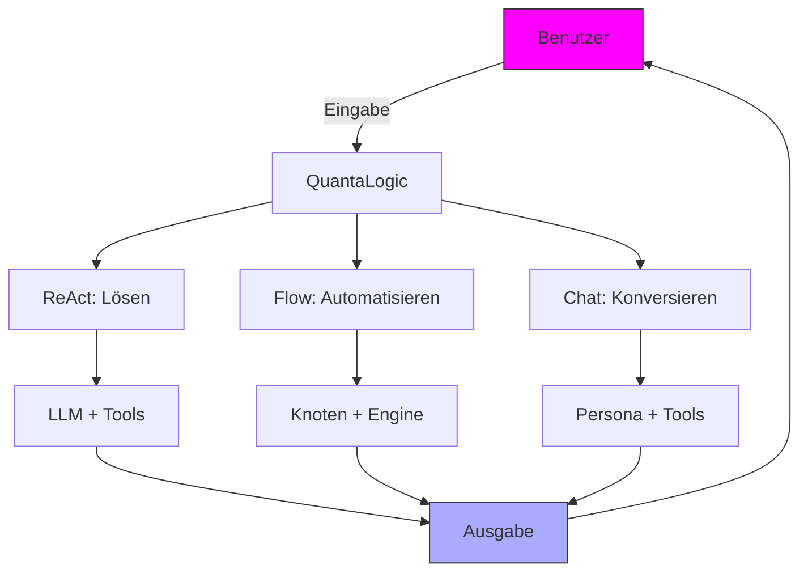
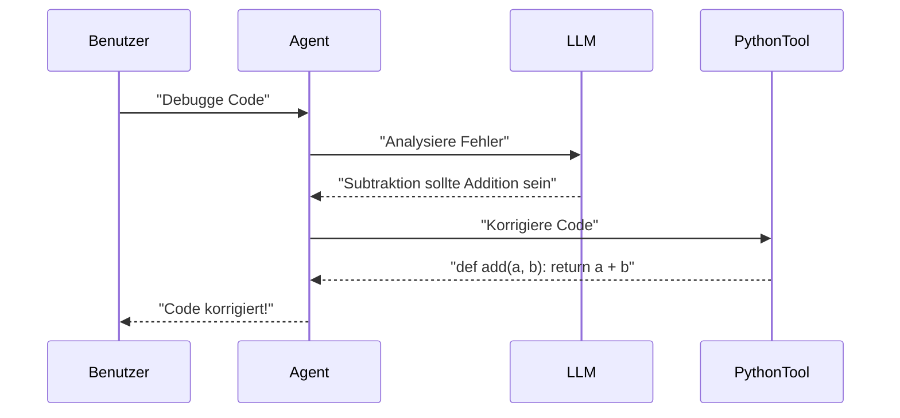
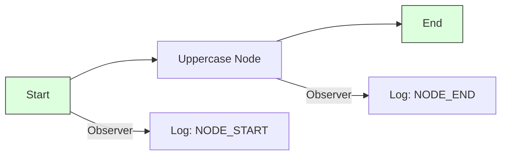

Here's the German translation:

# QuantaLogic: Entfessle KI für Programmierung, Automatisierung und Konversationen

**QuantaLogic** ist dein All-in-One-KI-Framework zum Erstellen intelligenter Agenten, die programmieren, Arbeitsabläufe automatisieren und sich wie Profis unterhalten. Angetrieben von großen Sprachmodellen (LLMs) und einem vielseitigen Toolset bietet es drei Top-Modi: **ReAct** für die Bewältigung schwieriger Aufgaben, **Flow** für optimierte Prozesse und **Chat** für natürliche, tool-versierte Konversationen. Egal, ob du ein Programmierer, ein Business-Innovator oder ein KI-Enthusiast bist, QuantaLogic liefert schnelle, flexible und unterhaltsame Lösungen. Lass uns durchstarten!

> **Neu: CodeAct**
>
> QuantaLogic CodeAct ist eine leistungsstarke, modulare Erweiterung zum Erstellen von KI-Agenten, die nicht nur denken und handeln (ReAct), sondern auch **ausführbaren Code als ihre primäre Aktionssprache** verwenden. Inspiriert von den neuesten Forschungsergebnissen ermöglicht CodeAct Agenten, komplexe, mehrstufige Aufgaben zu lösen, indem sie Python-Code generieren, ausführen und iterieren, während sie Kontext beibehalten und ein robustes Toolsystem nutzen. Dies macht es ideal für fortschrittliche Automatisierung, mathematische Problemlösung und benutzerfreundliche Konversationsoberflächen.

[📖 Vollständige Dokumentation](https://quantalogic.github.io/quantalogic/) | [⚡ Kurzanleitung](./docs/howto/howto.md)


---

## Warum QuantaLogic?

**Warum QuantaLogic wählen?** Es verwandelt die Komplexität von LLMs in praktische Magie und lässt KI *für dich* arbeiten. Vom Schreiben von Skripten über die Automatisierung von Geschäftsaufgaben bis hin zum Chatten über das Universum ist QuantaLogic dein kreativer Sidekick, der Zeit spart und Möglichkeiten eröffnet.

- **Vielseitige Leistung**: Programmieren, automatisieren oder konversieren – jede Aufgabe bewältigen.
- **Deine Regeln**: Passe Agenten und Tools an deine Bedürfnisse an.
- **Skaliert groß**: Von CLI-Hacks bis hin zu Enterprise-Workflows.
- **Kostenlos & Open Source**: Apache 2.0-Lizenz – nutze es, passe es an, teile es.

> *"KI sollte Freude bereiten, nicht Stress. QuantaLogic macht es möglich!"*

---

## Was ist QuantaLogic?

**Was ist die Stimmung?** QuantaLogic ist ein Python-Framework, das LLMs (wie GPT-4o, Claude oder DeepSeek) nutzt, um KI-Agenten zu erstellen. Diese Agenten verwenden Tools zum Programmieren, Suchen, für Dateioperationen und mehr, alles zugänglich über eine elegante CLI oder Python-API. Mit den Modi **ReAct**, **Flow** und **Chat** passt es sich jeder Herausforderung an – dynamischen Aufgaben, strukturierten Pipelines oder freundlichen Chats.

### Kernfunktionen
- **ReAct-Modus**: Probleme mit LLM-Denken + Tool-Aktionen lösen.
- **Flow-Modus**: Erstelle strukturierte Workflows mit Knoten und Übergängen.
- **Chat-Modus**: Konversiere auf natürliche Weise mit Tool-Calling-Intelligenz.
- **LLM-Integration**: Unterstützt OpenAI, Anthropic, DeepSeek über LiteLLM.
- **Toolset**: Codeausführung, Websuche, Dateiverwaltung und benutzerdefinierte Tools.
- **Intelligenter Speicher**: Hält den Kontext schlank für lange Aufgaben oder Chats.
- **Echtzeit-Einblicke**: Verfolge den Fortschritt mit Ereignissen und Protokollen.
- **Sichere Ausführung**: Docker-basierte Tool-Isolation.

---

## CodeAct vs. ReAct: Was ist der Unterschied?

QuantaLogic unterstützt sowohl das klassische **ReAct**-Paradigma als auch seine erweiterte Version, **CodeAct**:

- **ReAct** (Reason + Act):
  - Basierend auf dem [ReAct-Paper](https://arxiv.org/abs/2210.03629) ermöglicht dieser Ansatz Agenten, in einer Schleife zu *denken* (Schritt für Schritt) und zu *handeln* (Tools oder Code zu verwenden). Es ist ideal für Aufgaben, bei denen Sprachmodelle planen, Tools verwenden und sich an Feedback anpassen müssen.

- **CodeAct**:
  - Baut auf ReAct auf, indem **ausführbarer Python-Code** zur Hauptsprache für Agentenaktionen gemacht wird. Anstatt nur Tools aufzurufen oder Text auszugeben, schreibt und führt der Agent Code aus, beobachtet die Ergebnisse (einschließlich Fehler) und iteriert, bis die Aufgabe gelöst ist.
  - Dieser Ansatz ist von aktuellen Forschungsergebnissen ([Yang et al., 2024](https://arxiv.org/html/2402.01030v4)) inspiriert, die zeigen, dass ausführbare Codeaktionen leistungsfähigere und zuverlässigere LLM-Agenten ermöglichen.
  - CodeAct ist ideal für komplexe, mehrstufige Aufgaben, fortschrittliche Automatisierung und Szenarien, in denen präzise, überprüfbare Aktionen erforderlich sind.

**Zusammenfassung**:
- Verwende **ReAct** für flexibles Denken mit Tool-Nutzung.
- Verwende **CodeAct** für Aufgaben, bei denen das Generieren und Ausführen von Code der beste Weg ist, um ein Problem zu lösen oder einen Workflow zu automatisieren.

So funktioniert es:



---

## Wie man anfängt

**Wie taucht man ein?** Installiere es, richte es ein und beginne mit der Erstellung. Wir führen dich durch die Einrichtung, Beispiele und Profi-Tipps, um QuantaLogic in wenigen Minuten zu meistern.

### Installation

#### Was du brauchst
- **Python 3.12+**: Der Treibstoff für unsere KI-Engine.
- **Docker** (optional): Für die sichere Tool-Ausführung.

#### Option 1: pip (Schnellstart)
```bash
pip install quantalogic
```

#### Option 2: pipx (Saubere Einrichtung)
```bash
pipx install quantalogic
```

#### Option 3: Source (Für Hacker)
```bash
git clone https://github.com/quantalogic/quantalogic.git
cd quantalogic
python -m venv .venv
source .venv/bin/activate  # Windows: .venv\Scripts\activate
poetry install
```

**Insider-Geheimnis**: Erstelle eine `.env`-Datei für API-Schlüssel, um LLMs freizuschalten:
```bash
echo "OPENAI_API_KEY=sk-your-key" > .env
echo "DEEPSEEK_API_KEY=ds-your-key" >> .env
```

---

### Schnellstart-Beispiele

Lass uns QuantaLogic mit diesen schnellen Demos glänzen sehen.

#### CLI: Eine Aufgabe lösen
```bash
quantalogic task "Schreibe ein Python-Skript, um einen String umzukehren"
```
**Ausgabe**: Ein sauberes, funktionierendes String-Umkehrungs-Skript!

#### CLI: Chatten
```bash
quantalogic chat --persona "Du bist ein kosmischer Führer" "Was ist der höchste Berg?"
```
**Ausgabe**: Eine lebhafte Antwort, möglicherweise mit Suchergebnissen!

#### Python: ReAct-Agent
```python
from quantalogic import Agent

agent = Agent(model_name="deepseek/deepseek-chat")
result = agent.solve_task("Schreibe eine Python-Funktion, um einen String umzukehren")
print(result)
# Ausgabe: "def reverse_string(s): return s[::-1]"
```

#### Python: Chat-Modus
```python
from quantalogic import Agent, DuckDuckGoSearchTool

agent = Agent(
    model_name="gpt-4o-mini",
    chat_system_prompt="Du bist ein neugieriger Entdecker",
    tools=[DuckDuckGoSearchTool()]
)
response = agent.chat("Was gibt es Neues im Quantencomputing?")
print(response)
# Ausgabe: "Ich habe die neuesten Nachrichten überprüft! Hier ist ein Durchbruch im Quantencomputing: [Details]."
```

---

### Die drei Modi: Deine Superkräfte

#### 1. ReAct-Framework: Dynamische Aufgabenlösung
**Warum**: Bewältige offene Aufgaben wie Programmieren oder Recherchieren mit kreativem Flair.
**Was**: Kombiniert LLM-Denken mit Tools, um iterativ Lösungen zu finden.
**Wie**: Der Agent denkt, handelt und wiederholt, bis die Aufgabe abgeschlossen ist.

**Beispiel**: Debugge etwas Code.
```bash
quantalogic task "Debugge diesen Python-Code: def add(a, b): return a - b"
```
**Ablauf**:


**Merkhilfe**: ReAct = **R**eason + **A**ct, wie ein Detektiv, der Schritt für Schritt ein Rätsel löst.

#### 2. Flow-Modul: Strukturierte Automatisierung
**Warum**: Perfekt für wiederholbare Prozesse wie Datenpipelines oder Content-Erstellung.
**Was**: Ein System von Knoten (Aufgaben), die durch Übergänge verbunden sind und von einer Engine ausgeführt werden.
**Wie**: Definiere Knoten, verknüpfe sie und lass den Workflow summen.

**Beispiel**: Text verarbeiten.
```python
from quantalogic.flow import Workflow, Nodes

@Nodes.define(output="processed")
def uppercase(text: str) -> str:
    return text.upper()

workflow = Workflow("uppercase").build()
result = await workflow.run({"text": "hello world"})
print(result["processed"])  # "HELLO WORLD"
```

**Diagramm**:


**Merkhilfe**: Flow = ein Rezept – Knoten sind Zutaten, Übergänge sind Schritte und die Engine ist der Koch.

**Mehr erfahren**: Erkunde die [Flow YAML DSL Spezifikation](./quantalogic/flow/flow_yaml.md) für fortgeschrittene Workflows.

#### 3. Chat-Modus: Natürliche Konversationen
**Warum**: Ideal für interaktive Fragen und Antworten oder schnelle Informationen mit einem Hauch von Tool-Power.
**Was**: Eine konversationelle KI, die bei Bedarf Tools aufruft und Chats reibungslos hält.
**Wie**: Engagiert sich auf natürliche Weise und verwendet Tools über das ReAct-XML-System.

**Beispiel**: Überprüfe das Wetter.
```python
from quantalogic import Agent

agent = Agent(model_name="gpt-4o", chat_system_prompt="Du bist ein Reiseführer")
response = agent.chat("Wie ist das Wetter in Paris?")
print(response)
# Ausgabe: "Ich schaue nach! Paris ist sonnig, 20°C heute."
```

**Merkhilfe**: Chat = dein KI-Bester – redet, hört zu und greift sich Tools wie eine Suchmaschine, wenn er neugierig ist.

---

### Welchen Modus wählen?

| Modus      | Am besten geeignet für             | Stil                  | Tools                |
| ----------- | --------------------------------- | --------------------- | --------------------- |
| **ReAct**  | Programmieren, Recherche, F&A      | Iterativ, adaptiv      | Dynamisch, bei Bedarf |
| **Flow**   | Pipelines, Automatisierung         | Strukturiert, ordentlich | Knotenspezifisch       |
| **Chat**   | Konversationen, schnelle Abfragen | Frei fließend          | Kontextbezogen        |

**Profi-Tipp**: Kombiniere Modi! Verwende Chat für Benutzereingaben, Flow für Backend-Automatisierung und ReAct für komplexe Aufgaben.

---

### CLI-Meisterschaft

Die QuantaLogic CLI ist deine Kommandozentrale. Hier ist der Überblick:

```bash
quantalogic [BEFEHL] [OPTIONEN]
```

#### Befehle
- **task**: Führe eine Aufgabe aus.
  ```bash
  quantalogic task "Berechne 5 + 3" --model-name gpt-4o-mini
  ```
- **chat**: Starte eine Konversation.
  ```bash
  quantalogic chat --persona "KI-Experte" "Was ist das Neueste im Bereich Machine Learning?"
  ```
- **list-models**: Liste LLMs auf.
  ```bash
  quantalogic list-models --search claude
  ```

#### Wichtige Optionen
- `--model-name`: Wähle dein LLM aus (z.B. `anthropic/claude-3.5-sonnet`).
- `--mode`: Wähle ReAct, Flow oder Chat.
- `--tool-mode`: Priorisiere Tools im Chat (z.B. `code`).
- `--verbose`: Zeige detaillierte Protokolle an.

**Insider-Geheimnis**: Füge `--no-stream` für eine sauberere Ausgabe auf langsamen Terminals hinzu!

---

### Fortgeschrittene Tricks

#### Erstelle benutzerdefinierte Tools
Erstelle deine eigenen Tools für einzigartige Aufgaben:
```python
from quantalogic.tools import Tool

class TimeTool(Tool):
    name = "time_tool"
    def execute(self) -> str:
        from datetime import datetime
        return f"Aktuelle Zeit: {datetime.now()}"

agent = Agent(model_name="gpt-4o")
agent.add_tool(TimeTool())
```

#### Gehe Async
Steigere die Leistung mit Async:
```python
import asyncio
from quantalogic import Agent

async def main():
    agent = Agent(model_name="gpt-4o")
    result = await agent.async_chat("Erzähl mir einen Witz", streaming=True)
    print(result)

asyncio.run(main())
```

#### Überwache Ereignisse
Verfolge jeden Schritt:
```python
from quantalogic import Agent, console_print_events

agent = Agent(model_name="gpt-4o")
agent.event_emitter.on(["task_start", "tool_execution_start"], console_print_events)
result = agent.solve_task("Schreibe ein Gedicht")
```

---

### Merkhilfen
- **Modi als Jobs**: ReAct = Freelancer (flexible Aufgaben), Flow = Ingenieur (strukturierte Builds), Chat = Barista (serviert Chats).
- **Tools als Spielzeug**: `PythonTool` = LEGO zum Programmieren, `SearchTool` = Fernglas für Informationen.
- **Workflows als Karten**: Knoten = Ziele, Übergänge = Straßen, Engine = GPS.

---

### Vereinfachte Konzepte

**Tools 101**: Stell dir QuantaLogic als einen Handwerker vor. Du bittest um eine Reparatur (Aufgabe). Er greift sich Werkzeuge – einen Hammer (`WriteFileTool`) oder Schraubenzieher (`SearchTool`) – um die Arbeit richtig zu erledigen.

**Speichermagie**: Stell dir eine Pinnwand vor. Wenn Aufgaben oder Chats wachsen, verdichtet QuantaLogic alte Notizen, um Platz für neue zu schaffen – effizient und übersichtlich.

---

### Beispiel-Spielplatz
Tauche in unseren [Beispielordner](./examples/) ein, um dich inspirieren zu lassen:
- **Codegenerierung**: [05-code.py](./examples/05-code.py)
- **Workflow-Demo**: [story_generator_agent.py](./examples/flow/story_generator/story_generator_agent.py)
- **Finanzaufgaben**: [10-finance-agent.py](./examples/10-finance-agent.py)

**Video-Walkthrough**:
[](./examples/generated_tutorials/python/quantalogic_long.mp4)

---

### Mitwirken

**Warum**: KI für alle besser machen!
**Was**: Füge Funktionen hinzu, behebe Fehler oder schlage Ideen vor.
**Wie**: Forken, verzweigen, codieren und PR erstellen. Siehe [CONTRIBUTING.md](./CONTRIBUTING.md).

---

### Lizenz

QuantaLogic ist **Apache 2.0** – frei zu verwenden, zu modifizieren und zu verteilen. Mit ❤️ erstellt von Raphaël MANSUY bei [QuantaLogic](https://www.quantalogic.app).

---

### API-Schlüssel & Modelle

Schalte die Power mit LLM-API-Schlüsseln in einer `.env`-Datei frei:
```bash
OPENAI_API_KEY=sk-your-key
ANTHROPIC_API_KEY=your-key
DEEPSEEK_API_KEY=ds-your-key
```

**Top-Modelle**:
- `openai/gpt-4o-mini`: Schnell und budgetfreundlich.
- `anthropic/claude-3.5-sonnet`: Rasiermesserscharfes Denken.
- `deepseek/deepseek-reasoner`: Tiefgreifende Problemlösung.

**Insider-Geheimnis**: Setze `LM_STUDIO_API_BASE` für lokale LLMs – ideal für Offline-Arbeit!

---

### Lasst uns die Zukunft bauen

QuantaLogic ist deine Startrampe für KI-Großartigkeit. Installiere es, probiere die Beispiele aus und erschaffe etwas Episches – Code, Workflows oder Chats. Gib dem Repo einen Stern, trete der Community bei und lasst uns KI unaufhaltsam machen!

[](https://star-history.com/#quantalogic/quantalogic?Date)
