[](https://www.python.org/downloads/)
[](https://quantalogic.github.io/quantalogic/)

Hallo zusammen, willkommen bei **QuantaLogic** – Ihrem kosmischen Toolkit für die Erstellung von KI-Agenten und Workflows, die glänzen! Egal, ob Sie wie wild programmieren, einen Geschäftsprozess automatisieren, mit einem cleveren Assistenten chatten oder sich etwas Verrücktes ausdenken, QuantaLogic ist hier, um es möglich zu machen. Wir sprechen von **großen Sprachmodellen (LLMs)**, die mit einem herausragenden Toolset verschmolzen sind, das drei leistungsstarke Ansätze bietet: das **ReAct-Framework** für dynamische Problemlösung, das umwerfende neue **Flow-Modul** für strukturierte Brillanz und einen glänzenden **Chat-Modus** für konversationelle Magie mit Tool-Aufruffunktionen.

Stellen Sie sich Folgendes vor: eine CLI, die kinderleicht zu bedienen ist, eine Python-API, die pure Magie ist, und ein Framework, das von schnellen Hacks bis hin zu galaktischen Unternehmen skaliert. Bereit für den Start? Lasst uns durchstarten!

[Vollständige Dokumentation](https://quantalogic.github.io/quantalogic/) | [Anleitung](./docs/howto/howto.md)


---
[Chinesische Version](./README_CN.md)
[Französische Version](./README_FR.md)
[Deutsche Version](./README_DE.md)

## Warum QuantaLogic?

Bei [QuantaLogic](https://www.quantalogic.app) haben wir ein Schwarzes Loch entdeckt: Erstaunliche KI-Modelle von OpenAI, Anthropic und DeepSeek beleuchteten reale Aufgaben nicht vollständig. Unsere Mission? Diesen Funken entzünden! Wir sind hier, um generative KI für Entwickler, Unternehmen und Träumer gleichermaßen zum Kinderspiel zu machen – Ideen in Taten umzusetzen, eine brillante Lösung nach der anderen, sei es durch Aufgabenlösung, strukturierte Workflows oder natürliche Konversation.

> "KI sollte Ihr Co-Pilot sein, nicht ein Puzzle. QuantaLogic macht es möglich – schnell, unterhaltsam und furchtlos!"

---

## Hauptmerkmale

- **ReAct-Framework**: Argumentation + Aktion = unaufhaltsame Agenten!
- **Flow-Modul**: Strukturierte Workflows, die wie ein Fluss fließen.
- **Chat-Modus**: Konversationelle Brillanz mit Tool-Aufruffunktionen.
- **LLM-Galaxie**: Nutzen Sie OpenAI, DeepSeek und mehr über LiteLLM.
- **Sichere Tools**: Docker-gestützte Sicherheit für Code und Dateien.
- **Live-Überwachung**: Beobachten Sie die Entfaltung mit einer Weboberfläche und SSE.
- **Speichermagie**: Intelligenter Kontext sorgt für Schnelligkeit.
- **Unternehmenstauglich**: Protokolle, Fehlerbehandlung und Validierung – grundsolide.

---

## Inhaltsverzeichnis

- [Warum QuantaLogic?](#warum-quantalogic)
- [Hauptmerkmale](#hauptmerkmale)
- [Installation](#installation)
- [Schnellstart](#schnellstart)
- [ReAct-Framework: Dynamische Agenten](#react-framework-dynamic-agents)
- [Flow-Modul: Strukturierte Workflows](#flow-module-structured-workflows)
  - 📘 **[Workflow YAML DSL Spezifikation](./quantalogic/flow/flow_yaml.md)**: Umfassender Leitfaden zur Definition leistungsstarker, strukturierter Workflows mit unserer Domain-Specific Language
  - 📚 **[Flow YAML Dokumentation](./quantalogic/flow/flow_yaml)**: Tauchen Sie ein in die offizielle Dokumentation für ein tieferes Verständnis von Flow YAML und seinen Anwendungen
- [Chat-Modus: Konversationelle Leistung](#chat-mode-conversational-power)
- [ReAct vs. Flow vs. Chat: Wählen Sie Ihre Leistung](#react-vs-flow-vs-chat-pick-your-power)
- [Verwendung der CLI](#using-the-cli)
- [Beispiele, die Freude bereiten](#examples-that-spark-joy)
- [Kernkomponenten](#core-components)
- [Entwicklung mit QuantaLogic](#developing-with-quantalogic)
- [Beitragen](#contributing)
- [Lizenz](#license)
- [Projektwachstum](#project-growth)
- [API-Schlüssel und Umgebungskonfiguration](#api-keys-and-environment-configuration)

---

## Installation

Lassen Sie uns QuantaLogic in Ihr System einbringen – es ist so einfach wie 1-2-3!

### Was Sie benötigen
- **Python 3.12+**: Der Treibstoff für unsere Rakete.
- **Docker** (optional): Sperrt die Codeausführung in einem sicheren Pod.

### Option 1: pip – Schnell und einfach
```bash
pip install quantalogic
```

### Option 2: pipx – Isolierter Sternenstaub
```bash
pipx install quantalogic
```

### Option 3: Quelle – Für Weltraumforscher
```bash
git clone https://github.com/quantalogic/quantalogic.git
cd quantalogic
python -m venv .venv
source .venv/bin/activate  # Windows: .venv\Scripts\activate
poetry install
```
> **Tipp**: Kein Poetry? Holen Sie es sich mit `pip install poetry` und treten Sie der Crew bei!

---

## Schnellstart

Bereit, die Magie zu sehen? Hier ist Ihre Startrampe:

### CLI: Sofortige Aktion
```bash
quantalogic task "Schreibe eine Python-Funktion für Fibonacci-Zahlen"
```
> Bumm! ReAct zaubert in Sekundenschnelle eine Lösung herbei.

### CLI: Chat-Modus
```bash
quantalogic chat --persona "Du bist ein witziger Weltraumforscher" "Erzähl mir mit einer Suche etwas über den Mars"
```
> Der Chat-Modus wird aktiviert, verwendet bei Bedarf Tools und liefert eine konversationelle Antwort!

### Python: ReAct-Agent
```python
from quantalogic import Agent

agent = Agent(model_name="deepseek/deepseek-chat")
result = agent.solve_task("Code a Fibonacci function")
print(result)
# Output: "def fib(n): return [0, 1] if n <= 2 else fib(n-1) + [fib(n-1)[-1] + fib(n-1)[-2]]"
```

### Python: Chat-Modus
```python
from quantalogic import Agent

agent = Agent(model_name="gpt-4o", chat_system_prompt="You are a friendly guide")
response = agent.chat("What's the weather like in Tokyo?")
print(response)
# Engages in conversation, potentially calling a weather tool if configured
```

### Synchrones Agentenbeispiel
```python
from quantalogic import Agent

# Erstellen Sie einen synchronen Agenten
agent = Agent(model_name="gpt-4o")

# Lösen Sie eine Aufgabe synchron
result = agent.solve_task(
    task="Schreibe eine Python-Funktion zur Berechnung von Fibonacci-Zahlen",
    max_iterations=10  # Optional: Iterationen begrenzen
)

print(result)
```

### Asynchrones Agentenbeispiel 🌊
```python
import asyncio
from quantalogic import Agent

async def main():
    # Erstellen Sie einen asynchronen Agenten
    agent = Agent(model_name="gpt-4o")
    
    # Lösen Sie eine Aufgabe asynchron mit Streaming
    result = await agent.async_solve_task(
        task="Schreibe ein Python-Skript, um die Top-GitHub-Repositories zu scrapen",
        max_iterations=15,  # Optional: Iterationen begrenzen
        streaming=True      # Optional: Streamen Sie die Antwort
    )
    
    print(result)

# Führen Sie die asynchrone Funktion aus
asyncio.run(main())
```

### Beispiele für Ereignisüberwachung 🔍

#### Synchrone Ereignisüberwachung mit Finanztools
```python
from quantalogic import Agent
from quantalogic.console_print_events import console_print_events
from quantalogic.console_print_token import console_print_token
from quantalogic.tools import (
    DuckDuckGoSearchTool, 
    TechnicalAnalysisTool, 
    YFinanceTool
)

# Erstellen Sie einen Agenten mit finanzbezogenen Tools
agent = Agent(
    model_name="gpt-4o",
    tools=[
        DuckDuckGoSearchTool(),  # Web-Suchtool
        TechnicalAnalysisTool(),  # Technische Aktienanalyse
        YFinanceTool()            # Abruf von Aktiendaten
    ]
)

# Richten Sie umfassende Ereignis-Listener ein
agent.event_emitter.on(
    event=[
        "task_complete",
        "task_think_start", 
        "task_think_end", 
        "tool_execution_start", 
        "tool_execution_end",
        "error_max_iterations_reached",
        "memory_full",
        "memory_compacted"
    ],
    listener=console_print_events
)

# Optional: Überwachen Sie Streaming-Token
agent.event_emitter.on(
    event=["stream_chunk"], 
    listener=console_print_token
)

# Führen Sie eine mehrstufige Finanzanalyseaufgabe aus
result = agent.solve_task(
    "1. Finde die Top 3 Tech-Aktien für Q3 2024 "
    "2. Rufe historische Aktiendaten für jede Aktie ab "
    "3. Berechne gleitende Durchschnitte von 50 und 200 Tagen "
    "4. Gib eine kurze Anlageempfehlung",
    streaming=True  # Aktiviere Streaming für detaillierte Ausgabe
)
print(result)
```

#### Asynchrone Ereignisüberwachung mit Finanztools
```python
import asyncio
from quantalogic import Agent
from quantalogic.console_print_events import console_print_events
from quantalogic.console_print_token import console_print_token
from quantalogic.tools import (
    DuckDuckGoSearchTool, 
    TechnicalAnalysisTool, 
    YFinanceTool
)

async def main():
    # Erstellen Sie einen asynchronen Agenten mit finanzbezogenen Tools
    agent = Agent(
        model_name="gpt-4o",
        tools=[
            DuckDuckGoSearchTool(),  # Web-Suchtool
            TechnicalAnalysisTool(),  # Technische Aktienanalyse
            YFinanceTool()            # Abruf von Aktiendaten
        ]
    )

    # Richten Sie umfassende Ereignis-Listener ein
    agent.event_emitter.on(
        event=[
            "task_complete",
            "task_think_start", 
            "task_think_end", 
            "tool_execution_start", 
            "tool_execution_end",
            "error_max_iterations_reached",
            "memory_full",
            "memory_compacted"
        ],
        listener=console_print_events
    )

    # Optional: Überwachen Sie Streaming-Token
    agent.event_emitter.on(
        event=["stream_chunk"], 
        listener=console_print_token
    )

    # Führen Sie eine mehrstufige Finanzanalyseaufgabe asynchron aus
    result = await agent.async_solve_task(
        "1. Finde aufstrebende AI-Technologie-Startups "
        "2. Analysiere ihre letzten Finanzierungsrunden "
        "3. Vergleiche Marktpotenzial und Wachstumsindikatoren "
        "4. Gib einen Bericht über Anlagetrends",
        streaming=True  # Aktiviere Streaming für detaillierte Ausgabe
    )
    print(result)

# Führen Sie die asynchrone Funktion aus
asyncio.run(main())
```

### Python: Flow-Workflow
```python
from quantalogic.flow import Workflow, Nodes

@Nodes.define(output="greeting")
def greet(name: str) -> str:
    return f"Hello, {name}!"

workflow = Workflow("greet").build()
result = await workflow.run({"name": "Luna"})
print(result["greeting"])  # "Hello, Luna!"
```

---

## ReAct-Framework: Dynamische Agenten

Das **ReAct**-Framework ist Ihr KI-Sidekick – denken Sie schnell, handeln Sie klug. Es kombiniert LLM-Argumentation mit Tool-gestützter Aktion, perfekt für Aufgaben, die ein wenig Improvisation erfordern.

### So funktioniert es
1. **Sie sagen**: "Schreibe mir ein Skript."
2. **Es denkt**: LLM plant den Kurs.
3. **Es handelt**: Tools wie `PythonTool` machen sich an die Arbeit.
4. **Es wiederholt**: Geht so lange weiter, bis es fertig ist.

Schauen Sie sich das an:

```mermaid
graph TD
    A[Sie: 'Schreibe ein Skript'] --> B[ReAct Agent]
    B --> C{Argumentiere mit LLM}
    C --> D[Rufe Tools auf]
    D --> E[Erhalte Ergebnisse]
    E --> F{Aufgabe erledigt?}
    F -->|Nein| C
    F -->|Ja| G[Liefere Antwort]
    G --> H[Sie: Glücklich!]
    style A fill:#f9f,stroke:#333
    style H fill:#bbf,stroke:#333
```



### Beispiel: Codegenerator
```bash
quantalogic task "Erstelle ein Python-Skript zum Sortieren einer Liste"
```
> ReAct findet es heraus, schreibt den Code und übergibt ihn – reibungslos wie Seide!

### Warum es cool ist
Perfekt zum Codieren, Debuggen oder Beantworten verrückter Fragen im Handumdrehen.

---

## Flow-Modul: Strukturierte Workflows

Das **Flow-Modul** ist Ihr Architekt – es erstellt Workflows, die mit Präzision summen. Es dreht sich alles um Knoten, Übergänge und einen stetigen Rhythmus, ideal für wiederholbare Missionen.

🔍 **Möchten Sie tiefer eintauchen?** Sehen Sie sich unsere umfassende [Workflow YAML DSL Spezifikation](./quantalogic/flow/flow_yaml.md) an, einen detaillierten Leitfaden, der Sie durch die Definition leistungsstarker, strukturierter Workflows führt. Von grundlegenden Knotenkonfigurationen bis hin zu komplexen Übergangslogiken ist diese Dokumentation Ihre Roadmap zur Beherrschung des Workflow-Designs mit QuantaLogic.

📚 **Für ein tieferes Verständnis von Flow YAML und seinen Anwendungen lesen Sie bitte die offizielle [Flow YAML Dokumentation](https://quantalogic.github.io/quantalogic/flow/flow_yaml).**

Die Flow YAML-Dokumentation bietet einen umfassenden Überblick über die Flow YAML-Sprache, einschließlich ihrer Syntax, Funktionen und Best Practices. Sie ist eine wertvolle Ressource für alle, die komplexe Workflows mit QuantaLogic erstellen möchten.

Darüber hinaus enthält die Flow YAML-Dokumentation eine Reihe von Beispielen und Tutorials, die Ihnen den Einstieg in die Erstellung eigener Workflows erleichtern. Diese Beispiele decken eine Reihe von Themen ab, von einfachen Workflows bis hin zu komplexeren Szenarien, und sollen Ihnen helfen zu verstehen, wie Sie Flow YAML verwenden können, um leistungsstarke und flexible Workflows zu erstellen.

### Die Bausteine
- **Knoten**: Aufgaben wie Funktionen oder LLM-Aufrufe.
- **Übergänge**: Pfade mit optionalen Bedingungen.
- **Engine**: Führt die Show mit Flair aus.
- **Beobachter**: Werfen Sie mit Ereignissen einen Blick auf den Fortschritt.

### Beispiel: Geschichtenerzähler
```python
from quantalogic.flow import Workflow, Nodes

@Nodes.llm_node(model="openai/gpt-4o-mini", output="chapter")
async def write_chapter(ctx: dict) -> str:
    return f"Chapter 1: {ctx['theme']}"

workflow = (
    Workflow("write_chapter")
    .then("end", condition="lambda ctx: True")
    .add_observer(lambda e: print(f" {e.event_type}"))
)
engine = workflow.build()
result = await engine.run({"theme": "Cosmic Quest"})
print(result["chapter"])
```

### Beispiel: Story Generator Agent
```python
from typing import List
import anyio
from loguru import logger
from quantalogic.flow import Nodes, Workflow

# Definiere Knotenfunktionen mit Dekoratoren
@Nodes.validate_node(output="validation_result")
async def validate_input(genre: str, num_chapters: int) -> str:
    """Validiere Eingabeparameter."""
    if not (1 <= num_chapters <= 20 and genre.lower() in ["science fiction", "fantasy", "mystery", "romance"]):
        raise ValueError("Ungültige Eingabe: Das Genre muss eines von Science-Fiction, Fantasy, Mystery, Romance sein")
    return "Eingabe validiert"

@Nodes.llm_node(
    model="gemini/gemini-2.0-flash",
    system_prompt="Du bist ein kreativer Autor, der sich auf Geschichtentitel spezialisiert hat.",
    prompt_template="Generiere einen kreativen Titel für eine {{ genre }}-Geschichte. Gib nur den Titel aus.",
    output="title",
)
async def generate_title(genre: str) -> str:
    """Generiere einen Titel basierend auf dem Genre (wird von llm_node verarbeitet)."""
    pass  # Logik wird vom llm_node-Dekorator verarbeitet

@Nodes.define(output="manuscript")
async def compile_book(title: str, outline: str, chapters: List[str]) -> str:
    """Kompiliere das vollständige Manuskript aus Titel, Gliederung und Kapiteln."""
    return f"Titel: {title}\n\nGliederung:\n{outline}\n\n" + "\n\n".join(
        f"Kapitel {i}:\n{chap}" for i, chap in enumerate(chapters, 1)
    )

# Definiere den Workflow mit bedingter Verzweigung
workflow = (
    Workflow("validate_input")
    .then("generate_title")
    .then("generate_outline")
    .then("generate_chapter")
    .then("update_chapter_progress")
    .then("generate_chapter", condition=lambda ctx: ctx["completed_chapters"] < ctx["num_chapters"])
    .then("compile_book", condition=lambda ctx: ctx["completed_chapters"] >= ctx["num_chapters"])
    .then("quality_check")
    .then("end")
)

# Führe den Workflow aus
async def main():
    initial_context = {
        "genre": "science fiction",
        "num_chapters": 3,
        "chapters": [],
        "completed_chapters": 0,
    }
    engine = workflow.build()
    result = await engine.run(initial_context)
```

Dieses Beispiel demonstriert:
- Eingabevalidierung mit `@Nodes.validate_node`
- LLM-Integration mit `@Nodes.llm_node`
- Benutzerdefinierte Verarbeitung mit `@Nodes.define`
- Bedingte Verzweigung für iterative Kapitelgenerierung
- Kontextverwaltung zur Fortschrittsverfolgung

Das vollständige Beispiel ist unter [examples/flow/story_generator/story_generator_agent.py](./examples/flow/story_generator/story_generator_agent.py) verfügbar.

### Flow visualisiert


### Beispiel: Datenpipeline
```python
@Nodes.define(output="processed")
def clean_data( str) -> str:
    return data.strip().upper()

workflow = Workflow("clean_data").build()
result = await workflow.run({"data": " hello "})
print(result["processed"])  # "HELLO"
```

### Warum es rockt
Denken Sie an Content-Pipelines, Automatisierungsabläufe oder jede mehrstufige Aufgabe, die Ordnung erfordert.

---

## Chat-Modus: Konversationelle Leistung

Der **Chat-Modus** ist Ihr Konversationsbegleiter – ansprechend, flexibel und Tool-versiert. Er basiert auf derselben robusten ReAct-Grundlage und ermöglicht es Ihnen, auf natürliche Weise mit einer KI-Persona zu chatten und gleichzeitig bei Bedarf nahtlos Tool-Aufrufe zu integrieren. Perfekt für interaktive Dialoge oder schnelle Abfragen mit einem Hauch von Nützlichkeit.

### So funktioniert es
1. **Sie chatten**: "Wie ist das Wetter heute?"
2. **Es antwortet**: Nimmt an Gesprächen teil und entscheidet, ob ein Tool (wie eine Wettersuche) benötigt wird.
3. **Tool-Magie**: Bei Bedarf ruft es Tools mit demselben XML-basierten System wie ReAct auf und verwebt die Ergebnisse dann in das Gespräch.
4. **Geht weiter**: Behält den Kontext für einen reibungslosen, fließenden Chat bei.

### Beispiel: CLI-Chat mit Tool-Aufruf
```bash
quantalogic chat --persona "Du bist ein hilfreicher Reiseführer" "Finde mir Flüge nach Paris"
```
> Der Agent chattet zurück: "Ich suche nach Flügen nach Paris… Hier sind einige Optionen von einem Suchtool: [Flugdetails]. Kann ich Ihnen noch bei etwas helfen?"

### Beispiel: Python-Chat mit Tool-Aufruf
```python
from quantalogic import Agent
from quantalogic.tools import DuckDuckGoSearchTool

agent = Agent(
    model_name="gpt-4o",
    chat_system_prompt="You are a curious explorer",
    tools=[DuckDuckGoSearchTool()]
)
response = agent.chat("Tell me about the tallest mountain")
print(response)
# Might output: "I’ll look that up! The tallest mountain is Mount Everest, standing at 8,848 meters, according to a quick search."
```

### Tool-Integration
Der Chat-Modus verwendet denselben Tool-Aufrufmechanismus wie ReAct:
```xml
<action>
<duckduckgo_tool>
  <query>tallest mountain</query>
  <max_results>5</max_results>
</duckduckgo_tool>
</action>
```
- Tools werden automatisch ausgeführt (mit `--auto-tool-call` konfigurierbar) und die Ergebnisse werden natürlich formatiert.
- Priorisieren Sie bestimmte Tools mit `--tool-mode` (z. B. `search` oder `code`).

### Warum es fantastisch ist
Ideal für zwanglose Chats, schnelle Informationsrecherchen oder interaktive Unterstützung mit Tool-gestützter Präzision – ohne die starre Aufgabenlösungsstruktur von ReAct.

---

## ReAct vs. Flow vs. Chat: Wählen Sie Ihre Leistung

Alle drei Modi sind hervorragend, aber hier ist die Zusammenfassung:

| Funktion             | ReAct-Framework          | Flow-Modul              | Chat-Modus                |
|---------------------|--------------------------|--------------------------|--------------------------|
| **Atmosphäre**           | Freigeistig, anpassungsfähig  | Organisiert, vorhersehbar   | Konversationell, flexibel |
| **Ablauf**           | Schleifen, bis es gelöst ist   | Folgt einer Roadmap        | Fließt mit dem Chat      |
| **Sweet Spot**     | Kreatives Chaos (Codierung, F&A) | Stetige Workflows (Pipelines) | Zwanglose Chats, schnelle Abfragen |
| **Zustand**          | Der Speicher hält es locker    | Knoten sperren es          | Der Kontext hält es im Fluss |
| **Tools**          | Bei Bedarf abgerufen        | In Knoten integriert         | Bei Bedarf aufgerufen     |
| **Beobachten**       | Ereignisse wie `task_complete` | Beobachter wie `NODE_STARTED` | Ereignisse wie `chat_response` |

### Wann Sie wählen sollten
- **ReAct**: Code im laufenden Betrieb, Antworten suchen, wie ein Profi debuggen.
- **Flow**: Erstellen Sie eine Pipeline, automatisieren Sie einen Prozess, halten Sie ihn straff.
- **Chat**: Unterhalten Sie sich natürlich, erhalten Sie schnelle Antworten, verwenden Sie Tools bei Bedarf.

---

## Verwendung der CLI

Die CLI ist Ihre Kommandozentrale – schnell, flexibel und unterhaltsam!

### Syntax
```bash
quantalogic [OPTIONEN] BEFEHL [ARGUMENTE]...
```

### Beschreibung
QuantaLogic AI Assistant - Ein leistungsstarkes KI-Tool für verschiedene Aufgaben.

### Umgebungsvariablen
- **OpenAI**: Setzen Sie `OPENAI_API_KEY` auf Ihren OpenAI API-Schlüssel
- **Anthropic**: Setzen Sie `ANTHROPIC_API_KEY` auf Ihren Anthropic API-Schlüssel
- **DeepSeek**: Setzen Sie `DEEPSEEK_API_KEY` auf Ihren DeepSeek API-Schlüssel

Verwenden Sie eine `.env`-Datei oder exportieren Sie diese Variablen in Ihrer Shell für eine nahtlose Integration.

### Befehle
- **`task`**: Starten Sie eine Mission.
  ```bash
  quantalogic task "Fasse diese Datei zusammen" --file notes.txt
  ```
- **`chat`**: Starten Sie eine Konversation.
  ```bash
  quantalogic chat --persona "Du bist ein Tech-Guru" "Was gibt es Neues in der KI?"
  ```
- **`list-models`**: Listet unterstützte LiteLLM-Modelle mit optionaler Fuzzy-Suche auf.
  ```bash
  quantalogic list-models --search "gpt"
  ```

### Optionen
- **`--model-name TEXT`**: Geben Sie das zu verwendende Modell an (litellm-Format). Beispiele:
  - `openai/gpt-4o-mini`
  - `openai/gpt-4o`
  - `anthropic/claude-3.5-sonnet`
  - `deepseek/deepseek-chat`
  - `deepseek/deepseek-reasoner`
  - `openrouter/deepseek/deepseek-r1`
  - `openrouter/openai/gpt-4o`
- **`--mode [code|basic|interpreter|full|code-basic|search|search-full|chat]`**: Agentenmodus
- **`--vision-model-name TEXT`**: Geben Sie das zu verwendende Vision-Modell an (litellm-Format)
- **`--log [info|debug|warning]`**: Legen Sie die Protokollierungsstufe fest
- **`--verbose`**: Aktivieren Sie die ausführliche Ausgabe
- **`--max-iterations INTEGER`**: Maximale Anzahl von Iterationen (Standard: 30, nur Aufgabenmodus)
- **`--max-tokens-working-memory INTEGER`**: Legen Sie die maximal zulässigen Token im Arbeitsspeicher fest
- **`--compact-every-n-iteration INTEGER`**: Legen Sie die Häufigkeit der Speicherkomprimierung fest
- **`--thinking-model TEXT`**: Das zu verwendende Denkmodell
- **`--persona TEXT`**: Legen Sie die Chat-Persona fest (nur Chat-Modus)
- **`--tool-mode TEXT`**: Priorisieren Sie ein Tool oder Toolset (nur Chat-Modus)
- **`--auto-tool-call`**: Aktivieren/deaktivieren Sie die automatische Tool-Ausführung (nur Chat-Modus, Standard: True)
- **`--version`**: Zeigen Sie Versionsinformationen an

> **Tipp**: Führen Sie `quantalogic --help` aus, um die vollständige Befehlsreferenz zu erhalten!

---

## Beispiele, die Freude bereiten

Entdecken Sie unsere Sammlung von Beispielen, um QuantaLogic in Aktion zu sehen:

- [Flow-Beispiele](./examples/flow/README.md): Entdecken Sie praktische Workflows, die die Quantalogic Flow-Funktionen demonstrieren
- [Agentenbeispiele](./examples/agent/README.md): Sehen Sie dynamische Agenten mit dem ReAct-Framework in Aktion
- [Tool-Beispiele](./examples/tools/README.md): Entdecken Sie unsere leistungsstarken Tool-Integrationen

Jedes Beispiel enthält eine detaillierte Dokumentation und einen ausführungsbereiten Code.

### Video-Magie
[](./examples/generated_tutorials/python/quantalogic_long.mp4)

### Praktische Beispiele
| Name              | Was macht es?                       | Datei                                       |
|-------------------|------------------------------------|--------------------------------------------|
| Einfacher Agent      | Grundlegende ReAct-Agenten-Demo             | [01-simple-agent.py](./examples/01-simple-agent.py) |
| Ereignisüberwachung  | Agent mit Ereignisverfolgung          | [02-agent-with-event-monitoring.py](./examples/02-agent-with-event-monitoring.py) |
| Interpreter-Modus  | Agent mit Interpreter             | [03-agent-with-interpreter.py](./examples/03-agent-with-interpreter.py) |
| Agentenzusammenfassung     | Aufgabenzusammenfassungserstellung            | [04-agent-summary-task.py](./examples/04-agent-summary-task.py) |
| Codegenerierung   | Grundlegende Codegenerierung              | [05-code.py](./examples/05-code.py) |
| Code Screen       | Erweiterte Codegenerierung           | [06-code-screen.py](./examples/06-code-screen.py) |
| Tutorial-Autor   | Schreibe technische Tutorials          | [07-write-tutorial.py](./examples/07-write-tutorial.py) |
| PRD-Autor        | Produktspezifikationsdokument      | [08-prd-writer.py](./examples/08-prd-writer.py) |
| Story Generator   | Flow-basierte Geschichtenerstellung          | [story_generator_agent.py](./examples/flow/story_generator/story_generator_agent.py) |
| SQL-Abfrage         | Datenbankabfragegenerierung          | [09-sql-query.py](./examples/09-sql-query.py) |
| Finanzagent     | Finanzanalyse und Aufgaben       | [10-finance-agent.py](./examples/10-finance-agent.py) |
| Textuelle Schnittstelle | Agent mit textueller Benutzeroberfläche               | [11-textual-agent-interface.py](./examples/11-textual-agent-interface.py) |
| Composio-Test     | Composio-Integrationsdemo           | [12-composio-test.py](./examples/12-composio-test.py) |
| Synchroner Agent | Synchrone Agenten-Demo             | [13-synchronous-agent.py](./examples/13-synchronous-agent.py) |
| Asynchroner Agent       | Asynchrone Agenten-Demo                   | [14-async-agent.py](./examples/14-async-agent.py) |

### Bonus: Mathegenie
```bash
quantalogic task "Löse 2x + 5 = 15"
```
> Ausgabe: "Lass es uns lösen! 2x + 5 = 15 → 2x = 10 → x = 5. Fertig!"

### Bonus: Chat-Abfrage
```bash
quantalogic chat "Suche nach den neuesten KI-Durchbrüchen"
```
> Ausgabe: "Ich werde mich darum kümmern! Hier ist, was ich mit einer Suche gefunden habe: [Neueste KI-Nachrichten]. Ziemlich cool, oder?"

---

## Kernkomponenten

### ReAct-Agenten
- **Gehirn**: LLMs treiben das Denken an.
- **Hände**: Tools wie `PythonTool` erledigen die Arbeit.
- **Speicher**: Verbindet alles miteinander.

### Flow-Workflows
- **Knoten**: Ihre Aufgabenblöcke.
- **Engine**: Der Maestro der Ausführung.

### Chat-Modus
- **Persona**: Anpassbarer Konversationsstil.
- **Tools**: Nahtlos über das System von ReAct integriert.
- **Kontext**: Hält das Gespräch im Fluss.

### Tool-Arsenal
- **Code**: `PythonTool`, `NodeJsTool`.
- **Dateien**: `ReadFileTool`, `WriteFileTool`.
- Weitere in [REFERENCE_TOOLS.md](./REFERENCE_TOOLS.md).

---

## Entwicklung mit QuantaLogic

### Richten Sie Ihr Labor ein
```bash
git clone https://github.com/quantalogic/quantalogic.git
cd quantalogic
python -m venv venv
source venv/bin/activate
poetry install
```

### Testen Sie den Kosmos
```bash
pytest --cov=quantalogic
```

### Polieren Sie es auf
```bash
ruff format  # Bringen Sie diesen Code zum Glänzen
mypy quantalogic  # Überprüfen Sie die Typen
ruff check quantalogic  # Überprüfen Sie es
```

### Erstellen Sie benutzerdefinierte Tools
Die Funktion `create_tool()` wandelt jede Python-Funktion in ein wiederverwendbares Tool um:

```python
from quantalogic.tools import create_tool

def weather_lookup(city: str, country: str = "US") -> dict:
    """Rufe das aktuelle Wetter für einen bestimmten Ort ab.
    
    Args:
        city: Name der Stadt, nach der gesucht werden soll
        country: Zweistelliger Ländercode (Standard: US)
    
    Returns:
        Dictionary mit Wetterinformationen
    """
    # Implementiere hier die Logik zur Wettersuche
    return {"temperature": 22, "condition": "Sunny"}

# Konvertiere die Funktion in ein Tool
weather_tool = create_tool(weather_lookup)

# Jetzt können Sie es als Tool verwenden
print(weather_tool.to_markdown())  # Generiere Tool-Dokumentation
result = weather_tool.execute(city="New York")  # Führe es als Tool aus
```

#### Verwenden von benutzerdefinierten Tools mit dem ReAct-Agenten
```python
from