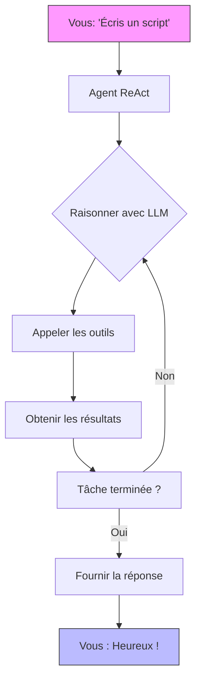
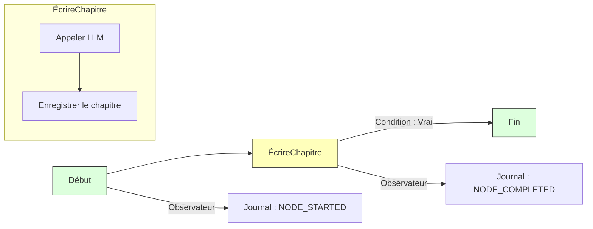

# QuantaLogic

[](https://opensource.org/licenses/Apache-2.0)
[](https://www.python.org/downloads/)
[](https://quantalogic.github.io/quantalogic/)

Bonjour à tous, bienvenue dans **QuantaLogic**—votre boîte à outils cosmique pour créer des agents et des flux de travail d'IA qui brillent de mille feux ! Que vous soyez en train de coder à tout-va, d'automatiser un processus métier ou d'imaginer quelque chose de fou, QuantaLogic est là pour que ça se réalise. Nous parlons ici de **grands modèles de langage (LLM)** fusionnés avec un ensemble d'outils stellaires, comprenant deux approches puissantes : le **framework ReAct** pour une résolution de problèmes dynamique et le tout nouveau et éblouissant **module Flow** pour une brillance structurée.

Imaginez ceci : une interface de ligne de commande aussi simple qu'un claquement de doigts, une API Python qui est de la pure magie et un framework qui s'adapte des hacks rapides aux entreprises galactiques. Prêt à décoller ? C'est parti pour le lancement !

[Documentation complète](https://quantalogic.github.io/quantalogic/) | [Guide pratique](./docs/howto/howto.md)


---
[Version chinoise](./README_CN.md)

## Pourquoi QuantaLogic ?

Chez [QuantaLogic](https://www.quantalogic.app), nous avons repéré un trou noir : les modèles d'IA incroyables d'OpenAI, Anthropic et DeepSeek n'illuminaient pas complètement les tâches du monde réel. Notre mission ? Allumer cette étincelle ! Nous sommes là pour rendre l'IA générative un jeu d'enfant pour les développeurs, les entreprises et les rêveurs—transformant les idées en action, une solution brillante à la fois.

> "L'IA devrait être votre copilote, pas un casse-tête. QuantaLogic rend cela possible—rapidement, de manière amusante et sans crainte !"

---

## Principales fonctionnalités

- **Framework ReAct** : Raisonnement + action = agents imparables !
- **Module Flow** : Des flux de travail structurés qui coulent comme une rivière.
- **Galaxie LLM** : Accédez à OpenAI, DeepSeek et plus encore via LiteLLM.
- **Outils sécurisés** : Sécurité alimentée par Docker pour le code et les fichiers.
- **Surveillance en direct** : Regardez le déroulement avec une interface web et SSE.
- **Magie de la mémoire** : Un contexte intelligent maintient les choses rapides.
- **Prêt pour l'entreprise** : Journaux, gestion des erreurs et validation—solide comme le roc.

---

## Table des matières

- [Pourquoi QuantaLogic ?](#pourquoi-quantalogic)
- [Principales fonctionnalités](#principales-fonctionnalités)
- [Installation](#installation)
- [Démarrage rapide](#démarrage-rapide)
- [Framework ReAct : Agents dynamiques](#react-framework-agents-dynamiques)
- [Module Flow : Flux de travail structurés](#flow-module-flux-de-travail-structurés)
  - **[Spécification DSL YAML du flux de travail](./quantalogic/flow/flow_yaml.md)** : Guide complet pour définir des flux de travail puissants et structurés à l'aide de notre langage spécifique au domaine
  - **[Documentation YAML du flux de travail](https://quantalogic.github.io/quantalogic/flow/flow_yaml)** : Plongez dans la documentation officielle pour une compréhension plus approfondie de Flow YAML et de ses applications
- [ReAct vs. Flow : Choisissez votre puissance](#react-vs-flow-choisissez-votre-puissance)
- [Utilisation de l'interface de ligne de commande](#utilisation-de-linterface-de-ligne-de-commande)
- [Exemples qui suscitent la joie](#exemples-qui-suscitent-la-joie)
- [Composants principaux](#composants-principaux)
- [Développement avec QuantaLogic](#développement-avec-quantalogic)
- [Contribution](#contribution)
- [Licence](#licence)
- [Croissance du projet](#croissance-du-projet)
- [Clés API et configuration de l'environnement](#clés-api-et-configuration-de-lenvironnement)

---

## Installation

Faisons orbiter QuantaLogic autour de votre système—c'est aussi simple que 1-2-3 !

### Ce dont vous aurez besoin
- **Python 3.12+** : Le carburant de notre fusée.
- **Docker** (facultatif) : Verrouille l'exécution du code dans un pod sécurisé.

### Option 1 : pip—Rapide et simple
```bash
pip install quantalogic
```

### Option 2 : pipx—Poussière d'étoile isolée
```bash
pipx install quantalogic
```

### Option 3 : Source—Pour les explorateurs de l'espace
```bash
git clone https://github.com/quantalogic/quantalogic.git
cd quantalogic
python -m venv .venv
source .venv/bin/activate  # Windows: .venv\Scripts\activate
poetry install
```
> **Conseil** : Pas de Poetry ? Récupérez-le avec `pip install poetry` et rejoignez l'équipage !

---

## Démarrage rapide

Prêt à voir la magie ? Voici votre pas de tir :

### CLI : Action instantanée
```bash
quantalogic task "Écrire une fonction Python pour les nombres de Fibonacci"
```
> Boum ! ReAct élabore une solution en quelques secondes.

### Python : Agent ReAct
```python
from quantalogic import Agent

agent = Agent(model_name="deepseek/deepseek-chat")
result = agent.solve_task("Coder une fonction Fibonacci")
print(result)
# Output: "def fib(n): return [0, 1] if n <= 2 else fib(n-1) + [fib(n-1)[-1] + fib(n-1)[-2]]"
```

### Exemple d'agent synchrone

```python
from quantalogic import Agent

# Créer un agent synchrone
agent = Agent(model_name="gpt-4o")

# Résoudre une tâche de manière synchrone
result = agent.solve_task(
    task="Écrire une fonction Python pour calculer les nombres de Fibonacci",
    max_iterations=10  # Facultatif : limiter les itérations
)

print(result)
```

### Exemple d'agent asynchrone 

```python
import asyncio
from quantalogic import Agent

async def main():
    # Créer un agent asynchrone
    agent = Agent(model_name="gpt-4o")
    
    # Résoudre une tâche de manière asynchrone avec le streaming
    result = await agent.async_solve_task(
        task="Écrire un script Python pour scraper les meilleurs dépôts GitHub",
        max_iterations=15,  # Facultatif : limiter les itérations
        streaming=True      # Facultatif : diffuser la réponse
    )
    
    print(result)

# Exécuter la fonction asynchrone
asyncio.run(main())
```

### Exemples de surveillance des événements 

#### Surveillance synchrone des événements avec des outils financiers
```python
from quantalogic import Agent
from quantalogic.console_print_events import console_print_events
from quantalogic.console_print_token import console_print_token
from quantalogic.tools import (
    DuckDuckGoSearchTool, 
    TechnicalAnalysisTool, 
    YFinanceTool
)

# Créer un agent avec des outils liés à la finance
agent = Agent(
    model_name="gpt-4o",
    tools=[
        DuckDuckGoSearchTool(),  # Outil de recherche web
        TechnicalAnalysisTool(),  # Analyse technique des actions
        YFinanceTool()            # Récupération des données boursières
    ]
)

# Configurer des écouteurs d'événements complets
agent.event_emitter.on(
    event=[
        "task_complete",
        "task_think_start", 
        "task_think_end", 
        "tool_execution_start", 
        "tool_execution_end",
        "error_max_iterations_reached",
        "memory_full",
        "memory_compacted"
    ],
    listener=console_print_events
)

# Facultatif : Surveiller les jetons de streaming
agent.event_emitter.on(
    event=["stream_chunk"], 
    listener=console_print_token
)

# Exécuter une tâche d'analyse financière en plusieurs étapes
result = agent.solve_task(
    "1. Trouver les 3 meilleures actions technologiques pour le T3 2024 "
    "2. Récupérer les données boursières historiques pour chacune "
    "3. Calculer les moyennes mobiles sur 50 et 200 jours "
    "4. Fournir une brève recommandation d'investissement",
    streaming=True  # Activer le streaming pour une sortie détaillée
)
print(result)
```

#### Surveillance asynchrone des événements avec des outils financiers
```python
import asyncio
from quantalogic import Agent
from quantalogic.console_print_events import console_print_events
from quantalogic.console_print_token import console_print_token
from quantalogic.tools import (
    DuckDuckGoSearchTool, 
    TechnicalAnalysisTool, 
    YFinanceTool
)

async def main():
    # Créer un agent asynchrone avec des outils liés à la finance
    agent = Agent(
        model_name="gpt-4o",
        tools=[
            DuckDuckGoSearchTool(),  # Outil de recherche web
            TechnicalAnalysisTool(),  # Analyse technique des actions
            YFinanceTool()            # Récupération des données boursières
        ]
    )

    # Configurer des écouteurs d'événements complets
    agent.event_emitter.on(
        event=[
            "task_complete",
            "task_think_start", 
            "task_think_end", 
            "tool_execution_start", 
            "tool_execution_end",
            "error_max_iterations_reached",
            "memory_full",
            "memory_compacted"
        ],
        listener=console_print_events
    )

    # Facultatif : Surveiller les jetons de streaming
    agent.event_emitter.on(
        event=["stream_chunk"], 
        listener=console_print_token
    )

    # Exécuter une tâche d'analyse financière en plusieurs étapes de manière asynchrone
    result = await agent.async_solve_task(
        "1. Trouver les startups émergentes dans le domaine de la technologie de l'IA "
        "2. Analyser leurs récentes levées de fonds "
        "3. Comparer le potentiel du marché et les indicateurs de croissance "
        "4. Fournir un rapport sur les tendances d'investissement",
        streaming=True  # Activer le streaming pour une sortie détaillée
    )
    print(result)

# Exécuter la fonction asynchrone
asyncio.run(main())
```

### Python : Flux de travail Flow
```python
from quantalogic.flow import Workflow, Nodes

@Nodes.define(output="greeting")
def greet(name: str) -> str:
    return f"Bonjour, {name} !"

workflow = Workflow("greet").build()
result = await workflow.run({"name": "Luna"})
print(result["greeting"])  # "Bonjour, Luna !"
```

---

## Framework ReAct : Agents dynamiques

Le framework **ReAct** est votre acolyte d'IA—pensez vite, agissez intelligemment. Il associe le raisonnement LLM à l'action alimentée par des outils, parfait pour les tâches qui nécessitent un peu d'improvisation.

### Comment ça marche
1. **Vous dites** : "Écris-moi un script."
2. **Il pense** : LLM trace la voie.
3. **Il agit** : Des outils comme `PythonTool` se mettent au travail.
4. **Il boucle** : Continue jusqu'à ce que ce soit terminé.

Regardez ça :



### Exemple : Générateur de code
```bash
quantalogic task "Créer un script Python pour trier une liste"
```
> ReAct trouve la solution, écrit le code et vous le remet—doux comme de la soie !

### Pourquoi c'est cool
Parfait pour coder, déboguer ou répondre à des questions folles à la volée.

---

## Module Flow : Flux de travail structurés

Le **module Flow** est votre architecte—construisant des flux de travail qui bourdonnent avec précision. Il s'agit de nœuds, de transitions et d'un rythme régulier, idéal pour les missions répétables.

**[Spécification DSL YAML du flux de travail](./quantalogic/flow/flow_yaml.md)** : Guide complet pour définir des flux de travail puissants et structurés à l'aide de notre langage spécifique au domaine

**[Documentation YAML du flux de travail](https://quantalogic.github.io/quantalogic/flow/flow_yaml)** : Plongez dans la documentation officielle pour une compréhension plus approfondie de Flow YAML et de ses applications

La documentation Flow YAML fournit une vue d'ensemble complète du langage Flow YAML, y compris sa syntaxe, ses fonctionnalités et ses meilleures pratiques. C'est une ressource précieuse pour quiconque cherche à créer des flux de travail complexes avec QuantaLogic.

De plus, la documentation Flow YAML comprend un certain nombre d'exemples et de tutoriels pour vous aider à démarrer avec la création de vos propres flux de travail. Ces exemples couvrent un éventail de sujets, des flux de travail simples aux scénarios plus complexes, et sont conçus pour vous aider à comprendre comment utiliser Flow YAML pour créer des flux de travail puissants et flexibles.

### Les éléments constitutifs
- **Nœuds** : Tâches comme des fonctions ou des appels LLM.
- **Transitions** : Chemins avec des conditions facultatives.
- **Moteur** : Dirige le spectacle avec panache.
- **Observateurs** : Jetez un coup d'œil aux progrès avec les événements.

### Exemple : Tisseur d'histoires
```python
from quantalogic.flow import Workflow, Nodes

@Nodes.llm_node(model="openai/gpt-4o-mini", output="chapter")
async def write_chapter(ctx: dict) -> str:
    return f"Chapitre 1 : {ctx['theme']}"

workflow = (
    Workflow("write_chapter")
    .then("end", condition="lambda ctx: True")
    .add_observer(lambda e: print(f" {e.event_type}"))
)
engine = workflow.build()
result = await engine.run({"theme": "Cosmic Quest"})
print(result["chapter"])
```

### Exemple : Agent générateur d'histoires

Voici un exemple plus complexe montrant un flux de travail complet de génération d'histoires à l'aide du module Flow :

```python
from typing import List
import anyio
from loguru import logger
from quantalogic.flow import Nodes, Workflow

# Définir les fonctions de nœud avec des décorateurs
@Nodes.validate_node(output="validation_result")
async def validate_input(genre: str, num_chapters: int) -> str:
    """Valider les paramètres d'entrée."""
    if not (1 <= num_chapters <= 20 and genre.lower() in ["science fiction", "fantasy", "mystery", "romance"]):
        raise ValueError("Entrée invalide : le genre doit être l'un des suivants : science-fiction, fantastique, mystère, romance")
    return "Entrée validée"

@Nodes.llm_node(
    model="gemini/gemini-2.0-flash",
    system_prompt="Vous êtes un écrivain créatif spécialisé dans les titres d'histoires.",
    prompt_template="Générer un titre créatif pour une histoire de {{ genre }}. Sortir uniquement le titre.",
    output="title",
)
async def generate_title(genre: str) -> str:
    """Générer un titre basé sur le genre (géré par llm_node)."""
    pass  # Logique gérée par le décorateur llm_node

@Nodes.define(output="manuscript")
async def compile_book(title: str, outline: str, chapters: List[str]) -> str:
    """Compiler le manuscrit complet à partir du titre, du plan et des chapitres."""
    return f"Titre : {title}\n\nPlan :\n{outline}\n\n" + "\n\n".join(
        f"Chapitre {i}:\n{chap}" for i, chap in enumerate(chapters, 1)
    )

# Définir le flux de travail avec une branche conditionnelle
workflow = (
    Workflow("validate_input")
    .then("generate_title")
    .then("generate_outline")
    .then("generate_chapter")
    .then("update_chapter_progress")
    .then("generate_chapter", condition=lambda ctx: ctx["completed_chapters"] < ctx["num_chapters"])
    .then("compile_book", condition=lambda ctx: ctx["completed_chapters"] >= ctx["num_chapters"])
    .then("quality_check")
    .then("end")
)

# Exécuter le flux de travail
async def main():
    initial_context = {
        "genre": "science fiction",
        "num_chapters": 3,
        "chapters": [],
        "completed_chapters": 0,
    }
    engine = workflow.build()
    result = await engine.run(initial_context)
```

Cet exemple démontre :
- Validation d'entrée avec `@Nodes.validate_node`
- Intégration LLM avec `@Nodes.llm_node`
- Traitement personnalisé avec `@Nodes.define`
- Branchement conditionnel pour la génération itérative de chapitres
- Gestion du contexte pour le suivi des progrès

L'exemple complet est disponible sur [examples/flow/story_generator/story_generator_agent.py](./examples/flow/story_generator/story_generator_agent.py).

### Flow visualisé


### Exemple : Pipeline de données
```python
@Nodes.define(output="processed")
def clean_data( str) -> str:
    return data.strip().upper()

workflow = Workflow("clean_data").build()
result = await workflow.run({"data": " hello "})
print(result["processed"])  # "HELLO"
```

### Pourquoi c'est génial
Pensez aux pipelines de contenu, aux flux d'automatisation ou à toute tâche en plusieurs étapes qui a besoin d'ordre.

---

## ReAct vs. Flow : Choisissez votre puissance

Les deux sont stellaires, mais voici le scoop :

| Fonctionnalité       | Framework ReAct                 | Module Flow                       |
|---------------------|--------------------------------|--------------------------------|
| **Ambiance**         | Esprit libre, adaptatif        | Organisé, prévisible         |
| **Flux**           | Boucle jusqu'à ce que ce soit résolu         | Suit une feuille de route              |
| **Point fort**     | Chaos créatif (codage, Q&R)   | Flux de travail stables (pipelines)   |
| **État**          | La mémoire le maintient lâche          | Les nœuds le verrouillent             |
| **Outils**          | Saisis au besoin              | Intégrés dans les nœuds               |
| **Surveiller**       | Événements comme `task_complete`    | Observateurs comme `NODE_STARTED`  |

### Quand choisir
- **ReAct** : Code à la volée, explorez les réponses, déboguez comme un pro.
- **Flow** : Construisez un pipeline, automatisez un processus, gardez-le serré.

---

## Utilisation de l'interface de ligne de commande

L'interface de ligne de commande est votre centre de commande—rapide, flexible et amusant !

### Syntaxe
```bash
quantalogic [OPTIONS] COMMANDE [ARGS]...
```

### Description
Assistant IA QuantaLogic - Un outil d'IA puissant pour diverses tâches.

### Variables d'environnement
- **OpenAI** : Définir `OPENAI_API_KEY` sur votre clé API OpenAI
- **Anthropic** : Définir `ANTHROPIC_API_KEY` sur votre clé API Anthropic
- **DeepSeek** : Définir `DEEPSEEK_API_KEY` sur votre clé API DeepSeek

Utilisez un fichier `.env` ou exportez ces variables dans votre shell pour une intégration transparente.

### Commandes
- **`task`** : Lancer une mission.
  ```bash
  quantalogic task "Résumer ce fichier" --file notes.txt
  ```
- **`list-models`** : Lister les modèles LiteLLM pris en charge avec une recherche floue facultative.
  ```bash
  quantalogic list-models --search "gpt"
  ```

### Options
- **`--model-name TEXT`** : Spécifier le modèle à utiliser (format litellm). Exemples :
  - `openai/gpt-4o-mini`
  - `openai/gpt-4o`
  - `anthropic/claude-3.5-sonnet`
  - `deepseek/deepseek-chat`
  - `deepseek/deepseek-reasoner`
  - `openrouter/deepseek/deepseek-r1`
  - `openrouter/openai/gpt-4o`
- **`--mode [code|basic|interpreter|full|code-basic|search|search-full]`** : Mode de l'agent
- **`--vision-model-name TEXT`** : Spécifier le modèle de vision à utiliser (format litellm)
- **`--log [info|debug|warning]`** : Définir le niveau de journalisation
- **`--verbose`** : Activer la sortie détaillée
- **`--max-iterations INTEGER`** : Nombre maximal d'itérations (par défaut : 30)
- **`--max-tokens-working-memory INTEGER`** : Définir le nombre maximal de jetons autorisés dans la mémoire de travail
- **`--compact-every-n-iteration INTEGER`** : Définir la fréquence de la compaction de la mémoire
- **`--thinking-model TEXT`** : Le modèle de pensée à utiliser
- **`--version`** : Afficher les informations sur la version

> **Conseil** : Exécutez `quantalogic --help` pour la référence de commande complète !

---

## Exemples qui suscitent la joie

Découvrez notre collection d'exemples pour voir QuantaLogic en action :

- [Exemples de Flow](./examples/flow/README.md) : Découvrez des workflows pratiques mettant en valeur les capacités de Quantalogic Flow
- [Exemples d'Agents](./examples/agent/README.md) : Voyez des agents dynamiques en action avec le framework ReAct
- [Exemples d'Outils](./examples/tools/README.md) : Explorez nos puissantes intégrations d'outils

Chaque exemple est accompagné d'une documentation détaillée et de code prêt à l'emploi.

### Magie vidéo
[](./examples/generated_tutorials/python/quantalogic_long.mp4)

### Exemples pratiques
| Nom              | Que fait-il ?                       | Fichier                                       |
|-------------------|------------------------------------|--------------------------------------------|
| Agent simple      | Démo de l'agent ReAct de base             | [01-simple-agent.py](./examples/01-simple-agent.py) |
| Surveillance des événements  | Agent avec suivi des événements          | [02-agent-with-event-monitoring.py](./examples/02-agent-with-event-monitoring.py) |
| Mode interpréteur  | Agent avec interpréteur             | [03-agent-with-interpreter.py](./examples/03-agent-with-interpreter.py) |
| Résumé de l'agent     | Génération de résumé de tâche            | [04-agent-summary-task.py](./examples/04-agent-summary-task.py) |
| Génération de code   | Génération de code de base              | [05-code.py](./examples/05-code.py) |
| Écran de code       | Génération de code avancée           | [06-code-screen.py](./examples/06-code-screen.py) |
| Rédacteur de tutoriel   | Écrire des tutoriels techniques          | [07-write-tutorial.py](./examples/07-write-tutorial.py) |
| Rédacteur PRD        | Document des exigences du produit      | [08-prd-writer.py](./examples/08-prd-writer.py) |
| Générateur d'histoires   | Création d'histoires basée sur Flow          | [story_generator_agent.py](./examples/flow/story_generator/story_generator_agent.py) |
| Requête SQL         | Génération de requête de base de données          | [09-sql-query.py](./examples/09-sql-query.py) |
| Agent financier     | Analyse financière et tâches       | [10-finance-agent.py](./examples/10-finance-agent.py) |
| Interface textuelle | Agent avec interface textuelle               | [11-textual-agent-interface.py](./examples/11-textual-agent-interface.py) |
| Test Composio     | Démo d'intégration Composio           | [12-composio-test.py](./examples/12-composio-test.py) |
| Agent synchrone | Démo d'agent synchrone             | [13-synchronous-agent.py](./examples/13-synchronous-agent.py) |
| Agent asynchrone       | Démo d'agent asynchrone                   | [14-async-agent.py](./examples/14-async-agent.py) |

### Bonus : Génie des maths
```bash
quantalogic task "Résoudre 2x + 5 = 15"
```
> Sortie : "Résolvons ça ! 2x + 5 = 15 → 2x = 10 → x = 5. Terminé !"

---

## Composants principaux

### Agents ReAct
- **Cerveau** : Les LLM alimentent la pensée.
- **Mains** : Des outils comme `PythonTool` font le travail.
- **Mémoire** : Relie tout ensemble.

### Flux de travail Flow
- **Nœuds** : Vos blocs de tâches.
- **Moteur** : Le maestro de l'exécution.

### Arsenal d'outils
- **Code** : `PythonTool`, `NodeJsTool`.
- **Fichiers** : `ReadFileTool`, `WriteFileTool`.
- Plus dans [REFERENCE_TOOLS.md](./REFERENCE_TOOLS.md).

---

## Développement avec QuantaLogic

### Configurer votre laboratoire
```bash
git clone https://github.com/quantalogic/quantalogic.git
cd quantalogic
python -m venv venv
source venv/bin/activate
poetry install
```

### Tester le cosmos
```bash
pytest --cov=quantalogic
```

### Peaufiner
```bash
ruff format  # Faire briller ce code
mypy quantalogic  # Vérifier les types
ruff check quantalogic  # Linter
```

### Créer des outils personnalisés
La fonction `create_tool()` transforme n'importe quelle fonction Python en un outil réutilisable :

```python
from quantalogic.tools import create_tool

def weather_lookup(city: str, country: str = "US") -> dict:
    """Récupérer la météo actuelle pour un lieu donné.
    
    Args:
        city: Nom de la ville à rechercher
        country: Code de pays à deux lettres (par défaut : US)
    
    Returns:
        Dictionnaire avec des informations météorologiques
    """
    # Implémenter la logique de recherche météorologique ici
    return {"temperature": 22, "condition": "Sunny"}

# Convertir la fonction en un outil
weather_tool = create_tool(weather_lookup)

# Maintenant, vous pouvez l'utiliser comme un outil
print(weather_tool.to_markdown())  # Générer la documentation de l'outil
result = weather_tool.execute(city="New York")  # Exécuter en tant qu'outil
```

#### Utilisation d'outils personnalisés avec l'agent ReAct

Voici comment intégrer des outils personnalisés avec un agent ReAct :

```python
from quantalogic import Agent
from quantalogic.tools import create_tool, PythonTool

# Créer un outil personnalisé de recherche de prix d'actions
def get_stock_price(symbol: str) -> str:
    """Obtenir le prix actuel d'une action par son symbole boursier.
    
    Args:
        symbol: Symbole boursier (par exemple, AAPL, MSFT)
    
    Returns:
        Informations sur le prix actuel de l'action
    """
    # Dans une implémentation réelle, vous récupéreriez à partir d'une API
    prices = {"AAPL": 185.92, "MSFT": 425.27, "GOOGL": 175.43}
    if symbol in prices:
        return f"{symbol} se négocie actuellement à {prices[symbol]}$"
    return f"Impossible de trouver le prix pour {symbol}"

# Créer un agent avec des outils standard et personnalisés
agent = Agent(
    model_name="gpt-4o",
    tools=[
        PythonTool(),  # Outil d'exécution Python standard
        create_tool(get_stock_price)  # Outil personnalisé de prix des actions
    ]
)

# L'agent peut maintenant utiliser les deux outils pour résoudre les tâches
result = agent.solve_task(
    "Écrire une fonction Python pour calculer la croissance des investissements, "  
    "puis analyser le prix actuel de l'action Apple"
)

print(result)
```

Dans cet exemple, l'agent peut utiliser de manière transparente à la fois l'outil `PythonTool` standard et votre outil personnalisé de recherche de prix des actions pour terminer la tâche.

Principales caractéristiques de `create_tool()` :
- Convertit automatiquement les fonctions en outils
- Extrait les métadonnées de la signature de la fonction et de la chaîne de documentation
- Prend en charge les fonctions synchrones et asynchrones
- Génère la documentation et la validation de l'outil

---

## Contribution

Rejoignez la galaxie QuantaLogic !
1. Fourchez-la.
2. Branche : `git checkout -b feature/epic-thing`.
3. Code + test.
4. PR !

Consultez [CONTRIBUTING.md](./CONTRIBUTING.md) pour tous les détails.

---

## Licence

 2024 QuantaLogic Contributors. **Apache 2.0**—gratuit et ouvert. Vérifiez [LICENSE](./LICENSE).

Imaginé par Raphaël MANSUY, fondateur de [QuantaLogic](https://www.quantalogic.app).

---

## Croissance du projet
[](https://star-history.com/#quantalogic/quantalogic&Date)

---

## Clés API et configuration de l'environnement

QuantaLogic se connecte aux LLM via des clés API—voici votre guide pour déverrouiller l'univers !

### Configuration des clés
Stockez les clés dans un fichier `.env` ou exportez-les :
```bash
echo "OPENAI_API_KEY=sk-your-openai-key" > .env
echo "DEEPSEEK_API_KEY=ds-your-deepseek-key" >> .env
source .env
```

### La chambre forte des clés : Modèles pris en charge
| Nom du modèle                              | Variable de clé             | À quoi ça sert ?                           |
|-----------------------------------------|--------------------------|-----------------------------------------------|
| `openai/gpt-4o-mini`                   | `OPENAI_API_KEY`         | Tâches rapides et économiques                 |
| `openai/gpt-4o`                        | `OPENAI_API_KEY`         | Raisonnement intensif                          |
| `anthropic/claude-3.5-sonnet`          | `ANTHROPIC_API_KEY`      | Brillance équilibrée                           |
| `deepseek/deepseek-chat`               | `DEEPSEEK_API_KEY`       | Bavard et polyvalent                          |
| `deepseek/deepseek-reasoner`           | `DEEPSEEK_API_KEY`       | Résolution de problèmes approfondie                          |
| `openrouter/deepseek/deepseek-r1`      | `OPENROUTER_API_KEY`     | Qualité de recherche via OpenRouter                 |
| `mistral/mistral-large-2407`           | `MISTRAL_API_KEY`        | Maîtrise multilingue                          |
| `dashscope/qwen-max`                   | `DASHSCOPE_API_KEY`      | Le puissant acteur d'Alibaba                        |
| `lm_studio/mistral-small-24b-instruct-2501` | `LM_STUDIO_API_KEY` | Action LLM locale                           |

### Configuration locale (par exemple, LM Studio)
```bash
export LM_STUDIO_API_BASE