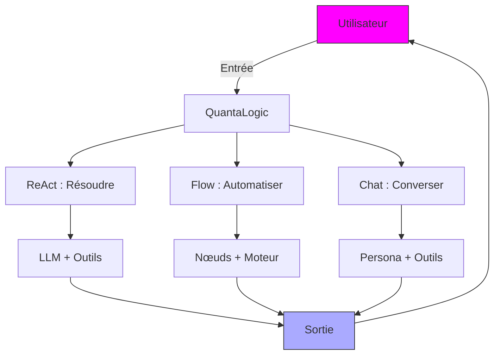
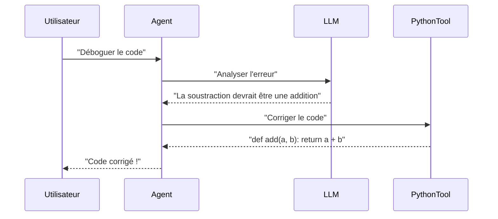
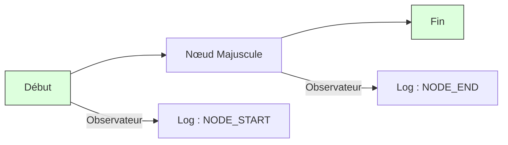

Here's the French translation of the provided text:

# QuantaLogic : Libérez l'IA pour le codage, l'automatisation et les conversations

**QuantaLogic** est votre framework d'IA tout-en-un pour créer des agents intelligents qui codent, automatisent les flux de travail et discutent comme des pros. Propulsé par de grands modèles de langage (LLM) et un ensemble d'outils polyvalent, il offre trois modes exceptionnels : **ReAct** pour s'attaquer aux tâches difficiles, **Flow** pour les processus rationalisés et **Chat** pour des conversations naturelles et expertes en outils. Que vous soyez un codeur, un innovateur commercial ou un passionné d'IA, QuantaLogic offre des solutions rapides, flexibles et amusantes. Décollons !

> **Nouveau : CodeAct**
>
> QuantaLogic CodeAct est une extension puissante et modulaire pour créer des agents d'IA qui non seulement raisonnent et agissent (ReAct), mais utilisent également **du code exécutable comme langage d'action principal**. Inspiré par les dernières recherches, CodeAct permet aux agents de résoudre des tâches complexes en plusieurs étapes en générant, exécutant et itérant sur du code Python, tout en maintenant le contexte et en tirant parti d'un système d'outils robuste. Cela le rend idéal pour l'automatisation avancée, la résolution de problèmes mathématiques et les interfaces conversationnelles conviviales.

[📖 Documentation complète](https://quantalogic.github.io/quantalogic/) | [⚡ Guide rapide](./docs/howto/howto.md)


---

## Pourquoi QuantaLogic ?

**Pourquoi choisir QuantaLogic ?** Il transforme la complexité des LLM en magie pratique, faisant travailler l'IA pour *vous*. De l'écriture de scripts au l'automatisation des tâches commerciales ou à la discussion sur l'univers, QuantaLogic est votre acolyte créatif, vous faisant gagner du temps et débloquant des possibilités.

- **Puissance polyvalente** : Codez, automatisez ou conversez – gérez n'importe quelle tâche.
- **Vos règles** : Personnalisez les agents et les outils pour qu'ils correspondent à vos besoins.
- **Échelle massive** : Des hacks CLI aux flux de travail d'entreprise.
- **Gratuit et ouvert** : Licence Apache 2.0 – utilisez-le, modifiez-le, partagez-le.

> *"L'IA devrait susciter la joie, pas le stress. QuantaLogic y parvient !"*

---

## Qu'est-ce que QuantaLogic ?

**Quelle est l'ambiance ?** QuantaLogic est un framework Python qui exploite les LLM (comme GPT-4o, Claude ou DeepSeek) pour créer des agents d'IA. Ces agents utilisent des outils pour le codage, la recherche, les opérations sur les fichiers, et plus encore, tous accessibles via une CLI élégante ou une API Python. Avec les modes **ReAct**, **Flow** et **Chat**, il s'adapte à tous les défis – tâches dynamiques, pipelines structurés ou discussions amicales.

### Fonctionnalités principales
- **Mode ReAct** : Résolvez des problèmes avec le raisonnement LLM + les actions d'outils.
- **Mode Flow** : Créez des flux de travail structurés avec des nœuds et des transitions.
- **Mode Chat** : Conversez naturellement avec des outils intelligents.
- **Intégration LLM** : Prend en charge OpenAI, Anthropic, DeepSeek via LiteLLM.
- **Ensemble d'outils** : Exécution de code, recherche Web, gestion de fichiers et outils personnalisés.
- **Mémoire intelligente** : Maintient le contexte léger pour les tâches ou les discussions longues.
- **Informations en temps réel** : Suivez les progrès avec des événements et des journaux.
- **Exécution sécurisée** : Isolation des outils basée sur Docker.

---

## CodeAct vs ReAct : Quelle est la différence ?

QuantaLogic prend en charge à la fois le paradigme classique **ReAct** et son extension avancée, **CodeAct** :

- **ReAct** (Raisonnement + Action) :
  - Basé sur l'article [ReAct](https://arxiv.org/abs/2210.03629), cette approche permet aux agents de *raisonner* (penser étape par étape) et d'*agir* (utiliser des outils ou du code) en boucle. C'est idéal pour les tâches où les modèles de langage doivent planifier, utiliser des outils et s'adapter aux commentaires.

- **CodeAct** :
  - S'appuie sur ReAct en faisant du **code Python exécutable** le langage principal pour les actions de l'agent. Au lieu de simplement appeler des outils ou de sortir du texte, l'agent écrit et exécute du code, observe les résultats (y compris les erreurs) et itère jusqu'à ce que la tâche soit résolue.
  - Cette approche est inspirée par des recherches récentes ([Yang et al., 2024](https://arxiv.org/html/2402.01030v4)) montrant que les actions de code exécutable permettent des agents LLM plus performants et fiables.
  - CodeAct est idéal pour les tâches complexes en plusieurs étapes, l'automatisation avancée et les scénarios où des actions précises et vérifiables sont nécessaires.

**Résumé** :
- Utilisez **ReAct** pour un raisonnement flexible avec l'utilisation d'outils.
- Utilisez **CodeAct** pour les tâches où la génération et l'exécution de code sont le meilleur moyen de résoudre un problème ou d'automatiser un flux de travail.

Voici comment cela se déroule :



---

## Comment démarrer

**Comment vous lancer ?** Installez-le, configurez-le et commencez à créer. Nous vous guiderons à travers la configuration, les exemples et les conseils de pro pour maîtriser QuantaLogic en quelques minutes.

### Installation

#### Ce dont vous avez besoin
- **Python 3.12+** : Le carburant de notre moteur d'IA.
- **Docker** (facultatif) : Pour une exécution sécurisée des outils.

#### Option 1 : pip (Voie rapide)
```bash
pip install quantalogic
```

#### Option 2 : pipx (Configuration propre)
```bash
pipx install quantalogic
```

#### Option 3 : Source (Pour les hackers)
```bash
git clone https://github.com/quantalogic/quantalogic.git
cd quantalogic
python -m venv .venv
source .venv/bin/activate  # Windows: .venv\Scripts\activate
poetry install
```

**Secret d'initié** : Créez un fichier `.env` pour les clés API afin de déverrouiller les LLM :
```bash
echo "OPENAI_API_KEY=sk-your-key" > .env
echo "DEEPSEEK_API_KEY=ds-your-key" >> .env
```

---

### Exemples de démarrage rapide

Voyons QuantaLogic briller avec ces démos rapides.

#### CLI : Résoudre une tâche
```bash
quantalogic task "Écrire un script Python pour inverser une chaîne de caractères"
```
**Sortie** : Un script d'inversion de chaîne propre et fonctionnel !

#### CLI : Discuter
```bash
quantalogic chat --persona "Vous êtes un guide cosmique" "Quelle est la plus haute montagne ?"
```
**Sortie** : Une réponse animée, éventuellement avec des résultats de recherche !

#### Python : Agent ReAct
```python
from quantalogic import Agent

agent = Agent(model_name="deepseek/deepseek-chat")
result = agent.solve_task("Écrire une fonction Python pour inverser une chaîne de caractères")
print(result)
# Sortie : "def reverse_string(s): return s[::-1]"
```

#### Python : Mode Chat
```python
from quantalogic import Agent, DuckDuckGoSearchTool

agent = Agent(
    model_name="gpt-4o-mini",
    chat_system_prompt="Vous êtes un explorateur curieux",
    tools=[DuckDuckGoSearchTool()]
)
response = agent.chat("Quoi de neuf en informatique quantique ?")
print(response)
# Sortie : "J'ai vérifié les dernières nouvelles ! Voici une avancée dans l'informatique quantique : [détails]."
```

---

### Les trois modes : Vos super pouvoirs

#### 1. Framework ReAct : Résolution dynamique des tâches
**Pourquoi** : S'attaquer à des tâches ouvertes comme le codage ou la recherche avec une touche créative.
**Quoi** : Combine le raisonnement LLM avec des outils pour itérer vers des solutions.
**Comment** : L'agent pense, agit et boucle jusqu'à ce que la tâche soit terminée.

**Exemple** : Déboguer du code.
```bash
quantalogic task "Déboguer ce code Python : def add(a, b): return a - b"
```
**Flux** :


**Astuce de mémorisation** : ReAct = **R**aisonnement + **A**ction, comme un détective résolvant un mystère étape par étape.

#### 2. Module Flow : Automatisation structurée
**Pourquoi** : Parfait pour les processus répétables comme les pipelines de données ou la création de contenu.
**Quoi** : Un système de nœuds (tâches) connectés par des transitions, exécuté par un moteur.
**Comment** : Définissez des nœuds, reliez-les et laissez le flux de travail bourdonner.

**Exemple** : Traiter du texte.
```python
from quantalogic.flow import Workflow, Nodes

@Nodes.define(output="processed")
def uppercase(text: str) -> str:
    return text.upper()

workflow = Workflow("uppercase").build()
result = await workflow.run({"text": "hello world"})
print(result["processed"])  # "HELLO WORLD"
```

**Diagramme** :


**Astuce de mémorisation** : Flow = une recette – les nœuds sont des ingrédients, les transitions sont des étapes et le moteur est le chef.

**En savoir plus** : Explorez la [Spécification DSL YAML de Flow](./quantalogic/flow/flow_yaml.md) pour les flux de travail avancés.

#### 3. Mode Chat : Conversations naturelles
**Pourquoi** : Idéal pour les questions-réponses interactives ou les informations rapides avec une touche de puissance d'outil.
**Quoi** : Une IA conversationnelle qui appelle des outils en cas de besoin, gardant les discussions fluides.
**Comment** : S'engage naturellement, en utilisant des outils via le système XML de ReAct.

**Exemple** : Vérifier la météo.
```python
from quantalogic import Agent

agent = Agent(model_name="gpt-4o", chat_system_prompt="Vous êtes un guide de voyage")
response = agent.chat("Quel temps fait-il à Paris ?")
print(response)
# Sortie : "Je vais vérifier ! Paris est ensoleillé, 20°C aujourd'hui."
```

**Astuce de mémorisation** : Chat = votre meilleur ami IA – parle, écoute et attrape des outils comme un moteur de recherche quand il est curieux.

---

### Quel mode choisir ?

| Mode       | Idéal pour                     | Style               | Outils              |
|------------|------------------------------|---------------------|--------------------|
| **ReAct**  | Codage, recherche, Q&R        | Itératif, adaptatif | Dynamique, à la demande |
| **Flow**   | Pipelines, automatisation        | Structuré, ordonné | Spécifique au nœud      |
| **Chat**   | Conversations, requêtes rapides  | Fluide        | Contextuel         |

**Conseil de pro** : Combinez les modes ! Utilisez Chat pour l'entrée utilisateur, Flow pour l'automatisation backend et ReAct pour les tâches complexes.

---

### Maîtrise de la CLI

La CLI QuantaLogic est votre centre de contrôle de mission. Voici le scoop :

```bash
quantalogic [COMMANDE] [OPTIONS]
```

#### Commandes
- **task** : Exécuter une tâche.
  ```bash
  quantalogic task "Calculer 5 + 3" --model-name gpt-4o-mini
  ```
- **chat** : Démarrer une conversation.
  ```bash
  quantalogic chat --persona "Expert en IA" "Quoi de neuf en apprentissage automatique ?"
  ```
- **list-models** : Lister les LLM.
  ```bash
  quantalogic list-models --search claude
  ```

#### Options clés
- `--model-name` : Sélectionnez votre LLM (par exemple, `anthropic/claude-3.5-sonnet`).
- `--mode` : Choisissez ReAct, Flow ou Chat.
- `--tool-mode` : Prioriser les outils dans Chat (par exemple, `code`).
- `--verbose` : Voir les journaux détaillés.

**Secret d'initié** : Ajoutez `--no-stream` pour une sortie plus propre sur les terminaux lents !

---

### Astuces avancées

#### Créer des outils personnalisés
Créez vos propres outils pour des tâches uniques :
```python
from quantalogic.tools import Tool

class TimeTool(Tool):
    name = "time_tool"
    def execute(self) -> str:
        from datetime import datetime
        return f"Heure actuelle : {datetime.now()}"

agent = Agent(model_name="gpt-4o")
agent.add_tool(TimeTool())
```

#### Passer en mode asynchrone
Améliorez les performances avec l'asynchrone :
```python
import asyncio
from quantalogic import Agent

async def main():
    agent = Agent(model_name="gpt-4o")
    result = await agent.async_chat("Raconte-moi une blague", streaming=True)
    print(result)

asyncio.run(main())
```

#### Surveiller les événements
Suivez chaque étape :
```python
from quantalogic import Agent, console_print_events

agent = Agent(model_name="gpt-4o")
agent.event_emitter.on(["task_start", "tool_execution_start"], console_print_events)
result = agent.solve_task("Écrire un poème")
```

---

### Astuces de mémorisation
- **Modes comme emplois** : ReAct = Freelancer (tâches flexibles), Flow = Ingénieur (constructions structurées), Chat = Barista (sert des discussions).
- **Outils comme jouets** : `PythonTool` = LEGO pour le codage, `SearchTool` = jumelles pour l'information.
- **Flux de travail comme cartes** : Nœuds = destinations, transitions = routes, moteur = GPS.

---

### Concepts simplifiés

**Outils 101** : Imaginez QuantaLogic comme un homme à tout faire. Vous demandez une réparation (tâche). Il saisit des outils – un marteau (`WriteFileTool`) ou un tournevis (`SearchTool`) – pour faire le travail correctement.

**Magie de la mémoire** : Imaginez un tableau de notes autocollantes. Au fur et à mesure que les tâches ou les discussions augmentent, QuantaLogic condense les anciennes notes pour faire de la place aux nouvelles – efficace et sans encombrement.

---

### Terrain de jeu d'exemples
Plongez dans notre [Dossier d'exemples](./examples/) pour l'inspiration :
- **Génération de code** : [05-code.py](./examples/05-code.py)
- **Démo de flux de travail** : [story_generator_agent.py](./examples/flow/story_generator/story_generator_agent.py)
- **Tâches financières** : [10-finance-agent.py](./examples/10-finance-agent.py)

**Présentation vidéo** :
[](./examples/generated_tutorials/python/quantalogic_long.mp4)

---

### Contribution

**Pourquoi** : Améliorer l'IA pour tout le monde !
**Quoi** : Ajouter des fonctionnalités, corriger des bugs ou suggérer des idées.
**Comment** : Fork, branche, code et PR. Consultez [CONTRIBUTING.md](./CONTRIBUTING.md).

---

### Licence

QuantaLogic est **Apache 2.0** – libre d'utilisation, de modification et de distribution. Construit avec ❤️ par Raphaël MANSUY chez [QuantaLogic](https://www.quantalogic.app).

---

### Clés API et modèles

Boostez avec des clés API LLM dans un fichier `.env` :
```bash
OPENAI_API_KEY=sk-your-key
ANTHROPIC_API_KEY=your-key
DEEPSEEK_API_KEY=ds-your-key
```

**Meilleurs modèles** :
- `openai/gpt-4o-mini` : Rapide et économique.
- `anthropic/claude-3.5-sonnet` : Raisonnement ultra-précis.
- `deepseek/deepseek-reasoner` : Résolution de problèmes en profondeur.

**Secret d'initié** : Définissez `LM_STUDIO_API_BASE` pour les LLM locaux – idéal pour le travail hors ligne !

---

### Construisons l'avenir

QuantaLogic est votre rampe de lancement pour la génialité de l'IA. Installez-le, essayez les exemples et créez quelque chose d'épique – code, flux de travail ou discussions. Mettez une étoile au dépôt, rejoignez la communauté et rendons l'IA imparable !

[](https://star-history.com/#quantalogic/quantalogic?Date)
