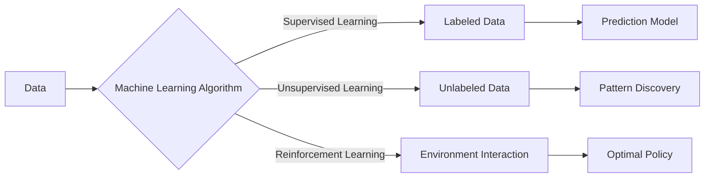

## Chapter 4: Machine Learning Fundamentals with Scikit-learn 🤖

Machine learning (ML) is transforming industries, and Python, with its powerful libraries like Scikit-learn, is at the forefront. This chapter will demystify ML, providing you with the fundamental skills to build and deploy your own models.

### Why Machine Learning? 🤔

Imagine predicting customer churn, classifying images, or recommending products – all automatically! ML empowers computers to learn from data without explicit programming, enabling them to make predictions and decisions. It automates insights and adapts to new data, unlocking opportunities across various fields.

### What is Machine Learning? 🧐

At its core, machine learning involves training algorithms on data to identify patterns and make predictions. There are three main types:

*   **Supervised Learning:** The algorithm learns from labeled data (input features and corresponding output labels). Think of it like learning with a teacher providing answers. Examples include predicting house prices (regression) or classifying emails as spam/not spam (classification).
*   **Unsupervised Learning:** The algorithm learns from unlabeled data, discovering hidden patterns and structures. It's like exploring data without a guide. Examples include clustering customers into segments or reducing the dimensionality of data.
*   **Reinforcement Learning:** The algorithm learns through trial and error, receiving rewards or penalties for its actions. It's like training a dog with treats! Examples include training a robot to walk or playing games.

Let's visualize this:



### How to Build Machine Learning Models with Scikit-learn 🛠️

Scikit-learn is a user-friendly Python library that provides a wide range of ML algorithms and tools. Here's a breakdown of the key steps:

1.  **Data Preprocessing:** Prepare your data for the model.

    *   **Cleaning:** Handle missing values (e.g., imputation with mean or median) and outliers.
    *   **Transforming:** Convert categorical features (e.g., colors) into numerical representations (e.g., one-hot encoding).
    *   **Scaling:** Scale numerical features to a similar range (e.g., using StandardScaler or MinMaxScaler) to prevent features with larger values from dominating the model.

    ```python
    from sklearn.preprocessing import StandardScaler
    import numpy as np

    data = np.array([[1, 10], [2, 20], [3, 30]])
    scaler = StandardScaler()
    scaled_data = scaler.fit_transform(data)
    print(scaled_data)
    ```

2.  **Model Selection:** Choose an appropriate algorithm based on your problem type and data characteristics.

    *   **Regression:** Linear Regression, Ridge Regression, Lasso Regression
    *   **Classification:** Logistic Regression, Support Vector Machines (SVM), Decision Trees, Random Forest
    *   **Clustering:** K-Means, DBSCAN

3.  **Model Training:** Train the model on your training data.

    *   Split your data into training and testing sets (e.g., 80% training, 20% testing).
    *   Fit the model to the training data using the `fit()` method.

    ```python
    from sklearn.model_selection import train_test_split
    from sklearn.linear_model import LinearRegression

    X = np.array([[1], [2], [3], [4], [5]])
    y = np.array([2, 4, 5, 4, 5])

    X_train, X_test, y_train, y_test = train_test_split(X, y, test_size=0.2, random_state=42)

    model = LinearRegression()
    model.fit(X_train, y_train)
    ```

4.  **Model Evaluation:** Evaluate the model's performance on the testing data.

    *   Use appropriate evaluation metrics based on your problem type.
        *   **Regression:** Mean Squared Error (MSE), R-squared
        *   **Classification:** Accuracy, Precision, Recall, F1-score, Confusion Matrix

    ```python
    from sklearn.metrics import mean_squared_error, r2_score

    y_pred = model.predict(X_test)
    mse = mean_squared_error(y_test, y_pred)
    r2 = r2_score(y_test, y_pred)

    print(f"Mean Squared Error: {mse}")
    print(f"R-squared: {r2}")
    ```

5.  **Model Selection and Hyperparameter Tuning:** Fine-tune the model to optimize performance.

    *   **Cross-validation:** Divide the training data into multiple folds and train/evaluate the model on different combinations of folds.
    *   **Grid Search:** Systematically search for the best combination of hyperparameters (parameters that control the model's learning process).

    ```python
    from sklearn.model_selection import GridSearchCV
    from sklearn.svm import SVC

    param_grid = {'C': [0.1, 1, 10], 'kernel': ['linear', 'rbf']}
    grid_search = GridSearchCV(SVC(), param_grid, cv=3)
    grid_search.fit(X_train, y_train)

    print(f"Best parameters: {grid_search.best_params_}")
    best_model = grid_search.best_estimator_
    ```

6.  **Model Deployment:** Save the trained model for future use.

    *   Use `pickle` or `joblib` to serialize the model.

    ```python
    import joblib

    joblib.dump(best_model, 'my_model.pkl')

    # Load the model later
    loaded_model = joblib.load('my_model.pkl')
    ```

### When to Use Machine Learning ⏰

ML is best suited for problems where:

*   You have a large amount of data.
*   The relationships between variables are complex and difficult to define explicitly.
*   You need to make predictions or decisions automatically.
*   The problem requires adaptation to changing data patterns.

### Insider Secrets 🤫

*   **Feature Engineering is Key:** The quality of your features (input variables) has a significant impact on model performance. Invest time in creating meaningful and relevant features.
*   **Don't Overfit:** Avoid creating models that are too complex and memorize the training data. Use techniques like cross-validation and regularization to prevent overfitting.
*   **Understand Your Data:** Explore your data thoroughly to identify patterns, outliers, and potential issues before training your model.

### Debunking Myths 💥

*   **Myth:** Machine learning is magic.
    *   **Reality:** ML is based on mathematical and statistical principles. It requires careful data preparation, model selection, and evaluation.
*   **Myth:** You need to be a math expert to do machine learning.
    *   **Reality:** While a basic understanding of math is helpful, libraries like Scikit-learn provide high-level abstractions that make ML accessible to a wider audience.
*   **Myth:** More data always leads to better models.
    *   **Reality:** The quality of the data is more important than the quantity. Garbage in, garbage out!

### Your 24-Hour Challenge! 🚀

Build a simple classification model using Scikit-learn. Choose a dataset from the Scikit-learn datasets library (e.g., the Iris dataset) or find a small dataset online. Follow the steps outlined above to preprocess the data, train a model (e.g., Logistic Regression or Decision Tree), and evaluate its performance. Share your results!

### A Spark of Creativity ✨

Imagine combining machine learning with your existing skills and interests. Could you build a model to predict the success of your creative projects? Or perhaps use ML to generate new artistic ideas? The possibilities are endless!