# QuantaLogic Architecture Guide

**Version**: v0.94  
**Last Updated**: June 30, 2025  
**Component Structure**: Post-Reorganization

## 🏛️ Executive Summary

QuantaLogic is a modular AI agent ecosystem consisting of three primary components, each serving distinct but complementary purposes. After the pragmatic reorganization, the architecture maintains clean separation of concerns while preserving all user-facing APIs and workflows.

## 🎯 Component Overview

### QuantaLogic Component Independence

```mermaid
graph TB
    subgraph "Independent Components"
        React[quantalogic_react<br/>ReAct Agent<br/>29,586 LOC<br/>🟢 INDEPENDENT]
        CodeAct[quantalogic_codeact<br/>Code Agent<br/>7,416 LOC<br/>🟢 INDEPENDENT]
        Flow[quantalogic_flow<br/>Workflow Engine<br/>6,282 LOC<br/>🟢 INDEPENDENT]
    end
    
    subgraph "User Interfaces"
        ReactCLI[quantalogic CLI]
        CodeActCLI[quantalogic-codeact CLI]
        FlowCLI[quantalogic-flow CLI]
    end
    
    ReactCLI --> React
    CodeActCLI --> CodeAct  
    FlowCLI --> Flow
    
    classDef independent fill:#4CAF50,stroke:#2E7D32,stroke-width:3px,color:#fff
    classDef cli fill:#2196F3,stroke:#1565C0,stroke-width:2px,color:#fff
    
    class React,CodeAct,Flow independent
    class ReactCLI,CodeActCLI,FlowCLI cli
```



### User Access Patterns


### Component Architecture Overview


### React Agent Interaction Flow


### CodeAct Agent Interaction Flow


### Flow Engine Interaction Flow


## 📊 Component Deep Dive

### 1. React Agent (`quantalogic_react/`)

**Purpose**: Original ReAct implementation with comprehensive tool ecosystem  
**Architecture**: Monolithic but well-structured  
**Size**: ~29,586 LOC  
**Independence**: 75% (good integration with Flow)

#### Core Modules
```
quantalogic_react/quantalogic/
├── agent.py                 # Core ReAct agent implementation
├── main.py                  # CLI entry point
├── tool_manager.py          # Tool loading and management
├── generative_model.py      # LLM integration layer
├── memory.py                # Conversation and variable memory
├── event_emitter.py         # Event system
├── tools/                   # Built-in tool collection (40+ tools)
├── server/                  # Web server implementation
├── utils/                   # Utility functions
└── prompts/                 # System prompts and templates
```

#### Key Features
- **ReAct Paradigm**: Reasoning and Acting in unified framework
- **Extensive Tool System**: 40+ built-in tools + plugin architecture
- **Multi-Model Support**: OpenAI, Anthropic, DeepSeek, local models
- **Event System**: Real-time monitoring and custom handlers
- **Web Interface**: Optional web server for remote access
- **Memory Management**: Conversation history and variable storage

#### Dependencies
- **External**: litellm, pydantic, loguru, rich
- **Internal**: Re-exports Flow components for user convenience (`quantalogic.flow`)
- **Tools**: Extensive 40+ tool ecosystem with plugin architecture
- **Independence**: 90% independent (only re-exports Flow for convenience)

### 2. CodeAct Agent (`quantalogic_codeact/`)

**Purpose**: Modern ReAct agent specialized for code execution and problem-solving  
**Architecture**: Modular with clean interfaces  
**Size**: ~7,416 LOC  
**Independence**: 95% (excellent separation)

#### Core Modules
```
quantalogic_codeact/quantalogic_codeact/
├── agent.py                 # Modern ReAct agent implementation
├── main.py                  # CLI and interactive shell
├── tool_manager.py          # Tool system management
├── memory.py                # Advanced memory systems
├── python_interpreter.py   # Secure Python execution
├── tools/                   # CodeAct-specific tools
├── utils/                   # Utility functions
└── prompts/                 # Specialized prompts
```

#### Key Features
- **Code-First Design**: Optimized for programming tasks
- **Secure Execution**: sandboxed Python environment (quantalogic-pythonbox)
- **Interactive Shell**: Rich CLI interface
- **Advanced Memory**: Persistent conversation and variable storage
- **Tool Integration**: Minimal dependencies on React tools

#### Dependencies
- **External**: litellm, pydantic, loguru, rich, quantalogic-pythonbox
- **Internal**: Zero dependencies on other QuantaLogic components
- **Tools**: Completely independent tool system
- **Independence**: 100% independent (no coupling with React or Flow)

### 3. Flow Engine (`quantalogic_flow/`)

**Purpose**: Standalone workflow automation engine  
**Architecture**: Completely independent microservice  
**Size**: ~6,282 LOC  
**Independence**: 100% (perfect isolation)

#### Core Modules
```
quantalogic_flow/quantalogic_flow/
├── flow/
│   ├── workflow.py          # Core workflow engine
│   ├── nodes.py             # Node implementations
│   ├── flow_manager.py      # Workflow management
│   ├── flow_validator.py    # YAML validation
│   ├── flow_generator.py    # Code generation
│   └── flow_mermaid.py      # Diagram generation
├── utils/                   # Flow utilities
└── templates/               # Workflow templates
```

#### Key Features
- **Dual API**: YAML declarations + Python fluent API
- **Visual Workflows**: Mermaid diagram generation
- **Template System**: Reusable workflow patterns
- **Validation**: Comprehensive YAML validation
- **Code Generation**: Convert YAML to executable Python

#### Dependencies
- **External**: litellm, pydantic, loguru, jinja2, pyyaml
- **Internal**: Zero internal dependencies (perfect isolation)
- **Architecture**: Completely standalone, microservice-ready

## 🔄 Component Independence

### Component Isolation


### Deployment Independence


### External Dependencies Overview


### Independence Levels

```mermaid
graph LR
    subgraph "Independence Rating"
        React[quantalogic_react<br/>⭐⭐⭐⭐☆<br/>90% Independent<br/>Re-exports Flow]
        CodeAct[quantalogic_codeact<br/>⭐⭐⭐⭐⭐<br/>100% Independent<br/>No internal deps]
        Flow[quantalogic_flow<br/>⭐⭐⭐⭐⭐<br/>100% Independent<br/>Standalone ready]
    end
    
    classDef high fill:#4CAF50,stroke:#2E7D32,stroke-width:3px,color:#fff
    classDef perfect fill:#2E7D32,stroke:#1B5E20,stroke-width:3px,color:#fff
    
    class React high
    class CodeAct,Flow perfect
```



## 🛠️ Tool Ecosystem Architecture

## 🛠️ Tool Ecosystem Architecture

### React Agent Tool System


### CodeAct Agent Tool System


### Flow Engine Integration


### ReAct Agent Processing Flow


### CodeAct Agent Processing Flow


### Monolithic Deployment


### Microservice Deployment


### Serverless Deployment


### Tool Sharing Strategy

1. **Independent Tool Systems**: Each component has its own tool system
2. **No Cross-Component Dependencies**: CodeAct and React are completely independent
3. **Specialized Tools**: Component-specific tools for specialized use cases
4. **Extension Points**: MCP and toolbox system for external extensions
5. **Clean Interfaces**: Zero coupling between components

## 🌟 Post-Reorganization Benefits

### 1. **Complete Component Independence**
- React and CodeAct agents are 100% independent
- No shared internal dependencies between components
- Each component can be deployed and scaled independently
- Clear, separate evolution paths

### 2. **Preserved User Experience**
- All existing CLI commands work unchanged
- Import paths preserved: `from quantalogic import Agent`
- No breaking changes to public APIs
- Backward compatibility maintained

### 3. **Better Organization**
- Clear component boundaries with zero coupling
- Logical grouping of related functionality
- Enhanced documentation structure
- Improved developer experience

### 4. **Enhanced Flexibility**
- Components evolve completely independently
- No integration complexity
- Extensible architecture per component
- Future-proof independent design
- Clean integration points
- Extensible architecture
- Future-proof design

## 🔧 Development Workflow

### Component Development Workflow

```mermaid
gitgraph
    commit id: "Main Branch"
    
    branch react-development
    checkout react-development
    commit id: "React: Add tool"
    commit id: "React: Update tests"
    
    checkout main
    branch codeact-development
    commit id: "CodeAct: Add feature"
    commit id: "CodeAct: Update interpreter"
    
    checkout main
    branch flow-development
    commit id: "Flow: Add node type"
    commit id: "Flow: Update templates"
    
    checkout main
    merge react-development
    commit id: "Integration test"
    
    checkout main
    merge codeact-development
    commit id: "Integration test"
    
    checkout main
    merge flow-development
    commit id: "Release v0.94"
```

### Independent Testing Strategy

```mermaid
graph TB
    subgraph "Unit Testing"
        ReactUnit[React Component Tests<br/>• Agent functionality<br/>• Tool operations<br/>• Memory management]
        CodeActUnit[CodeAct Component Tests<br/>• Code execution<br/>• Interpreter safety<br/>• Independent tools]
        FlowUnit[Flow Component Tests<br/>• Workflow execution<br/>• YAML validation<br/>• Template generation]
    end
    
    subgraph "Integration Testing"
        APIIntegration[API Integration Tests<br/>• LLM providers<br/>• External services<br/>• Component APIs]
    end
    
    subgraph "System Testing"
        E2EReact[React E2E Tests<br/>• Complete workflows<br/>• CLI operations]
        E2ECodeAct[CodeAct E2E Tests<br/>• Code scenarios<br/>• Shell interactions]
        E2EFlow[Flow E2E Tests<br/>• Workflow execution<br/>• Template processing]
    end
    
    ReactUnit --> APIIntegration
    CodeActUnit --> APIIntegration
    FlowUnit --> APIIntegration
    
    APIIntegration --> E2EReact
    APIIntegration --> E2ECodeAct
    APIIntegration --> E2EFlow
    
    classDef unit fill:#4CAF50,stroke:#2E7D32,stroke-width:2px,color:#fff
    classDef integration fill:#2196F3,stroke:#1565C0,stroke-width:2px,color:#fff
    classDef e2e fill:#FF9800,stroke:#E65100,stroke-width:2px,color:#fff
    
    class ReactUnit,CodeActUnit,FlowUnit unit
    class APIIntegration integration
    class E2EReact,E2ECodeAct,E2EFlow e2e
```



## 🎯 Architecture Principles

### 1. **Separation of Concerns**
- Each component has a clear, distinct purpose
- Minimal overlap in functionality
- Clean boundaries between components

### 2. **Preserved User Experience**
- All existing workflows continue to work
- No breaking changes to public APIs
- Backward compatibility maintained

### 3. **Flexibility and Extensibility**
- Components can evolve independently
- Clean integration points
- Plugin architecture for extensions

### 4. **Maintainability**
- Clear code organization
- Comprehensive documentation
- Logical component structure

### 5. **Performance**
- Efficient import paths
- Minimal overhead
- Optimized execution paths

## 🚀 Future Evolution

### Component Evolution Timeline

```mermaid
timeline
    title QuantaLogic Independent Component Evolution
    
    section v0.94 - Foundation
        Component Independence : Full independence established
                               : Clean separation of concerns  
                               : Zero coupling between CodeAct/React
                               : Professional documentation
    
    section v0.95 - Enhancement
        React Agent : Enhanced tool ecosystem
                    : Performance optimizations
                    : Extended LLM support
        
        CodeAct Agent : Advanced code analysis
                      : Extended language support
                      : Enhanced security features
        
        Flow Engine : Visual workflow editor
                    : Advanced template system
                    : Real-time monitoring
    
    section v1.0 - Maturity
        Independent Scaling : Microservice deployment
                            : Independent versioning
                            : Specialized optimizations
                            : Production-ready features
```

### Performance Optimization Areas

```mermaid
graph TB
    subgraph "React Agent Optimization"
        ReactImport[Import Optimization<br/>Lazy loading tools]
        ReactTool[Tool Caching<br/>Reuse results]
        ReactMemory[Memory Management<br/>Efficient storage]
    end
    
    subgraph "CodeAct Agent Optimization"
        CodeActImport[Fast Startup<br/>Minimal dependencies]
        CodeActExec[Execution Speed<br/>Optimized interpreter]
        CodeActSandbox[Sandbox Efficiency<br/>Resource management]
    end
    
    subgraph "Flow Engine Optimization"
        FlowParsing[YAML Parsing<br/>Fast validation]
        FlowExecution[Workflow Speed<br/>Parallel execution]
        FlowTemplate[Template Cache<br/>Reuse patterns]
    end
    
    subgraph "Performance Targets"
        ImportTarget[Import Time: <1s]
        CreationTarget[Agent Creation: <0.01s]
        MemoryTarget[Memory Usage: <200MB]
        ResponseTarget[Response Time: <2s]
    end
    
    ReactImport --> ImportTarget
    ReactTool --> CreationTarget
    ReactMemory --> MemoryTarget
    
    CodeActImport --> ImportTarget
    CodeActExec --> ResponseTarget
    CodeActSandbox --> MemoryTarget
    
    FlowParsing --> ImportTarget
    FlowExecution --> ResponseTarget
    FlowTemplate --> CreationTarget
    
    classDef react fill:#4CAF50,stroke:#2E7D32,stroke-width:2px,color:#fff
    classDef codeact fill:#FF5722,stroke:#D84315,stroke-width:2px,color:#fff
    classDef flow fill:#2196F3,stroke:#1565C0,stroke-width:2px,color:#fff
    classDef targets fill:#9C27B0,stroke:#6A1B9A,stroke-width:2px,color:#fff
    
    class ReactImport,ReactTool,ReactMemory react
    class CodeActImport,CodeActExec,CodeActSandbox codeact
    class FlowParsing,FlowExecution,FlowTemplate flow
    class ImportTarget,CreationTarget,MemoryTarget,ResponseTarget targets
```

---

**Architecture Status**: ✅ Well-organized, user-friendly, maintainable  
**Last Review**: June 30, 2025  
**Next Review**: After v0.94 release
