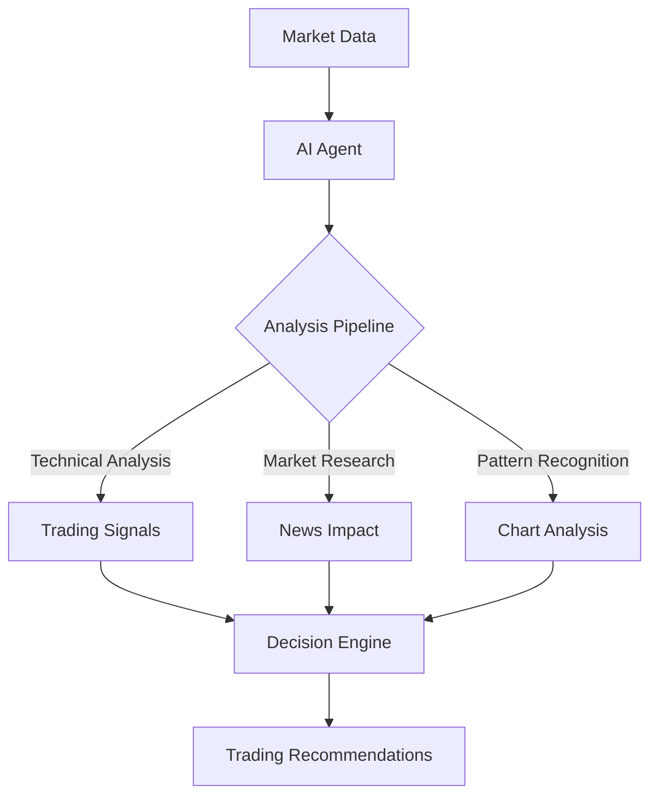

# Building Your AI Quant Trading Assistant: A Deep Dive into Financial Intelligence

## The Vision: Your Personal Hedge Fund in Code

Picture this: It's a bustling morning in Hong Kong's financial district. While traders are just settling into their desks, your AI assistant has already:

- Analyzed global market trends through DeepSeek's powerful LLM (Created by best Quant Team in the world)
- Generated precise technical indicators for your watchlist
- Created interactive visualizations of market patterns
- Formulated trading suggestions based on real-time data

All this power, built by you, running on your laptop. Let's make it happen.

## Why This Matters Now: The AI Trading Revolution



The financial markets are undergoing a revolutionary transformation:

- 2010s: Basic algorithmic trading
- 2020s: Machine learning models
- 2024: AI Agents with real-time analysis capabilities
- 2025: Your opportunity to join the revolution

## The Architecture: Building Your Market Intelligence Center

Let's break down our Quantalogic-powered agent into its core components:

### 1. The Brain: Agent Initialization
```python
def main():
    model_name = "deepseek/deepseek-chat"
    st.set_page_config(page_title="Finance Suite Pro", layout="wide")
    st.title("📈 AI Financial Analyst")

    if "agent" not in st.session_state:
        st.session_state.agent = Agent(
            model_name=model_name,
            tools=[
                StreamlitInputTool(),
                YFinanceTool(),
                TechnicalAnalysisTool(),
                VisualizationTool(),
                LLMTool(model_name=model_name),
            ]
        )
```

This isn't just code – it's your command center. Each tool represents a specialized capability:
- StreamlitInputTool: Your communication interface
- YFinanceTool: Your market data pipeline
- TechnicalAnalysisTool: Your quantitative brain
- VisualizationTool: Your pattern recognition system
- LLMTool: Your AI reasoning engine

### 2. The Market Intelligence Engine

```python
class TechnicalAnalysisTool(Tool):
    def _calculate_rsi(self, df: pd.DataFrame, period: int) -> pd.DataFrame:
        delta = df["Close"].diff()
        gain = delta.where(delta > 0, 0.0)
        loss = -delta.where(delta < 0, 0.0)
        avg_gain = gain.rolling(period).mean()
        avg_loss = loss.rolling(period).mean()
        rs = avg_gain / avg_loss.replace(0.0, 1e-10)
        df["RSI"] = 100 - (100 / (1 + rs))
        return df
```

This isn't just a function – it's the same RSI calculation used by professional traders, now automated in your system. The code handles edge cases (like division by zero) that could crash lesser implementations.

### 3. The Visualization Suite

```python
class VisualizationTool(Tool):
    def execute(self, data: str, chart_type: str = "line"):
        df = pd.read_json(StringIO(data))
        fig = go.Figure()
        
        if chart_type == "candle":
            fig.add_trace(go.Candlestick(
                x=df["Date"],
                open=df["Open"],
                high=df["High"],
                low=df["Low"],
                close=df["Close"]
            ))
```

Each visualization is interactive, professional-grade, and designed for real-time analysis. The dark theme isn't just aesthetic – it's optimized for extended trading sessions.

## Building Your Edge: Advanced Features

### Real-Time Event Processing
```python
def track_events(event: str, data: Optional[dict] = None):
    if event == "task_think_start":
        st.session_state.current_status = st.status("🔍 Analyzing...")
    elif event == "tool_execution_start":
        st.toast(f"📊 Executing {data['tool_name']}", icon="⏳")
```

This event system provides instant feedback, crucial for time-sensitive trading decisions.

### Market Data Pipeline
```python
class YFinanceTool(Tool):
    def execute(self, ticker: str, start_date: str, end_date: str) -> str:
        with st.spinner(f"Fetching {ticker} data..."):
            stock = yf.Ticker(ticker)
            hist = stock.history(start=start_date, end=end_date)
            return hist.to_json()
```

Clean, reliable data is the foundation of successful trading. This pipeline ensures you're working with quality information.

## Your Path to Market Mastery

### Hour 1-6: Foundation
```bash
uv venv venv
source venv/bin/activate
pip install streamlit yfinance pandas plotly quantalogic
```

### Hour 7-12: Core Implementation
Build your tools one by one, testing each component:
- Market data fetching
- Technical analysis
- Visualization system

### Hour 13-18: Integration
Connect your components into a seamless system:
- Event handling
- State management
- Error handling

### Hour 19-24: Optimization
Fine-tune your system:
- Performance optimization
- UI enhancements
- Trading strategy implementation

## The Future Is Code

While others pay thousands for trading terminals, you'll have built something potentially more powerful – a customizable, AI-powered trading assistant that understands your strategy and grows with you.

Remember: Every successful quant started somewhere. Your journey begins with this code.

Ready to build your AI trading future? The code is waiting. The market is ready. Are you?