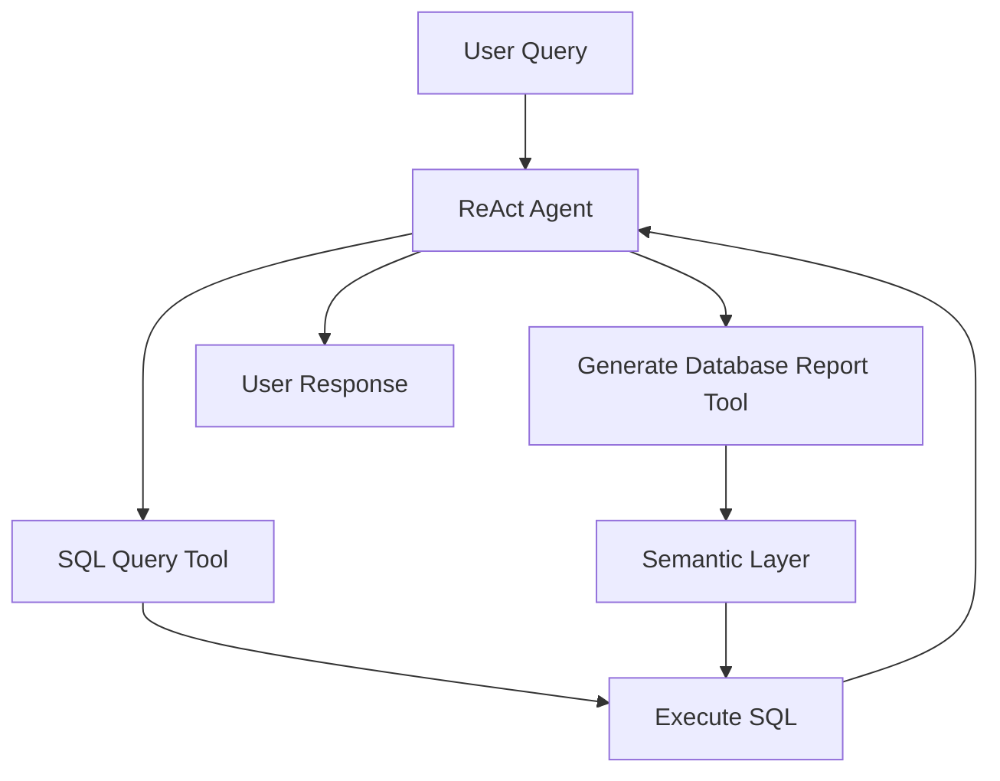

# 🚀 24-Hour AI Engineering Mastery: building an SQL AI Agent in less than 24 hours... with Quantalogic

>  **How Elite Engineers Build AI powered SQL Query Agents with Quantalogic.... (While Others Stay Stuck) .... 💡**

Are you tired of wading through endless tutorials, only to find yourself still stuck at the beginner level? What if you could transform from a novice to a proficient **AI Engineer practitioner** in **less than 24 hours**? Buckle up, because we're about to embark on a **thrilling journey** that will ignite your passion and equip you with the mastery you crave—swiftly and efficiently. 🌟

## 🌟 Why? The Power of Speed Learning in the Modern World 🌐
**Picture this**: You're at a tech conference, surrounded by AI enthusiasts. Someone casually mentions they built a SQL Query Agent last night. Jaws drop. Eyes widen. You feel a mix of awe and... is that a twinge of envy? Now imagine being that person. That's the power of mastering the **QuantaLogic ReAct Agent Framework**. It's not just about keeping up; it's about leading the pack. Ready to become the talk of your next meetup? Let's dive in:

- **🚀 Instant Expertise:** Transform from SQL novice to AI-powered data wizard overnight.
- **🧠 Cognitive Leverage:** Harness QuantaLogic's ReAct framework to outsmart, not outwork, the competition.
- **🔮 Future-Proof Skills:** As AI reshapes industries, be the one shaping AI. Your future self will thank you.

- **📊 Relevance:** Data is the new oil. Businesses thrive on data-driven decisions, making database analysis a highly sought-after skill.
- **⚡ Efficiency:** QuantaLogic's ReAct framework streamlines the process of building intelligent agents capable of complex tasks, including natural language queries.
- **💪 Empowerment:** By mastering this framework, you gain the ability to create robust AI-driven solutions that can transform how organizations interact with their data.

## 📚 What? Demystifying the QuantaLogic ReAct Agent Framework 🧠

Before diving headfirst, let's unravel what the **QuantaLogic ReAct Agent Framework** is and why it's your golden ticket to rapid proficiency.

**QuantaLogic** is a cutting-edge **ReAct (Reasoning & Action)** framework designed for building advanced AI agents. It seamlessly integrates large language models (LLMs) with a robust tool system, enabling agents to understand, reason about, and execute complex tasks through natural language interaction. In simpler terms, it allows you to create intelligent agents that can interact with databases using everyday language—**no SQL expertise required**! 🗣️💬

### 🔑 Key Components:

- **🧠 Large Language Models (LLMs):** The brainpower behind understanding and generating human-like text.
- **🔧 Tool System:** A suite of utilities that empowers agents to perform specific actions, like querying databases or generating reports.
- **🗨️ Natural Language Processing (NLP):** Enables agents to comprehend and respond to queries in plain language.

### 🔍 The Secret Sauce: Context is King 👑

One of the most critical elements in building an effective agent is providing **good context** of the database. This is where tools like `generate_database_report_tool.py` come into play. This tool creates a semantic layer by generating comprehensive documentation and an Entity-Relationship Diagram (ERD) of your database, ensuring your agent understands the data structure and relationships. Without this contextual foundation, even the most advanced AI agents can flounder. 🛠️📄



*Figure 1: Simplified Workflow of QuantaLogic ReAct Agent Framework*

## 🛠️ How? Step-by-Step Tutorial to Build Your SQL Query Agent in 24 Hours ⏱️

Alright, the stage is set. Let's roll up our sleeves and get to work. We'll break this down into actionable steps, peppered with **insider secrets** and **practical tasks** to keep you engaged. 🎯

### 🥾 Step 1: Setting Up Your Environment

**Before anything else, ensure you have the following:**

- **🐍 Python 3.12+** installed on your machine.
- **📦 QuantaLogic ReAct Agent Framework** installed via pip:
  ```bash
  pip install quantalogic
  ```
- **🗄️ Database Setup:** For demonstration purposes, we'll use SQLite. However, the framework supports various databases like PostgreSQL, MySQL, etc.

**🔧 Installation Commands:**
```bash
# Install QuantaLogic
pip install quantalogic

# (Optional) Install additional dependencies if required
pip install sqlalchemy networkx rich loguru
```

### 🔧 Step 2: Understanding the Toolbox 🛠️

Let's peek under the hood of the tools you'll be using:

You can clone the quantalogic framework on Github to the files:

[https://github.com/quantalogic/quantalogic](https://github.com/quantalogic/quantalogic)

----

> If this guide **has brightened your day** or helped you in any way, consider **giving us a star**! 🌟 Your support not only motivates us but also helps others find this resource. Let's spread the positivity together! 🤩

-----


1. **`generate_database_report_tool.py`:** Generates a comprehensive Markdown report of your database, complete with an ERD.
2. **`sql_query_tool.py`:** Executes SQL queries and returns results in a Markdown table format.
3. **`09-sql-query.py`:** The main script that ties everything together, creating an interactive SQL query interface driven by natural language.

### 🧠 Step 3: Creating the Semantic Layer 🏗️

The cornerstone of your agent's intelligence is the **semantic layer**. This is where `generate_database_report_tool.py` shines.

**🔨 Practical Task:** Execute the following script to generate a Markdown report of your sample database.

```bash
python quantalogic/tools/utils/generate_database_report.py
```

*Why?* This report provides a structured overview of your database schema, enabling the agent to comprehend table relationships, keys, and data types. 📋🔍

### 🤖 Step 4: Building the Agent 🏗️

Now, let's dive into `09-sql-query.py`. This script initializes the agent, integrates the necessary tools, and sets up an interactive query loop.

#### 📄 Step-by-Step Breakdown of `09-sql-query.py`:

1. **Importing Necessary Libraries:**
   ```python
   import os
   from typing import Any

   import loguru
   from rich.console import Console
   from rich.markdown import Markdown
   from rich.panel import Panel
   from rich.prompt import Confirm, Prompt
   from rich.syntax import Syntax

   from quantalogic import Agent
   from quantalogic.console_print_events import console_print_events
   from quantalogic.console_print_token import console_print_token
   from quantalogic.tools import GenerateDatabaseReportTool, InputQuestionTool, SQLQueryTool
   from quantalogic.tools.utils import create_sample_database
   ```
   *Purpose:* These imports bring in essential modules for logging, user interaction, and integrating QuantaLogic tools.

2. **Configuring the Language Model:**
   ```python
   MODEL_NAME = "deepseek/deepseek-chat"

   # Verify required API keys
   if not os.environ.get("DEEPSEEK_API_KEY"):
       raise ValueError("DEEPSEEK_API_KEY environment variable is not set")
   ```
   *Purpose:* Specifies the language model and ensures necessary API keys are set for authentication.

3. **Setting Up the Database Connection:**
   ```python
   console = Console()
   db_conn = os.environ.get("DB_CONNECTION_STRING") or Prompt.ask(
       "[bold]Enter database connection string[/bold]", default="sqlite:///sample.db", console=console
   )
   ```
   *Purpose:* Retrieves the database connection string from environment variables or prompts the user to enter it.

4. **Generating the Database Report:**
   ```python
   def get_database_report():
       """Generate a database report using the GenerateDatabaseReportTool."""
       tool = GenerateDatabaseReportTool(connection_string=db_conn)
       return tool.execute()
   ```
   *Purpose:* Utilizes the `GenerateDatabaseReportTool` to create a semantic layer of the database.

5. **Initializing the Agent with Tools:**
   ```python
   def create_agent(connection_string: str) -> Agent:
       """Create an agent with SQL capabilities."""
       agent = Agent(
           model_name=MODEL_NAME,
           tools=[
               SQLQueryTool(connection_string=connection_string),
               InputQuestionTool(),
           ],
       )
       return agent

   agent = create_agent(db_conn)
   ```
   *Purpose:* Creates an agent instance with integrated tools for SQL querying and handling user inputs.

6. **Setting Up Event-Driven Architecture:**
   ```python
   # Event-driven architecture for better observability and control
   agent.event_emitter.on(
       [
           "task_complete",
           "task_think_start",
           "task_think_end",
           "tool_execution_start",
           "tool_execution_end",
           "error_max_iterations_reached",
       ],
       console_print_events,
   )

   # Visual feedback system using spinner
   current_spinner = None  # Tracks active spinner instance

   def start_spinner(event: str, data: Any | None = None) -> None:
       """Start spinner to indicate processing state."""
       global current_spinner
       current_spinner = console.status("[bold green]Analyzing query...[/bold green]", spinner="dots")
       current_spinner.start()

   def stop_spinner(event: str, data: Any | None = None) -> None:
       """Stop spinner to indicate processing completion."""
       global current_spinner
       if current_spinner:
           current_spinner.stop()
           current_spinner = None  # Clear reference to allow garbage collection

   # Register event listeners
   loguru.logger.info("Registering event listeners")
   agent.event_emitter.on("task_solve_start", start_spinner)
   agent.event_emitter.on("stream_chunk", stop_spinner)
   agent.event_emitter.on("stream_chunk", console_print_token)
   agent.event_emitter.on("task_solve_end", stop_spinner)
   ```
   *Purpose:* Enhances observability by tracking various lifecycle events of the agent, providing real-time feedback through spinners and logs.

7. **Formatting the Output:**
   ```python
   def format_markdown(result: str) -> Panel:
       """Render markdown content with professional styling."""
       if "```sql" in result:
           result = Syntax(result, "sql", theme="monokai", line_numbers=False)
           return Panel.fit(result, title="Generated SQL", border_style="blue")

       md = Markdown(result, code_theme="dracula", inline_code_theme="dracula", justify="left")
       return Panel.fit(
           md,
           title="[bold]Query Results[/bold]",
           border_style="bright_cyan",
           padding=(1, 2),
           subtitle="📊 Database Results",
       )
   ```
   *Purpose:* Formats the agent's response into a visually appealing Markdown panel, differentiating between SQL queries and query results.

8. **Creating the Interactive Query Loop:**
   ```python
   def query_loop():
       """Interactive query interface with error recovery."""
       console.print(
           Panel.fit(
               "[bold reverse] 💽 SQL QUERY INTERFACE [/bold reverse]",
               border_style="bright_magenta",
               subtitle="Type 'exit' to quit",
           )
       )

       # Generate database report
       console.print("Generating database report...")
       database_report = get_database_report()
       console.print(format_markdown(database_report), width=90)

       while True:
           try:
               question = Prompt.ask("\n[bold cyan]❓ Your question[/bold cyan]")
               if question.lower() in ("exit", "quit", "q"):
                   break

               task_description = f"""
               As an expert database analyst, perform these steps:

               1. Analyze the question: "{question}"
               2. Generate appropriate SQL query
               3. Execute the SQL query and present the results

               The database context is as follows, strictly respect it:
               
               {database_report}
               
               """

               result = agent.solve_task(task_description, streaming=True)
               console.print(format_markdown(result), width=90)

               if not Confirm.ask("[bold]Submit another query?[/bold]", default=True):
                   break

           except Exception as e:
               console.print(
                   Panel.fit(f"[red bold]ERROR:[/red bold] {str(e)}", border_style="red", title="🚨 Processing Error")
               )
               if not Confirm.ask("[bold]Try another question?[/bold]", default=True):
                   break

       console.print(
           Panel.fit(
               "[bold green]Session terminated[/bold green]",
               border_style="bright_green",
               subtitle="Thank you for using the SQL interface!",
           )
       )

   if __name__ == "__main__":
       create_sample_database("sample.db")
       query_loop()
   ```
   *Purpose:* Establishes an interactive loop where users can input natural language questions, which the agent processes and responds to. It handles user prompts, task descriptions, error management, and session termination gracefully.

#### 🔑 Key Highlights:

- **🛠️ Model Selection:** The framework offers flexibility in choosing the underlying language model. For cost-effectiveness and performance, `deepseek/deepseek-chat` is a stellar choice.
- **🔧 Tool Integration:** Incorporates both `SQLQueryTool` for executing queries and `InputQuestionTool` for handling user inputs.
- **📈 Event-Driven Architecture:** Enhances observability by tracking task states, tool executions, and errors, providing real-time feedback.
- **✨ Insider Tip:** **Modularize your tools.** By keeping tools like SQL querying and report generation separate, you ensure scalability and ease of maintenance. 🛠️🔄

### 🖥️ Step 5: Running and Testing the Agent 🎯

Now that your agent is built, it's time to run it and see it in action.

**🔨 Practical Task:** Execute the main script to start the interactive SQL query interface.

```bash
python examples/09-sql-query.py
```

**💡 Example Interaction:**

1. **User Input:** "Show me all customers from France who made purchases in the last month."
2. **Agent Response:** Displays a Markdown table with the relevant data.

**🛠️ Testing Tips:**

- **Start Simple:** Begin with basic queries like "List all products in the inventory."
- **Increase Complexity:** Move on to more complex queries involving filters and aggregations.
- **Error Handling:** Test how the agent handles invalid queries or scenarios with no matching records.

### 🛡️ Step 6: Enhancing the Agent 🛠️

No system is immune to errors. Enhancing your agent ensures it remains robust and reliable.

#### 💡 Example Enhancements:

1. **Logging User Queries and Execution Times:**
   - **Purpose:** Monitor agent usage and performance.
   - **Implementation:**
     ```python
     import logging

     # Configure logging
     logging.basicConfig(filename='agent_queries.log', level=logging.INFO,
                         format='%(asctime)s - %(levelname)s - %(message)s')

     def query_loop():
         # Existing code...
         while True:
             try:
                 question = Prompt.ask("\n[bold cyan]❓ Your question[/bold cyan]")
                 if question.lower() in ("exit", "quit", "q"):
                     break

                 logging.info(f"User Query: {question}")
                 
                 # Existing task description and execution...
                 result = agent.solve_task(task_description, streaming=True)
                 logging.info(f"Query Result: {result}")

                 # Existing response handling...
             except Exception as e:
                 logging.error(f"Error: {str(e)}")
                 # Existing error handling...
     ```
   
2. **Implementing Pagination for Large Results:**
   - **Purpose:** Improve user experience when handling large datasets.
   - **Implementation:** Modify `SQLQueryTool` to support pagination parameters like `start_row` and `end_row`.

3. **Integrating Data Visualization:**
   - **Purpose:** Enhance the presentation of query results.
   - **Implementation:** Use libraries like `matplotlib` or `seaborn` to generate visual representations of the data.

### 💥 Interactive Sparks: Keeping You Engaged 🔥

Don't just read—**engage**! Here's a quick quiz to test your understanding. 🧠✨

### ❓ Quiz Time:

**Question:** What is the primary purpose of the `generate_database_report_tool.py` in the QuantaLogic framework?

- A) To execute SQL queries
- B) To generate a comprehensive Markdown report of the database, including an ERD
- C) To handle user authentication
- D) To visualize data trends

*Take a moment to think about it before scrolling down for the answer.* 🤔

<details>
<summary>Answer</summary>

**B)** To generate a comprehensive Markdown report of the database, including an ERD 📄🖼️

</details>

### 🛠️ Practical Task:

**Task:** Modify `09-sql-query.py` to include a feature that logs all user queries and their execution times. This will help in monitoring agent usage and performance. 📈🕵️‍♂️

*Hint:* Utilize Python's `logging` module and incorporate timestamps around the query execution block. 🕰️

```python
import logging

# Configure logging
logging.basicConfig(filename='agent_queries.log', level=logging.INFO,
                    format='%(asctime)s - %(levelname)s - %(message)s')

def query_loop():
    # Existing code...
    while True:
        try:
            question = Prompt.ask("\n[bold cyan]❓ Your question[/bold cyan]")
            if question.lower() in ("exit", "quit", "q"):
                break

            logging.info(f"User Query: {question}")
            
            # Existing task description and execution...
            result = agent.solve_task(task_description, streaming=True)
            logging.info(f"Query Result: {result}")

            # Existing response handling...
        except Exception as e:
            logging.error(f"Error: {str(e)}")
            # Existing error handling...
```

## 🕵️‍♂️ Insider Secrets: Tips from the Trenches 🛠️

1. **🔧 Leverage Existing Tools:** Don't reinvent the wheel. Utilize QuantaLogic's suite of tools to handle common tasks, allowing you to focus on customization.
2. **🛠️ Modular Design:** Keep your code modular. This not only enhances readability but also facilitates easier debugging and scalability.
3. **🧪 Continuous Testing:** Regularly test your agent with diverse queries to ensure reliability and robustness.
4. **📚 Stay Updated:** The AI landscape evolves rapidly. Stay abreast of the latest updates to the QuantaLogic framework to harness new features and improvements.

## 🕳️ Debunking Myths: Setting the Record Straight 🛡️

**Myth 1:** *"AI agents can understand any query without proper context."* 🤖❌

**Truth:** While AI agents are powerful, they require a well-defined context to function accurately. Tools like `generate_database_report_tool.py` are crucial in providing this context, ensuring the agent comprehends the data structure and relationships. 🧠📄

---

**Myth 2:** *"Building an AI agent is time-consuming and complex."* ⏳❌

**Truth:** With frameworks like **QuantaLogic's ReAct Agent Framework**, constructing intelligent agents is streamlined, reducing complexity and development time significantly. 🚀💡

## 🏁 Inspire Action: Your 24-Hour Challenge 🏆

Ready to transform your skills in a day? Here's your mission:

### 1. **🚀 Setup Phase (2 Hours):**
   - Install Python and necessary packages.
   - Clone or download the provided code snippets (`09-sql-query.py`, `generate_database_report_tool.py`, etc.).
   - Set up a sample database or connect to an existing one.

### 2. **💻 Development Phase (12 Hours):**
   - Understand each component of the framework.
   - Generate the semantic layer using `generate_database_report_tool.py`.
   - Build and run `09-sql-query.py` to create your interactive query agent.
   - Test various natural language queries, refining the agent's responses.

### 3. **🔍 Optimization Phase (6 Hours):**
   - Enhance the agent with advanced features like error handling, logging, and user feedback.
   - Integrate additional tools if necessary.
   - Conduct thorough testing to ensure reliability.

### 4. **📝 Review and Document (4 Hours):**
   - Document your setup and configurations for future reference.
   - Reflect on your learning journey and identify areas for further improvement.

**🌟 Final Task:** Share your experience with a community or a peer. Teaching others is a powerful way to reinforce your mastery. 🌐🤝

## 📑 Quick References 📚

- **🔗 Code Repositories:**
  - [`09-sql-query.py`](#)
  - [`generate_database_report_tool.py`](#)
  - [`sql_query_tool.py`](#)
- **📖 Documentation:**
  - [QuantaLogic Official Docs](https://quantalogic.github.io/quantalogic/)

---

- **🔧 Tools and Add-ons:** Explore additional tools that can integrate with QuantaLogic to expand your agent's capabilities.

---

*Remember, the journey to mastery is a marathon, not a sprint. Take it one step at a time, stay curious, and keep pushing your boundaries! 🌟💪*

# Stay Connected 🌐🤝

Join our community to stay updated, share your progress, and connect with fellow learners:

- **🌐 Social Media:**
  - [Twitter/X](https://x.com/quantalogic_app) (Yes at Quantalogic we love X 🤣)
  - [LinkedIn](https://www.linkedin.com/in/raphaelmansuy/) Your humble servitor.
  - [GitHub](https://github.com/quantalogic)


*Engage, collaborate, and grow together! 🌱🤗*

---

*Your journey to becoming a proficient database analyst starts now. Embrace the challenge, leverage the tools, and watch yourself transform in record time!* 🌟🚀

# Happy Coding! 💻🎉

---

*P.S. Don't forget to leave your feedback and share your success stories. We love hearing about your achievements!* 📝❤️

# Contact Us 📧

Have questions or need support? Reach out to our team:

- **📧 Email:** [support@quantalogic.com](mailto:contact@quantalogic.com)

*We're here to help you succeed!* 🙌💼


© 2025 QuantaLogic. All rights reserved.

# Appendix: Understanding the Files 🗂️

To ensure you have a clear understanding of the files involved in building your SQL Query Agent, here's a brief overview:

## 📄 File: `examples/09-sql-query.py` in the Github repository


By following this step-by-step tutorial, you're well on your way to mastering the QuantaLogic ReAct Agent Framework and building a robust SQL Query Agent that leverages the power of natural language processing. Dive in, experiment with different queries, and watch your agent transform your data interactions! 🌟🚀