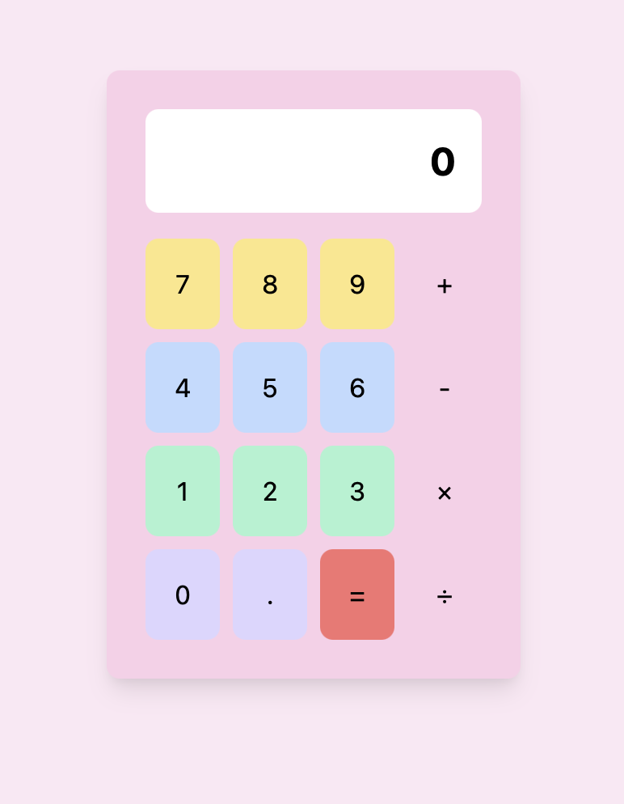
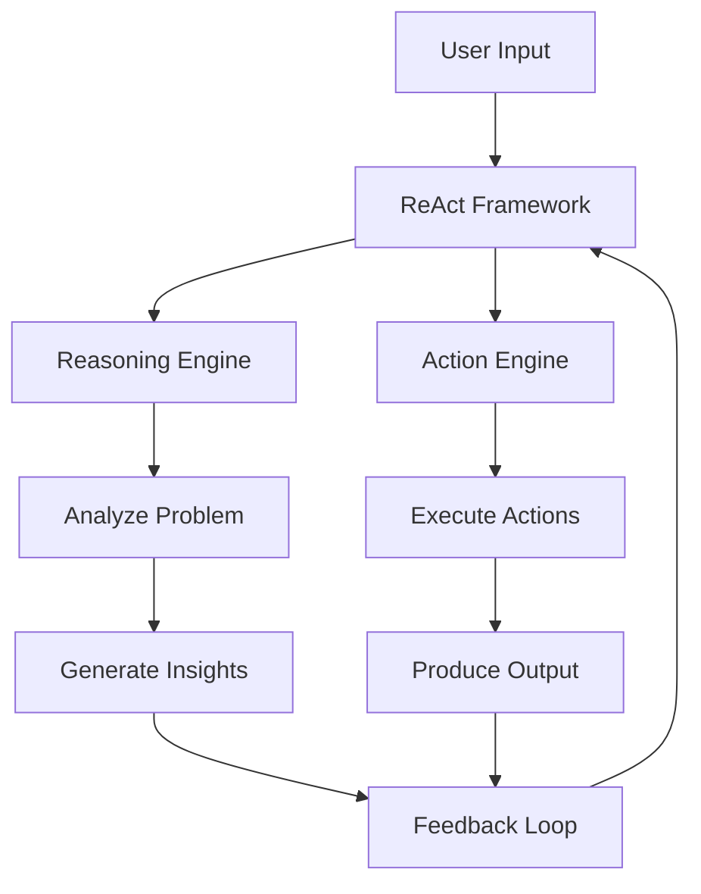
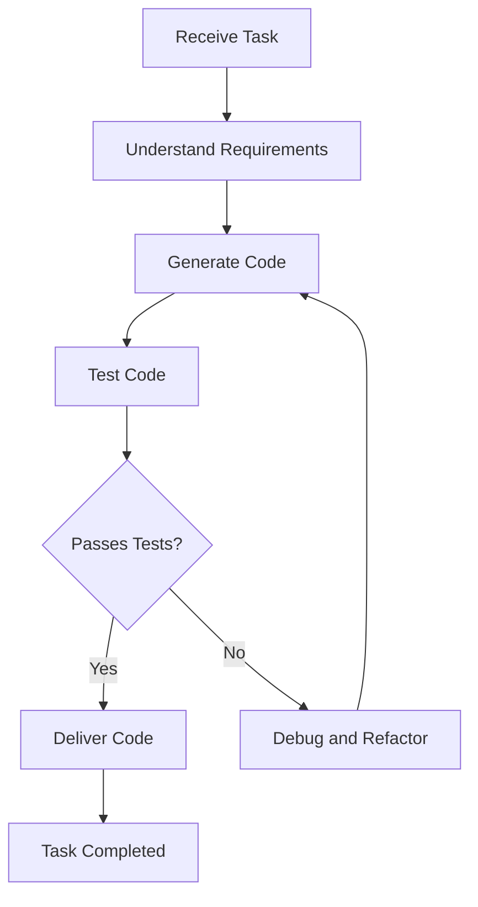

# Building a Coding Agent with the Quantalogic ReAct Framework: A Step-by-Step Guide

In this tutorial, we’ll walk through the process of building a **coding agent** using the **Quantalogic ReAct Framework**. This framework enables you to create intelligent agents that combine **reasoning** (via large language models, or LLMs) with **acting** (via modular tools) to automate complex tasks. By the end of this guide, you’ll have a fully functional coding agent capable of generating HTML, TailwindCSS, and JavaScript code from an image.

## We will cover the creation of an agent that starts with an image such as this:


To generate this:



[Demo 01](./asset/demo01/index.html)

An UX Specification:

[UX Specification](./asset//UX_Specification.md)

---

## **1. Introduction to ReAct Agents and the Quantalogic Framework**

### **What is a ReAct Agent?**
A **ReAct Agent** (Reasoning and Acting Agent) is an intelligent system that combines the reasoning capabilities of LLMs with the ability to execute actions using tools. This paradigm allows the agent to break down complex tasks into smaller, manageable steps, reason about the best course of action, and execute those actions using specialized tools.

For example, a ReAct Agent can analyze an image, extract specifications, generate code, and save the results to a file all in a single workflow.

### **Overview of the Quantalogic ReAct Framework**
The **Quantalogic ReAct Framework** is a powerful toolkit for building ReAct Agents. It provides:
- **Modular tools**: Pre-built tools for file operations, code generation, vision tasks, and more.
- **Event monitoring**: Real-time tracking of agent activities for debugging and observability.
- **Multi-step task execution**: The ability to handle complex workflows with ease only from a single task definition.



**Explanation:**
- The **User Input** is processed by the **ReAct Framework**.
- The **Reasoning Engine** analyzes the problem and generates insights.
- The **Action Engine** executes actions based on the insights.
- The **Feedback Loop** ensures continuous improvement by feeding results back into the framework.

### **Why Use Quantalogic for Building Coding Agents?**
Quantalogic is particularly well-suited for building coding agents because:
- It includes pre-built tools for common tasks like file operations and code generation.
- It’s highly flexible, allowing you to integrate custom tools and models.
- It supports multi-step workflows, making it ideal for automating complex coding tasks.

### **Example Use Case**
In this tutorial, we’ll build a coding agent that:
1. Analyzes an image of a user interface.
2. Generates HTML, TailwindCSS, and JavaScript code based on the image.
3. Saves the generated code to a directory.
4. Verifies the output.

---

## **2. Setting Up the Environment**

### **Prerequisites**
Before we begin, ensure you have the following:
- **Python 3.12+** installed.
- **API keys** for DeepSeek and OpenAI (or other supported LLMs).

**Tested with:**

| Model                        | Type                      | Status |
|------------------------------|---------------------------|--------|
| Claude Sonnet 3.5           | Model and Vision Model     | ✅     |
| DeepSeek 3.0                | Model                     | ✅     |
| OpenAI GPT-4o and GPT-4o-mini | Model and Vision Model     | ✅     |


### **Installing the Quantalogic Framework**
Install the Quantalogic framework using pip:
```bash
pip install quantalogic
```

### **Setting Up API Keys**
Export your API keys as environment variables:
```bash
export DEEPSEEK_API_KEY="your-deepseek-api-key"
export OPENAI_API_KEY="your-openai-api-key"
```

Verify the API keys in your code:
```python
import os

# Verify API keys are set before initialization to prevent runtime failures
# We use separate keys for DeepSeek and OpenAI to maintain service independence
# and allow for future service switching without code changes
if not os.environ.get("DEEPSEEK_API_KEY"):
    raise ValueError("DEEPSEEK_API_KEY environment variable is not set")

if not os.environ.get("OPENAI_API_KEY"):
    raise ValueError("OPENAI_API_KEY environment variable is not set")
```


---

## **3. Creating a Coding Agent**

### **Initializing the Agent**
Start by importing the necessary modules and defining the agent:
```python
from quantalogic import Agent, console_print_events
from quantalogic.tools import (
    ListDirectoryTool,
    LLMVisionTool,
    LLMTool,
    ReadFileBlockTool,
    ReadFileTool,
    ReplaceInFileTool,
    SearchDefinitionNames,
    WriteFileTool,
)

MODEL_NAME = "deepseek/deepseek-chat"
VISION_MODEL_NAME = "openrouter/openai/gpt-4o-mini"

agent = Agent(
    model_name=MODEL_NAME,
    tools=[
        SearchDefinitionNames(),
        RipgrepTool(),
        WriteFileTool(),
        ReadFileTool(),
        ReplaceInFileTool(),
        ReadFileBlockTool(),
        ListDirectoryTool(),
        LLMVisionTool(model_name=VISION_MODEL_NAME),
        LLMTool(model_name=MODEL_NAME, name="product_manager"),
    ],
)
```

### **Event Monitoring**
The Quantalogic framework includes an event monitoring system that tracks all agent activities. To enable real-time tracking, set up a wildcard listener:

```python
agent.event_emitter.on("*", console_print_events)
```

`console_print_events` is a predefined event listener that prints events to the console.


## **4. Example: Generating HTML from an Image**

### **Task Overview**

Our goal is to generate HTML, TailwindCSS, and JavaScript code from an image of a user interface. The agent will:

1. Analyze the image to extract specifications.
2. Generate code based on the specifications.
3. Save the code to a directory.
4. Verify the output.

### **Defining the Task**


Here’s how to define the task for the agent:

```python
result = agent.solve_task("""
        Your task is to create a functional screen code for a user interface.

        1. Create a very detailed UX specification based on this screen picture:

            - UI elements layout
            - UI elements labels, text, icons, images
            - UI elements hierarchy
            - UI elements positioning
            - UI elements width, height
            - Color scheme
            - Font styles
            - Animations

           Image: https://encrypted-tbn0.gstatic.com/images?q=tbn:ANd9GcR6wVcT9YYGkmnIfMXnubAaHgmM_b8DE4IlFA&s
        
        2. Create a functional specification from the UX specification.
        
        3. Create HTML5, TailwindCSS, and pure JavaScript implementation that follow strictly 

            - The functional specification
            - The UX specification

           Save the code to: ./demo01/

           Save the specification to: ./demo01/doc/ux_specification.md
           Save the functional specification to: ./demo01/doc/functional_specification.md

           Check the work done.
        """
)
```

### **Breaking Down the Task**

1. **Analyze the Image**: The `LLMVisionTool` extracts specifications from the image.
2. **Generate Code**: The agent uses the extracted specifications to generate HTML, TailwindCSS, and JavaScript code.
3. **Save the Code**: The `WriteFileTool` saves the generated code to the `demo01/` directory.
4. **Verify the Output**: The `ReadFileTool` and `ListDirectoryTool` verify the output.



**Explanation:**
- The coding agent starts by **Receiving a Task**.
- It **Understands Requirements** and **Generates Code**.
- The code is then **Tested**.
- If the tests pass, the code is **Delivered**; otherwise, the agent **Debugs and Refactors** the code.
- The process repeats until the task is completed.

### **Expected Output**
After running the task, you should see the following in the `demo01/` directory:
- `index.html`: The generated HTML file.
- `styles.css`: The generated TailwindCSS file.
- `script.js`: The generated JavaScript file.

---

## **5. Advanced Features and Customization**

### **Adding Custom Tools**
You can extend the agent’s capabilities by adding custom tools. For example, here’s how to create a tool for linting generated code:
```python
from quantalogic import Tool

class LintCodeTool(Tool):
    def execute(self, code: str) -> str:
        # Custom linting logic
        return linted_code
```

Integrate the custom tool into the agent:
```python
agent = Agent(
    model_name=MODEL_NAME,
    tools=[
        ...,
        LintCodeTool(),
    ],
)
```

### **Switching Models**
You can easily switch between different LLMs. For example, to use GPT-4 instead of DeepSeek:
```python
agent = Agent(model_name="openrouter/openai/gpt-4", tools=[...])
```

### **Extending Event Monitoring**
Add custom event listeners for analytics or logging:
```python
def custom_event_listener(event):
    print(f"Custom Event: {event}")

agent.event_emitter.on("*", custom_event_listener)
```

---

## **6. Conclusion and Next Steps**

### **Recap of Key Points**
- We set up the Quantalogic ReAct Framework and built a coding agent.
- The agent can analyze images, generate code, and save the results to files.
- We explored advanced features like custom tools and event monitoring.

### **Potential Applications**
- Automating frontend development.
- Data processing and analysis.
- Workflow automation.

### **Encouragement to Experiment**
- Try integrating custom tools or models.
- Explore other use cases like API integration or database operations.

### **Resources for Further Learning**
- [Visit Quantalogic Blog](https://www.quantalogic.app/blogs)
- [Quantalogic GitHub Repository](https://github.com/quantalogic/quantalogic)
- Suggested reading: [ReAct Agents and LLM Tooling](https://arxiv.org/abs/2210.03629)

---

By following this guide, you’ve built a powerful coding agent using the Quantalogic ReAct Framework. Experiment with different tools and models to unlock even more possibilities!