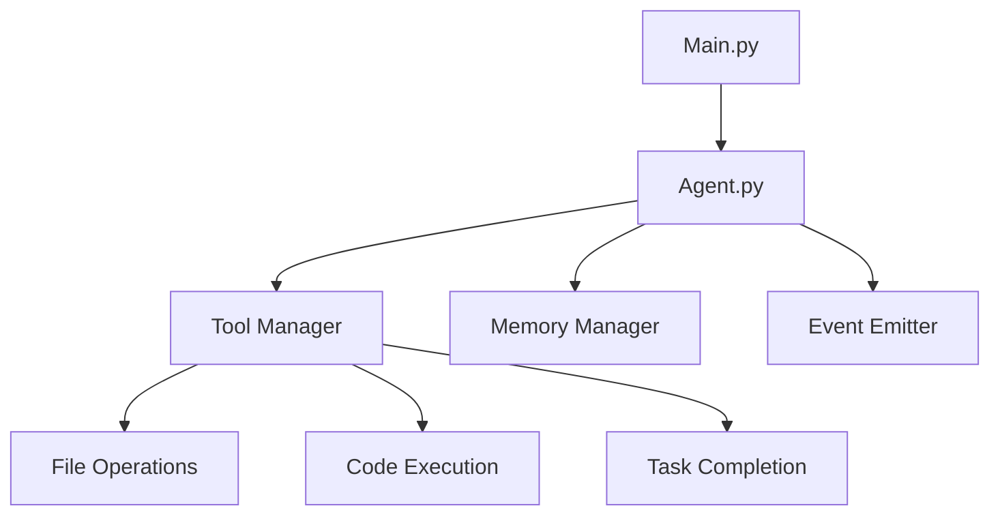
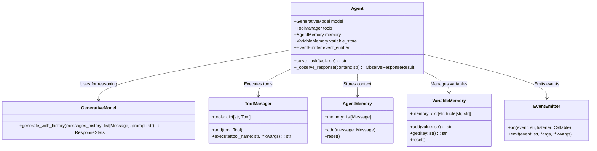
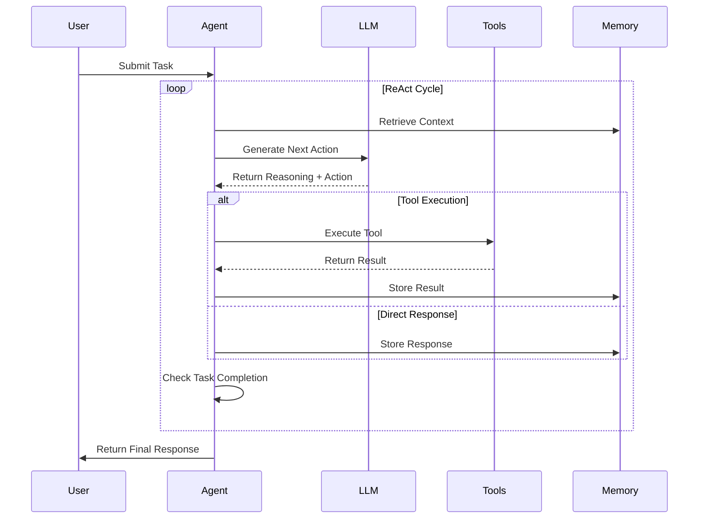
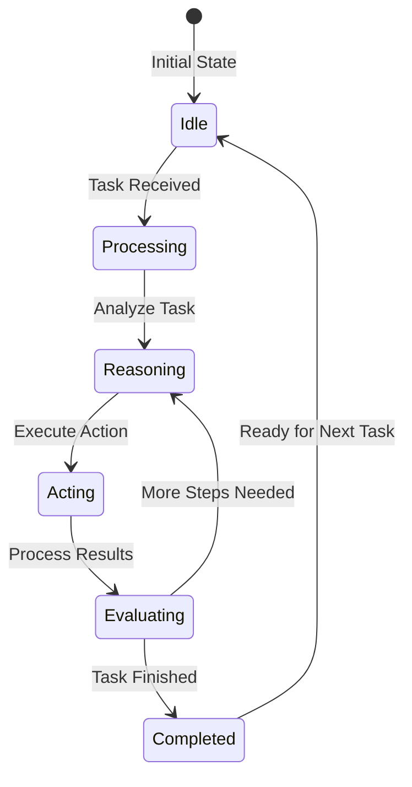
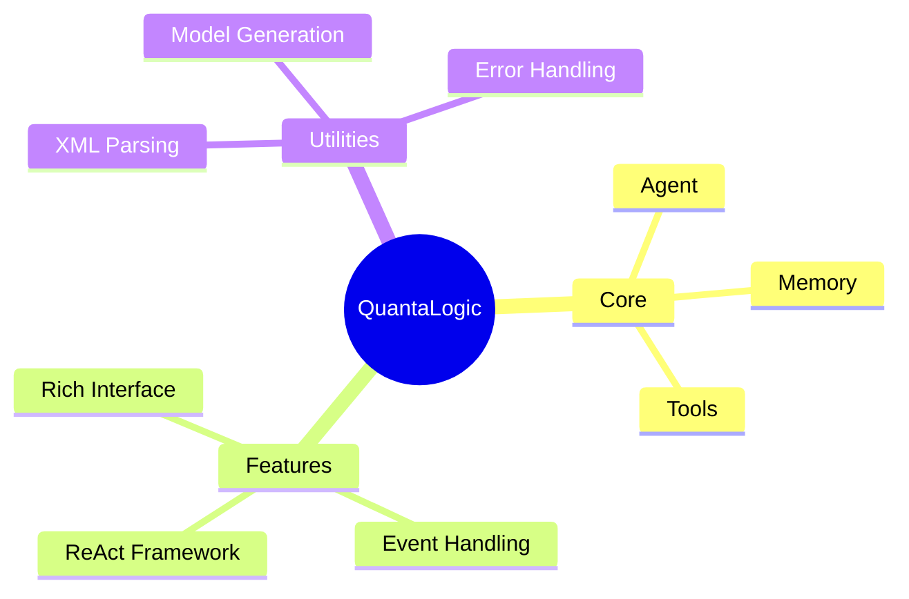

# QuantaLogic AI Agent Documentation

## Table of Contents
- [Overview](#overview)
  - [Key Features](#key-features)
  - [System Architecture](#system-architecture)
- [Core Components](#core-components)
  - [Agent Architecture](#agent-architecture)
    - [Generative Model Integration](#generative-model-integration)
    - [Tool Management](#tool-management)
  - [Memory Management](#memory-management)
    - [Agent Memory](#agent-memory)
    - [Variable Memory](#variable-memory)
  - [Event System](#event-system)
    - [Event Emitter](#event-emitter)
    - [Event Handling](#event-handling)
- [ReAct Framework](#react-framework)
  - [ReAct Cycle](#react-cycle)
    - [Reasoning Phase](#reasoning-phase)
    - [Acting Phase](#acting-phase)
    - [Evaluation Phase](#evaluation-phase)
  - [Implementation Details](#implementation-details)
    - [Message Handling](#message-handling)
    - [XML Format](#xml-format)
- [Built-in Tools](#built-in-tools)
  - [PythonTool](#pythontool)
    - [Usage Examples](#python-tool-examples)
    - [Limitations](#python-tool-limitations)
  - [NodeJsTool](#nodejstool)
    - [Usage Examples](#nodejs-tool-examples)
    - [Limitations](#nodejs-tool-limitations)
  - [ExecuteBashCommandTool](#executebashcommandtool)
    - [Safety Features](#bash-tool-safety)
    - [Usage Guidelines](#bash-tool-guidelines)
  - [ReadFileTool](#readfiletool)
  - [WriteFileTool](#writefiletool)
  - [ListDirectoryTool](#listdirectorytool)
  - [ReplaceInFileTool](#replaceinfiletool)
  - [AgentTool](#agenttool)
  - [LLMTool](#llmtool)
  - [TaskCompleteTool](#taskcompletetool)
  - [InputQuestionTool](#inputquestiontool)
  - [ElixirTool](#elixirtool)
  - [ReadFileBlockTool](#readfileblocktool)
  - [UnifiedDiffTool](#unifieddifftool)
- [Advanced Usage](#advanced-usage)
  - [Tool Chaining](#tool-chaining)
    - [Best Practices](#tool-chaining-best-practices)
    - [Example Workflows](#tool-chaining-examples)
  - [Task Delegation](#task-delegation)
    - [Specialized Agents](#specialized-agents)
    - [Delegation Strategies](#delegation-strategies)
- [Getting Started](#getting-started)
  - [Installation](#installation)
  - [Configuration](#configuration)
  - [First Task](#first-task)
- [License](#license)
- [Community and Support](#community-and-support)
  - [Contributing](#contributing)
  - [Support Channels](#support-channels)
- [Appendices](#appendices)
  - [Technical Details](#technical-details)
    - [System Requirements](#system-requirements)
    - [Performance Metrics](#performance-metrics)
  - [FAQ](#faq)
    - [Installation Issues](#installation-faq)
    - [Usage Questions](#usage-faq)
    - [Troubleshooting](#troubleshooting-faq)

## Overview

The QuantaLogic AI Agent is a powerful AI solution designed to streamline complex task execution through a ReAct-based architecture. It excels in systematic problem-solving by leveraging a rich set of tools and robust memory management. This agent is particularly valuable for developers and organizations looking to automate complex workflows with AI-powered task execution.

### Key Features:

#### ReAct Framework
- Implements the Reasoning and Acting paradigm for iterative task solving
- Provides a systematic approach to problem decomposition and solution generation
- Enables context-aware decision making through memory integration

#### Tool Integration
- Supports a wide range of tools for file operations, code execution, and task management
- Includes Python, Node.js, Bash, and specialized AI tools
- Enables tool chaining for complex workflows

#### Memory Management
- Maintains conversation history and variable storage for context-aware operations
- Supports variable interpolation across tools and tasks
- Provides both short-term and long-term memory capabilities

#### Event System
- Implements a thread-safe event emitter for logging and monitoring
- Supports custom event subscriptions and handlers
- Enables real-time task progress tracking

#### Rich Interface
- Provides visually appealing output using the Rich library
- Includes formatted tables, progress bars, and syntax highlighting
- Enhances user experience with clear and structured output

### Benefits:
- **Increased Productivity**: Automates complex workflows and reduces manual effort
- **Improved Accuracy**: Systematic approach minimizes errors in task execution
- **Enhanced Flexibility**: Modular architecture supports custom tool integration
- **Better Insights**: Detailed logging and monitoring provide valuable execution insights



---

## Core Components

### Agent Architecture

The Agent class is the central orchestrator of the QuantaLogic AI system, responsible for managing the entire task execution lifecycle. It integrates with all major components to provide a cohesive problem-solving environment.

#### Key Responsibilities:
- **Task Management**: Receives and processes user tasks through the ReAct framework
- **Component Coordination**: Manages interactions between tools, memory, and the generative model
- **Execution Flow**: Controls the iterative reasoning and acting cycle
- **State Management**: Maintains task context and execution state

#### Detailed Component Interactions:

**Generative Model Integration**
- The Agent uses the GenerativeModel for reasoning and action generation
- Maintains conversation history for context-aware responses
- Handles model responses and extracts actionable insights

**Tool Management**
- The ToolManager provides access to all available tools
- Handles tool execution and result processing
- Manages tool registration and configuration

**Memory Systems**
- AgentMemory stores conversation history and context
- VariableMemory handles persistent variable storage
- Both memory systems work together to maintain execution state

**Event System**
- The EventEmitter provides logging and monitoring capabilities
- Enables real-time task progress tracking
- Supports custom event subscriptions for extensibility



---

## ReAct Framework Implementation

The ReAct (Reasoning and Acting) framework is the core problem-solving engine of the QuantaLogic AI Agent. It follows a systematic cycle of iterative reasoning and action execution to solve complex tasks.

### ReAct Cycle

The ReAct cycle consists of four main phases that repeat until task completion:

1. **Reasoning**: The agent analyzes the task and context to determine the next action
2. **Acting**: The agent executes the chosen action using appropriate tools
3. **Observing**: The agent processes the results of the action
4. **Evaluating**: The agent determines if the task is complete or if more steps are needed



### ReAct State Diagram

The state diagram illustrates the agent's lifecycle during task execution:



### Detailed Implementation

The `solve_task` method implements the ReAct cycle with detailed error handling and state management:

```python
def solve_task(self, task: str, max_iterations: int = 30) -> str:
    """Solve a task using the ReAct framework.
    
    Args:
        task (str): The task to solve
        max_iterations (int): Maximum number of ReAct cycles
        
    Returns:
        str: Final answer or result of the task
    """
    # Initialize task state
    self.task_to_solve = task
    self.memory.reset()
    self.memory.add(Message(role="system", content=self.config.system_prompt))

    done = False
    current_prompt = self._prepare_prompt_task(task)
    answer = ""

    # Main ReAct loop
    for iteration in range(max_iterations):
        # Generate reasoning and next action
        result = self.model.generate_with_history(
            messages_history=self.memory.memory,
            prompt=current_prompt
        )
        content = result.response

        # Process the response and determine next steps
        result = self._observe_response(content)
        current_prompt = result.next_prompt

        # Check if task is complete
        if result.executed_tool == "task_complete":
            answer = result.answer
            done = True

        # Update memory with current state
        self.memory.add(Message(role="user", content=current_prompt))
        self.memory.add(Message(role="assistant", content=content))

        if done:
            break

    return answer
```

### Key Implementation Details:

1. **Iterative Problem Solving**:
   - The agent breaks down complex tasks into smaller, manageable steps
   - Each iteration refines the solution based on previous results

2. **Context Management**:
   - Maintains conversation history for context-aware reasoning
   - Stores intermediate results for future reference

3. **Error Handling**:
   - Includes maximum iteration limit to prevent infinite loops
   - Validates tool execution results before proceeding

4. **State Tracking**:
   - Maintains task state across iterations
   - Tracks progress towards task completion

### Message Handling in ReAct Cycle

The ReAct agent uses two primary message roles in its conversation history:

1. **User Messages**:
   - Represent task inputs and prompts
   - Contain the current state of the task execution
   - Used to maintain context between iterations
   - Example: `Message(role="user", content=current_prompt)`

2. **Assistant Messages**:
   - Contain the agent's reasoning and actions
   - Store the generated responses from the LLM
   - Maintain the flow of the ReAct cycle
   - Example: `Message(role="assistant", content=content)`

These messages are stored in the AgentMemory and used to:
- Maintain conversation context
- Provide historical reference for the LLM
- Enable iterative problem-solving
- Support variable interpolation and tool chaining

The message system ensures consistent state management throughout the ReAct cycle.

#### XML Format in ReAct Cycle

The LLM generates responses in a specific XML format during each ReAct cycle. Here's an example of the XML structure:

```xml
<thinking>
    <current_objective>Generate next action for task completion</current_objective>
    <context_analysis>Previous steps have identified the need to read a file</context_analysis>
    <next_steps>Execute read_file tool</next_steps>
    <tool_selection>read_file is appropriate for this task</tool_selection>
</thinking>

<read_file>
    <file_path>/path/to/file.txt</file_path>
</read_file>
```

This XML format is used to:
1. Structure the agent's reasoning process
2. Specify the next action to be taken
3. Provide context for the current step
4. Select and parameterize the appropriate tool

#### Example Messages

Here's an example of actual user and assistant messages from the ReAct agent implementation:

```python
# User message
user_msg = Message(
    role="user",
    content="Read the file /path/to/config.txt and extract the API key"
)

# Assistant message
assistant_msg = Message(
    role="assistant",
    content="""<thinking>
    <current_objective>Extract API key from config file</current_objective>
    <context_analysis>Need to read the file first</context_analysis>
    <next_steps>Execute read_file tool</next_steps>
    <tool_selection>read_file is appropriate for this task</tool_selection>
</thinking>
<read_file>
    <file_path>/path/to/config.txt</file_path>
</read_file>"""
)
```

---

## Built-in Tools

QuantaLogic provides a comprehensive set of built-in tools for various operations, each designed to handle specific tasks efficiently. Below is a detailed overview of each tool with examples and use cases:

### 1. PythonTool
Executes Python code in an isolated Docker environment. Ideal for data processing, machine learning tasks, and custom logic implementation.

**Example:**
```python
from quantalogic.tools import PythonTool

python_tool = PythonTool()
result = python_tool.execute(
    script="import pandas as pd; df = pd.DataFrame({'a': [1,2,3]}); print(df.to_json())",
    version="3.11",
    memory_limit="512m"
)
```

**Use Cases:**
- Data analysis and transformation
- Machine learning model training
- Custom algorithm implementation

### 2. NodeJsTool
Executes Node.js code in an isolated environment. Suitable for JavaScript-based tasks and web-related operations.

**Example:**
```python
from quantalogic.tools import NodeJsTool

node_tool = NodeJsTool()
result = node_tool.execute(
    script="const fs = require('fs'); console.log(fs.readFileSync('/path/to/file.txt', 'utf8'))",
    version="20",
    module_type="esm"
)
```

**Use Cases:**
- Web scraping and automation
- JavaScript-based data processing
- API interactions

### 3. ExecuteBashCommandTool
Executes shell commands with safety controls. Useful for system operations and file management.

**Example:**
```python
from quantalogic.tools import ExecuteBashCommandTool

bash_tool = ExecuteBashCommandTool()
result = bash_tool.execute("ls -la", working_dir="/path/to/dir")
```

**Use Cases:**
- File system operations
- System configuration
- Batch processing

### 4. ReadFileTool
Reads the content of a file. Essential for accessing and processing file-based data.

**Example:**
```python
from quantalogic.tools import ReadFileTool

read_tool = ReadFileTool()
result = read_tool.execute(file_path="/path/to/file.txt")
```

**Use Cases:**
- Reading configuration files
- Accessing data files
- Log file analysis

### 5. WriteFileTool
Writes content to a file. Useful for saving results and generating reports.

**Example:**
```python
from quantalogic.tools import WriteFileTool

write_tool = WriteFileTool()
result = write_tool.execute(
    file_path="/path/to/file.txt",
    content="Hello, World!"
)
```

**Use Cases:**
- Saving processed data
- Generating reports
- Logging information

### 6. ListDirectoryTool
Lists contents of a directory. Helpful for directory management and file discovery.

**Example:**
```python
from quantalogic.tools import ListDirectoryTool

list_tool = ListDirectoryTool()
result = list_tool.execute(directory_path="/path/to/dir")
```

**Use Cases:**
- Directory navigation
- File discovery
- Batch processing

### 7. ReplaceInFileTool
Modifies content in a file. Ideal for configuration updates and code modifications.

**Example:**
```python
from quantalogic.tools import ReplaceInFileTool

replace_tool = ReplaceInFileTool()
result = replace_tool.execute(
    path="/path/to/file.txt",
    diff="<<<<<<< SEARCH\nold_content\n=======\nnew_content\n>>>>>>> REPLACE"
)
```

**Use Cases:**
- Configuration updates
- Code modifications
- Template processing

### 8. AgentTool
Delegates tasks to specialized agents. Useful for complex task decomposition and delegation.

**Example:**
```python
from quantalogic.tools import AgentTool

math_agent = AgentTool(
    agent=Agent(model_name="deepseek-chat"),
    agent_role="math_expert"
)
result = math_agent.execute("Solve: 2x + 5 = 15")
```

**Use Cases:**
- Task delegation
- Specialized problem solving
- Complex workflow management

### 9. LLMTool
Interacts with language models. Essential for natural language processing and generation tasks.

**Example:**
```python
from quantalogic.tools import LLMTool

llm_tool = LLMTool()
result = llm_tool.execute(
    prompt="Explain quantum mechanics in simple terms",
    model="gpt-4"
)
```

**Use Cases:**
- Natural language processing
- Content generation
- Language translation

### 10. TaskCompleteTool
Marks task completion. Used to finalize task execution and return results.

**Example:**
```python
from quantalogic.tools import TaskCompleteTool

complete_tool = TaskCompleteTool()
result = complete_tool.execute(answer="The task is complete")
```

**Use Cases:**
- Task finalization
- Result reporting
- Workflow completion

### 11. InputQuestionTool
Prompts user for input. Useful for interactive tasks and user-driven workflows.

**Example:**
```python
from quantalogic.tools import InputQuestionTool

input_tool = InputQuestionTool()
result = input_tool.execute(
    question="What is your favorite color?",
    default="blue"
)
```

**Use Cases:**
- Interactive workflows
- User input collection
- Dynamic task execution

### 12. ElixirTool
Executes Elixir code. Suitable for functional programming tasks and Elixir-based operations.

**Example:**
```python
from quantalogic.tools import ElixirTool

elixir_tool = ElixirTool()
result = elixir_tool.execute(
    script="IO.puts(\"Hello from Elixir!\")",
    version="1.15"
)
```

**Use Cases:**
- Functional programming tasks
- Elixir-based workflows
- Concurrent processing

### 13. ReadFileBlockTool
Reads specific lines from a file. Useful for accessing large files efficiently.

**Example:**
```python
from quantalogic.tools import ReadFileBlockTool

read_block_tool = ReadFileBlockTool()
result = read_block_tool.execute(
    file_path="/path/to/file.txt",
    line_start=10,
    line_end=20
)
```

**Use Cases:**
- Accessing large files
- Efficient data extraction
- Log file analysis

### 14. UnifiedDiffTool
Applies unified diffs to files. Essential for version control and file patching.

### 15. SearchDefinitionNames
Searches for definition names (classes, functions, methods) in a directory using Tree-sitter. Returns the list of definition names grouped by file name, with line numbers. Supports multiple output formats (text, JSON, Markdown).

### 16. RipgrepTool
Search for text patterns in files using ripgrep, supporting regex and file pattern filtering. Provides efficient and fast text search capabilities across large codebases.

**Example:**
```python
from quantalogic.tools import UnifiedDiffTool

diff_tool = UnifiedDiffTool()
result = diff_tool.execute(
    path="/path/to/file.txt",
    diff="--- a/file.txt\n+++ b/file.txt\n@@ -1,3 +1,3 @@\n-old\n+new"
)
```

**Use Cases:**
- Version control
- File patching
- Code updates


### 1. PythonTool
Executes Python code in an isolated Docker environment.

```python
from quantalogic.tools import PythonTool

python_tool = PythonTool()
result = python_tool.execute(
    script="print('Hello from Python!')",
    version="3.11",
    memory_limit="512m"
)
```

### 2. NodeJsTool
Executes Node.js code in an isolated environment.

```python
from quantalogic.tools import NodeJsTool

node_tool = NodeJsTool()
result = node_tool.execute(
    script="console.log('Hello from Node.js!')",
    version="20",
    module_type="esm"
)
```

### 3. ExecuteBashCommandTool
Executes shell commands with safety controls.

```python
from quantalogic.tools import ExecuteBashCommandTool

bash_tool = ExecuteBashCommandTool()
result = bash_tool.execute("ls -la", working_dir="/path/to/dir")
```

### 4. ReadFileTool
Reads the content of a file.

```python
from quantalogic.tools import ReadFileTool

read_tool = ReadFileTool()
result = read_tool.execute(file_path="/path/to/file.txt")
```

### 5. WriteFileTool
Writes content to a file.

```python
from quantalogic.tools import WriteFileTool

write_tool = WriteFileTool()
result = write_tool.execute(
    file_path="/path/to/file.txt",
    content="Hello, World!"
)
```

### 6. ListDirectoryTool
Lists contents of a directory.

```python
from quantalogic.tools import ListDirectoryTool

list_tool = ListDirectoryTool()
result = list_tool.execute(directory_path="/path/to/dir")
```

### 7. ReplaceInFileTool
Modifies content in a file.

```python
from quantalogic.tools import ReplaceInFileTool

replace_tool = ReplaceInFileTool()
result = replace_tool.execute(
    path="/path/to/file.txt",
    diff="<<<<<<< SEARCH\nold_content\n=======\nnew_content\n>>>>>>> REPLACE"
)
```

### 8. AgentTool
Delegates tasks to specialized agents.

```python
from quantalogic.tools import AgentTool

math_agent = AgentTool(
    agent=Agent(model_name="deepseek-chat"),
    agent_role="math_expert"
)
result = math_agent.execute("Solve: 2x + 5 = 15")
```

### 9. LLMTool
Interacts with language models.

```python
from quantalogic.tools import LLMTool

llm_tool = LLMTool()
result = llm_tool.execute(
    prompt="Explain quantum mechanics in simple terms",
    model="gpt-4"
)
```

### 10. TaskCompleteTool
Marks task completion.

```python
from quantalogic.tools import TaskCompleteTool

complete_tool = TaskCompleteTool()
result = complete_tool.execute(answer="The task is complete")
```

### 11. InputQuestionTool
Prompts user for input.

```python
from quantalogic.tools import InputQuestionTool

input_tool = InputQuestionTool()
result = input_tool.execute(
    question="What is your favorite color?",
    default="blue"
)
```

### 12. ElixirTool
Executes Elixir code.

```python
from quantalogic.tools import ElixirTool

elixir_tool = ElixirTool()
result = elixir_tool.execute(
    script="IO.puts(\"Hello from Elixir!\")",
    version="1.15"
)
```

### 13. ReadFileBlockTool
Reads specific lines from a file.

```python
from quantalogic.tools import ReadFileBlockTool

read_block_tool = ReadFileBlockTool()
result = read_block_tool.execute(
    file_path="/path/to/file.txt",
    line_start=10,
    line_end=20
)
```

### 14. UnifiedDiffTool
Applies unified diffs to files.

```python
from quantalogic.tools import UnifiedDiffTool

diff_tool = UnifiedDiffTool()
result = diff_tool.execute(
    path="/path/to/file.txt",
    diff="--- a/file.txt\n+++ b/file.txt\n@@ -1,3 +1,3 @@\n-old\n+new"
)
```

---

## Memory Management

The memory system consists of two components that work together to maintain context and state during task execution:

### Variable Interpolation
The ReAct agent supports variable interpolation throughout its operation. Variables can be referenced using the format `$variable_name$` in tool parameters and responses. The agent automatically resolves these references by looking up values in its VariableMemory store. This feature enables dynamic content generation and parameter passing between tools.

**Step-by-Step Example:**

1. **Storing a Value:**
   ```python
   from quantalogic.memory import VariableMemory
   
   vars = VariableMemory()
   api_key = "12345-ABCDE"
   key = vars.add(api_key)  # Returns unique key
   ```

2. **Retrieving a Value:**
   ```python
   stored_value = vars.get(key)
   print(f"Retrieved API Key: {stored_value}")
   ```

3. **Using Interpolation:**
   ```python
   from quantalogic.tools import WriteFileTool
   
   write_tool = WriteFileTool()
   result = write_tool.execute(
       file_path="/path/to/config.txt",
       content="API_KEY=$key$"
   )
   ```

4. **Clearing Variables:**
   ```python
   vars.reset()  # Clears all stored variables
   ```

### 1. AgentMemory
Stores conversation history and maintains context across task iterations.

**Example Usage:**
```python
from quantalogic.memory import AgentMemory, Message

memory = AgentMemory()

# Add user message
memory.add(Message(role="user", content="What's the weather today?"))

# Add assistant response
memory.add(Message(role="assistant", content="Let me check the weather forecast."))

# Reset memory
memory.reset()
```

### 2. VariableMemory
Manages persistent variable storage and enables data sharing between tools.

**Key Features:**
- **Secure Storage**: Variables are stored securely with unique keys
- **Dynamic Access**: Variables can be accessed and updated during task execution
- **Scope Management**: Variables persist across tool executions but can be cleared when needed

**Advanced Usage Example:**
```python
from quantalogic.memory import VariableMemory

vars = VariableMemory()

# Store multiple values
config_key = vars.add({"api_key": "12345", "endpoint": "https://api.example.com"})
user_data = vars.add({"name": "John", "preferences": {"theme": "dark"}})

# Retrieve and use nested data
config = vars.get(config_key)
print(f"API Endpoint: {config['endpoint']}")

# Update variable
user = vars.get(user_data)
user['preferences']['theme'] = 'light'
vars.update(user_data, user)

# Clear all variables
vars.reset()
```

**Best Practices:**
- Use descriptive variable names for better code readability
- Clear variables when they are no longer needed to free up memory
- Use structured data (dictionaries, lists) for complex configurations

---

## Event System

The event system provides a robust mechanism for monitoring and reacting to various states and activities within the QuantaLogic AI Agent. It implements a thread-safe publish/subscribe pattern that enables real-time tracking and response to system events.

### Key Features:
- **Thread-Safe Operation**: Ensures reliable event handling in multi-threaded environments
- **Flexible Event Handling**: Supports multiple listeners for the same event
- **Rich Event Data**: Allows passing complex data structures with events
- **Lifecycle Tracking**: Provides events for all major system activities

### Core Concepts:

1. **Event Emitter**:
   - Central hub for event management
   - Handles event registration and dispatching
   - Maintains listener subscriptions

2. **Event Listeners**:
   - Functions that respond to specific events
   - Can be synchronous or asynchronous
   - Receive event-specific data

3. **Event Types**:
   - System-defined events (e.g., task_start, task_complete)
   - Custom events for application-specific needs

### Example Usage:

**Basic Event Handling:**
```python
from quantalogic.event_emitter import EventEmitter

# Create event emitter instance
emitter = EventEmitter()

# Define event handler
@emitter.on("task_start")
def handle_task_start(data):
    print(f"Task {data['task_id']} started at {data['timestamp']}")

# Emit an event
emitter.emit("task_start", {
    "task_id": 123,
    "timestamp": "2024-01-01T12:00:00Z"
})
```

**Advanced Features:**

1. **Multiple Listeners:**
   ```python
   @emitter.on("task_complete")
   def log_completion(data):
       print(f"Task {data['task_id']} completed")

   @emitter.on("task_complete")
   def update_dashboard(data):
       dashboard.update_task_status(data['task_id'], 'completed')
   ```

2. **Error Handling:**
   ```python
   @emitter.on("task_error")
   def handle_error(data):
       print(f"Error in task {data['task_id']}: {data['error']}")
       # Implement recovery logic here
   ```

3. **Custom Events:**
   ```python
   @emitter.on("custom_event")
   def handle_custom(data):
       print(f"Custom event received: {data}")

   emitter.emit("custom_event", {"message": "Hello from custom event"})
   ```

4. **Event Removal:**
   ```python
   # Remove specific listener
   emitter.off("task_complete", log_completion)

   # Remove all listeners for an event
   emitter.remove_all_listeners("task_complete")
   ```

### Built-in Events:

| Event Name        | Description                          | Data Structure                     |
|-------------------|--------------------------------------|------------------------------------|
| `task_start`      | Triggered when a task starts         | `{'task_id': str, 'timestamp': str}` |
| `task_complete`   | Triggered when a task completes      | `{'task_id': str, 'result': any}`   |
| `task_error`      | Triggered when a task fails          | `{'task_id': str, 'error': str}`    |
| `tool_execute`    | Triggered when a tool is executed    | `{'tool_name': str, 'params': dict}`|
| `memory_update`   | Triggered when memory is updated     | `{'key': str, 'value': any}`        |

### Best Practices:
- Use descriptive event names for better code readability
- Keep event handlers focused on single responsibilities
- Implement proper error handling in event listeners
- Clean up unused event listeners to prevent memory leaks
- Use structured data for event payloads

---

## Example Workflow

### Task: Read and Modify a File

```python
from quantalogic.agent import Agent

agent = Agent(model_name="openrouter/deepseek/deepseek-chat")
result = agent.solve_task("""
    Read the file /path/to/file.txt and replace all occurrences of 'foo' with 'bar'.
""")
print(result)
```

---

## Advanced Usage

### Tool Chaining
Tools can be chained together for complex operations:

```python
# Execute Python code and process with Node.js
python_result = python_tool.execute("print('Hello from Python')")
node_tool.execute(f"""
    const pythonOutput = `{python_result}`;
    console.log('Processing Python output:', pythonOutput);
""")
```

### Task Delegation
Use `AgentTool` for specialized task delegation:

```python
from quantalogic.tools import AgentTool

math_agent = AgentTool(
    agent=Agent(model_name="deepseek-chat"),
    agent_role="math_expert"
)
result = math_agent.execute("Solve: 2x + 5 = 15")
```

---

## Conclusion

The QuantaLogic AI Assistant is a powerful framework for systematic problem-solving. Its modular architecture, rich toolset, and event-driven design make it highly adaptable for various use cases.



### Getting Started:
1. Install dependencies: `pip install -r requirements.txt`
2. Run the assistant: `python main.py`
3. Provide tasks in XML format for execution

### License:
This project is licensed under the Apache 2 License. See LICENSE for details.
