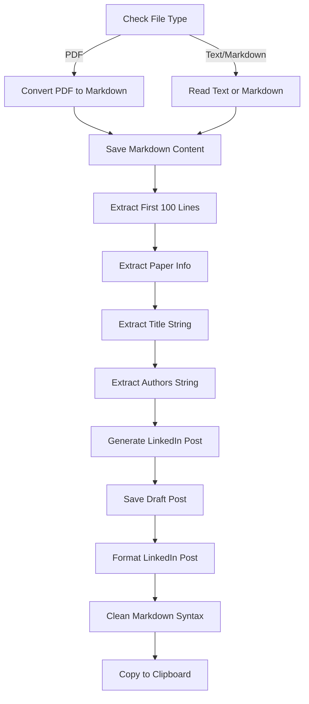
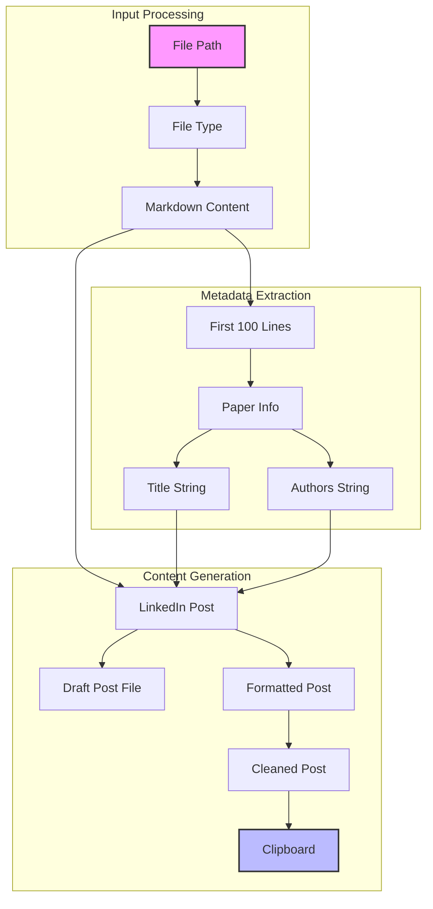

# Paper Analyzer: Convert Research Papers to LinkedIn Posts

This tutorial explains how to use the `analyze_paper.py` script to convert academic papers (PDF, Markdown, or text) into engaging LinkedIn posts using QuantaLogic's Flow framework.

## Overview

The Paper Analyzer is a powerful workflow that:

1. Extracts content from research papers (PDF, Markdown, or text files)
2. Identifies the paper's title and authors
3. Generates a well-structured LinkedIn post summarizing the paper
4. Formats the post for LinkedIn publishing
5. Copies the final content to your clipboard (optional)

The tool leverages Large Language Models (LLMs) for each step of the process, creating high-quality, engaging content ready for professional sharing.

## Prerequisites

### Python Dependencies

The script requires Python 3.12+ and the following packages:
- loguru
- litellm
- pydantic
- asyncio
- jinja2
- py-zerox
- pdf2image
- pillow
- quantalogic
- instructor
- typer
- rich
- pyperclip

### System Dependencies

- **poppler** (for pdf2image): 
  - macOS: `brew install poppler`
  - Linux: `apt-get install poppler-utils`

## Installation

The script uses [uv](https://github.com/astral-sh/uv) for dependency management. When you run the script for the first time, it will automatically install all required dependencies.

## Usage

### Basic Usage

```bash
python analyze_paper.py /path/to/your/paper.pdf
```

### Advanced Options

```bash
python analyze_paper.py /path/to/your/paper.pdf \
  --text-extraction-model "gemini/gemini-2.0-flash" \
  --cleaning-model "gemini/gemini-2.0-flash" \
  --writing-model "openrouter/deepseek/deepseek-r1" \
  --output-dir "/path/to/output" \
  --max-character-count 3000 \
  --copy-to-clipboard-flag
```

### Command Line Arguments

| Argument | Description | Default |
|----------|-------------|---------|
| `file_path` | Path to the file (PDF, .txt, or .md) | (Required) |
| `--text-extraction-model` | LLM model for PDF text extraction | gemini/gemini-2.0-flash |
| `--cleaning-model` | LLM model for title/author extraction | gemini/gemini-2.0-flash |
| `--writing-model` | LLM model for article writing and formatting | openrouter/deepseek/deepseek-r1 |
| `--output-dir` | Directory to save output files | Current directory |
| `--save / --no-save` | Save output to a markdown file | True |
| `--copy-to-clipboard-flag / --no-copy-to-clipboard-flag` | Copy the final post to clipboard | True |
| `--max-character-count` | Maximum character count for the LinkedIn post | 3000 |

## How It Works

The script uses QuantaLogic's Flow framework to create a directed workflow of nodes, each performing a specific task in the conversion process.

### Workflow Architecture



### Node Functions

Each node in the workflow performs a specific function:

#### 1. Input Processing Nodes

- **check_file_type**: Determines if the input is PDF, text, or Markdown
- **convert_pdf_to_markdown**: Uses vision models to extract text from PDFs
- **read_text_or_markdown**: Reads content from text or Markdown files
- **save_markdown_content**: Saves the extracted content to a file

#### 2. Metadata Extraction Nodes

- **extract_first_100_lines**: Gets the first 100 lines for metadata extraction
- **extract_paper_info**: Uses structured LLM output to identify title and authors
- **extract_title_str**: Extracts the title from the paper info
- **extract_authors_str**: Extracts the authors from the paper info

#### 3. Content Generation Nodes

- **generate_linkedin_post**: Creates a draft LinkedIn post using an LLM
- **save_draft_post_content**: Saves the draft post to a file
- **format_linkedin_post**: Formats the post for LinkedIn publishing
- **clean_markdown_syntax**: Removes any remaining Markdown syntax
- **copy_to_clipboard**: Copies the final content to the clipboard

### Data Flow Diagram



## Implementation Details

### LLM Node Types

The workflow uses two types of LLM nodes:

1. **Standard LLM Nodes**: Process text using prompts and return unstructured text
   ```python
   @Nodes.llm_node(
       system_prompt="You are an AI expert who enjoys sharing interesting papers...",
       output="draft_post_content",
       prompt_template="..."
   )
   ```

2. **Structured LLM Nodes**: Return structured data using Pydantic models
   ```python
   @Nodes.structured_llm_node(
       system_prompt="You are an AI assistant tasked with extracting...",
       output="paper_info",
       response_model=PaperInfo,
       prompt_template="..."
   )
   ```

### Workflow Definition

The workflow is defined using QuantaLogic's Flow framework:

```python
def create_file_to_linkedin_workflow() -> Workflow:
    wf = Workflow("check_file_type")
    
    # Add nodes with input mappings
    wf.node("check_file_type")
    wf.node("convert_pdf_to_markdown", inputs_mapping={"model": "text_extraction_model"})
    # ... more nodes ...
    
    # Define branching logic
    wf.branch([
        ("convert_pdf_to_markdown", lambda ctx: ctx["file_type"] == "pdf"),
        ("read_text_or_markdown", lambda ctx: ctx["file_type"] in ["text", "markdown"])
    ])
    
    # Define transitions
    wf.transitions["convert_pdf_to_markdown"] = [("save_markdown_content", None)]
    # ... more transitions ...
    
    return wf
```

## Output Files

The script generates several output files:

1. **Extracted Markdown** (`your_file.extracted.md`): The raw content extracted from the input file
2. **Draft LinkedIn Post** (`your_file.draft.md`): The draft LinkedIn post before final formatting
3. **Clipboard Content**: The final formatted post is copied to your clipboard (if enabled)

## Example

### Input: Research Paper PDF

A research paper about machine learning algorithms.

### Output: LinkedIn Post

```
Curious how recent advances in transformer models are reshaping NLP applications?

👉 A new paper "Attention Is All You Need" by Vaswani et al. introduces a groundbreaking architecture that eliminates recurrence and convolutions entirely.

👉 The key innovation is the "self-attention mechanism" that directly models relationships between all words in a sentence, regardless of their positions.

👉 Results show transformers outperform RNNs and CNNs on translation tasks while being more parallelizable and requiring less training time.

What I found most interesting is how this architecture has become the foundation for models like BERT, GPT, and T5 that have revolutionized language understanding.

What applications of transformer models are you most excited about?

#NLP #MachineLearning #Transformers
```

## Customization

### Using Different Models

You can customize which LLM models are used for each stage of the process:

- **Text Extraction**: Models with vision capabilities (e.g., GPT-4V, Gemini)
- **Cleaning/Formatting**: Faster models for simpler tasks
- **Writing**: More powerful models for creative content generation

### Modifying the Post Format

To customize the LinkedIn post format, modify the prompt templates in:
- `generate_linkedin_post()`: Controls the overall post structure
- `format_linkedin_post()`: Controls the final formatting

## Troubleshooting

### Common Issues

1. **PDF Extraction Fails**: Try a different text extraction model or check if the PDF is scanned/image-based
2. **Title/Author Extraction Incorrect**: Check the first 100 lines of the extracted content
3. **Post Too Long**: Adjust the `max_character_count` parameter

### Logging

The script uses loguru for detailed logging. Check the logs for information about each step of the process.

## Advanced: Extending the Workflow

You can extend the workflow by adding new nodes:

1. Define a new node function with the `@Nodes.define` or `@Nodes.llm_node` decorator
2. Add the node to the workflow in `create_file_to_linkedin_workflow()`
3. Update the transitions to include your new node

## Conclusion

The Paper Analyzer demonstrates the power of QuantaLogic's Flow framework for creating complex, multi-step workflows that leverage LLMs. By breaking down the process into discrete steps, the workflow can handle different file types, extract metadata, and generate high-quality content suitable for professional sharing.
