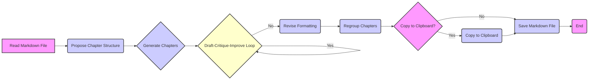
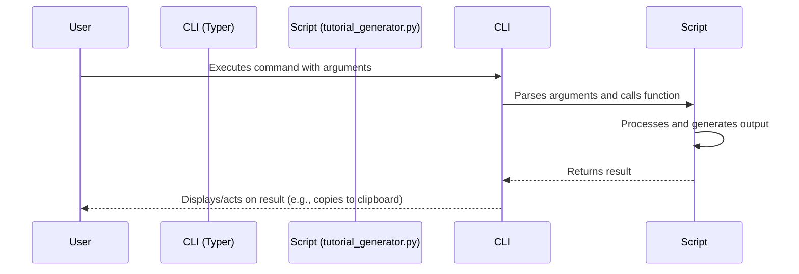
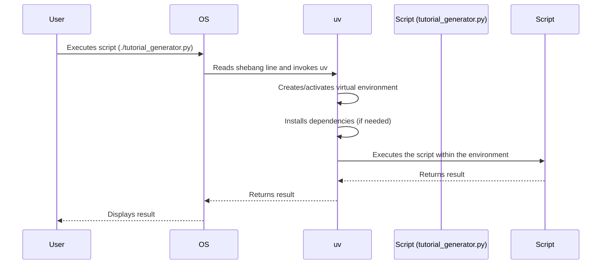
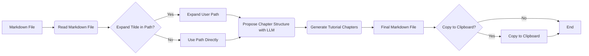
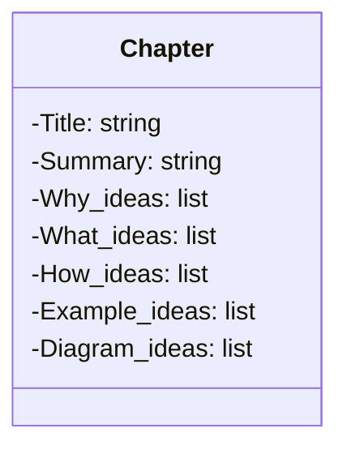
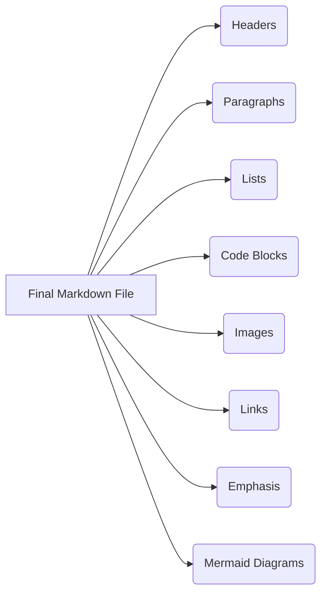

# Tutorial: Generating Engaging Tutorials with flow.py from Markdown

## Chapter 1: Introduction to Tutorial Generation with flow.py

This chapter introduces the tutorial's objective: creating an engaging tutorial from a markdown file using `quatalogic flow.py`, drawing inspiration from `story_generator.py`. It outlines the prerequisites, input parameters, workflow steps, output, and recommendations for creating an engaging and reader-friendly tutorial.

This section explores the motivations behind creating a tutorial generation system from a markdown file using `quatalogic flow.py`. We'll delve into the benefits of this approach and the reasons for adopting specific technologies and design principles.

### Why create a tutorial from a markdown file?

Imagine you have a wealth of knowledge captured in a dense, technical markdown document. While the information is there, it might not be easily digestible for someone new to the topic. Converting this raw knowledge into a well-structured, engaging tutorial can significantly broaden its reach and impact.

- **Accessibility:** Markdown is a simple, ubiquitous format. Many technical professionals already use it for documentation. Leveraging existing markdown files allows us to easily transform static content into dynamic learning experiences.
- **Scalability:** Automating the tutorial generation process allows us to rapidly create educational material for various topics, scaling knowledge dissemination efforts.
- **Maintainability:** Updating the source markdown file automatically updates the generated tutorial, ensuring consistency and reducing maintenance overhead.
- **Engagement:** A well-crafted tutorial, with clear explanations, examples, and visualizations, keeps the reader engaged and facilitates deeper understanding.

Think of it like this: the markdown file is the raw ore, and the tutorial is the refined gold. We're building a refinery to extract the value and present it in a beautiful, accessible form.

### Why use `quatalogic flow.py`?

`quatalogic flow.py` provides a powerful and flexible framework for orchestrating complex workflows. When we have a task broken down into smaller steps, `flow.py` can help us define and manage the order and dependencies of these steps.

- **Workflow Management:** Tutorial generation involves multiple steps, from parsing the markdown to generating drafts, incorporating feedback, and finalizing the output. `flow.py` helps us define and manage this complex workflow.
- **Modularity:** `flow.py` encourages modular design, allowing us to easily swap out components or modify the workflow without affecting the entire system. For example, we can easily change the LLM used for generating drafts.
- **Reproducibility:** By defining the workflow in code, we ensure that the tutorial generation process is reproducible, eliminating ambiguity and errors.
- **Observability:** `flow.py` provides tools for monitoring the workflow's execution, allowing us to identify and resolve bottlenecks or errors.

### Why use `story_generator.py` as an example?

`story_generator.py` demonstrates how to use `quatalogic flow.py` to generate creative content. By drawing inspiration from it, we can leverage its techniques for generating engaging and informative tutorial content.

- **Proven Workflow:** `story_generator.py` provides a working example of a complex content generation workflow using `flow.py`.
- **Adaptability:** The core concepts of `story_generator.py` can be adapted to tutorial generation, such as using LLMs for content creation and incorporating feedback loops.
- **Inspiration:** It serves as a source of inspiration for designing the tutorial generation workflow and incorporating creative elements.

### Why make the tutorial engaging and reader-friendly?

A tutorial that is dry and difficult to follow will fail to achieve its objective: to educate and empower the reader. Engagement and readability are crucial for effective learning.

- **Improved Comprehension:** Engaging content keeps the reader's attention and facilitates deeper understanding.
- **Increased Retention:** Readers are more likely to remember and apply the information presented in an engaging and reader-friendly manner.
- **Positive Learning Experience:** A positive learning experience encourages the reader to continue learning and exploring the topic.
- **Wider Audience:** Engaging and accessible tutorials can reach a wider audience, including those who might be intimidated by technical jargon.

## What

This section defines the objectives, prerequisites, inputs, workflow, and outputs of the tutorial generation system.

### What is the objective of the tutorial?

The primary objective is to create an engaging and reader-friendly tutorial from a given markdown file using `quatalogic flow.py`.

### What are the prerequisites?

Before using the tutorial generation system, you'll need the following:

- **Python Environment:** A working Python environment (preferably using a virtual environment).
- **Typer:** Installed for command-line interface (CLI) creation. `pip install typer`
- **quatalogic.flow:** Installed for workflow management. `pip install quantalogic`
- **uv:** Used to start the script with a shebang.
- **LLM API Key:** Access to a Large Language Model (LLM) API (e.g., OpenAI, Cohere) and the corresponding API key.
- **Markdown File:** A markdown file containing the content to be converted into a tutorial.

### What are the input parameters?

The system accepts the following input parameters:

- **Markdown File Path:** The path to the markdown file (supports tilde expansion, local and full paths).
- **LLM Model Name:** The name of the LLM model to use (e.g., `gpt-3.5-turbo`, `gpt-4`).
- **Number of Chapters (Optional):** The desired number of chapters in the tutorial (default: 5).
- **Words per Chapter (Optional):** The desired number of words per chapter (default: 2000).
- **Copy to Clipboard (Optional):** A flag indicating whether to copy the final result to the clipboard.

### What is the workflow?

The tutorial generation workflow consists of the following steps:



1.  **Read the Markdown File:** Read the content of the input markdown file.
2.  **Propose Chapter Structure:** Use the LLM to propose a structure for the tutorial, organized into chapters, each with a title, summary, and ideas for "Why," "What," "How," examples, and Mermaid diagrams.
3.  **Generate Chapters:** Generate the tutorial chapter by chapter, using the chapter structure and the full content of the markdown file as input.
    - **Draft Chapter:** Generate a draft of the chapter using the LLM.
    - **Critique Chapter:** Critique the draft chapter, identifying areas for improvement.
    - **Improve Chapter:** Improve the draft chapter based on the critique. This loop continues until the chapter meets the desired quality.
4.  **Revise Formatting:** As a book editor, revise the formatting of each chapter to make it more engaging and reader-friendly.
5.  **Regroup Chapters:** Regroup each chapter into a final markdown file.
6.  **Copy to Clipboard (Optional):** If the "copy to clipboard" option is selected, copy the final result to the clipboard.
7.  **Save Markdown File:** Save the final markdown file along with the original markdown file.

### What is the output?

The system produces the following output:

- **Final Markdown File:** A markdown file containing the complete tutorial, structured into chapters with "Why," "What," and "How" sections, examples, and Mermaid diagrams.
- **Clipboard Content (Optional):** The content of the final markdown file copied to the clipboard (if the option is selected).

### What are the recommendations?

To create an effective tutorial, consider the following recommendations:

- **Engagement:** Use emojis, emotions, and storytelling to make the tutorial engaging.
- **Readability:** Use markdown formatting (headings, lists, code blocks, etc.) to make the tutorial reader-friendly.
- **Visualizations:** Use Mermaid diagrams to represent complex concepts visually.
- **Private Insights:** Include personal experiences and insights to make the tutorial more relatable and engaging.

## How

This section describes the key steps involved in building the tutorial generation system.

### How to read the markdown file

Use Python's built-in file I/O functions to read the content of the markdown file. Handle potential errors, such as file not found or invalid file format.

```python
def read_markdown_file(file_path: str) -> str:
    """Reads the content of a markdown file."""
    try:
        with open(file_path, "r") as f:
            content = f.read()
        return content
    except FileNotFoundError:
        raise FileNotFoundError(f"File not found: {file_path}")
    except Exception as e:
        raise Exception(f"Error reading file: {e}")
```

### How to propose a structure for the tutorial

Use the LLM to generate a chapter structure based on the markdown file's content. The structure should include a title, summary, and ideas for "Why," "What," "How," examples, and Mermaid diagrams for each chapter.

### How to generate a draft chapter

Use the LLM to generate a draft chapter based on the chapter structure and the markdown file's content. Provide clear instructions to the LLM regarding the desired tone, style, and level of detail.

### How to critique the draft chapter

Develop a set of criteria for evaluating the draft chapter, such as clarity, accuracy, engagement, and readability. Use these criteria to identify areas for improvement.

### How to improve the draft chapter

Based on the critique, use the LLM to revise the draft chapter. Provide specific instructions to the LLM regarding the changes to be made.

### How to regroup each chapter in a final markdown file

Concatenate the content of each chapter into a single markdown file, adding appropriate headings and formatting.

### How to copy the final result to clipboard

Use a library like `pyperclip` to copy the content of the final markdown file to the clipboard.

### How to save the final markdown file

Use Python's file I/O functions to save the final markdown file to disk.

## Example Ideas

(Examples will be added in subsequent chapters)

## Diagram Ideas

(Diagrams will be added in subsequent chapters)

---

## Chapter 2: Prerequisites: Typer, flow.py, and uv Shebang

- Create an engaging tutorial from the markdown file

## Prerequisites

- use typer of for cli
- use quantalogic.flow for workflow
- use uv shebang to start the script

## Introduction

Before we dive into the heart of creating dynamic tutorials from Markdown files using `quanalogic.flow`, let's lay the groundwork by understanding the essential tools we'll be using. This chapter acts as a preparation stage, introducing you to `Typer` for building our command-line interface (CLI), `quanalogic.flow` for managing our workflow, and the `uv` shebang for seamless script execution. Think of this as gathering your tools and sharpening them before embarking on a complex woodworking project. Without the right tools, the job becomes significantly harder, if not impossible.

### Why Use Typer for CLI?

Imagine trying to control a sophisticated machine without any buttons or levers. That's essentially what it's like trying to interact with a complex program without a well-defined CLI. `Typer` provides a clean, Pythonic way to create these interfaces.

- **Why a CLI at all?** CLIs offer several advantages: they are scriptable, composable (you can chain commands together), and often more efficient for experienced users than graphical interfaces.
- **Why Typer over other CLI libraries?** `Typer` is built on top of Python type hints, making it incredibly easy to define your CLI and benefit from automatic validation and documentation. It's like having a coding assistant that catches errors before you even run your program.
- **Why this is important for our tutorial generator:** We need a way to specify the input Markdown file, the LLM model to use, the number of chapters, and other options. `Typer` allows us to do this in an organized and user-friendly manner.

### What is Typer?

`Typer` is a Python library for building CLI applications. It's designed to be easy to use, even for those new to CLI development. It leverages Python's type hints to automatically generate help messages, validate input, and convert data types. In essence, `Typer` takes the pain out of CLI development, allowing you to focus on the core logic of your application.

### How to Use Typer for CLI

Let's illustrate how to use `Typer` with a simple example. Suppose we want to create a CLI tool that takes a Markdown file path as input.

```python
import typer

app = typer.Typer()

@app.command()
def generate_tutorial(
    markdown_file: str = typer.Option(..., help="Path to the Markdown file."),
    model: str = typer.Option("gpt-3.5-turbo", help="The LLM model to use."),
    chapters: int = typer.Option(5, help="Number of chapters to generate."),
    words_per_chapter: int = typer.Option(2000, help="Target words per chapter."),
    copy_to_clipboard: bool = typer.Option(False, help="Copy the final result to clipboard.")
):
    """
    Generates a tutorial from a Markdown file. 🚀
    """
    print(f"Generating tutorial from: {markdown_file}")
    print(f"Using model: {model}")
    print(f"Chapters: {chapters}")
    print(f"Words per chapter: {words_per_chapter}")
    print(f"Copy to clipboard: {copy_to_clipboard}")

if __name__ == "__main__":
    app()
```

In this example:

1.  We import the `typer` library.
2.  We create a `Typer` app instance.
3.  We define a function `generate_tutorial` decorated with `@app.command()`. This makes it a command that can be executed from the CLI.
4.  Inside the function, we define arguments using `typer.Option()`. The `...` indicates that the argument is required. We also provide helpful messages using the `help` parameter.
5.  The function simply prints the values of the arguments.

To run this script, save it as `tutorial_generator.py` and execute it from your terminal:

```bash
python tutorial_generator.py --markdown-file my_tutorial.md --model gpt-4 --chapters 3
```

Typer handles the parsing of these arguments and provides a nice help message if you run the script with `--help`.

```bash
python tutorial_generator.py --help
```

### Example of Typer CLI command

Here's a concrete example of how a user might interact with our `Typer`-based CLI:

```bash
python tutorial_generator.py --markdown-file "~/Documents/my_story.md" --model "gpt-4" --chapters 7 --words-per-chapter 2500 --copy-to-clipboard
```

This command tells the script to:

- Generate a tutorial from the Markdown file located at `~/Documents/my_story.md`.
- Use the `gpt-4` model for generating content.
- Create 7 chapters.
- Aim for 2500 words per chapter.
- Copy the final result to the clipboard.

### Diagram of Typer CLI interaction



### Why Use quantalogic.flow for Workflow?

Crafting a high-quality tutorial isn't a single step; it's a series of interconnected tasks. We need to read the Markdown file, propose a structure, generate chapters, critique and improve them, revise formatting, and finally, assemble the complete tutorial. `quanalogic.flow` helps us orchestrate this intricate process.

- **Why a workflow manager?** Workflow managers provide structure, clarity, and maintainability. They allow you to define the dependencies between tasks, handle errors gracefully, and visualize the overall process.
- **Why `quanalogic.flow`?** It offers a lightweight and flexible way to define workflows in Python. It's designed to be easy to integrate with existing code and doesn't impose a lot of boilerplate.

### What is quantalogic.flow?

`quanalogic.flow` is a Python library designed for defining and executing workflows. It allows you to represent a series of tasks and their dependencies as a directed acyclic graph (DAG). Each node in the graph represents a task, and the edges represent the dependencies between them. `quanalogic.flow` handles the execution of these tasks in the correct order, ensuring that dependencies are met.

### How to Use quantalogic.flow for Workflow

Let's create a simplified workflow for our tutorial generator:

```python
from quantalogic.flow import Flow, Task

def read_markdown(file_path: str) -> str:
    """Reads the Markdown file."""
    with open(file_path, "r") as f:
        return f.read()

def propose_structure(markdown_content: str) -> dict:
    """Proposes a chapter structure."""
    # In reality, this would involve LLM calls
    return {"Chapter 1": {"title": "Introduction", "summary": "Overview"}}

def generate_chapter(chapter_structure: dict, markdown_content: str) -> str:
    """Generates a chapter based on the structure."""
    return f"# {chapter_structure['title']}\n\n{chapter_structure['summary']}"

# Define the tasks
read_task = Task(read_markdown, name="Read Markdown")
structure_task = Task(propose_structure, name="Propose Structure")
generate_task = Task(generate_chapter, name="Generate Chapter")

# Define the dependencies
structure_task.depends_on(read_task)
generate_task.depends_on(structure_task, read_task)

# Create the flow
flow = Flow(tasks=[read_task, structure_task, generate_task])

# Execute the flow
results = flow.run(
    task_inputs={
        "Read Markdown": {"file_path": "my_tutorial.md"},
        "Propose Structure": {"markdown_content": "Placeholder"}, #Will be overwritten by the output of Read Markdown
        "Generate Chapter": {} #The inputs will be passed by the output of the previous task
    }
)

print(results)
```

In this example:

1.  We define three tasks: `read_markdown`, `propose_structure`, and `generate_chapter`.
2.  We create `Task` objects for each function.
3.  We define the dependencies using `depends_on()`. `structure_task` depends on `read_task`, and `generate_task` depends on both `structure_task` and `read_task`.
4.  We create a `Flow` object with the tasks.
5.  We execute the flow using `flow.run()`. We provide the initial inputs for the `read_markdown` task. The outputs of a task get automatically passed as inputs to the dependent tasks.

### Example of quantalogic.flow workflow definition

This example illustrates the key steps in defining a workflow using `quanalogic.flow`, allowing for modularity and organized task execution.

### Diagram of quantalogic.flow workflow

```mermaid
graph LR
    A[Read Markdown\n(file_path)] --> B(Propose Structure\n(markdown_content));
    A --> C(Generate Chapter\n(chapter_structure, markdown_content));
    B --> C;
```

### Why Use uv Shebang to Start the Script?

The shebang line (`#!`) at the beginning of a script tells the operating system which interpreter to use to execute the script. Using `uv` shebang ensures that your script always runs in a consistent and isolated environment. `uv` is a fast, modern Python package installer and resolver, and using its shebang offers several benefits.

- **Why use a shebang at all?** Makes your script executable directly without specifying the interpreter.
- **Why `uv` specifically?** It ensures that the dependencies for your script are managed in an isolated environment, preventing conflicts with other Python projects. It also speeds up the execution of the script.
- **Why this matters for our tutorial generator:** Ensures that our script runs consistently regardless of the user's environment, and that it has access to the necessary dependencies.

### What is uv Shebang?

The `uv` shebang is a special shebang line that uses the `uv` package manager to create an isolated environment for your script and then executes the script within that environment. It's similar to using `venv` or `conda`, but it's more lightweight and faster.

### How to Use uv Shebang to Start the Script

To use the `uv` shebang, simply add the following line to the beginning of your script:

```python
#!/usr/bin/env uv python
```

Make sure you have `uv` installed. You can install it using `pip install uv`.

Then, make the script executable:

```bash
chmod +x tutorial_generator.py
```

Now you can run the script directly:

```bash
./tutorial_generator.py --markdown-file my_tutorial.md
```

`uv` will automatically create a virtual environment (if one doesn't already exist), install the necessary dependencies (specified in your `requirements.txt` or `pyproject.toml` file), and then execute the script within that environment.

### Example of uv Shebang Usage

This simple example highlights the ease of ensuring that the script runs in an isolated and dependency-managed environment.

### Diagram of uv Shebang Execution



By understanding and utilizing Typer, quantalogic.flow, and uv shebang, you are well-equipped to build a robust and efficient tutorial generator, ensuring a smoother and more productive development experience.

---

## Chapter 3: Input Parameters and Chapter Structure

This chapter details the input parameters for the tutorial generation process. It covers the path to the markdown file, model selection for LLM, the number of chapters, the number of words per chapter, and the option to copy the final result to the clipboard. It also explains the structure object used for organizing each chapter.

Let's kick things off by understanding _why_ we've chosen this particular setup for our tutorial generator. Think of it like building a rocket – the foundation is crucial.

### Why use markdown files as input?

Markdown is the lingua franca of the internet when it comes to writing documentation and tutorials. It's lightweight, readable, and easily converted to other formats like HTML or PDF. Using markdown allows us to focus on the content, not the formatting. It's like Feynman's approach to problem-solving: simplify, simplify, simplify! Plus, it's version control friendly, making collaboration a breeze. Imagine trying to track changes in a binary file... nightmare fuel!

### Why allow model selection?

Different Large Language Models (LLMs) have different strengths and weaknesses. Some might be better at creative writing, while others excel at technical explanations. By allowing model selection, we can tailor the tutorial generation to the specific needs of the content. It's like choosing the right tool for the job. You wouldn't use a hammer to screw in a screw, would you?

### Why organize chapters in Why, What, How?

This structure is inspired by the best teaching methodologies. Starting with "Why" motivates the reader by explaining the importance and context. "What" provides the necessary definitions and concepts. Finally, "How" explains the practical implementation and steps involved. It’s a structured way to build understanding, much like Karpathy's emphasis on understanding the fundamentals before diving into complex implementations. It makes the learning process more intuitive and engaging. Think of it as starting with the big picture, then zooming in on the details.

### Why provide options for chapter length?

Different topics require different depths of explanation. Some chapters might need more detail, while others can be concise. Providing options for chapter length allows us to control the granularity of the tutorial. It's about finding the right balance between thoroughness and brevity. We don't want to bore the reader with unnecessary details, but we also don't want to leave them feeling confused.

### Why offer a clipboard option?

Convenience is key! The clipboard option allows users to quickly copy the generated tutorial and paste it into their desired platform, whether it's a blog post, a documentation site, or a simple text editor. It's a small feature that can save a lot of time and effort. It's like having a "copy-paste" button for your brain.

## What?

Now, let's define _what_ each input parameter and the chapter structure entails. This is where we lay out the concrete details.

### What is the path to the markdown file?

This is simply the location of the markdown file containing the content to be used for tutorial generation. It can be a local path (e.g., `my_tutorial.md`), a full path (e.g., `/home/user/documents/my_tutorial.md`), or a path that includes the tilde character `~` to represent the home directory.

### What model to use for LLM?

This specifies the Large Language Model to be used for generating the tutorial content. Examples include `gpt-3.5-turbo`, `gpt-4`, or even locally hosted models like `llama2`. The chosen model will significantly impact the style, quality, and accuracy of the generated content.

### What is the chapter structure?

The chapter structure is an object that defines the organization of each chapter in the tutorial. It contains the following keys:

- **Chapter:**
  - **Title:** The title of the chapter.
  - **Summary:** A brief summary of the content covered in the chapter.
  - **Why_ideas:** A list of ideas to explore in the "Why" section.
  - **What_ideas:** A list of ideas to explore in the "What" section.
  - **How_ideas:** A list of ideas to explore in the "How" section.
  - **Example_ideas:** A list of ideas for examples to illustrate the concepts.
  - **Diagram_ideas:** A list of ideas for Mermaid diagrams to visualize the content.

### What are the options for the number of chapters and words?

- **Number of chapters:** This determines how many chapters the tutorial will be divided into. The default value is 5, but it can be adjusted to suit the length and complexity of the content.
- **Number of words per chapter:** This sets the target word count for each chapter. The default value is 2000, but it can be modified to control the depth of each chapter.

### What is the clipboard option?

This is a boolean flag (True or False) that determines whether the final generated tutorial should be copied to the clipboard. If set to True, the tutorial will be automatically copied to the clipboard after generation.

## How?

Now, let's dive into _how_ these input parameters are processed and used in the tutorial generation workflow. This is where we get into the nitty-gritty details.

### How to read the markdown file

The tutorial generator needs to read the content of the markdown file. This is typically done using a file reading function in Python. For example:

```python
def read_markdown_file(file_path):
    with open(file_path, 'r') as f:
        content = f.read()
    return content
```

### How to expand tilde in path

The tilde character `~` represents the user's home directory. To handle paths that include the tilde, we can use the `os.path.expanduser()` function:

```python
import os

file_path = "~/documents/my_tutorial.md"
expanded_path = os.path.expanduser(file_path)
print(expanded_path) # Output: /home/your_username/documents/my_tutorial.md
```

### How to handle local and full paths

Python's `os.path` module provides functions for working with file paths. We can use `os.path.abspath()` to convert a local path to a full path:

```python
import os

file_path = "my_tutorial.md"
full_path = os.path.abspath(file_path)
print(full_path) # Output: /path/to/current/directory/my_tutorial.md
```

### How to propose a structure for the tutorial

This is where the LLM comes into play. Given the markdown content, the LLM can be prompted to suggest a chapter structure, including titles, summaries, and ideas for each section (Why, What, How, Examples, Diagrams). This process involves carefully crafting prompts that guide the LLM to generate a well-organized and informative structure. For example, you might prompt the LLM like this:

"Based on the following markdown content, propose a chapter structure for a tutorial. Include a title and summary for each chapter, as well as ideas for 'Why', 'What', 'How', 'Examples', and 'Diagrams' sections."

### How to organize chapters in Why, What, How

As mentioned earlier, this structure is designed to facilitate effective learning. The "Why" section provides motivation and context, the "What" section defines key concepts, and the "How" section explains the practical implementation. This approach helps readers understand not just _what_ to do, but also _why_ they're doing it and _how_ it works.

## Example

### Example of a markdown file input

```markdown
# Introduction to Quantum Computing

## What is Quantum Computing?

Quantum computing is a new paradigm of computation that leverages the principles of quantum mechanics to solve complex problems that are intractable for classical computers.

## Quantum Bits (Qubits)

Unlike classical bits, which can be either 0 or 1, qubits can exist in a superposition of both states.
```

### Example of model selection

```python
model_name = "gpt-4" # Selecting the GPT-4 model
```

### Example of chapter structure object

```python
chapter_structure = {
    "Chapter": {
        "Title": "Introduction to Quantum Computing",
        "Summary": "An overview of quantum computing and its potential.",
        "Why_ideas": ["Why is quantum computing important?", "What problems can it solve?"],
        "What_ideas": ["What are qubits?", "What is superposition?", "What is entanglement?"],
        "How_ideas": ["How do quantum computers work?", "How are quantum algorithms designed?"],
        "Example_ideas": ["Shor's algorithm", "Grover's algorithm"],
        "Diagram_ideas": ["Diagram of a qubit", "Diagram of a quantum circuit"]
    }
}
```

## Diagram

### Data flow diagram of input processing



### Diagram representing the Chapter structure object



---

## Chapter 4: Workflow: Generating the Tutorial Chapter by Chapter

**Summary:** This chapter delves into the heart of our tutorial generation process. We'll explore how we transform a simple markdown file into a comprehensive, engaging tutorial by iteratively crafting chapters through a draft-critique-improve loop. We'll also cover formatting revisions and the final assembly of chapters into a cohesive markdown document. Think of it as turning raw ore into a polished gem, one facet at a time. ✨

### Why use a draft-critique-improve loop?

The draft-critique-improve loop is the bedrock of effective writing. It allows us to:

- **Refine and clarify our ideas:** Initial drafts often contain ambiguities and inconsistencies. The critique stage helps us identify and address these issues.
- **Ensure accuracy and completeness:** Fresh eyes can spot errors or omissions that we might have overlooked.
- **Improve readability and engagement:** Feedback on style, tone, and structure enables us to create a more reader-friendly and captivating tutorial.
- **Embrace iterative development:** Just like software development, writing benefits from continuous improvement and adaptation.

### Why revise the formatting?

Formatting is crucial for:

- **Readability:** Properly formatted text is easier to scan and understand. Headings, lists, and code blocks break up the monotony and guide the reader.
- **Engagement:** Visual elements like emojis, diagrams, and well-placed images can enhance interest and make the tutorial more appealing.
- **Clarity:** Consistent formatting helps reinforce the structure and organization of the content, making it easier for the reader to follow along.
- **Professionalism:** A well-formatted tutorial projects a sense of authority and credibility.

### Why regroup chapters into a final file?

Regrouping chapters into a final markdown file provides:

- **A single, cohesive document:** This makes the tutorial easier to share, distribute, and maintain.
- **A logical flow:** Arranging chapters in a deliberate order ensures a smooth and coherent learning experience for the reader.
- **A complete and self-contained resource:** All the information needed to understand the topic is readily available in one place.
- **A foundation for future revisions:** Having a single file simplifies the process of updating and improving the tutorial.

## What Ideas

### What are the steps in the workflow?

Our tutorial generation workflow consists of the following steps:

1.  **Read the markdown file:** Parse the input markdown file to extract the raw content.
2.  **Propose a tutorial structure:** Define the chapters, their titles, summaries, and ideas for Why, What, How sections, examples, and diagrams.
3.  **Generate the tutorial chapter by chapter:**
    - **Generate a draft chapter:** Create an initial version of the chapter based on the proposed structure and the markdown content.
    - **Critique the draft chapter:** Review the draft for accuracy, clarity, engagement, and formatting.
    - **Improve based on critics:** Revise the draft based on the feedback received.
4.  **Revise the formatting:** Enhance the visual appeal and readability of each chapter.
5.  **Regroup each chapter in a final markdown file:** Combine the individual chapters into a single, complete tutorial.
6.  **Copy the final result to clipboard (optional):** Copy the content of the final markdown file to the clipboard.
7.  **Save the final markdown file:** Store the completed tutorial in a markdown file.

### What is the draft-critique-improve loop?

The draft-critique-improve loop is an iterative process for refining the content of each chapter. It involves the following steps:

1.  **Draft:** Create an initial version of the chapter based on the proposed structure and the markdown content.
2.  **Critique:** Review the draft for accuracy, clarity, engagement, and formatting. This can involve self-review, peer review, or automated tools.
3.  **Improve:** Revise the draft based on the feedback received. This may involve rewriting sections, adding examples, clarifying explanations, or improving the formatting.
4.  **Repeat:** Repeat the critique and improve steps until the chapter meets the desired quality standards.

### What is involved in revising the formatting?

Revising the formatting involves applying various techniques to enhance the visual appeal and readability of the tutorial. This includes:

- **Adding headings and subheadings:** To structure the content and make it easier to scan.
- **Using lists and bullet points:** To present information in a concise and organized manner.
- **Creating code blocks:** To display code snippets with proper syntax highlighting.
- **Adding images and diagrams:** To illustrate concepts and break up the text.
- **Using emojis:** To add personality and make the tutorial more engaging.
- **Adjusting font sizes and styles:** To improve readability and highlight important information.
- **Ensuring consistent formatting:** To maintain a professional and cohesive look.

## How Ideas

### How to generate a draft chapter

To generate a draft chapter, follow these steps:

1.  **Select a chapter from the proposed structure.**
2.  **Gather relevant content from the input markdown file.**
3.  **Write the Why, What, and How sections based on the ideas in the chapter structure.** Aim for clarity, conciseness, and engagement.
4.  **Incorporate examples to illustrate key concepts.** Use code snippets, real-world scenarios, or analogies.
5.  **Create a Mermaid diagram to visually represent a key concept or process.**
6.  **Format the chapter using markdown syntax.** Use headings, lists, code blocks, and other formatting elements to enhance readability.

### How to critique the draft chapter

Critique the draft chapter by considering the following questions:

- **Accuracy:** Is the information accurate and up-to-date?
- **Clarity:** Is the writing clear and easy to understand? Are the explanations concise and well-organized?
- **Engagement:** Is the chapter engaging and interesting? Does it capture the reader's attention?
- **Completeness:** Does the chapter cover all the necessary information? Are there any gaps or omissions?
- **Formatting:** Is the chapter well-formatted and easy to read? Are the headings, lists, and code blocks used effectively?
- **Examples:** Are the examples relevant and helpful? Do they illustrate the key concepts effectively?
- **Diagrams:** Is the Mermaid diagram accurate and informative? Does it enhance the reader's understanding?

### How to improve based on critics

To improve the chapter based on the critique, address the following:

1.  **Review the feedback carefully.** Understand the concerns and suggestions raised by the critics.
2.  **Prioritize the issues.** Focus on the most important areas for improvement first.
3.  **Rewrite sections that are unclear or confusing.** Use simpler language, provide more context, or break down complex ideas into smaller steps.
4.  **Add examples or diagrams to illustrate key concepts.**
5.  **Correct any errors or omissions.**
6.  **Improve the formatting to enhance readability.**
7.  **Seek further feedback if needed.**

### How to revise the formatting

Revise the formatting by:

1.  **Ensuring consistent heading levels.**
2.  **Using bullet points or numbered lists for related items.**
3.  **Enclosing code snippets in backticks (`) for inline code or triple backticks (```) for code blocks.** Specify the language for syntax highlighting (e.g., ```python).
4.  **Adding images or diagrams using the `` syntax.**
5.  **Using emojis sparingly to add personality and emphasis.**
6.  **Checking for typos and grammatical errors.**
7.  **Using bold or italic text for emphasis.**

### How to regroup each chapter in a final markdown file

To regroup each chapter into a final markdown file:

1.  **Create a new markdown file.**
2.  **Copy and paste the content of each chapter into the new file.**
3.  **Arrange the chapters in a logical order.**
4.  **Add a table of contents at the beginning of the file.**
5.  **Review the entire file for consistency and completeness.**
6.  **Save the file with a descriptive name.**

## Example Ideas

### Example of a draft chapter

Let's say the original markdown file contains information about Python lists. A draft chapter might look like this:

````markdown
# Python Lists: A Quick Introduction

## Why

Lists are fundamental data structures in Python. They allow you to store collections of items, making them essential for many programming tasks.

## What

A list is an ordered, mutable sequence of items. You can create a list using square brackets `[]` and separate the items with commas.

## How

Here's how to create a list:

```python
my_list = [1, 2, 3, "hello", True]
print(my_list)
```
````

````

### Example of a critique of a draft chapter

A critique of the draft chapter above might include the following points:

*   **Clarity:** The explanation of "mutable sequence" could be clearer.
*   **Engagement:** The chapter is a bit dry. Consider adding some real-world examples or a relatable story.
*   **Completeness:** The chapter could benefit from explaining how to access elements in a list and how to modify them.
*   **Formatting:** Add some emojis to make the content more engaging.

### Example of an improved chapter

Based on the critique, the improved chapter might look like this:

```markdown
# Python Lists: Unleash the Power of Collections! 🚀

## Why

Imagine you're organizing your favorite books. 📚 You wouldn't just pile them up randomly, right? You'd want to keep them in a specific order so you can easily find what you're looking for. Python lists are like that – they let you organize and manage collections of items in a structured way! They are fundamental data structures, essential for everything from storing user data to managing game inventory.

## What

A list is an ordered, *mutable* sequence of items. Think of it as a dynamic container that can hold anything – numbers, strings, even other lists! "Mutable" means you can change the list after you create it – add items, remove items, or rearrange them. You create a list using square brackets `[]` and separate the items with commas.

## How

Here's how to create a list:

```python
my_list = [1, 2, 3, "hello", True]
print(my_list)
````

To access an item in a list, use its index (starting from 0):

```python
print(my_list[0])  # Output: 1
print(my_list[3])  # Output: hello
```

To modify an item in a list:

```python
my_list[1] = "world"
print(my_list)  # Output: [1, 'world', 3, 'hello', True]
```

## Example: Managing a To-Do List

Let's say you want to create a to-do list. You can use a Python list to store your tasks:

```python
todo_list = ["Buy groceries", "Walk the dog", "Pay bills"]
print(todo_list)
```

You can then add, remove, or modify tasks as needed.

````

## Diagram Ideas

### Flowchart of the tutorial generation workflow

```mermaid
graph TD
    A[Read Markdown File] --> B{Propose Tutorial Structure};
    B --> C{Generate Chapter by Chapter};
    C --> D[Generate Draft Chapter];
    D --> E[Critique Draft Chapter];
    E --> F{Improve Based on Critics};
    F --> D;
    F --> G[Revise Formatting];
    G --> H[Regroup Chapters into Final File];
    H --> I{Copy to Clipboard (Optional)};
    I --> J[Save Final Markdown File];
````

### Diagram of the draft-critique-improve loop

```mermaid
graph LR
    A[Draft] --> B{Critique};
    B --> C{Improve};
    C --> A;
    C --> D[Done];
```

---

## Chapter 5: Output and Recommendations for an Engaging Tutorial

This chapter explains the output of the tutorial generation process, including the final markdown file and the clipboard content. It also provides recommendations for creating an engaging and reader-friendly tutorial, such as using emojis, emotions, stories, markdown formatting, mermaid diagrams, and private insights.

### Why save the final markdown file?

Imagine meticulously crafting a delicious recipe 🧑‍🍳, only to lose it! Saving the final markdown file ensures your hard work isn't lost into the digital abyss. It provides a tangible, reusable, and shareable artifact of the tutorial generation process. This allows for:

- **Archiving:** Keeping a record of past tutorials for reference or future modifications.
- **Collaboration:** Sharing the markdown file with others for review, editing, or repurposing.
- **Version Control:** Using tools like Git to track changes and revert to previous versions.
- **Reusability:** Adapting and expanding upon existing tutorials to create new content.
- **Documentation:** Serving as a source of truth for the tutorial's content and structure.

Think of it as backing up your brain 🧠 – you never know when you might need to revisit those ideas!

### Why copy the result to the clipboard?

Convenience is key! 🔑 Copying the final result to the clipboard allows you to instantly paste the tutorial into various platforms, such as:

- **Blog posts:** Quickly publishing the tutorial on your personal or company blog.
- **Documentation websites:** Integrating the tutorial into existing documentation.
- **Learning platforms:** Adding the tutorial to online courses or learning management systems.
- **Sharing with colleagues:** Instantly sharing the tutorial via email or chat applications.

It's all about reducing friction and getting your content out there with minimal effort. It's like having a teleportation device 🚀 for your tutorial!

### Why make the tutorial engaging and reader-friendly?

Let's face it: nobody wants to slog through a dry, boring tutorial. 😴 Making the tutorial engaging and reader-friendly is crucial for:

- **Increased comprehension:** Engaging content keeps readers interested and helps them understand the material better.
- **Improved retention:** Readers are more likely to remember information presented in an engaging and memorable way.
- **Higher completion rates:** An engaging tutorial motivates readers to finish the entire piece.
- **Positive user experience:** A reader-friendly tutorial creates a positive experience, encouraging readers to return for more.
- **Wider audience reach:** Engaging content attracts a broader audience and increases the likelihood of sharing.

Think of it as turning a chore into a fun adventure! 🏞️

## What?

### What is the final markdown file?

The final markdown file is a plain text file with `.md` extension that contains the complete tutorial content, formatted using Markdown syntax. This includes:

- **Headers:** Organizing the content into sections and subsections.
- **Paragraphs:** Presenting the main body of the tutorial.
- **Lists:** Creating ordered and unordered lists for clear presentation.
- **Code blocks:** Displaying code snippets with proper syntax highlighting.
- **Images:** Including relevant images to illustrate concepts.
- **Links:** Linking to external resources for further reading.
- **Emphasis:** Using bold and italic text to highlight important information.
- **Mermaid diagrams:** Visualizing complex concepts and workflows.

This file serves as the single source of truth for the tutorial's content and structure. It's like the blueprint 🏗️ for your tutorial.

### What is the clipboard content?

The clipboard content is simply the text of the final markdown file copied to your system's clipboard. This allows you to paste the content into any application that supports text input. It's a temporary storage space for your tutorial, readily available for immediate use. Think of it as a temporary holding cell 📦 for your awesome content.

### What are the recommendations for an engaging tutorial?

Here are some key recommendations for creating an engaging and reader-friendly tutorial:

- **Use emojis:** Inject personality and visual appeal with relevant emojis. 🎉
- **Use emotions and story:** Connect with readers on an emotional level by incorporating stories and personal anecdotes.
- **Use markdown formatting:** Leverage Markdown's power to create a visually appealing and well-structured document.
- **Use mermaid diagrams:** Visualize complex concepts and workflows using Mermaid diagrams.
- **Use private insights:** Share unique perspectives and personal experiences to add depth and authenticity.

These recommendations are the secret sauce 🤫 for creating a truly exceptional tutorial.

## How?

### How to save the final markdown file

Saving the final markdown file is straightforward:

1.  **Determine the file name and location:** Choose a descriptive file name and a suitable directory to save the file.
2.  **Use a text editor or code editor:** Open the file in a text editor (e.g., Notepad, TextEdit) or a code editor (e.g., VS Code, Sublime Text).
3.  **Save the file with the `.md` extension:** Ensure that the file is saved with the `.md` extension.
4.  **Verify the file content:** Open the saved file to verify that the content is correct and properly formatted.

It's like planting a tree 🌳 – you need to choose the right spot and nurture it for it to grow!

### How to copy the final result to clipboard

Copying the final result to the clipboard is equally simple:

1.  **Select the entire content of the final markdown file:** Use your mouse or keyboard shortcuts to select all the text in the file.
2.  **Copy the selected text to the clipboard:** Use the `Ctrl+C` (Windows/Linux) or `Cmd+C` (macOS) keyboard shortcut, or right-click and select "Copy."
3.  **Verify the clipboard content:** Paste the clipboard content into a text editor to verify that it has been copied correctly.

It's like beaming up Scotty! 🚀

## Example

### Example of a final markdown file

```markdown
# Getting Started with Quantum Computing

This tutorial provides a gentle introduction to the fascinating world of quantum computing.

## Why Quantum Computing?

Quantum computing offers the potential to solve problems that are intractable for classical computers.

## What is a Qubit?

A qubit is the basic unit of information in quantum computing, analogous to a bit in classical computing.

## How to Create a Qubit

You can create a qubit using various physical systems, such as photons or superconducting circuits.
```

### Example of clipboard content

The clipboard content would be the exact same text as shown in the "Example of a final markdown file" section.

## Diagram

### Diagram of the final markdown file structure



This diagram illustrates the key components that make up the final markdown file.

### Diagram showing clipboard functionality

```mermaid
sequenceDiagram
    participant User
    participant TextEditor
    participant Clipboard
    participant Application

    User->>TextEditor: Selects text in file
    User->>TextEditor: Copies to clipboard (Ctrl+C / Cmd+C)
    TextEditor->>Clipboard: Sends selected text
    Clipboard-->>User: Text is now in clipboard
    User->>Application: Pastes from clipboard (Ctrl+V / Cmd+V)
    Application<<--Clipboard: Receives text
```

This diagram demonstrates the flow of information when copying content to the clipboard and pasting it into another application.

---
