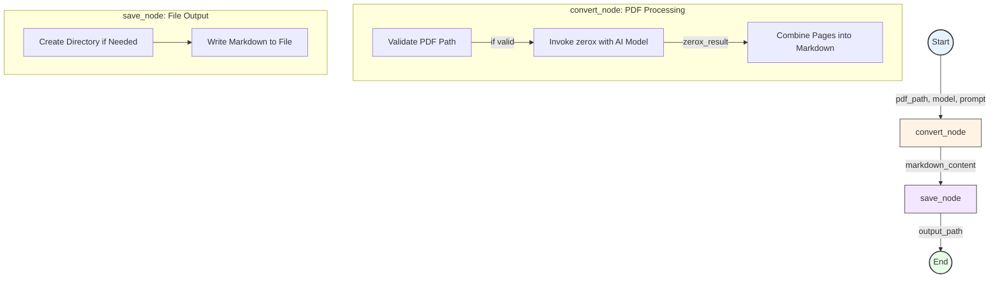

# Tutorial: Building a PDF-to-Markdown Pipeline with Quantalogic Flow

This tutorial guides you through creating a robust pipeline to convert PDF files into Markdown using **Quantalogic Flow**, a powerful Python workflow framework. PDFs often contain a mix of text, images, graphs, and tables—elements that traditional tools like `PyPDF2` or `pdftotext` struggle to handle comprehensively. By leveraging Quantalogic Flow and the AI-driven `pyzerox` library, you’ll learn to extract and interpret these components effectively. With detailed explanations, practical examples,, you’ll gain the skills to adapt this pipeline for various tasks. By the end, you’ll be able to transform complex PDFs into structured Markdown files and understand how to extend workflows for your own projects.

---

## Table of Contents

1. [Understanding PDFs: Challenges and Opportunities](#understanding-pdfs-challenges-and-opportunities)
2. [Quantalogic Flow: A Workflow Framework](#quantalogic-flow-a-workflow-framework)
   - [Overview of Quantalogic Flow](#overview-of-quantalogic-flow)
   - [Mechanics and Examples](#mechanics-and-examples)
   - [Key Benefits](#key-benefits)
3. [UV Shebang and Metadata: Streamlined Execution](#uv-shebang-and-metadata-streamlined-execution)
4. [Setting Up the Pipeline](#setting-up-the-pipeline)
5. [Exploring the Code](#exploring-the-code)
   - [`convert_node`: PDF Processing](#convert_node-pdf-processing)
   - [`save_node`: File Output](#save_node-file-output)
   - [Workflow Definition](#workflow-definition)
6. [Running the Pipeline](#running-the-pipeline)
7. [Extending and Customizing the Pipeline](#extending-and-customizing-the-pipeline)
8. [Visualizing the Process with Mermaid](#visualizing-the-process-with-mermaid)
9. [Outcomes and Next Steps](#outcomes-and-next-steps)

---

## Understanding PDFs: Challenges and Opportunities

PDFs are widely used for their fixed formatting, but extracting their content programmatically poses challenges:
- **Text**: Easily accessible with basic tools.
- **Images**: Stored as raster data, requiring visual interpretation.
- **Graphs**: Complex visuals that lose meaning without context.
- **Tables**: Structured data that often mangles into unstructured text.

For example, a research paper might include a graph of experimental results or a table of statistics—elements critical to its meaning but inaccessible to simple text extractors. This tutorial uses Quantalogic Flow and `pyzerox` to not only extract text but also generate descriptive Markdown for non-text components, offering a complete solution for content reuse.

---

## Quantalogic Flow: A Workflow Framework

### Overview of Quantalogic Flow

Quantalogic Flow, defined in `quantalogic/flow/flow.py`, is a Python library for designing and executing workflows—sequences of tasks (nodes) that process data in a structured manner. It provides a flexible architecture for:
- Sequential execution of tasks.
- Parallel processing of multiple tasks.
- Integration of sub-workflows.
- Monitoring via event observers.

In this pipeline, it manages the conversion of a PDF to Markdown and the subsequent saving of the output, demonstrating its ability to orchestrate asynchronous operations.

### Mechanics and Examples

Quantalogic Flow operates through the `Workflow` class and `Nodes` decorator. Nodes are individual tasks registered with inputs and outputs, while workflows define their execution order. Here are two illustrative examples:

#### Example 1: Sequential Data Processing
```python
from quantalogic.flow.flow import Nodes, Workflow
import asyncio

@Nodes.define(output="processed_text")
async def clean_text(raw_text: str) -> str:
    return raw_text.strip().upper()

@Nodes.define(output="summary")
async def summarize_text(processed_text: str) -> str:
    return f"Summary: {processed_text[:10]}..."

workflow = Workflow("clean_text").sequence("clean_text", "summarize_text")
result = asyncio.run(workflow.build().run({"raw_text": "  hello world  "}))
print(result)  # {'raw_text': '  hello world  ', 'processed_text': 'HELLO WORLD', 'summary': 'Summary: HELLO WOR...'}
```

- **Nodes**: `clean_text` processes input, `summarize_text` generates a summary.
- **Workflow**: Executes sequentially, passing data between nodes.

#### Example 2: Parallel File Analysis
```python
@Nodes.define(output="word_count")
async def count_words(file_content: str) -> int:
    return len(file_content.split())

@Nodes.define(output="line_count")
async def count_lines(file_content: str) -> int:
    return len(file_content.splitlines())

workflow = Workflow("count_words").parallel("count_words", "count_lines")
result = asyncio.run(workflow.build().run({"file_content": "Line one\nLine two"}))
print(result)  # {'file_content': 'Line one\nLine two', 'word_count': 4, 'line_count': 2}
```

- **Parallel**: Both nodes run concurrently, analyzing the same input.

These examples showcase Quantalogic Flow’s adaptability, which we’ll apply to our PDF pipeline.

### Key Benefits

- **Modularity**: Break tasks into reusable components.
- **Asynchronous Execution**: Optimize for I/O operations like API calls.
- **Flexibility**: Support multiple execution patterns (sequential, parallel, nested).
- **Transparency**: Observers and logging provide execution insights.
- **Scalability**: Easily expand with additional nodes or workflows.

This framework empowers you to tackle diverse automation challenges beyond PDFs.

---

## UV Shebang and Metadata: Streamlined Execution

The script begins with a special header:

```python
#!/usr/bin/env -S uv run
# /// script
# requires-python = ">=3.12"
# dependencies = [
#     "loguru", "litellm", "pydantic>=2.0", "asyncio", "jinja2",
#     "py-zerox @ git+https://github.com/getomni-ai/zerox.git",
#     "pdf2image", "pillow", "typer", "pathlib", "pathspec", "quantalogic"
# ]
# ///
```

- **UV Shebang**: `#!/usr/bin/env -S uv run` uses `uv`, a high-performance Python tool from Astral, to execute the script. After setting permissions (`chmod +x pdf_to_md_flow.py`), it runs directly as `./pdf_to_md_flow.py`.
- **Metadata Block**: The `# /// script` section specifies:
  - `requires-python`: Ensures compatibility with Python 3.12+.
  - `dependencies`: Lists packages that `uv` installs automatically during execution.

This setup eliminates manual dependency management, making the script portable and executable with a single command. Install `uv` with: `curl -LsSf https://astral.sh/uv/install.sh | sh`.

---

## Setting Up the Pipeline

### Dependencies
The metadata covers Python packages, including:
- `py-zerox`: AI-driven PDF processing.
- `quantalogic`: Workflow orchestration.
- `pdf2image`: PDF-to-image conversion.

### System Requirements
Install `poppler` for `pdf2image`:
- **macOS**: `brew install poppler`
- **Linux**: `apt-get install poppler-utils`
- **Windows**: `choco install poppler` or add to PATH manually.

With these in place, you’re ready to build the pipeline.

---

## Exploring the Code

### `convert_node`: PDF Processing

#### Code:
```python
@Nodes.define(output="markdown_content")
async def convert_node(
    pdf_path: str,
    model: str,
    custom_system_prompt: Optional[str] = None,
    output_dir: Optional[str] = None,
    select_pages: Optional[Union[int, list[int]]] = None
) -> str:
    if not validate_pdf_path(pdf_path):
        raise ValueError("Invalid PDF path")
    if custom_system_prompt is None:
        custom_system_prompt = (
            "Convert the PDF page to a clean, well-formatted Markdown document. "
            "Preserve structure, headings, and any code or mathematical notation. "
            "For the images and chart, create a literal description what is visible"
            "Return only pure Markdown content, excluding any metadata or non-Markdown elements."
        )
    zerox_result = await zerox(
        file_path=pdf_path,
        model=model,
        system_prompt=custom_system_prompt,
        output_dir=output_dir,
        select_pages=select_pages
    )
    markdown_content = "\n\n".join(
        page.content for page in zerox_result.pages if hasattr(page, 'content') and page.content
    ) or ""
    return markdown_content
```

#### Functionality:
- **Validation**: Checks the PDF file’s existence and format.
- **Conversion**: Uses `zerox` to process the PDF with an AI model (e.g., Gemini or GPT), guided by a system prompt.
- **Output**: Combines page contents into a single Markdown string, including descriptions for images and graphs.

This node leverages AI to interpret visual elements, a leap beyond basic text extraction.

### `save_node`: File Output

#### Code:
```python
@Nodes.define(output="output_path")
async def save_node(markdown_content: str, output_md: str) -> str:
    output_path = Path(output_md)
    output_path.parent.mkdir(parents=True, exist_ok=True)
    with output_path.open("w", encoding="utf-8") as f:
        f.write(markdown_content)
    return str(output_path)
```

#### Functionality:
- **Directory Setup**: Creates parent directories if missing.
- **File Writing**: Saves the Markdown content to the specified path.

This node ensures the output is preserved for later use.

### Workflow Definition

#### Code:
```python
def create_pdf_to_md_workflow():
    workflow = (
        Workflow("convert_node")
        .sequence("convert_node", "save_node")
    )
    return workflow
```

#### Structure:
- **Initialization**: Starts with `convert_node`.
- **Sequence**: Links `convert_node` to `save_node`, passing `markdown_content`.

This defines a straightforward pipeline executed by Quantalogic Flow’s engine.

---

## Running the Pipeline

Set execution permissions: `chmod +x pdf_to_md_flow.py`.

- **Basic Execution**: `./pdf_to_md_flow.py convert input.pdf`
  - Converts `input.pdf` to `input.md`.
- **Custom Execution**: `./pdf_to_md_flow.py convert input.pdf output.md --model gemini/gemini-2.0-flash`
  - Specifies output file and model.

Set environment variables for the model (e.g., `export GEMINI_API_KEY=your_key_here`).

---

## Extending and Customizing the Pipeline

- **Model Selection**: Use `--model openai/gpt-4o-mini` or other LiteLLM-compatible models.
- **System Prompt**: Adjust with `--system-prompt "Extract tables as Markdown, ignore images"`.
- **Page Selection**: Modify `initial_context` in the `convert` function to include `select_pages=[1, 3]` for specific pages.
- **Additional Nodes**: Add a node to preprocess PDFs or post-process Markdown (e.g., formatting cleanup).

These options let you tailor the pipeline to specific needs, such as focusing on tables or processing subsets of a document.

---

## Visualizing the Process with Mermaid



#### Details:
- **Main Flow**: Inputs feed into `convert_node`, which outputs to `save_node`.
- **Subprocesses**: Each node’s steps are broken down for clarity.
- **Styling**: Subtle colors enhance readability.

This diagram reflects the pipeline’s structure and Quantalogic Flow’s execution logic.

---

## Outcomes and Next Steps

By completing this tutorial, you’ll achieve:
- **A Working Pipeline**: Convert PDFs to Markdown, including descriptions of images, graphs, and tables.
- **Quantalogic Flow Mastery**: Understand how to define and execute workflows for sequential and parallel tasks.
- **UV Proficiency**: Run self-contained Python scripts with automatic dependency management.
- **Customization Skills**: Adapt the pipeline for specific use cases.

### What You Can Do Next:
- **Process Complex PDFs**: Try a document with charts or tables (e.g., a financial report) and refine the output.
- **Expand the Workflow**: Add nodes for text analysis (e.g., keyword extraction) or format conversion (e.g., to HTML).
- **Build New Pipelines**: Use Quantalogic Flow for tasks like data scraping, file batch processing, or API automation.

With these skills, you’re equipped to tackle document processing challenges and design sophisticated workflows for any project. Start experimenting today!