# 📚✨ Educational Questionnaire Generator README

🎉 **Welcome to the Educational Questionnaire Generator!** 🎉 Imagine transforming a markdown file into a slick, interactive quiz with AI-powered precision—all in a snap! This tool takes your educational content, extracts facts, crafts questions, evaluates them, and delivers a polished questionnaire. Perfect for teachers, learners, or trivia buffs—let’s make knowledge fun! 🚀

---

## 🎯 Why & What

### Why Build This? 🤔
- **Save Time**: Manual quiz-making is so last century. Let AI handle it! ⏳
- **Boost Learning**: Quizzes reinforce understanding, tailored to your content. 🧠
- **AI Magic**: Tap into cutting-edge LLMs (e.g., Gemini) for smart fact extraction and question crafting. 🤖
- **Versatile Fun**: Turn any markdown into a quiz—classrooms, blogs, or self-study, here we come! 🎲

### What Does It Do? 🌟
This Python script:
1. 📖 **Reads** your markdown file.
2. 🧩 **Extracts** detailed facts with claims and sources.
3. ❓ **Generates** multiple-choice questions (3-6 options, single or multi-answer).
4. ✅ **Evaluates** each question for quality and accuracy.
5. 🔀 **Shuffles** options for fairness.
6. 💾 **Saves** it all as a JSON file.

It’s your quiz-crafting sidekick, powered by Python and AI! 🎨

---

## 🛠️ How It Works

Let’s explore the workflow step-by-step with visuals and examples. Buckle up for the ride! 🚗

### Step 1: The Workflow at a Glance
Powered by `quantalogic.flow`, this script chains tasks like a relay race. Here’s the flow:

```mermaid
graph TD
    A[📖 Read Markdown] --> B[🧠 Extract Facts]
    B --> C[✂️ Select Facts]
    C --> D[🔄 Loop Per Fact]
    D --> E[❓ Generate Question]
    E --> F[✅ Verify Question]
    F --> G[➕ Append Results]
    G --> H{More Facts?}
    H -->|Yes| D
    H -->|No| I[🔀 Shuffle Options]
    I --> J[💾 Save Output]
```



Each "node" passes the baton to the next—smooth and efficient! 🏃‍♂️

### Step 2: The `uv` Shebang Magic ✨
This script kicks off with a futuristic twist: a `uv`-powered shebang! Here’s what it looks like:

```python
#!/usr/bin/env -S uv run
# /// script
# requires-python = ">=3.12"
# dependencies = [
#     "loguru",
#     "litellm",
#     "pydantic>=2.0",
#     "anyio",
#     "quantalogic>=0.35",
#     "jinja2",
#     "typer>=0.9.0"
# ]
# ///
```

#### What’s This Do? 🧐
- **Shebang (`#!/usr/bin/env -S uv run`)**: Tells your system to run the script with `uv`, a Rust-based Python tool that’s *fast* and *smart*.
- **Metadata Block**: Specifies Python 3.12+ and lists dependencies. When `uv` runs this, it:
  1. Downloads the right Python version if needed.
  2. Installs all listed packages in a temporary, isolated environment.
  3. Executes the script—no setup required! 🚀

#### Why It Rocks 🌟
- **No Manual Installs**: Forget `pip install`—`uv` handles it on the fly.
- **Conflict-Free**: Each run is sandboxed, keeping your system Python pristine.
- **Speedy**: Built in Rust, it’s quicker than traditional tools like `venv`.
- **Portable**: The script carries its own requirements—share it anywhere `uv` is installed!

#### How to Use It
- Install `uv` (see below), then run `./question_and_answers.py`—it’s that easy! More details in "Running It" below. 😎

### Step 3: Workflow Details with Example
Let’s use a markdown file about **Space Exploration** to see it in action.

#### 📖 Node 1: Read Markdown
- **What**: Loads your `.md` file.
- **Example**: `space.md` says:
  ```markdown
  ## The Moon Landing
  In 1969, Apollo 11 landed humans on the Moon...
  ```

#### 🧠 Node 2: Extract Facts
- **What**: AI pulls out facts with details.
- **Output**:
  ```json
  {
    "facts": [
      {
        "title": "Apollo 11 Moon Landing",
        "claims": "On July 20, 1969, NASA’s Apollo 11 mission landed humans on the Moon. Neil Armstrong and Buzz Aldrin walked the surface, while Michael Collins orbited. It was a historic milestone, meeting Kennedy’s 1961 goal despite technical hurdles.",
        "sources": ["The Moon Landing"]
      }
    ]
  }
  ```

#### ❓ Node 3: Generate Question
- **What**: Creates a quiz item.
- **Output**:
  ```json
  {
    "question": "Who walked on the Moon during Apollo 11?",
    "options": ["Armstrong & Aldrin", "Collins & Glenn", "Shepard & Grissom"],
    "correct_answers": [1],
    "explanation": "Armstrong and Aldrin landed; Collins orbited."
  }
  ```

#### ✅ Node 4: Verify & Beyond
- Rates the question (e.g., 5/5 relevance), loops through facts, shuffles options, and saves the result!

### Step 4: Running It
1. **Install `uv`**:
   - On macOS/Linux: `curl -LsSf https://astral.sh/uv/install.sh | sh`
   - On Windows: `powershell -c "irm https://astral.sh/uv/install.ps1 | iex"`
   - Check it: `uv --version` (e.g., `uv 0.4.0`).

2. **Make Executable** (optional, Unix-like systems):
   ```bash
   chmod +x question_and_answers.py
   ```

3. **Run with `uv`**:
   - Direct: `./question_and_answers.py generate space.md --num-questions 3`
   - Or: `uv run question_and_answers.py generate space.md --model gemini/gemini-2.0-flash`
   - `uv` fetches Python 3.12+ and dependencies automatically!

4. **Output**: See the quiz in your terminal and grab `space_results.json`.

---

## 🚀 Try It Out!
Write a markdown file (e.g., `planets.md`), run the script, and watch your quiz come to life. Share it, tweak it, or challenge your friends! 🎉

## 🌟 Features
- ✅ Structured data with Pydantic
- 🤖 AI-driven fact and question generation
- 🔄 Dynamic workflow loops
- 💯 Built-in question evaluation
- 📝 Typer CLI interface
- ⚡ `uv` for effortless execution

Happy quizzing—may your knowledge blast off! 🌌✨

😊