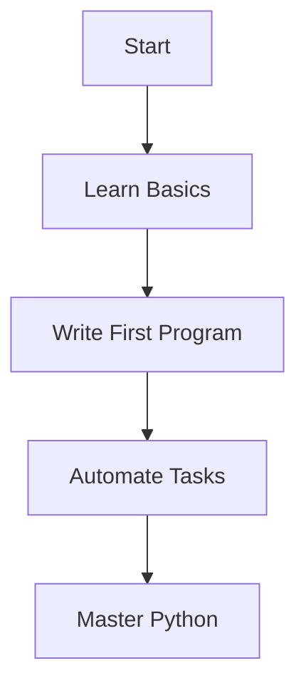
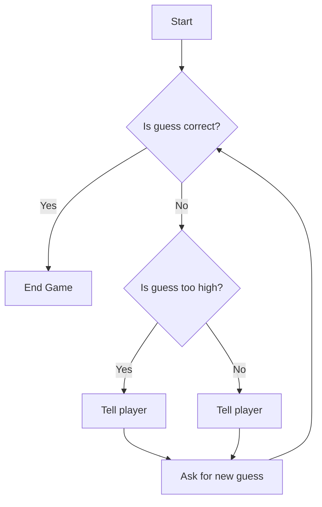

# The Ultimate Guide for the Impatient: From Novice to Practitioner in Record Time

```markdown
# Chapter 1: Python Basics - The Fast Lane to Coding

## 1.1 Captivating Example: "Hello, World!" in 30 Seconds

Let’s dive right in! Open your favorite text editor or Python IDE (like [VS Code](https://code.visualstudio.com/) or [PyCharm](https://www.jetbrains.com/pycharm/)) and type the following:

```python
print("Hello, World!")
```

Run this code, and voilà! You’ve just written your first Python program. In less than 30 seconds, you’ve joined the ranks of Python programmers worldwide. This simple line of code is your gateway to a world of possibilities. But why Python? Let’s find out.

---

## 1.2 Why Python?

Python is like the Swiss Army knife of programming languages. It’s versatile, beginner-friendly, and powerful enough to build everything from web apps to machine learning models. Here’s why Python stands out:

- **Readability**: Python’s syntax is clean and intuitive, making it easy to learn and write.
- **Community Support**: With millions of users, Python has a vast ecosystem of libraries and frameworks.
- **Cross-Platform**: Python runs on Windows, macOS, Linux, and even Raspberry Pi.
- **Job Market Demand**: Python is one of the most sought-after skills in tech today.

Still not convinced? Let’s explore some key concepts that make Python so approachable.

---

## 1.3 Key Concepts: Variables, Data Types, and Operators

### Variables
Variables are like containers for storing data. In Python, you don’t need to declare a type—just assign a value:

```python
name = "Alice"
age = 25
```

### Data Types
Python supports various data types, including:
- **Strings**: `"Hello, World!"`
- **Integers**: `42`
- **Floats**: `3.14`
- **Booleans**: `True` or `False`

### Operators
Operators let you perform actions on data. For example:
- **Arithmetic**: `+`, `-`, `*`, `/`
- **Comparison**: `==`, `!=`, `>`, `<`
- **Logical**: `and`, `or`, `not`

Here’s a quick example:

```python
x = 10
y = 5
print(x + y)  # Output: 15
print(x > y)  # Output: True
```

---

## 1.4 Actionable Strategy: Write Your First Program

Let’s put these concepts into practice. Write a program that calculates the area of a rectangle:

```python
# Input length and width
length = 10
width = 5

# Calculate area
area = length * width

# Display result
print(f"The area of the rectangle is {area}.")
```

Run this code, and you’ll see: `The area of the rectangle is 50.` Congratulations! You’ve just written a functional Python program.

---

## 1.5 Contextual Application: Automating a Daily Task

Now, let’s take it a step further. Imagine you want to automate a daily task, like renaming files in a folder. Here’s a simple script to rename all `.txt` files in a directory:

```python
import os

# Directory path
folder_path = "path/to/your/folder"

# Loop through files
for filename in os.listdir(folder_path):
    if filename.endswith(".txt"):
        new_name = f"renamed_{filename}"
        os.rename(os.path.join(folder_path, filename), os.path.join(folder_path, new_name))
        print(f"Renamed {filename} to {new_name}")
```

Replace `"path/to/your/folder"` with your actual folder path, and watch Python do the heavy lifting for you.

---

## Call to Action

Ready to take the next step? Start experimenting with Python today! Try modifying the examples above or explore Python’s official documentation at [python.org](https://www.python.org/). Remember, the best way to learn is by doing. Happy coding!




# Chapter 2: Control Flow and Functions - Building Blocks of Logic

## 2.1 Captivating Example: A Guessing Game

Imagine you’re building a simple guessing game. The computer picks a random number, and the player has to guess it. Sounds fun, right? But how do you make the game respond to the player’s guesses? This is where **control flow** and **functions** come into play.

```python
import random

def guessing_game():
    secret_number = random.randint(1, 10)
    while True:
        guess = int(input("Guess a number between 1 and 10: "))
        if guess < secret_number:
            print("Too low!")
        elif guess > secret_number:
            print("Too high!")
        else:
            print("You got it!")
            break
```

This tiny program uses **if-else statements**, a **while loop**, and a **function** to create an interactive experience. Let’s break it down.

---

## 2.2 Why Control Flow Matters

Control flow is the backbone of any program. It determines how your code makes decisions and repeats actions. Without it, your program would just execute instructions in a straight line, like a robot with no brain. Control flow gives your code **logic** and **flexibility**.

Think of it like this: If you’re baking a cake, you don’t just throw all the ingredients into the oven at once. You follow steps, make decisions (e.g., "Is the batter smooth?"), and repeat actions (e.g., "Mix until combined"). Control flow lets your program do the same.

---

## 2.3 Key Concepts: If-Else, Loops, and Functions

### If-Else Statements
These are your decision-makers. They let your code choose between different paths based on conditions.

```python
age = 18
if age >= 18:
    print("You can vote!")
else:
    print("Sorry, you’re too young.")
```

### Loops
Loops repeat actions. Use `for` when you know how many times to repeat, and `while` when you want to repeat until a condition is met.

```python
# For loop
for i in range(3):
    print(f"Loop iteration {i}")

# While loop
count = 0
while count < 3:
    print(f"Count: {count}")
    count += 1
```

### Functions
Functions are reusable blocks of code. They help you avoid repetition and keep your code organized.

```python
def greet(name):
    return f"Hello, {name}!"

print(greet("Alice"))
print(greet("Bob"))
```

---

## 2.4 Actionable Strategy: Build a To-Do List App

Let’s apply these concepts to build a simple to-do list app. Here’s the plan:
1. Use a list to store tasks.
2. Use a loop to keep the app running.
3. Use if-else to handle user commands (add, view, quit).

```python
def todo_list():
    tasks = []
    while True:
        command = input("Enter a command (add, view, quit): ").strip().lower()
        if command == "add":
            task = input("Enter a task: ")
            tasks.append(task)
        elif command == "view":
            print("Your tasks:")
            for task in tasks:
                print(f"- {task}")
        elif command == "quit":
            print("Goodbye!")
            break
        else:
            print("Invalid command.")
```

---

## 2.5 Contextual Application: Solving Real-World Problems

Control flow and functions aren’t just for games and to-do lists. They’re used everywhere:
- **E-commerce**: Calculate discounts based on user input.
- **Data Analysis**: Filter and process large datasets.
- **Automation**: Schedule tasks or send reminders.

For example, here’s how you might calculate a discount:

```python
def calculate_discount(price, is_member):
    if is_member:
        return price * 0.9  # 10% discount
    else:
        return price
```

---

## Call to Action

Now it’s your turn! Take the guessing game or to-do list app and tweak it. Add new features, like keeping track of how many guesses the player made or letting users mark tasks as complete. Experiment, break things, and learn. Remember, the best way to master control flow and functions is to **practice**.



Happy coding! 🚀

# Chapter 3: Data Structures and Libraries - Unlocking Python’s Power

## 3.1 Captivating Example: Analyzing a Dataset

Imagine you’ve just downloaded a dataset of global coffee production. You want to find out which country produces the most coffee and how production has changed over time. Sounds daunting? Not with Python! Using libraries like `pandas` and `matplotlib`, you can analyze and visualize this data in just a few lines of code:

```python
import pandas as pd
import matplotlib.pyplot as plt

# Load the dataset
data = pd.read_csv('coffee_production.csv')

# Find the top coffee-producing country
top_country = data.loc[data['Production'].idxmax(), 'Country']

# Plot production trends
data.groupby('Year')['Production'].sum().plot(kind='line')
plt.title('Global Coffee Production Over Time')
plt.show()

print(f"The top coffee-producing country is {top_country}!")
```

In minutes, you’ve unlocked insights that would take hours manually. This is the power of Python’s data structures and libraries.

---

## 3.2 Why Data Structures and Libraries Matter

Data structures and libraries are the backbone of Python programming. They allow you to:
- **Organize data efficiently**: Lists, dictionaries, and other structures help you store and manipulate data.
- **Save time**: Libraries like `pandas`, `numpy`, and `matplotlib` provide pre-built tools for complex tasks.
- **Solve real-world problems**: From analyzing datasets to building web apps, these tools make Python versatile and powerful.

Without them, you’d be reinventing the wheel every time you write code.

---

## 3.3 Key Concepts: Lists, Dictionaries, and Libraries

### Lists
Lists are ordered collections of items. They’re perfect for storing sequences of data:
```python
fruits = ['apple', 'banana', 'cherry']
fruits.append('orange')  # Add an item
print(fruits[1])  # Access the second item: 'banana'
```

### Dictionaries
Dictionaries store key-value pairs, making them ideal for structured data:
```python
person = {'name': 'Alice', 'age': 30, 'city': 'New York'}
print(person['name'])  # Access the value for 'name': 'Alice'
```

### Libraries
Libraries extend Python’s capabilities. For example:
- `pandas`: Data manipulation and analysis.
- `numpy`: Numerical computing.
- `matplotlib`: Data visualization.

---

## 3.4 Actionable Strategy: Create a Personal Budget Tracker

Let’s apply these concepts to build a personal budget tracker. Here’s how:

1. **Store Expenses**: Use a list of dictionaries to track expenses.
2. **Calculate Totals**: Use a loop to sum up expenses.
3. **Visualize Spending**: Use `matplotlib` to create a pie chart.

```python
expenses = [
    {'category': 'Food', 'amount': 200},
    {'category': 'Transport', 'amount': 50},
    {'category': 'Entertainment', 'amount': 100}
]

# Calculate total spending
total = sum(item['amount'] for item in expenses)
print(f"Total expenses: ${total}")

# Visualize spending
categories = [item['category'] for item in expenses]
amounts = [item['amount'] for item in expenses]

plt.pie(amounts, labels=categories, autopct='%1.1f%%')
plt.title('Monthly Expenses')
plt.show()
```

---

## 3.5 Contextual Application: Building a Mini-Project

Now it’s your turn! Build a **movie recommendation system** using lists and dictionaries. Here’s the plan:
1. Create a dictionary of movies with genres and ratings.
2. Write a function to recommend movies based on a user’s preferred genre.
3. Use `random` to suggest a random movie.

```python
import random

movies = {
    'Inception': {'genre': 'Sci-Fi', 'rating': 8.8},
    'The Dark Knight': {'genre': 'Action', 'rating': 9.0},
    'Toy Story': {'genre': 'Animation', 'rating': 8.3}
}

def recommend_movie(genre):
    options = [movie for movie, details in movies.items() if details['genre'] == genre]
    return random.choice(options)

print(f"Recommended movie: {recommend_movie('Sci-Fi')}")
```

---

## Call to Action

Ready to unlock Python’s full potential? Dive deeper into data structures and libraries by exploring the official documentation or taking an online course. Then, build your own mini-project and share it with the world! Remember, the best way to learn is by doing. Happy coding! 🚀
