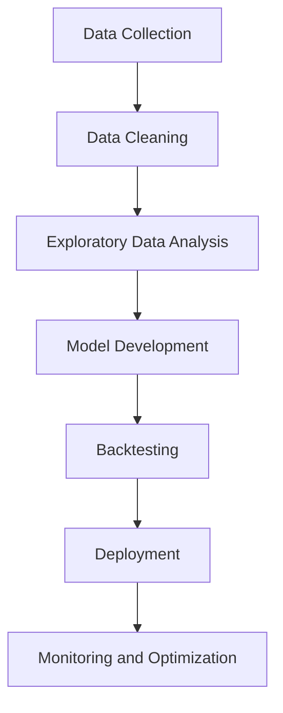
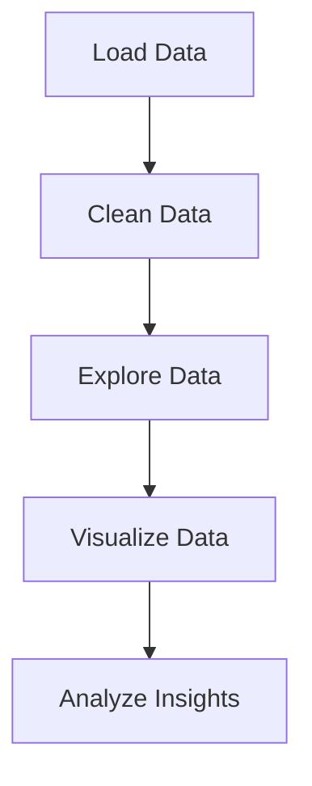
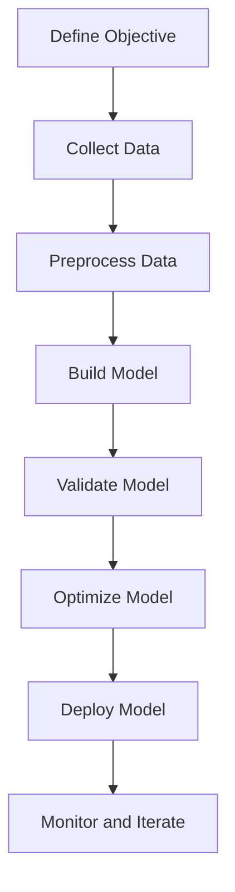
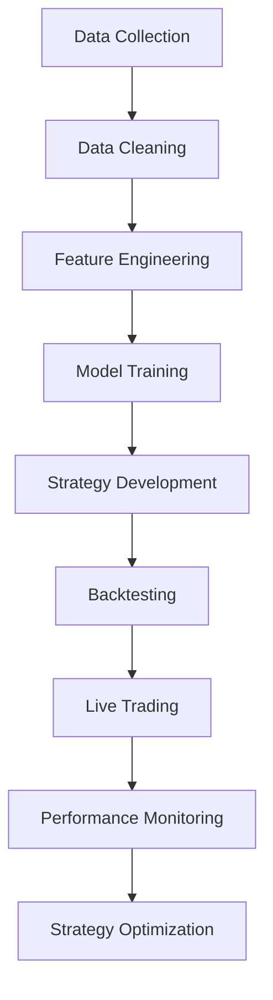
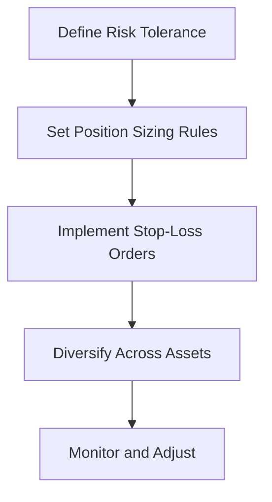

# Chapter 1: The Foundations of Quantitative Finance

## A Day in the Life of a Quant Analyst

Imagine this: It’s 6:30 AM, and the sun is just beginning to rise over the Manhattan skyline. Sarah, a quantitative analyst at a mid-sized hedge fund, is already at her desk, sipping her third cup of coffee. Her morning ritual involves scanning the latest financial news, checking overnight market movements, and running a quick diagnostic on the firm’s algorithmic trading models. By 7:00 AM, she’s knee-deep in Python code, tweaking parameters for a new portfolio optimization strategy. 

Sarah’s day is a blend of mathematics, programming, and financial intuition. She doesn’t just crunch numbers—she tells stories with data, uncovers hidden patterns, and makes decisions that could mean millions of dollars in profit or loss. By the end of the day, she’s back at her desk, reviewing the performance of her models and planning for tomorrow. 

This is the life of a quant analyst: fast-paced, intellectually stimulating, and deeply rewarding. But how do you get there? What does it take to go from a curious beginner to a practitioner who can confidently navigate the world of quantitative finance? That’s what this guide is all about.

---

## Key Concepts in Quantitative Finance

Before diving into Python and building models, it’s essential to understand the foundational concepts that underpin quantitative finance. These principles will guide your work and help you make sense of the data and models you’ll encounter.

### 1. **Time Value of Money (TVM)**
The time value of money is the idea that a dollar today is worth more than a dollar tomorrow. Why? Because you can invest that dollar today and earn a return. TVM is the cornerstone of finance, and it’s used in everything from pricing bonds to valuing stocks.

**Example**: If you invest $100 today at a 5% annual interest rate, it will grow to $105 in one year. Conversely, $100 received a year from now is worth less than $100 today because you miss out on the opportunity to earn interest.

### 2. **Risk-Return Tradeoff**
In finance, higher returns usually come with higher risk. This tradeoff is at the heart of portfolio management. Your goal as a quant is to find the optimal balance between risk and return.

**Example**: A government bond might offer a low return but is considered low-risk. On the other hand, investing in a startup could yield high returns but comes with the risk of losing your entire investment.

### 3. **Market Efficiency**
The Efficient Market Hypothesis (EMH) states that asset prices reflect all available information. In an efficient market, it’s impossible to consistently achieve above-average returns without taking on additional risk.

**Myth Debunking**: "You can beat the market with enough data and computing power." While data and technology are powerful tools, markets are incredibly complex and often unpredictable. Even the best models can’t guarantee success.

---

## Python Basics for Quantitative Finance

Python is the lingua franca of quantitative finance. Its simplicity, versatility, and extensive libraries make it the go-to tool for quants. Let’s get you set up with the basics.

### Essential Libraries
- **NumPy**: For numerical computations and working with arrays.
- **pandas**: For data manipulation and analysis.
- **matplotlib**: For data visualization.

### Setting Up Your Environment
First, ensure you have Python installed. If not, download it from [python.org](https://www.python.org/). Next, install the necessary libraries using pip:

```bash
pip install numpy pandas matplotlib
```

### Importing Libraries
Here’s how you import the essential libraries in Python:

```python
import numpy as np
import pandas as pd
import matplotlib.pyplot as plt
```

### Example: Calculating the Time Value of Money
Let’s calculate the future value of an investment using Python:

```python
# Inputs
principal = 100  # Initial investment
rate = 0.05      # Annual interest rate
years = 10       # Investment period

# Future Value Calculation
future_value = principal * (1 + rate) ** years
print(f"Future Value: ${future_value:.2f}")
```

**Output**:
```
Future Value: $162.89
```

---

## Myth Debunking: "You Need a PhD to Work in Quantitative Finance"

One of the most pervasive myths in the field is that you need a PhD to succeed. While advanced degrees can be helpful, they’re not a prerequisite. Many successful quants come from diverse backgrounds, including computer science, engineering, and even self-taught programming.

**Insider Tip**: Focus on building practical skills. Learn Python, understand financial concepts, and work on real-world projects. A strong portfolio of work can be just as valuable as a degree.

---

## Insider Tip: Start Small to Build Intuition

When you’re starting out, it’s tempting to dive into complex models and large datasets. But here’s a pro tip: start small. Work with small datasets to build your intuition and understand the underlying mechanics. For example, analyze the historical prices of a single stock before moving on to an entire portfolio.

---

## Call to Action: Set Up Your Python Environment

Your journey into quantitative finance starts today. Here’s what you need to do:
1. **Install Python**: If you haven’t already, download and install Python from [python.org](https://www.python.org/).
2. **Install Libraries**: Use pip to install NumPy, pandas, and matplotlib.
3. **Write Your First Script**: Use the example above to calculate the future value of an investment.

---

## Interactive Elements

### Mermaid Diagram: Quantitative Finance Workflow
Here’s a flowchart that outlines the typical workflow in quantitative finance:



### Interactive Quiz: Test Your Understanding
1. What is the future value of $200 invested at a 3% annual interest rate for 5 years?
   - A) $230.00
   - B) $231.85
   - C) $250.00
   - D) $260.00

2. Which Python library is best suited for data manipulation?
   - A) NumPy
   - B) pandas
   - C) matplotlib
   - D) SciPy

**Answers**: 1) B, 2) B

---

## Wrapping Up

You’ve taken the first step into the world of quantitative finance. By understanding foundational concepts like the time value of money, risk-return tradeoff, and market efficiency, you’re well on your way to becoming a practitioner. With Python as your tool, the possibilities are endless.

In the next chapter, we’ll dive into data wrangling and visualization, where you’ll learn how to clean messy datasets and uncover insights through exploratory data analysis. Until then, set up your Python environment and start experimenting with the code snippets provided.

Remember, the journey from novice to practitioner is a marathon, not a sprint. Take it one step at a time, and soon enough, you’ll be living the life of a quant analyst—just like Sarah.

# Chapter 2: Data Wrangling and Visualization

## Storytelling: How a Messy Dataset Almost Ruined a Trading Strategy

Imagine this: You’ve spent weeks building a sophisticated trading strategy. You’ve backtested it, optimized it, and are ready to deploy it live. But on the first day of trading, your algorithm goes haywire. Instead of making profits, it starts losing money at an alarming rate. Panic sets in. You dig into the data and realize the culprit: a messy dataset. Missing values, incorrect timestamps, and outliers had silently crept into your data, rendering your strategy useless.

This isn’t just a hypothetical scenario—it’s a real-life lesson from a quant analyst who learned the hard way that **data wrangling** is the backbone of any successful quantitative finance project. In this chapter, we’ll dive into the art and science of cleaning, exploring, and visualizing financial data using Python. By the end, you’ll be equipped to handle even the messiest datasets with confidence.

---

## Key Concepts: Data Cleaning, EDA, and Visualization

### 1. **Data Cleaning: The Unsung Hero**
Data cleaning is the process of detecting and correcting (or removing) corrupt, inaccurate, or irrelevant parts of a dataset. In quantitative finance, this step is critical because even a single outlier can skew your analysis and lead to costly mistakes.

### 2. **Exploratory Data Analysis (EDA): The Detective Work**
EDA is the process of summarizing the main characteristics of a dataset, often using visual methods. It helps you uncover patterns, spot anomalies, and test hypotheses before diving into modeling.

### 3. **Visualization: The Storyteller**
Visualization transforms raw data into insights. It’s not just about making pretty charts—it’s about communicating complex information in a way that’s easy to understand.

---

## Python Tools: pandas and seaborn

### pandas: The Swiss Army Knife of Data Manipulation
`pandas` is the go-to library for data wrangling in Python. It provides powerful tools for cleaning, transforming, and analyzing data. Here’s a quick overview of its key features:
- **DataFrames**: A tabular data structure that makes it easy to manipulate rows and columns.
- **Handling Missing Data**: Functions like `.dropna()` and `.fillna()` help you deal with incomplete data.
- **Grouping and Aggregating**: Use `.groupby()` to summarize data by categories.

### seaborn: The Artist of Data Visualization
`seaborn` builds on `matplotlib` to create beautiful, informative visualizations with minimal code. It’s particularly useful for exploring relationships between variables and creating complex plots like heatmaps and pair plots.

---

## Myth Debunking: "Visualization is Just for Presentations"

One of the biggest misconceptions in quantitative finance is that visualization is only useful for presenting results to stakeholders. In reality, visualization is a critical tool for **understanding your data**. It helps you:
- Identify trends and patterns.
- Detect outliers and anomalies.
- Validate assumptions before building models.

For example, a simple line plot of stock prices can reveal seasonality or volatility clustering, which might not be apparent from raw numbers alone.

---

## Insider Tip: Use `.describe()` and `.info()` to Quickly Understand Your Data

When you first load a dataset, it’s tempting to dive straight into analysis. But taking a few minutes to explore the data can save you hours of headaches later. Here’s how to get started:

```python
import pandas as pd

# Load a financial dataset (e.g., stock prices)
df = pd.read_csv('stock_prices.csv')

# Get a quick summary of the data
print(df.info())

# Generate descriptive statistics
print(df.describe())
```

- `.info()` gives you an overview of the dataset, including the number of rows, columns, and data types.
- `.describe()` provides summary statistics like mean, standard deviation, and quartiles.

---

## Call to Action: Load a Financial Dataset and Perform EDA

Now it’s your turn! Follow these steps to practice data wrangling and visualization:

1. **Load a Dataset**: Use a financial dataset like stock prices or cryptocurrency data.
2. **Clean the Data**: Handle missing values, remove duplicates, and correct inconsistencies.
3. **Explore the Data**: Use `.describe()` and `.info()` to understand the dataset.
4. **Visualize the Data**: Create plots to uncover patterns and relationships.

Here’s a code snippet to get you started:

```python
import pandas as pd
import seaborn as sns
import matplotlib.pyplot as plt

# Load the dataset
df = pd.read_csv('stock_prices.csv')

# Clean the data
df.dropna(inplace=True)  # Remove rows with missing values
df['Date'] = pd.to_datetime(df['Date'])  # Convert to datetime

# Explore the data
print(df.info())
print(df.describe())

# Visualize the data
plt.figure(figsize=(10, 6))
sns.lineplot(x='Date', y='Close', data=df)
plt.title('Stock Price Over Time')
plt.show()
```

---

## Interactive Plot: Use Plotly to Create an Interactive Candlestick Chart

For a more advanced visualization, try creating an interactive candlestick chart using `Plotly`. This type of chart is commonly used in financial analysis to show price movements over time.

```python
import plotly.graph_objects as go

# Create a candlestick chart
fig = go.Figure(data=[go.Candlestick(
    x=df['Date'],
    open=df['Open'],
    high=df['High'],
    low=df['Low'],
    close=df['Close']
)])

fig.update_layout(title='Stock Price Candlestick Chart', xaxis_title='Date', yaxis_title='Price')
fig.show()
```

---

## Mermaid Diagram: Data Wrangling Pipeline

Here’s a visual representation of the data wrangling process:



---

## Conclusion: The Power of Clean Data

Data wrangling and visualization might not be the most glamorous parts of quantitative finance, but they’re undoubtedly the most important. As the story at the beginning of this chapter illustrates, even the most sophisticated models are useless if the underlying data is flawed.

By mastering these skills, you’ll not only avoid costly mistakes but also gain a deeper understanding of the financial markets. So roll up your sleeves, load a dataset, and start exploring. The insights you uncover might just be the key to your next big breakthrough.

---

## Call to Action: Your Turn!

1. **Download a Dataset**: Use a free financial dataset from sources like [Yahoo Finance](https://finance.yahoo.com/) or [Quandl](https://www.quandl.com/).
2. **Clean and Explore**: Apply the techniques you’ve learned to clean and explore the data.
3. **Visualize**: Create at least one interactive visualization using `Plotly`.
4. **Share Your Work**: Post your code and insights on GitHub or a data science platform like Kaggle.

Remember, the journey from novice to practitioner is a marathon, not a sprint. But with the right tools and techniques, you’ll get there faster than you think. Happy coding! 🚀

# Chapter 3: Building Your First Financial Model

## Storytelling: How a Simple Model Outperformed a Complex One

Let me tell you a story about Sarah, a junior quant analyst at a mid-sized hedge fund. Sarah was tasked with developing a model to predict stock price movements. Her team had access to terabytes of data—everything from historical prices to social media sentiment—and they were convinced that a complex machine learning model would be the key to success.

Sarah, however, decided to take a different approach. She started with a simple linear regression model, using only historical price data. While her colleagues spent weeks fine-tuning their neural networks, Sarah’s model was up and running in a matter of days. To everyone’s surprise, her simple model outperformed the more complex ones, especially during volatile market conditions.

The lesson? Complexity isn’t always better. In fact, starting with a simple model can often lead to quicker insights and more robust results. This chapter will guide you through building your first financial model, focusing on simplicity and practicality.

## Key Concepts: Linear Regression, Monte Carlo Simulations, and Portfolio Optimization

### Linear Regression

Linear regression is one of the simplest yet most powerful tools in a quant’s arsenal. It’s used to model the relationship between a dependent variable (e.g., stock price) and one or more independent variables (e.g., time, interest rates). The goal is to find the best-fitting line that minimizes the difference between the predicted and actual values.

### Monte Carlo Simulations

Monte Carlo simulations are used to model the probability of different outcomes in a process that cannot easily be predicted due to the intervention of random variables. In finance, they’re often used to assess the risk and uncertainty of investment portfolios.

### Portfolio Optimization

Portfolio optimization is the process of selecting the best portfolio (asset distribution) out of the set of all possible portfolios being considered, according to some objective. The objective typically maximizes factors like expected return and minimizes costs like financial risk.

## Python Tools: scikit-learn for Regression, SciPy for Optimization

### scikit-learn

scikit-learn is a powerful Python library for machine learning that provides simple and efficient tools for data mining and data analysis. It’s particularly well-suited for implementing linear regression models.

### SciPy

SciPy is a Python library used for scientific and technical computing. It provides functions for optimization, integration, interpolation, eigenvalue problems, algebraic equations, and other tasks.

## Myth Debunking: "More Data Always Leads to Better Models"

One of the most pervasive myths in quantitative finance is that more data always leads to better models. While it’s true that having more data can improve model accuracy, it’s not a guarantee. The quality of the data, the relevance of the features, and the appropriateness of the model are far more important than the sheer volume of data.

In Sarah’s case, her simple linear regression model outperformed more complex models because it was based on high-quality, relevant data. The takeaway? Focus on the quality and relevance of your data, not just the quantity.

## Insider Tip: Start with a Simple Model and Iterate

When building your first financial model, it’s tempting to jump straight into complex algorithms. However, starting with a simple model allows you to quickly validate your assumptions and identify any issues with your data. Once you have a working baseline, you can gradually add complexity and refine your model.

## Call to Action: Build a Basic Portfolio Optimization Model

Now that you understand the key concepts and tools, it’s time to put them into practice. In this section, we’ll walk through building a basic portfolio optimization model using Python.

### Step 1: Import Libraries

```python
import numpy as np
import pandas as pd
import matplotlib.pyplot as plt
from scipy.optimize import minimize
```

### Step 2: Load Data

For this example, we’ll use historical stock price data for three assets: Apple (AAPL), Google (GOOGL), and Microsoft (MSFT).

```python
# Load historical stock price data
data = pd.read_csv('stock_data.csv', index_col='Date', parse_dates=True)
returns = data.pct_change().dropna()
```

### Step 3: Define the Objective Function

The objective of portfolio optimization is to maximize the Sharpe ratio, which is a measure of risk-adjusted return.

```python
def sharpe_ratio(weights, returns, risk_free_rate=0.02):
    portfolio_return = np.sum(returns.mean() * weights) * 252
    portfolio_std = np.sqrt(np.dot(weights.T, np.dot(returns.cov() * 252, weights)))
    return (portfolio_return - risk_free_rate) / portfolio_std

def negative_sharpe_ratio(weights, returns, risk_free_rate=0.02):
    return -sharpe_ratio(weights, returns, risk_free_rate)
```

### Step 4: Optimize the Portfolio

We’ll use the `minimize` function from SciPy to find the optimal weights that maximize the Sharpe ratio.

```python
# Initial guess (equal weights)
initial_guess = np.array([1/3, 1/3, 1/3])

# Constraints
constraints = ({'type': 'eq', 'fun': lambda weights: np.sum(weights) - 1})

# Bounds (weights between 0 and 1)
bounds = tuple((0, 1) for _ in range(len(returns.columns)))

# Optimize
result = minimize(negative_sharpe_ratio, initial_guess, args=(returns,), method='SLSQP', bounds=bounds, constraints=constraints)

# Optimal weights
optimal_weights = result.x
print("Optimal Weights:", optimal_weights)
```

### Step 5: Visualize the Results

Finally, let’s visualize the optimal portfolio allocation.

```python
# Plot the optimal portfolio allocation
plt.figure(figsize=(10, 6))
plt.pie(optimal_weights, labels=returns.columns, autopct='%1.1f%%', startangle=140)
plt.title('Optimal Portfolio Allocation')
plt.show()
```

## Interactive Simulation: Use Bokeh to Visualize Monte Carlo Results

To make your financial models more interactive, you can use Bokeh, a Python library for creating interactive visualizations. Below is an example of how to visualize the results of a Monte Carlo simulation using Bokeh.

```python
from bokeh.plotting import figure, show
from bokeh.io import output_notebook

output_notebook()

# Generate random portfolio returns
num_portfolios = 10000
results = np.zeros((3, num_portfolios))

for i in range(num_portfolios):
    weights = np.random.random(3)
    weights /= np.sum(weights)
    portfolio_return = np.sum(returns.mean() * weights) * 252
    portfolio_std = np.sqrt(np.dot(weights.T, np.dot(returns.cov() * 252, weights)))
    results[0, i] = portfolio_return
    results[1, i] = portfolio_std
    results[2, i] = (portfolio_return - 0.02) / portfolio_std

# Create a Bokeh plot
p = figure(title="Monte Carlo Simulation of Portfolio Returns", x_axis_label='Risk (Std Dev)', y_axis_label='Return')
p.circle(results[1, :], results[0, :], size=5, color='blue', alpha=0.5)
show(p)
```

## Mermaid Diagram: Model Development Lifecycle



## Conclusion

Building your first financial model doesn’t have to be daunting. By starting with simple models and gradually adding complexity, you can quickly gain valuable insights and improve your skills. Remember, the key to success in quantitative finance is not just the complexity of your models, but the quality of your data and the relevance of your features.

Now it’s your turn. Take the code snippets provided in this chapter, load your own dataset, and start building your first financial model. Don’t be afraid to experiment and iterate. The more you practice, the better you’ll become.

Happy modeling!

# Chapter 4: Advanced Techniques in Quantitative Finance

## Storytelling: How Machine Learning Transformed a Hedge Fund’s Strategy

In 2018, a mid-sized hedge fund was struggling to keep up with the competition. Their traditional models, based on linear regression and basic statistical methods, were no longer delivering the edge they needed. The fund’s lead quant, Sarah, decided to take a bold step: she introduced machine learning into their trading strategy. 

At first, the team was skeptical. "Machine learning is too complex," they argued. "We don’t have the data or the expertise." But Sarah persisted. She started small, using historical stock price data to train a simple neural network. The results were promising. Over time, the model evolved, incorporating more sophisticated techniques like time series analysis and reinforcement learning. Within a year, the fund’s performance had improved significantly, and Sarah’s team became pioneers in the use of machine learning in quantitative finance.

This story illustrates the transformative power of advanced techniques in quantitative finance. In this chapter, we’ll explore how you can leverage these techniques to elevate your own strategies.

## Key Concepts: Time Series Analysis, Machine Learning, and Algorithmic Trading

### Time Series Analysis

Time series analysis is the backbone of many quantitative finance models. It involves analyzing data points collected or recorded at specific time intervals to identify patterns, trends, and seasonality. In finance, time series data is everywhere—stock prices, interest rates, and economic indicators are all examples.

One of the most popular methods for time series analysis is the **ARIMA (AutoRegressive Integrated Moving Average)** model. ARIMA models are particularly useful for forecasting future values based on past data.

### Machine Learning

Machine learning (ML) has become a game-changer in quantitative finance. From predicting stock prices to optimizing portfolios, ML algorithms can uncover patterns that traditional models might miss. Some common ML techniques used in finance include:

- **Supervised Learning**: Algorithms like linear regression, decision trees, and support vector machines are used to predict outcomes based on labeled data.
- **Unsupervised Learning**: Techniques like clustering and principal component analysis (PCA) help identify hidden patterns in data.
- **Reinforcement Learning**: This approach is used in algorithmic trading, where an agent learns to make decisions by interacting with an environment and receiving rewards or penalties.

### Algorithmic Trading

Algorithmic trading involves using computer programs to execute trades based on predefined criteria. These algorithms can analyze market data, identify trading opportunities, and execute orders at lightning speed. The goal is to capitalize on market inefficiencies and execute trades with minimal human intervention.

## Python Tools: statsmodels for Time Series, TensorFlow for ML

### statsmodels

The `statsmodels` library in Python is a powerful tool for time series analysis. It provides functions for estimating and interpreting statistical models, including ARIMA.

```python
import statsmodels.api as sm

# Example: Fitting an ARIMA model
model = sm.tsa.ARIMA(data, order=(1, 1, 1))
results = model.fit()
print(results.summary())
```

### TensorFlow

TensorFlow is an open-source machine learning framework developed by Google. It’s widely used for building and training neural networks.

```python
import tensorflow as tf

# Example: Building a simple neural network
model = tf.keras.Sequential([
    tf.keras.layers.Dense(64, activation='relu'),
    tf.keras.layers.Dense(1)
])

model.compile(optimizer='adam', loss='mse')
model.fit(X_train, y_train, epochs=10)
```

## Myth Debunking: "Algorithmic Trading is Only for Large Firms"

One of the most pervasive myths in quantitative finance is that algorithmic trading is the exclusive domain of large financial institutions. While it’s true that big firms have more resources, the barriers to entry have never been lower. With open-source tools like Python and affordable cloud computing, even individual traders can develop and deploy algorithmic trading strategies.

## Insider Tip: Use Cross-Validation to Avoid Overfitting

Overfitting is a common pitfall in machine learning, where a model performs well on training data but poorly on unseen data. To avoid this, always use cross-validation techniques like **k-fold cross-validation**. This involves splitting your data into multiple subsets and training your model on different combinations of these subsets to ensure it generalizes well.

```python
from sklearn.model_selection import cross_val_score

# Example: Cross-validation for a regression model
scores = cross_val_score(model, X, y, cv=5)
print("Cross-validation scores:", scores)
```

## Call to Action: Implement a Simple Trading Algorithm

Now that you’ve learned about advanced techniques, it’s time to put them into practice. Below is a simple example of a moving average crossover strategy, a common algorithmic trading strategy.

```python
import pandas as pd
import numpy as np

# Load stock price data
data = pd.read_csv('stock_prices.csv', index_col='Date', parse_dates=True)

# Calculate moving averages
data['SMA_50'] = data['Close'].rolling(window=50).mean()
data['SMA_200'] = data['Close'].rolling(window=200).mean()

# Generate trading signals
data['Signal'] = np.where(data['SMA_50'] > data['SMA_200'], 1, -1)

# Plot the results
import matplotlib.pyplot as plt

plt.figure(figsize=(10, 6))
plt.plot(data['Close'], label='Close Price')
plt.plot(data['SMA_50'], label='50-Day SMA')
plt.plot(data['SMA_200'], label='200-Day SMA')
plt.plot(data[data['Signal'] == 1].index, data['Close'][data['Signal'] == 1], '^', markersize=10, color='g', lw=0, label='Buy Signal')
plt.plot(data[data['Signal'] == -1].index, data['Close'][data['Signal'] == -1], 'v', markersize=10, color='r', lw=0, label='Sell Signal')
plt.legend()
plt.show()
```

## Interactive Dashboard: Use Dash to Create a Trading Strategy Dashboard

To take your algorithmic trading to the next level, consider building an interactive dashboard using **Dash**, a Python framework for building web applications. Dash allows you to create interactive, real-time visualizations of your trading strategies.

```python
import dash
from dash import dcc, html
import plotly.express as px

# Example: Creating a simple Dash app
app = dash.Dash(__name__)

app.layout = html.Div([
    dcc.Graph(id='price-chart'),
    dcc.Interval(id='interval-component', interval=1*1000, n_intervals=0)
])

@app.callback(
    dash.dependencies.Output('price-chart', 'figure'),
    [dash.dependencies.Input('interval-component', 'n_intervals')]
)
def update_graph(n):
    # Fetch real-time data here
    data = pd.read_csv('real_time_data.csv')
    fig = px.line(data, x='Date', y='Close', title='Real-Time Stock Price')
    return fig

if __name__ == '__main__':
    app.run_server(debug=True)
```

## Mermaid Diagram: Algorithmic Trading Workflow



## Conclusion

Advanced techniques in quantitative finance, such as time series analysis, machine learning, and algorithmic trading, can significantly enhance your trading strategies. By leveraging Python’s powerful libraries and following best practices, you can develop sophisticated models that give you a competitive edge.

**Call to Action**: Implement the moving average crossover strategy provided in this chapter and experiment with building your own algorithmic trading models. Share your results and insights with the community to continue learning and growing as a quant practitioner.

Remember, the journey from novice to practitioner is a marathon, not a sprint. Keep experimenting, learning, and refining your skills, and you’ll be well on your way to mastering quantitative finance in Python.

# Chapter 5: From Practitioner to Pro

## The Story of Sarah: From Junior Quant to Team Lead in 2 Years

Sarah was a junior quant analyst at a mid-sized hedge fund. She had just graduated with a degree in mathematics and was eager to prove herself. Her first task was to backtest a simple moving average crossover strategy. She spent weeks tweaking parameters, running simulations, and analyzing results. But when she presented her findings, her team lead pointed out a critical flaw: she hadn’t accounted for transaction costs. 

Determined to improve, Sarah dove deeper into risk management and backtesting frameworks. She documented every step of her process, shared her code on GitHub, and even built a Streamlit app to visualize her results. Two years later, Sarah was leading her own team, mentoring junior quants, and developing cutting-edge trading strategies. Her secret? A relentless focus on continuous learning, meticulous documentation, and a willingness to share her work with the community.

Sarah’s story is a testament to what’s possible when you combine technical skills with a proactive mindset. In this chapter, we’ll explore how you can follow in her footsteps and transition from a practitioner to a pro in quantitative finance.

---

## Key Concepts: Backtesting, Risk Management, and Continuous Learning

### 1. **Backtesting: The Foundation of Strategy Development**
Backtesting is the process of testing a trading strategy on historical data to evaluate its performance. It’s a critical step in strategy development, but it’s also fraught with pitfalls. Common mistakes include overfitting, ignoring transaction costs, and failing to account for market impact.

**Python Tools for Backtesting:**
- **backtrader**: A powerful backtesting library that supports multiple assets, indicators, and strategies.
- **PyAlgoTrade**: A lightweight library for backtesting and live trading.

**Example: Backtesting a Moving Average Crossover Strategy**
```python
import backtrader as bt

class MovingAverageCrossover(bt.Strategy):
    params = (('short_period', 10), ('long_period', 30))

    def __init__(self):
        self.sma_short = bt.indicators.SimpleMovingAverage(self.data.close, period=self.params.short_period)
        self.sma_long = bt.indicators.SimpleMovingAverage(self.data.close, period=self.params.long_period)

    def next(self):
        if self.sma_short > self.sma_long and not self.position:
            self.buy()
        elif self.sma_short < self.sma_long and self.position:
            self.sell()

cerebro = bt.Cerebro()
data = bt.feeds.YahooFinanceData(dataname='AAPL', fromdate=datetime(2020, 1, 1), todate=datetime(2023, 1, 1))
cerebro.adddata(data)
cerebro.addstrategy(MovingAverageCrossover)
cerebro.run()
cerebro.plot()
```

### 2. **Risk Management: Protecting Your Capital**
No matter how good your strategy is, risk management is what keeps you in the game. Key concepts include position sizing, stop-loss orders, and diversification.

**Risk Management Framework:**


**Example: Implementing a Stop-Loss in Backtrader**
```python
class StopLossStrategy(bt.Strategy):
    def __init__(self):
        self.stop_loss = 0.95  # 5% stop-loss

    def next(self):
        if self.data.close[0] < self.buy_price * self.stop_loss:
            self.sell()
```

### 3. **Continuous Learning: Staying Ahead of the Curve**
The field of quantitative finance is constantly evolving. To stay relevant, you need to commit to lifelong learning. This includes reading research papers, attending conferences, and experimenting with new tools and techniques.

**Insider Tip:** Document your work and share it on GitHub. Not only does this help you stay organized, but it also builds your reputation in the community.

---

## Myth Debunking: "You Can’t Learn Quantitative Finance on Your Own"

One of the most pervasive myths in quantitative finance is that you need a formal education or a mentor to succeed. While having a mentor can be incredibly helpful, the truth is that most of the knowledge you need is available online. From free courses on Coursera to open-source libraries like backtrader, the resources are out there. The key is to be proactive and disciplined in your learning.

---

## Insider Tip: Document Your Work and Share It on GitHub

Documentation is often an afterthought, but it’s one of the most important habits you can develop. Not only does it help you keep track of your progress, but it also makes it easier to collaborate with others. Sharing your work on GitHub is a great way to build your portfolio and get feedback from the community.

**Example: Creating a GitHub Repository**
1. Create a new repository on GitHub.
2. Add a README file with a description of your project.
3. Include your code, data, and any relevant documentation.
4. Share the link with your network and ask for feedback.

---

## Call to Action: Backtest Your Trading Strategy and Share Your Results

Now it’s your turn. Take the moving average crossover strategy we discussed earlier, backtest it on a different dataset, and share your results on GitHub. Don’t forget to include a README file with a detailed explanation of your methodology and findings.

**Steps to Get Started:**
1. Choose a dataset (e.g., S&P 500, Bitcoin).
2. Implement the strategy using backtrader.
3. Add risk management rules (e.g., stop-loss, position sizing).
4. Document your process and share it on GitHub.

---

## Interactive Portfolio: Use Streamlit to Create a Portfolio Tracker

Streamlit is a fantastic tool for building interactive dashboards. Let’s create a simple portfolio tracker to visualize your backtest results.

**Example: Streamlit Portfolio Tracker**
```python
import streamlit as st
import pandas as pd
import yfinance as yf

st.title('Portfolio Tracker')

tickers = st.text_input('Enter tickers (comma-separated)', 'AAPL,MSFT,GOOGL').split(',')
data = yf.download(tickers, start='2020-01-01', end='2023-01-01')['Adj Close']
returns = data.pct_change().dropna()

st.line_chart(returns.cumsum())
```

---

## Conclusion: The Journey from Practitioner to Pro

Transitioning from a practitioner to a pro in quantitative finance is a journey that requires technical skills, a proactive mindset, and a commitment to continuous learning. By mastering backtesting, implementing robust risk management, and sharing your work with the community, you can accelerate your growth and achieve your goals.

Remember, the field of quantitative finance is as much about creativity and problem-solving as it is about math and programming. So, take the leap, backtest your strategy, and share your results. The world is waiting to see what you can do.

---

**Call to Action:** Start today. Backtest your trading strategy, document your process, and share it on GitHub. The road from practitioner to pro begins with a single step. Take it now.
