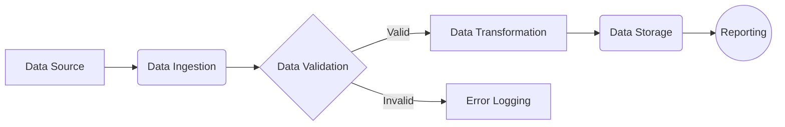

# Test Tutorial

## Chapter 1: Introduction and Core Concepts

This chapter introduces the topic of "Test Tutorial Input" and outlines the fundamental concepts necessary for understanding its purpose and implementation. We'll explore why this topic is important, what the core components are, and how to begin using them.

### Why

#### Why is this topic important?

Understanding how to create test tutorial input is crucial for developing robust and reliable educational materials.  It allows us to validate the tutorial generation process, ensuring that our system can correctly interpret and transform markdown content into structured learning experiences.  By testing with various inputs, we can identify potential weaknesses and improve the overall quality of the generated tutorials. Think of it like testing a new engine design. You don't want to put it straight into a car; you need to test it with different simulations first! This tutorial input is our simulation.

#### Why use these concepts?

The concepts introduced here – markdown parsing, tutorial generation, and validation – are foundational to building effective educational platforms. Mastering these concepts enables us to automate the creation of high-quality learning resources, making education more accessible and scalable.  Furthermore, understanding the underlying principles allows for customization and adaptation to specific learning needs.

### What

#### What is the topic?

The topic is "Test Tutorial Input," which refers to the process of creating and using markdown files as input for a tutorial generation system. This involves understanding the structure of markdown, the expected format for tutorial content, and the desired output format for the generated tutorials. We are essentially defining the language the tutorial generator speaks.

#### What are the core concepts?

The core concepts include:

*   **Markdown Syntax:** Understanding the basic syntax of markdown, including headings, lists, code blocks, and emphasis.
*   **Tutorial Structure:** Defining a consistent structure for tutorial content, including sections like introduction, examples, and exercises.
*   **Tutorial Generation:** The process of converting markdown input into a structured tutorial format, such as HTML or PDF.
*   **Validation:**  Ensuring the generated tutorial meets the defined standards for quality, accuracy, and completeness.

### How

#### How to implement core concepts?

1.  **Markdown Syntax:**  Start by familiarizing yourself with markdown syntax using online resources and editors. Experiment with different elements to understand how they are rendered.

2.  **Tutorial Structure:**  Define a template for your tutorial content, including sections for introduction, core concepts, examples, exercises, and further reading.

3.  **Tutorial Generation:**  Use a markdown parser library (e.g., Python's `markdown`) to convert the markdown input into HTML.  You may need to customize the output format to match your desired tutorial structure.

4.  **Validation:**  Write automated tests to ensure the generated tutorial meets your defined standards. These tests could check for things like the presence of headings, the correct formatting of code blocks, and the completeness of the content.

#### How to use best practices?

*   **Keep it simple:**  Use clear and concise language.
*   **Provide examples:**  Illustrate concepts with practical examples.
*   **Break down complex topics:**  Dividing content into smaller, manageable chunks.
*   **Use visuals:**  Incorporate diagrams and images to enhance understanding.
*   **Test thoroughly:**  Validate your tutorial content to ensure accuracy and completeness.

### Example

#### Hello world code

```python
def hello_world():
    print("Hello, World!")

hello_world()
```

This simple Python function demonstrates a basic "Hello, World!" program, a common starting point for learning a new programming language. It showcases a simple function definition and the `print()` statement.

#### Simple function example

Let's expand the hello world example to include a name:

```python
def hello_name(name):
  print(f"Hello, {name}!")

hello_name("Feynman")
```

This function takes a `name` as input and prints a personalized greeting.  It illustrates how to pass arguments to a function.

### Diagram

#### Diagram of core concepts

```mermaid
graph LR
    A[Markdown Input] --> B(Markdown Parser);
    B --> C{Tutorial Structure};
    C --> D[Generated Tutorial];
    D -->

---

## Chapter 2: Implementation and Best Practices

This chapter delves into the nitty-gritty of implementing the concepts discussed so far, focusing on practical implementation details and essential best practices. Think of it as moving from the theoretical whiteboard to the actual workbench, soldering iron in hand. We'll explore the 'how' behind making things work reliably and efficiently.


*   **Why are these implementation details important?** Understanding the underlying implementation allows for better debugging, optimization, and adaptation of the techniques to different scenarios. Knowing how things *really* work empowers you to go beyond blindly following instructions and truly *understand* the code. It's the difference between being a driver and a mechanic.
*   **Why use these best practices?** Best practices are born from experience – the collective wisdom of countless developers who've stumbled, learned, and refined their approaches. They lead to more robust, maintainable, and scalable code, saving time, money, and headaches in the long run. They also help avoid common pitfalls and ensure your codebase remains understandable to others (and your future self!).

## What

*   **What are the implementation details?** Implementation details include the specific algorithms, data structures, and coding techniques used to realize a particular functionality. This could involve choosing the right data structure for storing information, optimizing loops for performance, or handling edge cases gracefully.
*   **What are the best practices?** Best practices encompass coding conventions, design patterns, testing strategies, and deployment methodologies. They are the established guidelines for producing high-quality software, focusing on readability, maintainability, and reliability. For instance, writing clear comments, using descriptive variable names, and adopting a consistent coding style.

## How

*   **How to implement advanced techniques?** Advanced techniques often involve combining multiple concepts and leveraging specialized libraries or frameworks. A key aspect is breaking down complex problems into smaller, manageable components and implementing them incrementally, testing each component thoroughly before integrating it into the larger system.
*   **How to apply best practices?** Applying best practices is an ongoing process that requires discipline and a commitment to continuous improvement. It involves adopting consistent coding standards, writing comprehensive unit tests, and conducting regular code reviews. Tools like linters and static analyzers can help enforce coding standards and identify potential issues early on.

## Example

Let's consider the "Hello, World!" example provided. While simple, it illustrates key implementation and best practice principles.

```python
def hello_world():
    """Prints the greeting "Hello, World!" to the console."""
    print("Hello, World!")

hello_world() # Call the function
```

This seemingly trivial example demonstrates:

*   **Implementation:**  The implementation involves using the `print()` function to output a string to the console.
*   **Best Practice (Docstring):** The inclusion of a docstring explaining what the function does.  This is crucial for maintainability and understanding.
*   **Best Practice (Function Definition):** Encapsulating the printing logic within a function makes the code more modular and reusable.

A real-world use case might involve using this "Hello, World!" function as a sanity check within a larger application, ensuring the core environment is functioning correctly.

## Diagram

While a UML diagram might be overkill for the "Hello, World!" example, consider a more complex scenario where you're implementing a data processing pipeline. A diagram can significantly improve understanding and collaboration.



This diagram visually represents the flow of data through the pipeline, highlighting key components and their interactions. This is invaluable for understanding the system's architecture and identifying potential bottlenecks.  Each of these components would have its own implementation details and require adhering to best practices for robust and reliable operation.

---

## Chapter 3: Advanced Techniques and Optimization

This chapter delves into advanced techniques and optimization strategies to enhance your coding skills. We'll explore why these are crucial, what they entail, and how to implement them effectively.

### Why

**Why use advanced techniques?**

Imagine you're building a complex application. While a basic implementation might work initially, as data volumes grow and user demands increase, performance can quickly degrade. Advanced techniques offer sophisticated solutions to tackle these challenges. They allow you to write code that's not just functional, but also efficient, scalable, and maintainable. They can unlock functionalities and patterns that are simply not accessible through basic approaches. Think of it as leveling up your coding abilities, moving from a simple hammer to a whole toolbox of specialized tools.

**Why optimize code?**

Optimization is about making your code run faster, consume less memory, and use fewer resources. In a world where computational power is often limited (think mobile devices or embedded systems), optimization becomes paramount. Even in powerful server environments, efficient code translates to lower operating costs, improved responsiveness, and a better user experience. Consider a search engine; if it wasn't highly optimized, search queries would take minutes instead of milliseconds – rendering it practically useless. Furthermore, well-optimized code is often cleaner and more elegant, making it easier to understand and maintain.

### What

**What are the advanced techniques?**

Advanced techniques encompass a wide range of approaches. These can include:

*   **Algorithmic Optimization:** Choosing the right algorithm for the job. For example, using a hash table for fast lookups instead of iterating through a list.
*   **Data Structures:** Selecting appropriate data structures like trees, graphs, or heaps to efficiently store and manipulate data.
*   **Parallel Processing:** Utilizing multiple cores or machines to perform computations simultaneously, greatly reducing execution time.
*   **Caching:** Storing frequently used data in memory for quick access, avoiding costly re-computations.
*   **Code Profiling:** Identifying performance bottlenecks in your code to target optimization efforts effectively.

**What are the optimization strategies?**

Optimization strategies provide guidelines for refining your code. Some key strategies include:

*   **Reducing Redundancy:** Eliminating unnecessary computations or data storage.
*   **Loop Optimization:** Minimizing operations within loops, as they are executed repeatedly.  This can involve loop unrolling, vectorization, or using more efficient data structures within the loop.
*   **Memory Management:** Allocating and deallocating memory efficiently to prevent leaks and improve performance.
*   **Compiler Optimization:** Leveraging compiler flags and directives to enable automatic optimization of your code.

### How

**How to optimize code?**

Optimization is an iterative process. Start by identifying the bottlenecks in your code using profiling tools. Then, apply relevant optimization strategies.  For example, if you find that a loop is taking a long time, consider using a more efficient algorithm or data structure within the loop.  Always measure the impact of your optimizations to ensure they are actually improving performance.  Small, incremental improvements can accumulate to significant gains.

**How to benchmark different approaches?**

Benchmarking involves comparing the performance of different code implementations. Use dedicated benchmarking libraries or tools to measure execution time, memory usage, and other relevant metrics. Run your benchmarks under controlled conditions to ensure accurate and reproducible results. Consider the range of input data you use to test, to ensure your optimizations work across different scenarios.

### Example

**Optimized code example:**

Let's say you have the following inefficient code:

```python
def sum_list(data):
    total = 0
    for item in data:
        total += item
    return total
```

A more optimized version using NumPy (assuming `data` is a NumPy array) would be:

```python
import numpy as np

def sum_list_numpy(data):
    return np.sum(data)
```

NumPy's `np.sum` function is highly optimized for numerical operations and will typically be much faster than the Python loop.

**Benchmark comparison:**

Imagine you've benchmarked two implementations of a sorting algorithm, Algorithm A and Algorithm B. The benchmark results show that Algorithm A takes an average of 0.5 seconds to sort 1 million items, while Algorithm B takes

---

