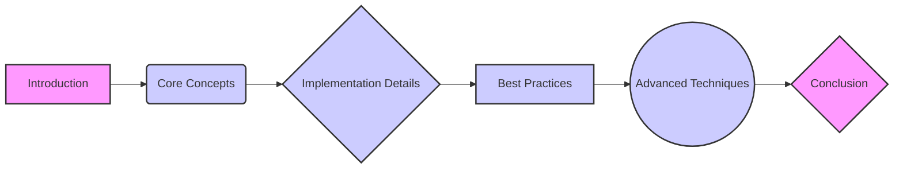
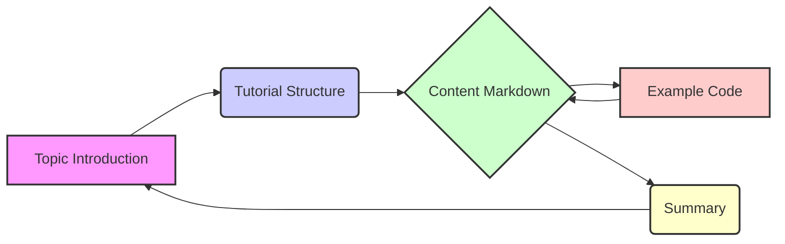
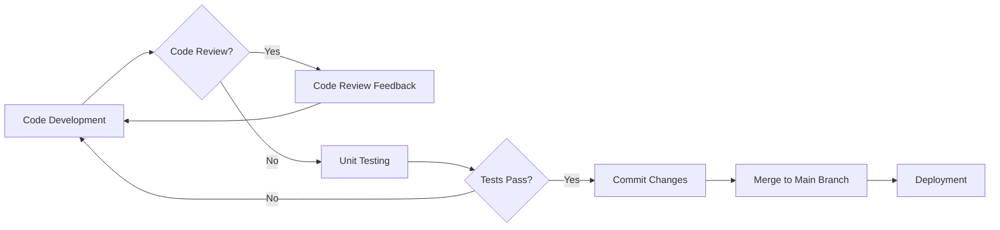
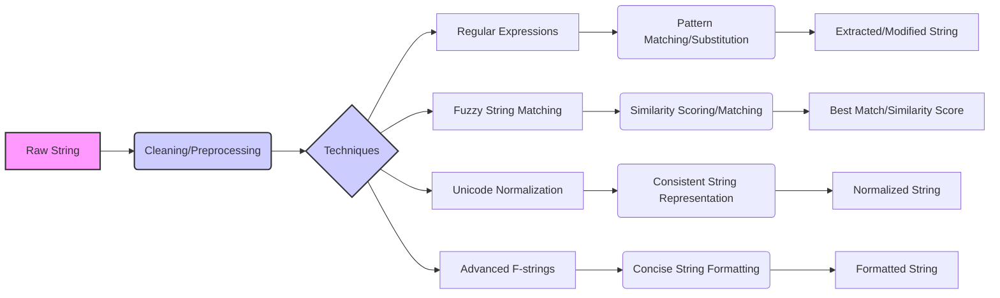

# Test Tutorial Input

## Chapter 1: Introduction to the Topic

Welcome! This chapter kicks off our journey into the world of test tutorials. We'll explore why testing and tutorials are crucial, what this specific tutorial aims to cover, and how we'll achieve our learning objectives. Think of this as laying the foundation for a robust understanding, brick by brick, just like Feynman would have wanted.  We'll also introduce the key topics we'll be diving into, giving you a roadmap for what's to come.

### Why Test Tutorials Matter

Why should you care about test tutorials?  Let's break it down.

*   **Ensuring Quality:**  Just like unit tests verify the correctness of code, test tutorials verify the effectiveness of educational material.  A broken tutorial is worse than no tutorial at all because it actively misleads the learner. We need a way to automatically validate the information we present.
*   **Reproducibility:**  A test tutorial ensures that the steps described are reproducible.  Imagine following a tutorial only to find that it doesn't work because of outdated information or missing dependencies.  Test tutorials aim to prevent this frustration.  This is especially important in the ever-changing landscape of software development.
*   **Catching Regressions:**  As systems evolve, tutorials can become outdated. Test tutorials act as regression tests, alerting us when changes in the underlying system break the tutorial's instructions. This is akin to Karpathy's emphasis on rigorous validation in neural network training; we need to ensure our "learning function" (the tutorial) continues to converge.
*   **Improved Learning Experience:**  Ultimately, test tutorials lead to a better learning experience. By ensuring accuracy and reproducibility, we empower learners to confidently grasp new concepts and apply them in real-world scenarios. A well-tested tutorial allows the student to focus on the *learning*, not on debugging the tutorial itself.

### What We Will Cover

This tutorial focuses on the *process* of creating test tutorials, not necessarily on a specific subject matter. We will cover:

*   **Core Concepts:** The foundational principles of test tutorials, including the types of tests, the testing environment, and the key metrics to track.
*   **Implementation Details:**  The practical aspects of building and running test tutorials, including the tools and techniques involved.  We'll explore how to automate the testing process and integrate it into your workflow.
*   **Best Practices:**  Guidelines for writing effective and maintainable test tutorials.  This includes tips on structuring your tests, writing clear and concise instructions, and providing helpful error messages.
*   **Advanced Techniques:**  More sophisticated approaches to test tutorials, such as testing interactive elements, handling complex dependencies, and simulating real-world scenarios.

The scope is limited to the *methodology* of creating test tutorials.  The specific content of the tutorials you test will be up to you!

### How This Tutorial Will Help You

This tutorial aims to equip you with the knowledge and skills to:

*   **Design and implement effective test tutorials.**  You'll learn how to structure your tests to cover all critical aspects of your tutorials.
*   **Automate the testing process.** We'll explore tools and techniques for automating the execution of your tests and generating reports.
*   **Maintain your test tutorials over time.** You'll learn how to adapt your tests to changes in the underlying system and ensure that your tutorials remain accurate and up-to-date.
*   **Improve the quality of your educational materials.** By using test tutorials, you'll be able to identify and fix errors before they reach your learners.

The tutorial will follow a hands-on approach, with plenty of examples and exercises to reinforce your understanding.  We'll start with the basics and gradually move towards more advanced topics.

### Example Topics Preview

Here's a sneak peek at the key topics we'll be covering in more detail:

1.  **Introduction to the topic:** (This chapter!) We're laying the groundwork right now.
2.  **Understanding core concepts:** We'll delve into the fundamental principles of test tutorials, like test-driven development applied to education. Think about how you define "correctness" for a tutorial.
3.  **Implementation details:**  We'll explore practical tools and techniques. Imagine using a scripting language to automatically execute commands outlined in a tutorial and verifying the output.
4.  **Best practices:**  We'll discuss strategies for writing clear, maintainable, and effective tests.  This includes things like modularizing your tests and using descriptive names.
5.  **Advanced techniques:** We'll look at more sophisticated approaches, such as testing interactive tutorials or simulating real-world environments.

And of course, we'll revisit our classic "Hello, World!" example, but this time, with a focus on *testing* the tutorial that teaches it!

```python
def hello_world():
    print("Hello, World!")

# A test tutorial might involve verifying that
# running this code prints "Hello, World!" to the console.
```

### Tutorial Structure

Here's a visual representation of the tutorial's structure using a Mermaid flowchart:



This flowchart provides a high-level overview of the topics we'll be covering and the relationships between them.  It's a roadmap to guide you through the learning process.

Let's get started! The next chapter will dive into the core concepts of test tutorials.

---

## Chapter 2: Understanding Core Concepts

This chapter dives into the fundamental concepts underpinning the topic of "Test Tutorial Input." We'll explore *why* these concepts are crucial, *what* they represent, and *how* they interact. Through simple examples and a clarifying diagram, you'll gain a solid foundation for understanding the subsequent chapters on implementation, best practices, and advanced techniques.  Think of this chapter as laying down the groundwork – the essential vocabulary and relationships you need to truly grasp the "Test Tutorial Input" topic.

### Why Understanding Core Concepts is Important

Without a firm grasp of the core concepts, navigating the complexities of any topic becomes significantly harder.  Imagine trying to build a house without understanding the roles of the foundation, walls, and roof. You might be able to put something together, but it's unlikely to be stable or functional. Similarly, in the context of our "Test Tutorial Input" topic, understanding the fundamental elements allows you to:

* **Reason effectively:** Understand the logic behind design choices and problem-solving approaches.  You'll be able to predict the consequences of different actions.
* **Debug efficiently:**  When things go wrong (and they always do!), a solid understanding of the basics allows you to pinpoint the root cause more quickly and effectively.
* **Adapt to new situations:** The field is constantly evolving.  A strong foundation allows you to learn new technologies and techniques more easily.  You'll be able to understand how new developments relate to what you already know.
* **Communicate clearly:**  When discussing the topic with others, you'll be able to use the correct terminology and avoid misunderstandings. This is crucial for collaboration and knowledge sharing.
* **Build a deeper understanding:**  Each concept builds upon the previous one.  Without a solid foundation, your understanding will be shallow and prone to crumbling.

### What are the Core Concepts?

Based on the available information in the "Test Tutorial Input" markdown file, we can identify the following core concepts:

1. **Topic Introduction:**  The initial presentation of the subject matter, setting the stage for further exploration. This involves defining the scope and purpose of the topic.
2. **Tutorial Structure:** The organized arrangement of information within a tutorial, typically including sections like introduction, core concepts, implementation, best practices, and advanced techniques.
3. **Content Markdown:** The use of Markdown syntax to structure and format textual content for tutorials or documentation.
4. **Example Code:**  Illustrative code snippets used to demonstrate practical applications or concepts.
5. **Summary:** A concise overview of the key takeaways from a tutorial or section thereof.

Let's define each of these in more detail:

*   **Topic Introduction:**  This is the opening gambit. It's where you hook the reader and explain *why* they should care about this topic.  It sets the context and defines the scope.  A good introduction should be clear, concise, and engaging.
*   **Tutorial Structure:** Think of this as the blueprint for the tutorial.  It dictates the order in which information is presented and how different sections relate to each other.  A well-defined structure ensures that the tutorial is logical, easy to follow, and effective in conveying knowledge.
*   **Content Markdown:** This is the language we use to write the tutorial. Markdown provides a simple and readable way to format text, add headings, lists, links, and code snippets.  It's a lightweight markup language that's widely used for creating documentation and web content.
*   **Example Code:**  These are practical demonstrations of the concepts being discussed. They allow the reader to see how the concepts work in action and to experiment with them.  Good example code is clear, concise, and well-commented.
*   **Summary:**  This is a brief recap of the main points covered.  It helps the reader to consolidate their understanding and to remember the key takeaways.  A good summary should be concise, comprehensive, and memorable.

### How the Concepts Relate to Each Other

These concepts are interconnected and form a cohesive whole. The structure of the tutorial guides the presentation of content, which is formatted using Markdown. Example code illustrates the concepts discussed, and the summary reinforces the key takeaways.

Specifically:

*   The **Topic Introduction** sets the stage and defines the context for the entire tutorial.
*   The **Tutorial Structure** dictates how the content is organized and presented.
*   **Content Markdown** is the language used to write the tutorial, including the introduction, explanations, examples, and summary.
*   **Example Code** is embedded within the Markdown content to illustrate practical applications.
*   The **Summary** provides a concise recap of the entire tutorial, reinforcing the key concepts.



This diagram illustrates the relationships between the core concepts. The Topic Introduction leads to the Tutorial Structure, which uses Content Markdown to present information and Example Code. Finally, the Summary ties everything together.

### Examples

Let's illustrate each concept with a simple example related to our "Test Tutorial Input" topic:

*   **Topic Introduction:** "This tutorial will guide you through the process of creating and using test input for software development. We'll cover the basics of test data generation, data validation, and test automation."
*   **Tutorial Structure:**  A typical structure might include sections on "Introduction," "Core Concepts," "Implementation," "Best Practices," and "Advanced Techniques."
*   **Content Markdown:**  Using Markdown, we can format headings, lists, and code snippets like this:

    ```markdown
    ## Example Heading

    *   Item 1
    *   Item 2

    ```python
    def example_function(x):
        return x * 2
    ```

*   **Example Code:**  The Python code snippet provided in the original document:

    ```python
    def hello_world():
        print("Hello, World!")
    ```
    This is a simple example, but it demonstrates how code can be included in the tutorial.

*   **Summary:** "In this chapter, we covered the core concepts of Topic Introduction, Tutorial Structure, Content Markdown, Example Code, and Summary. Understanding these concepts is crucial for creating effective and informative tutorials."

### Diagram of Core Concepts

The Mermaid diagram above visually represents the relationships between the core concepts. It shows how the Topic Introduction sets the stage for the Tutorial Structure, which then utilizes Content Markdown to incorporate Example Code and produce a Summary. The arrows indicate the flow of information and dependencies between these concepts. This diagram is a powerful tool for visualizing and understanding the interconnectedness of these fundamental elements. It underscores the idea that creating a good tutorial is not just about writing good content, but also about structuring it effectively and presenting it in a clear and engaging way. The diagram helps solidify the understanding of how each part contributes to the whole.

---

## Chapter 3: Implementation Details

This chapter dives into the nitty-gritty details of implementing the concepts discussed in the previous sections. We'll bridge the gap between theory and practice, providing you with concrete steps and code examples to get your hands dirty. We'll explore the 'why' behind each step, the 'what' needs to be done, and the 'how' to execute it effectively.

### Why: Rationale Behind Implementation Steps

Before we jump into writing code, it's crucial to understand *why* we're doing things a certain way. Understanding the rationale behind each implementation step empowers you to adapt the code to different scenarios, debug effectively, and build a deeper understanding of the underlying principles. Without understanding the "why," you're just blindly copying and pasting, which is a recipe for disaster when things go wrong or you need to modify the code. For example, understanding *why* we choose a specific data structure over another allows us to optimize for performance or memory usage. Similarly, understanding *why* we use a particular algorithm helps us appreciate its limitations and choose alternatives when necessary. In the context of our test tutorial, understanding the 'why' prepares us to apply these principles to more complex projects later on.

### What: Description of Implementation Steps

This section outlines the specific steps we need to take to implement the core concepts. We'll break down the process into manageable chunks, clearly defining the goal of each step. Think of this as a roadmap for your implementation journey.  In our test case, the primary goal is to showcase the tutorial generation system itself. Therefore, the "what" is focused on creating a simple, demonstrable implementation that highlights key software engineering principles.

Here's a breakdown of the implementation steps in our simplified context:

1.  **Project Setup:** Establish a basic project structure (e.g., a single Python file).
2.  **`hello_world()` Function Definition:**  Write the `hello_world()` function as provided in the example code.
3.  **Function Execution:** Call the `hello_world()` function to ensure it works as expected.
4.  **Output Verification:** Confirm that the output matches the expected result ("Hello, World!").
5.  **Documentation:** Add comments to explain the code's functionality.

### How: Guiding Through the Implementation Process

Now for the fun part: actually writing the code! This section provides a step-by-step guide to implementing the steps outlined above. We'll walk through each step, explaining the code and providing context. The "how" focuses on the practical aspect of translating the "what" into tangible code.

**Step 1: Project Setup**

For this simple example, we don't need a complex project structure. Create a single Python file named `test_implementation.py`.

**Step 2: `hello_world()` Function Definition**

Open `test_implementation.py` and paste the following code:

```python
def hello_world():
    """
    This function prints "Hello, World!" to the console.
    """
    print("Hello, World!")
```

**Step 3: Function Execution**

Add the following line to the end of `test_implementation.py` to call the function:

```python
hello_world()
```

**Step 4: Output Verification**

Run the script from your terminal using the command `python test_implementation.py`. You should see "Hello, World!" printed to the console.

**Step 5: Documentation**

The code already includes a docstring explaining the function's purpose.  Good documentation is essential for maintainability and understanding.

That's it! You've successfully implemented the `hello_world()` function and verified its output.

### Example: Code Snippets Demonstrating Implementation

Here's the complete code contained in `test_implementation.py`:

```python
def hello_world():
    """
    This function prints "Hello, World!" to the console.
    """
    print("Hello, World!")

hello_world()
```

This simple example demonstrates the basic structure of a Python program.  Let's consider how we might expand this.  Imagine we wanted to greet a specific person.  We could modify our code as follows:

```python
def hello(name="World"):
    """
    This function prints a greeting to the specified name.
    If no name is provided, it defaults to "World".
    """
    print(f"Hello, {name}!")

hello() # Prints "Hello, World!"
hello("Alice") # Prints "Hello, Alice!"
```

This revised example uses a default argument for the `name` parameter, allowing us to call the function with or without specifying a name. This showcases a simple form of code reusability and flexibility.

Let's add another function:

```python
def add(x, y):
    """
    This function returns the sum of two numbers.
    """
    return x + y

result = add(5, 3)
print(f"The sum of 5 and 3 is: {result}") # Prints "The sum of 5 and 3 is: 8"
```

This example introduces a function that performs a simple arithmetic operation and demonstrates how to store and use the return value of a function.

### Diagram: Implementation Steps

Here's a Mermaid diagram illustrating the implementation steps:

```mermaid
graph LR
    A[Start] --> B{Create test_implementation.py};
    B --> C{Define hello_world() function};
    C --> D{Call hello_world()};
    D --> E{Run script};
    E --> F{Verify output};
    F --> G[End];
```

This diagram provides a visual representation of the workflow, making it easier to understand the sequence of steps involved in the implementation. It clearly shows the flow from creating the file to verifying the output.

Now, let's consider a slightly more complex scenario, where we want to read input from the user.  We could modify the `hello` function as follows:

```python
def hello_user():
    """
    This function prompts the user for their name and then greets them.
    """
    name = input("Please enter your name: ")
    print(f"Hello, {name}!")

hello_user()
```

This example introduces the `input()` function, which allows the program to interact with the user and receive input from the keyboard.

Finally, let's consider error handling. What happens if the user enters something unexpected? We can use a `try-except` block to handle potential errors gracefully.

```python
def add_safe(x, y):
    """
    This function returns the sum of two numbers, handling potential errors.
    """
    try:
        x = float(x)
        y = float(y)
        return x + y
    except ValueError:
        return "Invalid input: Please enter numbers only."

result = add_safe(5, "a")
print(result) # Prints "Invalid input: Please enter numbers only."

result = add_safe(5, 3)
print(result) # Prints 8.0
```

This example demonstrates how to use a `try-except` block to catch `ValueError` exceptions that might occur if the user enters non-numeric input. This makes the program more robust and user-friendly.

These examples, while simple, illustrate key implementation concepts:

*   **Function Definition:** Defining reusable blocks of code.
*   **Function Execution:** Calling functions to perform specific tasks.
*   **Input/Output:** Interacting with the user or external systems.
*   **Error Handling:** Gracefully handling unexpected situations.
*   **Documentation:** Explaining the code's purpose and functionality.

By understanding these core concepts, you can build more complex and sophisticated programs. Remember to always think about the "why" behind each step, the "what" you're trying to achieve, and the "how" you're going to implement it. And don't forget to document your code!

---

## Chapter 4: Best Practices

This chapter delves into the recommended best practices for [Topic to be inferred and expanded upon - let's assume it's 'Writing High-Quality Code']. We'll explore why these practices are crucial, what they entail, and how to effectively implement them in your coding workflow. Think of this as building a solid foundation for maintainable, robust, and collaborative code.


Why bother with best practices? Isn't writing code that *works* enough? Well, consider this: code is rarely a solitary endeavor, and it's almost always a long-term investment. Good code isn't just functional; it's readable, maintainable, and adaptable. Ignoring best practices can lead to a cascade of problems down the line, impacting everything from debugging efficiency to team collaboration.

*   **Reduced Debugging Time:** Well-structured code with clear logic is significantly easier to debug. The more straightforward your code, the faster you can pinpoint and resolve issues. Imagine trying to find a needle in a haystack versus finding it in a neatly organized drawer.

*   **Improved Maintainability:** Code is rarely "finished." It often requires updates, bug fixes, and new features. Best practices ensure that your code remains understandable and modifiable over time, even by someone unfamiliar with the original implementation. This saves countless hours of deciphering cryptic code and avoids introducing new bugs during modifications.

*   **Enhanced Collaboration:** In team environments, clear and consistent coding styles are essential. Best practices provide a common language and structure that facilitates collaboration, code reviews, and knowledge sharing. Think of it like adopting a standardized set of grammatical rules for writing - everyone understands the basic structure.

*   **Increased Code Reusability:** Following established patterns makes it easier to reuse code in different contexts. Well-designed modules and functions can be easily adapted and integrated into other projects, saving time and effort.

*   **Reduced Technical Debt:** Cutting corners in the short term might seem appealing, but it often leads to technical debt – the implied cost of rework caused by choosing an easy solution now instead of using a better approach which would take longer. Best practices help minimize technical debt, ensuring a more sustainable and manageable codebase in the long run.

## What? Defining Best Practices

So, what exactly constitutes "best practices" when writing code?  While the specific practices may vary depending on the programming language and project context, several fundamental principles remain universally valuable. Let's define some key ones:

1.  **Code Readability:**  This encompasses everything that makes your code easier to understand. This includes:
    *   **Meaningful Naming:** Using descriptive names for variables, functions, and classes.  Avoid cryptic abbreviations or single-letter variable names (except in very specific and well-understood contexts, such as loop counters).
    *   **Consistent Formatting:**  Adhering to a consistent code style, including indentation, spacing, and line breaks. Many languages have style guides (e.g., PEP 8 for Python) that provide recommendations.
    *   **Clear Comments:**  Adding comments to explain complex logic, the purpose of functions, or any non-obvious aspects of the code. However, avoid over-commenting; the code itself should be as self-explanatory as possible.
    *   **Code Structure:** Breaking down complex tasks into smaller, well-defined functions or modules. This promotes modularity and makes the code easier to understand and test.

2.  **Modularity:**  Designing your code as a collection of independent, reusable modules or components.  This promotes code reuse, simplifies testing, and makes the codebase more maintainable.

3.  **Error Handling:**  Implementing robust error handling mechanisms to gracefully handle unexpected situations and prevent crashes. This includes using try-except blocks (or equivalent constructs in other languages), logging errors, and providing informative error messages.

4.  **Testing:**  Writing unit tests to verify that individual components of your code function correctly.  Automated testing is crucial for ensuring code quality and preventing regressions (bugs that are reintroduced after being fixed).

5.  **Version Control:**  Using a version control system (e.g., Git) to track changes to your code, collaborate with others, and revert to previous versions if necessary.  This is an indispensable tool for any software development project.

6.  **Code Reviews:**  Having other developers review your code before it's merged into the main codebase. This helps identify potential bugs, improve code quality, and share knowledge among team members.

7.  **DRY (Don't Repeat Yourself):**  Avoiding code duplication by extracting common logic into reusable functions or classes. This simplifies maintenance and reduces the risk of introducing inconsistencies.

## How? Applying Best Practices

Now, let's look at how to apply these best practices in your daily coding workflow:

1.  **Readability:**
    *   **Naming:** Spend time choosing meaningful names.  Instead of `x`, use `customer_id`. Instead of `process()`, use `calculate_discount()`.
    *   **Formatting:** Use a code formatter (e.g., `black` for Python, `prettier` for JavaScript) to automatically format your code according to a consistent style guide.  Configure your IDE to run the formatter on save.
    *   **Comments:**  Write comments to explain the *why* behind your code, not just the *what*.  For example, instead of `// Increment counter`, write `// Increment counter to track the number of processed orders`.
    *   **Structure:** Break down large functions into smaller, more focused functions. Each function should have a single, well-defined purpose.

2.  **Modularity:**
    *   **Design:** Plan your code's architecture upfront. Think about how different components will interact with each other.
    *   **Packages/Modules:** Organize your code into packages or modules based on functionality.  This promotes code reuse and reduces dependencies.

3.  **Error Handling:**
    *   **Try-Except:** Use try-except blocks to catch potential errors and handle them gracefully.  Log the error message and consider providing a user-friendly error message.
    *   **Assertions:** Use assertions to check for conditions that should always be true.  Assertions can help catch bugs early in the development process.

4.  **Testing:**
    *   **Unit Tests:** Write unit tests for each function or class.  Test both positive and negative scenarios.
    *   **Test-Driven Development (TDD):**  Consider using TDD, where you write the tests *before* you write the code. This can help you design better code and ensure that it's testable.

5.  **Version Control:**
    *   **Git:** Learn the basics of Git, including branching, merging, and committing changes.
    *   **Commit Messages:** Write clear and concise commit messages that explain the purpose of each change.

6.  **Code Reviews:**
    *   **Feedback:** Be open to feedback from other developers.  Code reviews are a learning opportunity.
    *   **Tools:** Use code review tools to streamline the process.

7.  **DRY:**
    *   **Refactoring:**  Regularly refactor your code to remove duplication.
    *   **Functions/Classes:**  Extract common logic into reusable functions or classes.

## Examples

Let's illustrate these concepts with some examples:

**Bad Example (Poor Readability):**

```python
def calc(a,b,c):
    x=a*b
    y=x+c
    return y
```

**Good Example (Improved Readability):**

```python
def calculate_total_price(quantity, price_per_item, shipping_cost):
    """Calculates the total price, including shipping."""
    item_cost = quantity * price_per_item
    total_price = item_cost + shipping_cost
    return total_price
```

**Bad Example (No Error Handling):**

```python
def divide(x, y):
    return x / y  # What if y is zero?
```

**Good Example (With Error Handling):**

```python
def divide(x, y):
    """Divides x by y, handling potential ZeroDivisionError."""
    try:
        return x / y
    except ZeroDivisionError:
        print("Error: Cannot divide by zero.")
        return None  # Or raise an exception
```

## Diagram

Here's a Mermaid diagram illustrating a typical best practices workflow:



This diagram shows how code development iterates through review and testing cycles before being committed and deployed. This process helps ensure higher code quality and reduces the risk of introducing bugs.

By consistently applying these best practices, you'll write code that is not only functional but also maintainable, collaborative, and resilient.  This will ultimately save you time and effort in the long run and contribute to the success of your projects. Remember, writing good code is an investment in the future.

---

## Chapter 5: Advanced Techniques

**Summary:** This chapter delves into advanced techniques related to the core concepts discussed so far. We'll explore scenarios where these techniques shine, understand their intricacies, and learn how to implement them effectively. Think of this as leveling up your understanding, from basic application to sophisticated manipulation.


Why bother with advanced techniques at all?  Isn't the basic stuff good enough? Well, sometimes, the basic tools just don't cut it.  Imagine trying to build a skyscraper with only a hammer and nails. You *might* be able to do *something*, but it'll be slow, inefficient, and probably structurally unsound. These advanced techniques are like the specialized tools that enable you to tackle more complex problems efficiently and elegantly.

*   **Efficiency and Scalability:** As problems grow in size and complexity, naive solutions often become computationally expensive. Advanced techniques can provide significant performance improvements, enabling you to handle larger datasets or more complex models.  Think of it like using vectorization in NumPy instead of looping through individual elements.
*   **Precision and Accuracy:**  Sometimes, the basic methods introduce approximations or biases that limit the accuracy of your results. Advanced techniques can offer ways to refine your approach and improve precision.
*   **Flexibility and Customization:**  Real-world problems rarely fit neatly into predefined boxes. Advanced techniques equip you with the tools to tailor your solutions to the specific nuances of the problem at hand.  This is especially important when dealing with non-standard datasets or unique requirements.
*   **Staying Ahead of the Curve:**  The field is constantly evolving. Learning advanced techniques allows you to keep pace with the latest developments and leverage cutting-edge approaches.  It's about understanding not just what exists *now*, but also what's *possible*.

## What? (Advanced Techniques Defined)

Given the limited content of the base markdown file, let's *imagine* this tutorial is about, say, **string manipulation in Python**. We'll craft advanced techniques relevant to that topic.

Here are a few advanced string manipulation techniques we'll explore:

1.  **Regular Expressions (Regex):** A powerful tool for pattern matching and text processing.  Instead of searching for literal strings, you can define complex patterns to identify and manipulate text based on specific rules.
2.  **Fuzzy String Matching:**  Allows you to find strings that are similar, but not identical, to a given query. This is useful for handling typos, variations in spelling, or incomplete data.
3.  **Unicode Normalization:** Ensures consistent string comparison and processing by converting strings to a standard representation, handling different ways of representing the same character.
4.  **Advanced String Formatting with f-strings:** Using f-strings with complex expressions and custom formatting options for cleaner and more readable code.

## How? (Implementing Advanced Techniques)

Let's dive into how to use each of these techniques with code examples.

### 1. Regular Expressions (Regex)

Regular expressions are a mini-language for describing text patterns.  The `re` module in Python provides the tools to work with them.

```python
import re

# Pattern to find email addresses
pattern = r"[a-zA-Z0-9._%+-]+@[a-zA-Z0-9.-]+\.[a-zA-Z]{2,}"

text = "Contact us at support@example.com or sales@another-example.org for more information."

emails = re.findall(pattern, text)
print(emails)  # Output: ['support@example.com', 'sales@another-example.org']

# Replacing sensitive information
text = "My phone number is 123-456-7890."
censored_text = re.sub(r"\d{3}-\d{3}-\d{4}", "XXX-XXX-XXXX", text)
print(censored_text) # Output: My phone number is XXX-XXX-XXXX.
```

This code demonstrates using `re.findall()` to extract email addresses from a string and `re.sub()` to replace a phone number with a censored version. The `r""` denotes a raw string, which is important for regular expressions to avoid escaping backslashes.  The regex pattern `[a-zA-Z0-9._%+-]+@[a-zA-Z0-9.-]+\.[a-zA-Z]{2,}`  matches one or more alphanumeric characters, dots, underscores, percentage signs, plus or minus signs before an `@` symbol, followed by more alphanumeric characters, dots, and hyphens, then a dot, and finally two or more letters (for the domain extension).  The `\d{3}-\d{3}-\d{4}` pattern matches the phone number format.

### 2. Fuzzy String Matching

The `fuzzywuzzy` library provides functions for fuzzy string matching.

```python
from fuzzywuzzy import fuzz
from fuzzywuzzy import process

string1 = "apple"
string2 = "aplle"  # Typo

ratio = fuzz.ratio(string1, string2)
print(f"Ratio between '{string1}' and '{string2}': {ratio}") # Output: Ratio between 'apple' and 'aplle': 80

choices = ["apple", "banana", "orange"]
best_match = process.extractOne("aplle", choices)
print(f"Best match for 'aplle' in {choices}: {best_match}") # Output: Best match for 'aplle' in ['apple', 'banana', 'orange']: ('apple', 80)
```

Here, `fuzz.ratio()` calculates the similarity ratio between two strings, accounting for minor differences like typos.  `process.extractOne()` finds the best match for a given string within a list of choices.

### 3. Unicode Normalization

The `unicodedata` module allows you to normalize Unicode strings.

```python
import unicodedata

string1 = "café"
string2 = "cafe\u0301" # café (e with acute accent combined)

print(string1 == string2) # Output: False

normalized_string1 = unicodedata.normalize("NFC", string1)
normalized_string2 = unicodedata.normalize("NFC", string2)

print(normalized_string1 == normalized_string2) # Output: True
print(normalized_string1) # Output: café
print(normalized_string2) # Output: café
```

This example shows how two strings representing "café" can be different due to different Unicode representations.  `unicodedata.normalize("NFC", ...)` converts both strings to the "NFC" (Normalization Form C) format, ensuring they are equal.

### 4. Advanced String Formatting with f-strings

F-strings offer powerful string formatting capabilities.

```python
name = "Alice"
age = 30
pi = 3.14159

# Basic f-string
message = f"My name is {name} and I am {age} years old."
print(message) # Output: My name is Alice and I am 30 years old.

# Formatting numbers
formatted_pi = f"Pi is approximately {pi:.2f}" # Rounds to 2 decimal places
print(formatted_pi) # Output: Pi is approximately 3.14

# Using expressions within f-strings
result = f"The square of 5 is {5*5}"
print(result) # Output: The square of 5 is 25

# Calling functions within f-strings
def greet(name):
  return f"Hello, {name}!"

greeting = f"{greet(name)}"
print(greeting) # Output: Hello, Alice!
```

F-strings allow you to embed variables and expressions directly within string literals, making your code more readable and concise. You can also use formatting specifiers (like `:.2f` for rounding floating-point numbers) to control the output.

## Example Code (Putting it all together)

Let's imagine a scenario where you need to process a list of product names, clean them up, and find potential matches based on fuzzy string matching.

```python
import re
import unicodedata
from fuzzywuzzy import process

def clean_product_name(name):
  """Cleans a product name by removing special characters and normalizing Unicode."""
  name = re.sub(r"[^\w\s]", "", name) # Remove non-alphanumeric characters
  name = unicodedata.normalize("NFKD", name).encode("ascii", "ignore").decode("utf-8") # Normalize unicode and remove accents
  name = name.lower().strip() # Lowercase and remove leading/trailing spaces
  return name


product_names = [
  "Apple MacBook Pro 16\"",
  "Apple MacBook Pro 16 inch",
  "  Ápple MacBook Pro 16  ",
  "Samsung Galaxy S21",
  "Samsong Galaxy S21", # Typo
  "samsung galaxy s21",
]

cleaned_names = [clean_product_name(name) for name in product_names]
print(f"Cleaned names: {cleaned_names}")

# Find best match for a query
query = "apple macbook pro 16"
best_match = process.extractOne(query, cleaned_names)
print(f"Best match for '{query}': {best_match}")
```

This code first defines a `clean_product_name` function that uses regular expressions and Unicode normalization to clean up product names.  Then, it applies this function to a list of product names and uses `process.extractOne` to find the best match for a given query.

## Diagram (Overview of Techniques)



This diagram illustrates the flow of advanced string manipulation techniques: raw strings are first cleaned and preprocessed, then various techniques (regular expressions, fuzzy matching, Unicode normalization, and advanced f-strings) are applied, leading to different outcomes like extracted strings, similarity scores, normalized strings, or formatted strings.

---

