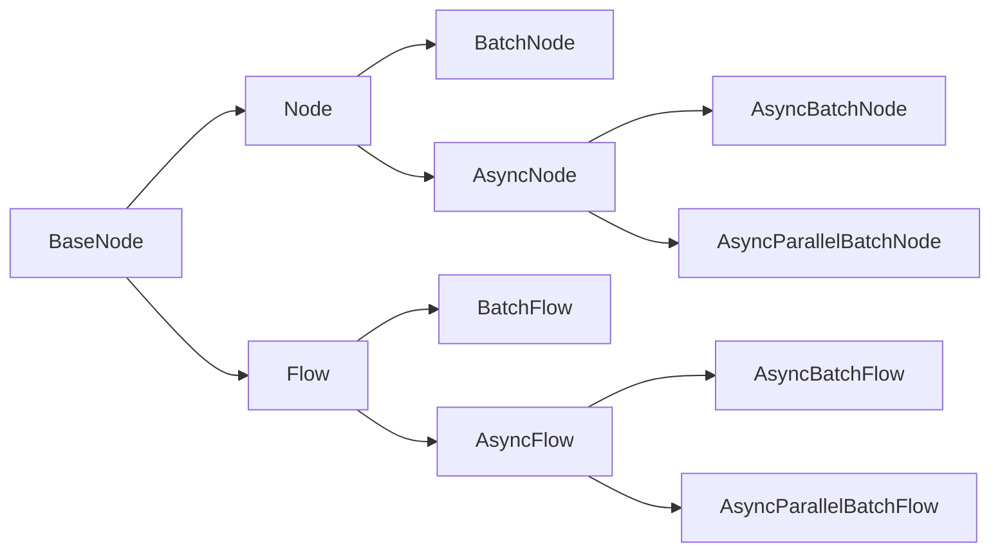
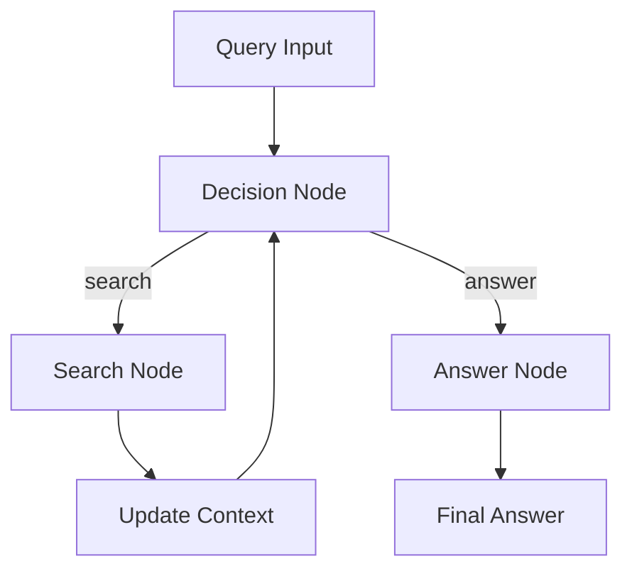

# Qflow Library Documentation

This documentation covers the Qflow library and demonstrates how to design, execute, and extend flows of operations.

## Table of Contents
1. [Introduction](#introduction)
2. [Basic Concepts](#basic-concepts)
3. [Simple Synchronous Usage](#simple-synchronous-usage)
4. [Conditional Transitions](#conditional-transitions)
5. [Batch Processing](#batch-processing)
6. [Advanced Asynchronous Usage](#advanced-asynchronous-usage)
7. [Mermaid Diagram](#mermaid-diagram)
8. [Comprehensive Example with Different Node Types](#comprehensive-example-with-different-node-types)
9. [Additional Node Types Examples](#additional-node-types-examples)
10. [Decision Flow Pattern](#decision-flow-pattern)

## Introduction

Qflow enables flexible connection of nodes (operations) in a flow. Nodes can be synchronous or asynchronous and may include retries, conditional transitions, and batch processing.

## Basic Concepts

- **BaseNode**: The core building block.
- **Node**: Synchronous nodes with retries.
- **Flow**: Executes nodes sequentially.
- **AsyncNode/AsyncFlow**: Asynchronous versions of Node and Flow.
- **BatchNode/BatchFlow**: Processes collections of items.

## Simple Synchronous Usage

```python
from qflow import Node, Flow

class PrintNode(Node):
    def prep(self, shared: dict) -> str:
        return shared.get("message", "No message")

    def exec(self, prep_res: str) -> str:
        print("Executing:", prep_res)
        return "default"  # Triggers default next node

    def post(self, shared: dict, prep_res: str, exec_res: str) -> None:
        print("Finished:", prep_res)

# Setup a flow with two nodes
n1 = PrintNode()
n2 = PrintNode()
n1 >> n2

flow = Flow(n1)
flow.run({"message": "Hello from Shared!"})
```

## Conditional Transitions

Nodes can transition based on result values. Use the subtraction operator for condition-based linking.

```python
from qflow import Node, Flow

class ConditionNode(Node):
    def prep(self, shared: dict) -> int:
        return shared.get("counter", 0)

    def exec(self, prep_res: int) -> str:
        # Return condition string based on counter value
        return "high" if prep_res > 5 else "low"

    def post(self, shared: dict, prep_res: int, exec_res: str) -> str:
        print(f"Counter {prep_res} is {exec_res}.")
        return exec_res

n_main = ConditionNode()
n_high = PrintNode()
n_low = PrintNode()
# Setup conditional transitions
n_main - "high" >> n_high
n_main - "low" >> n_low

flow = Flow(n_main)
flow.run({"counter": 7})
```

## Batch Processing

Batch nodes process lists of items. The following example demonstrates executing a node for each list item.

```python
from qflow import BatchNode, BatchFlow

class ProcessItem(BatchNode):
    def prep(self, shared: dict) -> dict:
        return shared

    def exec(self, item: int) -> int:
        result = item * 2
        print("Processed:", item, "->", result)
        return result

    def post(self, shared: dict, prep_res: dict, exec_res: list) -> list:
        return exec_res

items = [1, 2, 3, 4]
batch_node = ProcessItem()
flow = BatchFlow(batch_node)
result = flow.run({"items": items})
print("Batch Result:", result)
```

## Advanced Asynchronous Usage

Advanced flows support asynchronous nodes, including parallel batch processing. In the example below, nodes process items concurrently.

```python
import asyncio
from qflow import AsyncNode, AsyncFlow

class AsyncPrintNode(AsyncNode):
    async def prep_async(self, shared: dict) -> str:
        await asyncio.sleep(0.1)
        return shared.get("message", "No async message")

    async def exec_async(self, prep_res: str) -> str:
        print("Async Executing:", prep_res)
        return "default_async"

    async def post_async(self, shared: dict, prep_res: str, exec_res: str) -> None:
        print("Async Finished:", prep_res)

async def main():
    n1 = AsyncPrintNode()
    n2 = AsyncPrintNode()
    n1 >> n2  # Sequential async flow
    flow = AsyncFlow(n1)
    await flow.run_async({"message": "Hello from Async Flow"})
    
    # Example with conditional logic in async flow could also be implemented similarly.

asyncio.run(main())
```

## Mermaid Diagram

Below is an overview of the node and flow relationships in Qflow:



## Comprehensive Example with Different Node Types

The following example demonstrates multiple node types within a single project.

```python
import asyncio
from qflow import Node, BatchNode, AsyncNode, Flow, AsyncFlow

# Synchronous Node Example
class SyncPrintNode(Node):
    def prep(self, shared: dict) -> str:
        return shared.get("text", "sync")
    def exec(self, prep_res: str) -> str:
        print("Sync:", prep_res)
        return "default"
    def post(self, shared: dict, prep_res: str, exec_res: str) -> None:
        pass

# Batch Node Example: processes list items
class MultiplyBatch(BatchNode):
    def prep(self, shared: dict) -> dict:
        return shared
    def exec(self, number: int) -> int:
        return number * 3
    def post(self, shared: dict, prep_res: dict, exec_res: list) -> list:
        print("Batch Result:", exec_res)
        return exec_res

# Asynchronous Node Example
class AsyncPrintNode(AsyncNode):
    async def prep_async(self, shared: dict) -> str:
        return shared.get("text", "async")
    async def exec_async(self, prep_res: str) -> str:
        print("Async:", prep_res)
        return "default_async"
    async def post_async(self, shared: dict, prep_res: str, exec_res: str) -> None:
        pass

# Build and execute a synchronous flow
sync_node = SyncPrintNode()
sync_node >> MultiplyBatch()  # Link to batch processing node
sync_flow = Flow(sync_node)
sync_flow.run({"text": "Hello from Sync Flow", "items": [1, 2, 3]})

# Build and execute an asynchronous flow
async_node = AsyncPrintNode()
async_flow = AsyncFlow(async_node)

async def run_async():
    await async_flow.run_async({"text": "Hello from Async Flow"})

asyncio.run(run_async())
```

## Additional Node Types Examples

Below are examples demonstrating asynchronous batch processing nodes.

### AsyncBatchNode Example

```python
import asyncio
from qflow import AsyncBatchNode, AsyncBatchFlow

class AsyncMultiplyNode(AsyncBatchNode):
    async def prep_async(self, shared: dict) -> dict:
        return shared
    async def exec_async(self, number: int) -> int:
        await asyncio.sleep(0.1)
        return number * 10
    async def post_async(self, shared: dict, prep_res: dict, exec_res: list) -> list:
        print("Async Batch Result:", exec_res)
        return exec_res

async def run_async_batch():
    node = AsyncMultiplyNode()
    flow = AsyncBatchFlow(node)
    result = await flow.run_async({"items": [1, 2, 3, 4]})
    print("Final AsyncBatchFlow result:", result)

asyncio.run(run_async_batch())
```

### AsyncParallelBatchNode Example

```python
import asyncio
from qflow import AsyncParallelBatchNode, AsyncParallelBatchFlow

class AsyncParallelMultiplyNode(AsyncParallelBatchNode):
    async def prep_async(self, shared: dict) -> dict:
        return shared
    async def exec_async(self, number: int) -> int:
        await asyncio.sleep(0.1)
        return number + 5
    async def post_async(self, shared: dict, prep_res: dict, exec_res: list) -> list:
        print("Async Parallel Batch Result:", exec_res)
        return exec_res

async def run_async_parallel_batch():
    node = AsyncParallelMultiplyNode()
    flow = AsyncParallelBatchFlow(node)
    result = await flow.run_async({"items": [10, 20, 30]})
    print("Final AsyncParallelBatchFlow result:", result)

asyncio.run(run_async_parallel_batch())
```

## Decision Flow Pattern

The decision flow pattern allows for dynamic flow control based on LLM responses. This pattern is useful for creating interactive agents that can make decisions about next steps and execute different actions based on context.

### Example: Web Search Agent

The following example demonstrates a decision flow that:
1. Takes a user query
2. Decides whether to search or answer directly
3. Performs web searches when needed
4. Provides final answers using context from searches

```python
from qflow import Node, Flow

class DecideAction(Node):
    def exec(self, inputs):
        query, context = inputs
        # Ask LLM to decide next action
        decision = call_llm("""
        Given input: {query}
        Previous search results: {context}
        
        Decide whether to:
        1. Search for more information
        2. Answer with current context
        """)
        return {"action": "search"} # or {"action": "answer"}

class SearchWeb(Node):
    def exec(self, search_term):
        # Perform web search
        results = search_web(search_term)
        return results

class DirectAnswer(Node):
    def exec(self, inputs):
        query, context = inputs
        # Generate answer using context
        return call_llm(f"Answer {query} using {context}")

# Connect nodes with conditions
decide = DecideAction()
search = SearchWeb()
answer = DirectAnswer()

decide - "search" >> search
decide - "answer" >> answer
search - "decide" >> decide  # Loop back for multiple searches

flow = Flow(start=decide)
```

### Key Components of Decision Flows

1. **Decision Node**
   - Takes current state/context
   - Uses LLM to decide next action
   - Returns action identifier

2. **Action Nodes**
   - Implement specific behaviors (search, answer, etc.)
   - Update shared context
   - Can loop back to decision node

3. **Context Management**
   - Maintains history of actions and results
   - Informs future decisions
   - Provides background for final answers

### Best Practices

1. **Structured Decisions**
   - Use XML or JSON format for LLM decisions
   - Include reasoning with decisions
   - Validate decision structure

2. **Error Handling**
   - Provide fallback behaviors
   - Handle API failures gracefully
   - Log decision process

3. **Context Management**
   - Limit context size
   - Keep relevant information
   - Structure context for LLM consumption

### Mermaid Diagram: Decision Flow



## Summary

This tutorial introduced:
- Simple synchronous node flows.
- Conditional transitions based on execution results.
- Batch processing for itemized operations.
- Advanced asynchronous flows with parallel execution potential.

Experiment and extend these examples to build custom workflows tailored to your needs.

