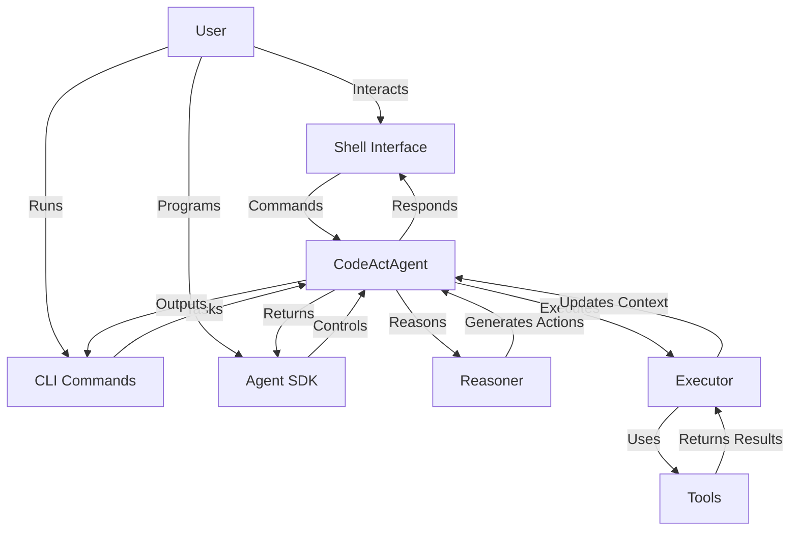

# Quantalogic CodeAct

Quantalogic CodeAct is a modular framework for building AI agents that reason, act, and interact using the **ReAct** paradigm, with **executable Python code** as the primary action language. Part of the QuantaLogic ecosystem, CodeAct empowers developers and users to solve complex tasks, automate workflows, and engage in conversational interactions through CLI, shell, and Python SDK interfaces.

+ [](https://pypi.org/project/quantalogic)
+ [](https://github.com/quantalogic/quantalogic/actions)
+ [](https://github.com/quantalogic/quantalogic/blob/main/LICENSE)

---

## Why CodeAct?

CodeAct addresses the need for AI agents that can handle complex, multi-step tasks with precision and adaptability. Key benefits include:

- **Robust Task Solving**: Breaks down tasks into reasoning and executable code actions.
- **Modularity**: Plug-and-play tools, reasoners, and executors for customization.
- **Accessible Interfaces**: CLI, interactive shell, and Python SDK for diverse users.
- **Scalability**: Supports applications from simple calculations to advanced automation.

---

## What is CodeAct?

CodeAct is a framework within QuantaLogic that enables AI agents to reason and act using the ReAct paradigm, with a focus on executable Python code. It integrates LLMs (via LiteLLM), a robust tool system, and interactive interfaces to solve tasks, automate processes, and engage in conversations.

### CodeAct Principle and ReAct

CodeAct builds on the **ReAct** paradigm ([ReAct Paper](https://arxiv.org/abs/2210.03629)) and is formalized in the **CodeAct Paper** ([Yang et al., 2024](https://arxiv.org/html/2402.01030v4)). ReAct combines:

- **Reasoning**: Generating plans or code based on task context.
- **Acting**: Executing actions (e.g., running Python code) and observing results.
- **Iterating**: Repeating until the task is solved or a limit is reached.

CodeAct enhances ReAct by using **executable Python code** as the primary action format, leveraging LLMs’ code proficiency and Python’s ecosystem. This is supported by the [quantalogic-pythonbox](https://github.com/quantalogic/quantalogic-pythonbox) project, which provides a secure, sandboxed environment for code execution.

**Example Interaction**:
```markdown
<execute>
print("Hello, World!")
</execute>
```
The agent executes this code, observes the output, and continues reasoning.

### ReAct Agent

The `CodeActAgent` implements the ReAct loop:
1. **Input**: Receives a task (e.g., "Calculate Fibonacci").
2. **Reasoning**: Generates a plan or code using an LLM.
3. **Action**: Executes code or calls tools via an executor.
4. **Evaluation**: Iterates until completion.

### Architecture

CodeAct’s modular architecture includes:



- **Agent**: Orchestrates the ReAct loop.
- **Reasoner**: Generates plans or code.
- **Executor**: Runs code or tools.
- **Tools**: Perform specific tasks (e.g., math calculations).
- **Interfaces**: Shell, CLI, SDK.

---

## Getting Started

### Installation

#### Prerequisites
- Python 3.12+
- Poetry (`pip install poetry`)
- LLM API keys (e.g., `GEMINI_API_KEY`)

#### Steps
1. Install QuantaLogic:
   ```bash
   pip install quantalogic
   ```
2. Set API keys:
   ```bash
   export GEMINI_API_KEY="your-api-key"
   ```
3. Verify:
   ```bash
   quantalogic_codeact shell
   ```

See [Installation Guide](installation.md).

### Quick Start

#### Interactive Shell
```bash
quantalogic_codeact shell
```
Example:
```
[cfg:config.yaml] [Agent] [codeact]> /solve "What is 2 + 2?"
[Final Answer]
4
```

#### CLI
```bash
quantalogic_codeact task "Solve 2 + 2" --streaming
```

### Using the Agent SDK

```python
from quantalogic_codeact.codeact.agent import Agent
from quantalogic_codeact.codeact.agent_config import AgentConfig
from quantalogic_toolbox import create_tool, Tool

@create_tool
async def fibonacci(n: int) -> int:
    """Calculate the nth Fibonacci number."""
    a, b = 0, 1
    for _ in range(n):
        a, b = b, a + b
    return a

config = AgentConfig(
    model="deepseek/deepseek-chat",
    enabled_toolboxes=["math_tools"],
    tools=[fibonacci]
)
agent = Agent(config=config)

def monitor_event(event):
    if event.event_type == "TaskCompleted":
        print(f"Task completed: {event.final_answer}")

agent.add_observer(monitor_event, ["TaskCompleted"])
result = agent.sync_solve("Calculate the 6th Fibonacci number")
print(f"Final Answer: {result[-1].get('result')}")
# Output: "Final Answer: 8"
```

---

## Commands

### Shell Commands
| Command              | Description                                      | Example                       |
|----------------------|--------------------------------------------------|-------------------------------|
| `/solve <task>`      | Solve a task                                    | `/solve Integrate x^2`        |
| `/chat <message>`    | Converse with the agent                         | `/chat How are you?`          |
| `/config show`       | Show configuration                              | `/config show`                |
| `/setmodel <model>`  | Set LLM model                                   | `/setmodel deepseek/deepseek-chat` |
| `/exit`              | Exit shell                                      | `/exit`                       |

### CLI Commands
```bash
quantalogic_codeact [OPTIONS] COMMAND [ARGS]...
```
- `shell`: Start interactive shell.
- `task`: Run a task.
- `list-models`: List LLMs.

Example:
```bash
quantalogic_codeact task "Calculate sqrt(16)" --model gemini/gemini-2.0-flash
```

See [CLI Reference](cli-reference.md).

---

## Examples

See [Examples](examples/simple-agent.md) for detailed guides. Sample configuration:
```yaml
model: "deepseek/deepseek-chat"
max_iterations: 5
enabled_toolboxes:
  - math_tools
```

---

## Configuration

Configure via `~/.quantalogic/config.yaml`:
```yaml
model: "gemini/gemini-2.0-flash"
max_iterations: 5
enabled_toolboxes:
  - math_tools
```

See [Installation Guide](installation.md#required-configuration).

---

## Contributing

Contribute via [GitHub](https://github.com/quantalogic/quantalogic). See [Contributing Guide](dev/contributing.md).

---

## References
- [ReAct Paper](https://arxiv.org/abs/2210.03629)
- [CodeAct Paper](https://arxiv.org/html/2402.01030v4)
- [quantalogic-pythonbox](https://github.com/quantalogic/quantalogic-pythonbox)