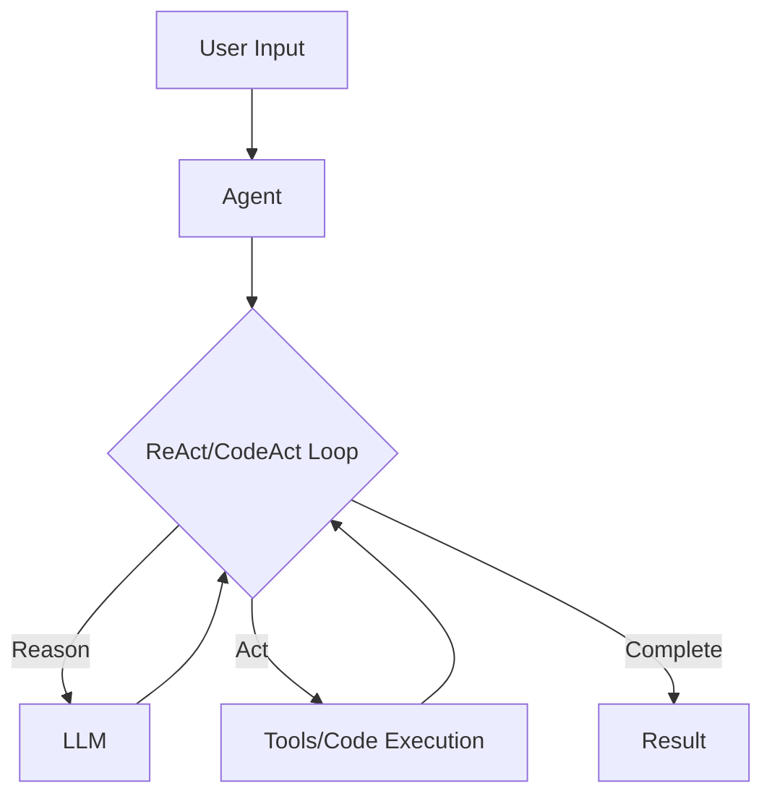
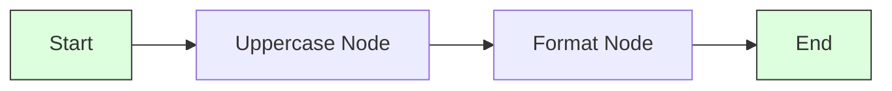
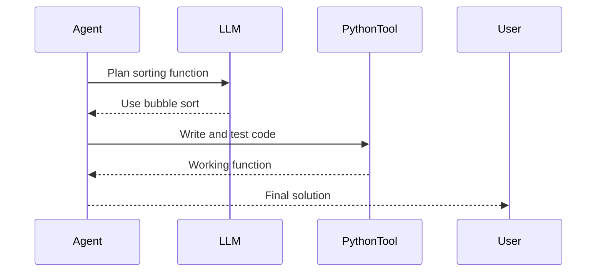

# Core Concepts

Understand the foundational elements of QuantaLogic, including its four modes: **ReAct**, **CodeAct**, **Flow**, and **Chat**.

---

## What are ReAct and CodeAct?

**ReAct** (Reasoning and Acting) is a paradigm that enables AI agents to solve complex tasks by alternating between reasoning and action ([ReAct Paper](https://arxiv.org/abs/2210.03629)). **CodeAct** extends ReAct by using executable Python code as the primary action language, leveraging LLMs’ code proficiency for precise automation ([CodeAct Paper](https://arxiv.org/html/2402.01030v4)).

**How They Work**:
- **Reasoning**: The agent analyzes the task, plans steps, or generates code.
- **Acting**: The agent executes actions (tools in ReAct, code in CodeAct) and observes results.
- **Looping**: The process repeats until the task is complete.

**Example**:
- ReAct: “Write a script” → Reason (plan steps) → Act (use `WriteFileTool`).
- CodeAct: “Calculate Fibonacci” → Reason (write code) → Act (execute code).

**Diagram**:

---

## What is Flow?

**Flow** orchestrates structured workflows using nodes (tasks) and transitions (connections). It’s ideal for repeatable processes like data pipelines or report generation.

**Key Components**:
- **Nodes**: Individual tasks (e.g., LLM calls, data processing).
- **Workflows**: Define how nodes connect and execute.
- **Context**: A shared dictionary for passing data between nodes.

**Example**: A workflow to uppercase text and format it.

**Diagram**:

---

## What is Chat?

**Chat** mode enables natural, tool-augmented conversations. The agent responds to queries, calling tools (e.g., web search) when needed, with a customizable persona.

**Example**: “What’s the weather?” → Agent searches and responds.

---

## The Agent

The **Agent** is the core component, orchestrating tasks across modes. It:
- Interprets user instructions.
- Selects appropriate tools or code.
- Manages context and memory.
- Iterates until task completion.

See [Agent API](api/agent.md).

---

## The Tool System

Tools are modular functions that agents use to perform tasks. They run in a secure, Docker-based sandbox.

**Examples**:
- `PythonTool`: Executes Python code (used heavily in CodeAct).
- `DuckDuckGoSearchTool`: Performs web searches.
- `WriteFileTool`: Manages file operations.

See [Tool Development](best-practices/tool-development.md).

---

## Memory Management

Agents maintain context using:
- **AgentMemory**: Stores conversation history.
- **VariableMemory**: Manages task-specific variables.

Memory is compacted to optimize performance for long tasks.

See [Memory API](api/memory.md).

---

## Key Principles

- **Safety**: Tools run in isolated environments.
- **Transparency**: Events and logs provide insight into agent actions.
- **Flexibility**: Supports multiple LLMs and custom tools.
- **Learning**: Agents improve by retaining successful patterns.

---

## Example Flow

**Task**: “Write a function to sort numbers.”

1. **User Input**: Agent receives the task.
2. **Reasoning**: Plans to write and test a sorting function.
3. **Action**: Uses `PythonTool` to generate and execute code.
4. **Result**: Returns a working function.

**Sequence**:

---

## Next Steps
- Try the [Quick Start](quickstart.md)
- Explore [CodeAct](codeact.md) and [Flow](quantalogic-flow.md)
- See [Examples](examples/simple-agent.md)