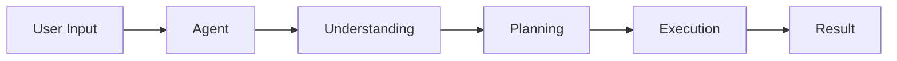

# Core Concepts

## What is ReAct?

ReAct (Reasoning & Action) is a pattern that helps AI agents solve problems more effectively by combining two key abilities:

1. **Reasoning**: Understanding the problem and planning a solution
2. **Action**: Using tools and executing steps to implement the solution

Think of it like how a chef cooks a meal:
- First, they **reason** about the recipe, ingredients, and cooking steps
- Then they **act** by gathering ingredients, using tools, and cooking

## How QuantaLogic Works

### 1. The Agent

The agent is your AI assistant. It:
- Understands your instructions in plain language
- Breaks down complex tasks into smaller steps
- Chooses the right tools for each step
- Learns from the results to improve



### 2. The Tool System

Tools are what the agent uses to get things done. Like a Swiss Army knife, each tool has a specific purpose:

- **Code Tools**: Write and run code
- **File Tools**: Read, write, and edit files
- **Search Tools**: Find information
- **Analysis Tools**: Process and understand data

Tools run in a secure sandbox to prevent any unwanted effects.

### 3. Memory Management

The agent keeps track of:
- The current conversation
- Previous actions and their results
- Important context about your task

This helps it make better decisions and maintain context across multiple interactions.

## Key Principles

### 1. Safety First
- All code runs in isolated environments
- Tools have clear permissions
- No unexpected side effects

### 2. Transparency
- See what the agent is thinking
- Watch tools in action
- Understand why decisions are made

### 3. Flexibility
- Works with different AI models
- Customizable tool sets
- Adaptable to various tasks

### 4. Learning
- Improves from experience
- Remembers successful patterns
- Avoids repeated mistakes

## Example Flow

Here's how QuantaLogic solves a simple coding task:

1. **User Request**: "Create a function to sort a list of numbers"

2. **Agent Reasoning**:
   - Need to write Python code
   - Should handle different input types
   - Must include error checking

3. **Agent Actions**:
   ```mermaid
   sequenceDiagram
       Agent->>Code Tool: Write sorting function
       Code Tool->>Agent: Return code
       Agent->>Test Tool: Verify function
       Test Tool->>Agent: Test results
       Agent->>User: Final solution
   ```

4. **Result**: Working, tested code that meets the requirements

## Next Steps

- Try the [Quick Start Guide](quickstart.md)
- See [Examples](examples/simple-agent.md)
- Learn about [Tool Development](best-practices/tool-development.md)
