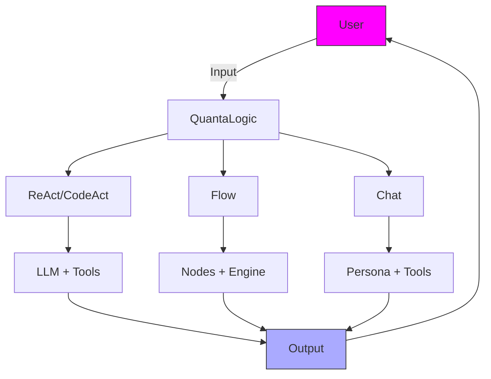

# QuantaLogic: Unleash AI for Coding, Automation, and Conversations

**QuantaLogic** is a versatile Python framework for building intelligent AI agents that excel at coding, automating workflows, and engaging in natural conversations. Powered by large language models (LLMs) and a robust toolset, QuantaLogic offers four powerful modes: **ReAct** for dynamic problem-solving, **CodeAct** for code-driven automation, **Flow** for structured workflows, and **Chat** for tool-augmented conversations. Whether you're a developer, researcher, or business innovator, QuantaLogic provides flexible, open-source tools to bring your ideas to life.

> **New: CodeAct**  
> CodeAct extends ReAct by using executable Python code as the primary action language, enabling precise automation and complex task-solving. Learn more in the [CodeAct Guide](codeact.md).

[📖 Full Documentation](https://quantalogic.github.io/quantalogic/) | [⚡ Quick Start](quickstart.md)

---

## Why QuantaLogic?

QuantaLogic simplifies the power of LLMs, making AI accessible and practical for a wide range of applications. Key benefits include:

- **Versatile Applications**: Write code, automate processes, or chat with context-aware AI.
- **Customizable Agents**: Tailor agents and tools to fit your specific needs.
- **Scalable Solutions**: From quick CLI scripts to enterprise-grade pipelines.
- **Open-Source Freedom**: Licensed under Apache 2.0 for unrestricted use and modification.

> *“QuantaLogic turns AI complexity into creative opportunity!”*

---

## What is QuantaLogic?

QuantaLogic leverages LLMs (e.g., GPT-4o, Claude, DeepSeek) to create AI agents that reason, act, and converse. These agents use a modular toolset for tasks like coding, web searching, and file operations, accessible via a command-line interface (CLI), interactive shell, or Python API. The framework’s four modes cater to diverse use cases:

- **ReAct**: Iteratively reasons and acts to solve open-ended tasks, using tools as needed ([ReAct Paper](https://arxiv.org/abs/2210.03629)).
- **CodeAct**: Extends ReAct with executable Python code as the primary action format, ideal for automation and precision ([CodeAct Paper](https://arxiv.org/html/2402.01030v4)).
- **Flow**: Orchestrates structured workflows with nodes and transitions, perfect for repeatable processes.
- **Chat**: Engages in natural, tool-augmented conversations for quick queries or interactive dialogues.

### Core Features
- **LLM Integration**: Supports OpenAI, Anthropic, DeepSeek, and more via LiteLLM.
- **Toolset**: Includes code execution, file management, web search, and custom tools.
- **Smart Memory**: Efficiently manages context for long tasks or conversations.
- **Real-Time Monitoring**: Tracks progress with events and logs.
- **Secure Execution**: Uses Docker-based isolation for safe tool operations.

**Architecture Overview**:


---

## Getting Started

### Installation

#### Requirements
- Python 3.12 or higher
- Docker (optional, for secure tool execution)

#### Quick Install
```bash
pip install quantalogic
```

#### Alternative: pipx
```bash
pipx install quantalogic
```

#### From Source
```bash
git clone https://github.com/quantalogic/quantalogic.git
cd quantalogic
python -m venv .venv
source .venv/bin/activate
poetry install
```

**Tip**: Configure LLM API keys in a `.env` file:
```bash
echo "OPENAI_API_KEY=sk-your-key" > .env
echo "DEEPSEEK_API_KEY=ds-your-key" >> .env
```

See [Installation Guide](installation.md) for detailed instructions.

### Quick Examples

#### CLI: Solve a Task
```bash
quantalogic task "Write a Python script to reverse a string"
```
**Output**: A working string-reversal script.

#### CLI: Start a Conversation
```bash
quantalogic chat --persona "Cosmic guide" "What’s the tallest mountain?"
```
**Output**: A detailed response, possibly with search results.

#### Python: ReAct/CodeAct Agent
```python
from quantalogic import Agent

agent = Agent(model_name="deepseek/deepseek-chat")
result = agent.solve_task("Write a Python function to reverse a string")
print(result)
# Output: "def reverse_string(s): return s[::-1]"
```

#### Python: Flow Workflow
```python
from quantalogic_flow import Workflow, Nodes
import asyncio

@Nodes.define(output="processed")
def uppercase(text: str) -> str:
    return text.upper()

workflow = Workflow("uppercase").build()
result = asyncio.run(workflow.run({"text": "hello world"}))
print(result["processed"])  # "HELLO WORLD"
```

---

## Choosing a Mode

| Mode       | Best For                     | Style               | Tools              |
|------------|------------------------------|---------------------|--------------------|
| **ReAct**  | Coding, research, Q&A        | Iterative, adaptive | Dynamic, on-demand |
| **CodeAct**| Complex automation, scripting| Code-driven         | Executable code    |
| **Flow**   | Pipelines, automation        | Structured, orderly | Node-specific      |
| **Chat**   | Conversations, quick queries  | Free-flowing        | Contextual         |

**Pro Tip**: Combine modes for powerful solutions—use Chat for user input, Flow for automation, and ReAct/CodeAct for complex tasks.

---

## CLI Commands

```bash
quantalogic [COMMAND] [OPTIONS]
```

- **task**: Run a task in ReAct/CodeAct mode.
  ```bash
  quantalogic task "Calculate 5 + 3"
  ```
- **chat**: Start a conversation.
  ```bash
  quantalogic chat "What’s new in AI?"
  ```
- **list-models**: List available LLMs.
  ```bash
  quantalogic list-models
  ```

See [CLI Reference](cli-reference.md) for all commands and options.

---

## Contributing

Join the QuantaLogic community to enhance the framework. Contribute features, fix bugs, or suggest improvements. See [Contributing Guide](dev/contributing.md).

---

## License

QuantaLogic is licensed under **Apache 2.0**. Built by Raphaël MANSUY at [QuantaLogic](https://www.quantalogic.app).

---

## Next Steps

- Learn the [Core Concepts](core-concepts.md)
- Try the [Quick Start](quickstart.md)
- Explore [CodeAct](codeact.md) or [Flow](quantalogic-flow.md)
- Check out [Examples](examples/simple-agent.md)
- Join the community on [GitHub](https://github.com/quantalogic/quantalogic)