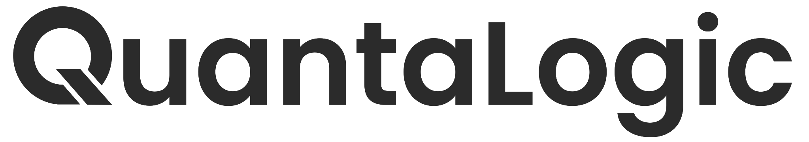

# QuantaLogic: ReAct AI Agent Framework

{ width="200" }

## 🌟 Welcome to QuantaLogic

QuantaLogic is a cutting-edge ReAct (Reasoning & Action) framework designed to transform how we interact with AI agents. By seamlessly integrating large language models with a powerful tool system, we enable intelligent, context-aware agents that can understand, reason, and execute complex tasks.

## 🚀 Key Features

- **Advanced ReAct Framework**: Combine reasoning with concrete actions
- **Universal LLM Support**: Integrate with OpenAI, Anthropic, LM Studio, and more
- **Secure Tool Execution**: Docker-based code and file manipulation
- **Real-time Monitoring**: Interactive web interface with event visualization
- **Intelligent Memory Management**: Optimize context and task understanding

## 🎯 Our Mission

Bridge the gap between advanced AI models and practical business processes, making generative AI accessible and actionable for organizations of all sizes.

## 🔍 Quick Links

- [Installation](/installation)
- [Quick Start](/quickstart)
- [CLI Reference](/cli)

---

*Empowering businesses with intelligent, adaptable AI agents.*
