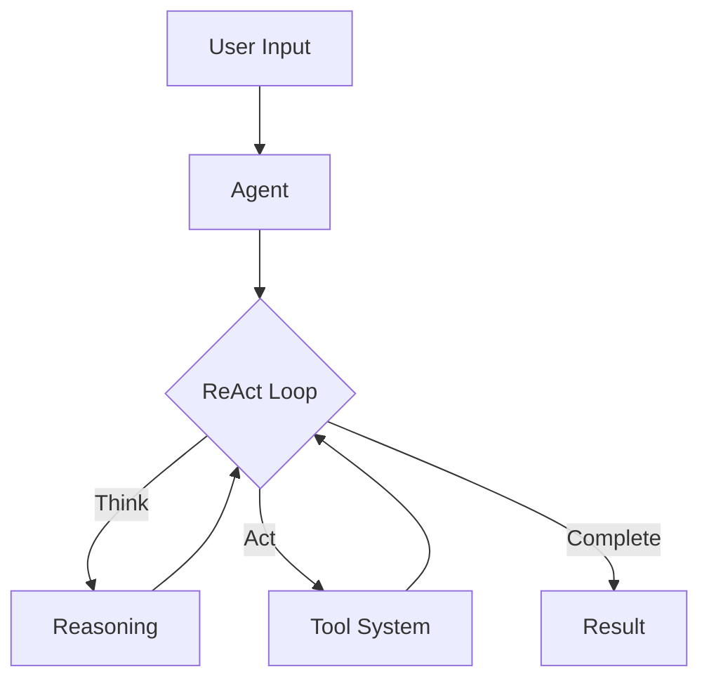

# QuantaLogic: ReAct AI Agent Framework

## What is QuantaLogic?

QuantaLogic is a Python framework that helps you build smart AI agents that can think and act. Imagine having a helpful assistant that not only understands what you want but can actually do it - that's what QuantaLogic enables.

Using the ReAct (Reasoning & Action) pattern, our agents:

1. 🧠 **Understand**
   - Process your instructions in plain language
   - Analyze context and requirements
   
2. 💭 **Think**
   - Plan the best approach
   - Break down complex problems
   - Consider different solutions
   
3. ⚡ **Act**
   - Execute planned actions
   - Use specialized tools
   - Write and modify code
   
4. 📚 **Learn**
   - Analyze results
   - Adapt strategies
   - Improve future actions

## Why Choose QuantaLogic?

- **Smart by Design**: Built on the ReAct pattern that combines thinking with doing
- **Works with Your Favorite AI**: Use OpenAI, Anthropic, DeepSeek, or any other LLM
- **Powerful Tools**: Built-in tools for coding, file handling, and more
- **Secure by Default**: Sandboxed execution environment for safety
- **See What's Happening**: Real-time monitoring of your agent's thoughts and actions
- **Memory That Matters**: Intelligent context management for better results

## Core Concepts

### The Agent
- Understands natural language instructions
- Plans and executes complex tasks
- Uses specialized tools effectively
- Learns and adapts from results

### The Tool System
- Secure sandboxed execution
- Code generation and execution
- File and data manipulation
- Information search and analysis

### Memory Management
- Maintains conversation context
- Tracks actions and results
- Optimizes decision making
- Preserves important task information

## Project Structure

The QuantaLogic framework is organized into the following structure:

```
quantalogic/
├── quantalogic/          # Main package directory
│   ├── tools/           # Built-in tool implementations
│   │   ├── python_tool.py
│   │   ├── nodejs_tool.py
│   │   ├── llm_tool.py
│   │   └── ...
│   ├── agent.py         # Core Agent implementation
│   └── server/          # Server components
├── examples/            # Usage examples
├── tests/              # Test suite
├── docs/               # Documentation
├── mkdocs/             # MkDocs documentation site
├── pyproject.toml      # Project configuration
└── poetry.lock         # Dependency lock file
```

### Key Components

- **Agent**: Core reasoning and execution engine
- **Tools**: Specialized modules for different tasks
  - Python execution
  - Node.js execution
  - LLM interactions
  - File operations
  - Search capabilities
- **Server**: Web interface and API
- **Examples**: Ready-to-use code samples
- **Tests**: Comprehensive test suite

## 🚀 Quick Examples

### 🖥️ Using the CLI

```bash
# Execute a task with default settings (code mode)
quantalogic task "Create a function to validate email addresses"

# Run with specific model and mode
quantalogic task --model-name "openrouter/deepseek/deepseek-chat" \
                 --mode interpreter \
                 --verbose \
                 "Explain quantum computing"

# Run from a task file with custom settings
quantalogic task --file tasks/example.md \
                 --mode full \
                 --log debug \
                 --max-iterations 50

# Use vision capabilities
quantalogic task --vision-model-name "openrouter/openai/gpt-4o-mini" \
                 "Analyze this image and explain what you see"
```

Available modes:
- `code`: Coding-focused agent (default)
- `basic`: General-purpose agent
- `interpreter`: Interactive code execution
- `full`: Full-featured agent
- `code-basic`: Basic coding agent
- `search`: Web search capabilities
- `search-full`: Full search capabilities

### 🐍 Python SDK Examples

#### Basic Usage
```python
from quantalogic import Agent

# Initialize agent with environment check
import os

if not os.environ.get("DEEPSEEK_API_KEY"):
    raise ValueError("DEEPSEEK_API_KEY environment variable is not set")

# Create agent with specific model
agent = Agent(model_name="deepseek/deepseek-chat")

# Execute a task
result = agent.solve_task(
    "Create a Python function that calculates the Fibonacci sequence"
)
print(result)
```

#### Event Monitoring
```python
from quantalogic import Agent, console_print_events
from quantalogic.tools import LLMTool

# Initialize agent with LLM tool
agent = Agent(
    model_name="deepseek/deepseek-chat",
    tools=[LLMTool(model_name="deepseek/deepseek-chat")]
)

# Configure event monitoring
agent.event_emitter.on(
    [
        "task_complete",
        "task_think_start",
        "task_think_end",
        "tool_execution_start",
        "tool_execution_end",
        "error_max_iterations_reached",
        "memory_full",
        "memory_compacted",
        "memory_summary",
    ],
    console_print_events,
)

# Execute a complex task
result = agent.solve_task(
    "1. Write a poem in English about a dog. "
    "2. Translate the poem into French. "
    "3. Choose 2 French authors. "
    "4. Rewrite the translated poem in their styles."
)
print(result)
```

## ✨ Key Features

- 🌐 **Universal LLM Support**: Integration with OpenAI, Anthropic, LM Studio, Bedrock, Ollama, DeepSeek V3, via LiteLLM
- 🔒 **Secure Tool System**: Docker-based code execution and file manipulation tools
- 📊 **Real-time Monitoring**: Web interface with SSE-based event visualization
- 🧠 **Memory Management**: Intelligent context handling and optimization
- 🏢 **Enterprise Ready**: Comprehensive logging, error handling, and validation system

## 💡 Real-World Use Cases

- 💻 **Code Generation**: Write, refactor, and debug code
- 📊 **Data Analysis**: Process and analyze data with natural language commands
- 🤖 **Task Automation**: Automate repetitive tasks with intelligent workflows
- 🔍 **Information Retrieval**: Search and summarize information from various sources

## Getting Started

### Quick Install

```bash
pip install quantalogic
```

### Basic Example

Here's a minimal example to create your first QuantaLogic agent:

```python
from quantalogic import Agent
from quantalogic.tools import Tool, ToolArgument
from pydantic import Field, BaseModel

# Create a custom tool
class GreetingTool(Tool):
    # Required tool configuration
    name: str = Field(default="greeting_tool")
    description: str = Field(default="Greets someone by name")
    need_validation: bool = False  # Set to True if the tool needs user validation
    
    # Define tool arguments
    arguments: list[ToolArgument] = [
        ToolArgument(
            name="name",
            arg_type="string",
            description="The name of the person to greet",
            required=True,
            example="Alice"
        )
    ]
    
    def execute(self, name: str) -> str:
        """Execute the tool's main functionality"""
        return f"Hello, {name}!"

# Initialize the agent with configuration
agent = Agent(
    model_name="deepseek/deepseek-chat",  # Required: specify the LLM
    tools=[GreetingTool()],  # Add your custom tools
    specific_expertise="An AI assistant that greets people",  # Optional: specify expertise
    ask_for_user_validation=lambda *args, **kwargs: asyncio.create_task(asyncio.to_thread(lambda: True)),  # Optional: async validation function
)

# Let the agent use the tool
response = agent.solve_task("Greet someone named Alice")
print(response)
```

### Key Steps to Build an Agent

1. **Install Dependencies**
   ```bash
   pip install quantalogic
   python -m quantalogic verify  # Check installation
   ```

2. **Create Your Tools**
   - Inherit from the `Tool` base class
   - Define tool properties (name, description, arguments)
   - Implement the `execute` method
   - Add clear docstrings and type hints

3. **Initialize the Agent**
   ```python
   from quantalogic import Agent
   from quantalogic.tools import PythonTool
   
   agent = Agent(
       model_name="deepseek/deepseek-chat",  # Required: specify the LLM
       tools=[PythonTool()]  # Add your tools
   )
   ```

4. **Run Your Agent**
   ```python
   result = agent.solve_task("Your instruction here")
   ```

### Best Practices

- Start simple, add complexity as needed
- Test tools individually before using with agent
- Use descriptive names for tools and parameters
- Handle errors explicitly in your tools
- Keep tool functions focused and small


## Architecture Overview



## Ready to Start?

- Read the [Core Concepts](core-concepts.md)
- Follow our Tutorials
- Check out the [API Reference](api/agent.md)
- Learn [Best Practices](best-practices/agent-design.md)

---

*Building the future of AI agents, one task at a time.*
