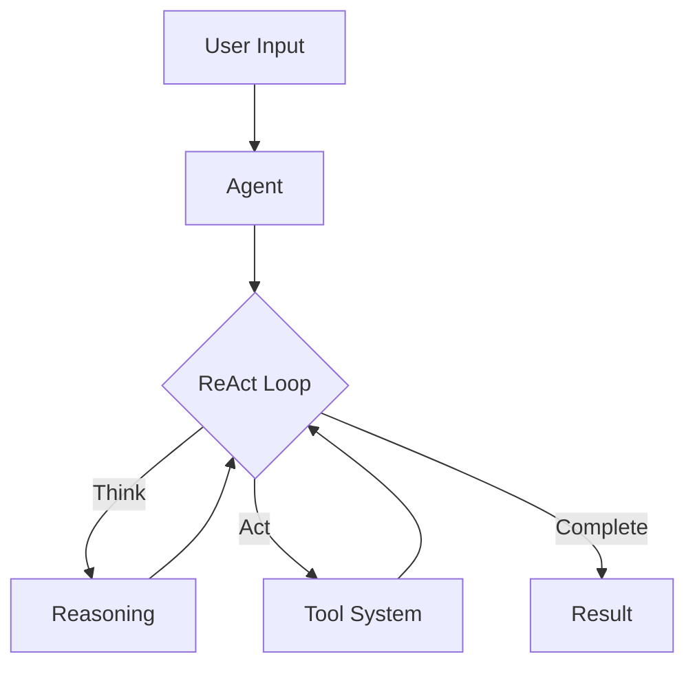

# QuantaLogic: ReAct AI Agent Framework

{ width="200" }

## What is QuantaLogic?

QuantaLogic is a Python framework that helps you build smart AI agents that can think and act. Imagine having a helpful assistant that not only understands what you want but can actually do it - that's what QuantaLogic enables.

Using the ReAct (Reasoning & Action) pattern, our agents:
1. **Understand** your instructions in plain language
2. **Think** about the best way to solve your problem
3. **Act** by using tools and writing code
4. **Learn** from the results to improve future actions

## Why Choose QuantaLogic?

- **Smart by Design**: Built on the ReAct pattern that combines thinking with doing
- **Works with Your Favorite AI**: Use OpenAI, Anthropic, DeepSeek, or any other LLM
- **Powerful Tools**: Built-in tools for coding, file handling, and more
- **Secure by Default**: Sandboxed execution environment for safety
- **See What's Happening**: Real-time monitoring of your agent's thoughts and actions
- **Memory That Matters**: Intelligent context management for better results

## Quick Example

```python
from quantalogic import Agent

# Create an agent with your preferred LLM
agent = Agent(model_name="deepseek/deepseek-chat")

# Let it solve a task
result = agent.solve_task(
    "Create a Python function that generates the Fibonacci sequence"
)
```

## Real-World Use Cases

- **Code Generation**: Write, refactor, and debug code
- **Data Analysis**: Process and analyze data with natural language commands
- **Task Automation**: Automate repetitive tasks with intelligent workflows
- **Information Retrieval**: Search and summarize information from various sources

## Getting Started

1. [Install QuantaLogic](installation.md) with pip or your favorite package manager
2. Follow our [Quick Start Guide](quickstart.md) to create your first agent
3. Explore [Examples](examples/simple-agent.md) to see what's possible
4. Join our community to share and learn

## Architecture Overview



## Ready to Start?

- Read the [Core Concepts](core-concepts.md)
- Follow our [Tutorials](tutorials/basic-agent.md)
- Check out the [API Reference](api/agent.md)
- Learn [Best Practices](best-practices/agent-design.md)

---

*Building the future of AI agents, one task at a time.*
