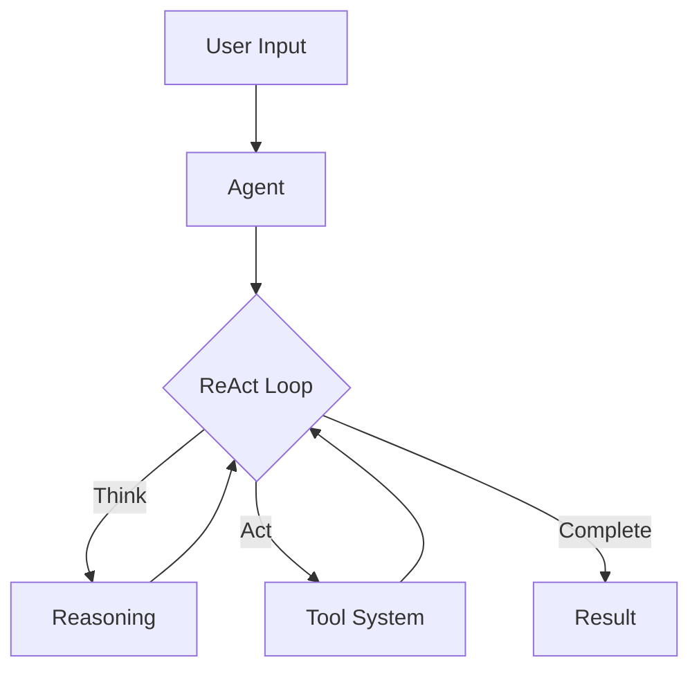

# QuantaLogic: ReAct AI Agent Framework

{ width="200" }

## What is QuantaLogic?

QuantaLogic is a Python framework that helps you build smart AI agents that can think and act. Imagine having a helpful assistant that not only understands what you want but can actually do it - that's what QuantaLogic enables.

Using the ReAct (Reasoning & Action) pattern, our agents:

1. 🧠 **Understand**
   - Process your instructions in plain language
   - Analyze context and requirements
   
2. 💭 **Think**
   - Plan the best approach
   - Break down complex problems
   - Consider different solutions
   
3. ⚡ **Act**
   - Execute planned actions
   - Use specialized tools
   - Write and modify code
   
4. 📚 **Learn**
   - Analyze results
   - Adapt strategies
   - Improve future actions

## Why Choose QuantaLogic?

- **Smart by Design**: Built on the ReAct pattern that combines thinking with doing
- **Works with Your Favorite AI**: Use OpenAI, Anthropic, DeepSeek, or any other LLM
- **Powerful Tools**: Built-in tools for coding, file handling, and more
- **Secure by Default**: Sandboxed execution environment for safety
- **See What's Happening**: Real-time monitoring of your agent's thoughts and actions
- **Memory That Matters**: Intelligent context management for better results

## Core Concepts

### The Agent
- Understands natural language instructions
- Plans and executes complex tasks
- Uses specialized tools effectively
- Learns and adapts from results

### The Tool System
- Secure sandboxed execution
- Code generation and execution
- File and data manipulation
- Information search and analysis

### Memory Management
- Maintains conversation context
- Tracks actions and results
- Optimizes decision making
- Preserves important task information

## 🚀 Quick Examples

### 🖥️ Using the CLI

```bash
# Execute a task
quantalogic task "Create a function to validate email addresses" --mode code

# Run with specific model and mode
quantalogic --model-name "openrouter/deepseek-chat" --mode interpreter task "Explain quantum computing"

# Run from a task file
quantalogic task --file tasks/example.md --verbose
```

### 🐍 Python SDK Examples

#### Basic Usage
```python
from quantalogic import Agent

# Initialize agent with environment check
import os

if not os.environ.get("DEEPSEEK_API_KEY"):
    raise ValueError("DEEPSEEK_API_KEY environment variable is not set")

# Create agent with specific model
agent = Agent(model_name="deepseek/deepseek-chat")

# Execute a task
result = agent.solve_task(
    "Create a Python function that calculates the Fibonacci sequence"
)
print(result)
```

#### 🔧 Available Agent Modes
- 💻 `code`: Coding-focused agent with basic capabilities
- 🔄 `basic`: General-purpose agent without coding tools
- 🖲️ `interpreter`: Interactive code execution agent
- ⭐ `full`: Full-featured agent with all capabilities
- 📝 `code-basic`: Coding agent with basic reasoning
- 🔍 `search`: Web search agent with Wikipedia, DuckDuckGo and SERPApi integration

## ✨ Key Features

- 🌐 **Universal LLM Support**: Integration with OpenAI, Anthropic, LM Studio, Bedrock, Ollama, DeepSeek V3, via LiteLLM
- 🔒 **Secure Tool System**: Docker-based code execution and file manipulation tools
- 📊 **Real-time Monitoring**: Web interface with SSE-based event visualization
- 🧠 **Memory Management**: Intelligent context handling and optimization
- 🏢 **Enterprise Ready**: Comprehensive logging, error handling, and validation system

## 💡 Real-World Use Cases

- 💻 **Code Generation**: Write, refactor, and debug code
- 📊 **Data Analysis**: Process and analyze data with natural language commands
- 🤖 **Task Automation**: Automate repetitive tasks with intelligent workflows
- 🔍 **Information Retrieval**: Search and summarize information from various sources

## Getting Started

1. [Install QuantaLogic](installation.md) with pip or your favorite package manager
2. Follow our [Quick Start Guide](quickstart.md) to create your first agent
3. Explore [Examples](examples/simple-agent.md) to see what's possible
4. Join our community to share and learn

## Architecture Overview



## Ready to Start?

- Read the [Core Concepts](core-concepts.md)
- Follow our [Tutorials](tutorials/basic-agent.md)
- Check out the [API Reference](api/agent.md)
- Learn [Best Practices](best-practices/agent-design.md)

---

*Building the future of AI agents, one task at a time.*
