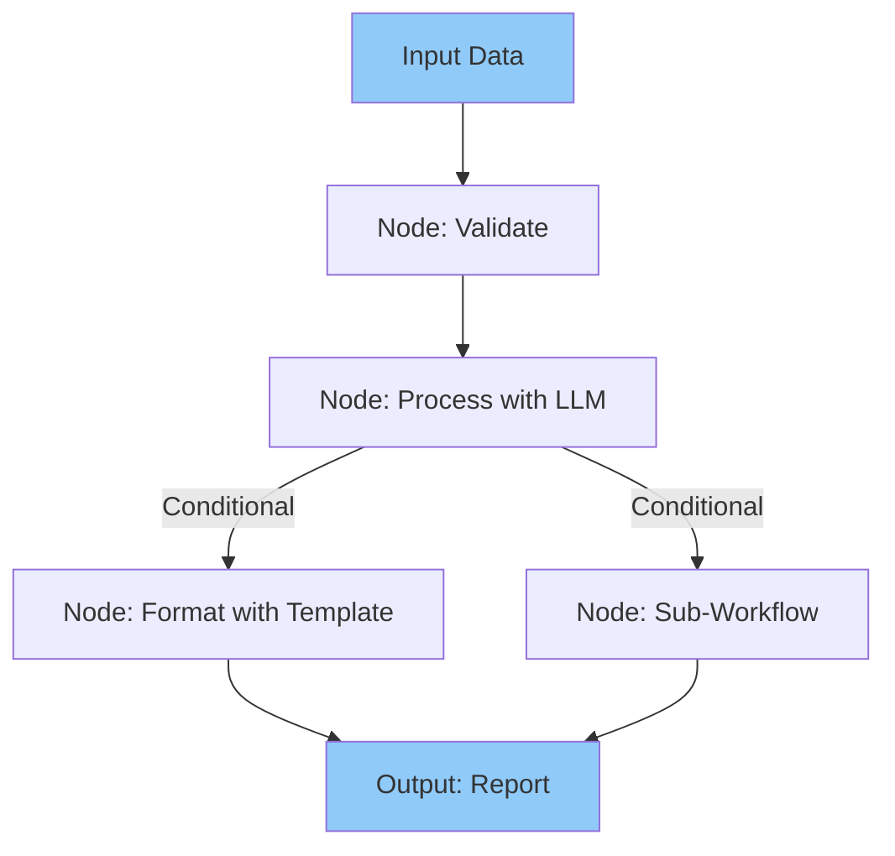
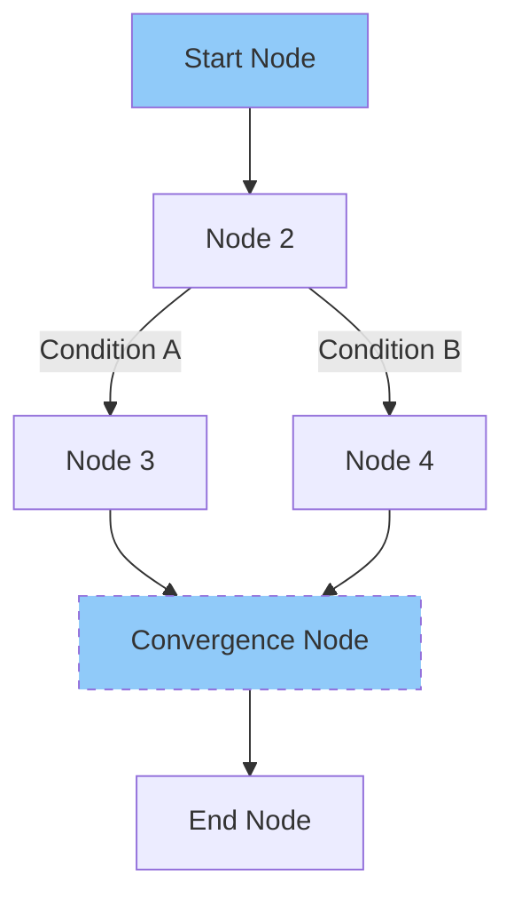
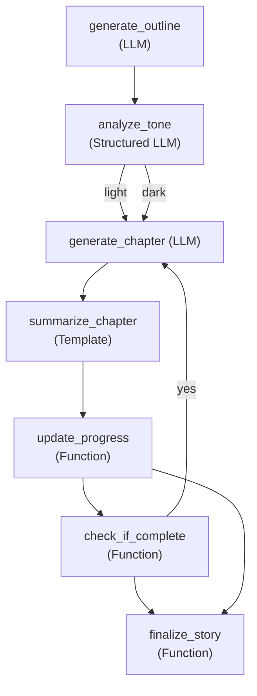

# Quantalogic Flow: Workflow Automation Powerhouse

Quantalogic Flow is an open-source Python library for intuitive, scalable workflow automation within the QuantaLogic ecosystem. It orchestrates complex tasks—AI-driven with Large Language Models (LLMs), data processing pipelines, or formatted outputs—using a **declarative YAML interface** or a **fluent Python API**.

+ [](https://pypi.org/project/quantalogic-flow)
+ [](https://github.com/quantalogic/quantalogic-flow/actions)
+ [](https://github.com/quantalogic/quantalogic/blob/main/LICENSE)

---

## Why Quantalogic Flow?

Flow simplifies repetitive, multi-step workflows, reducing development time and errors. It integrates with QuantaLogic’s ReAct, CodeAct, and Chat modes for end-to-end automation.

**Key Features**:
- **Declarative YAML**: Readable, shareable workflows for static processes.
- **Fluent Python API**: Dynamic workflows for developers.
- **LLM Integration**: Supports OpenAI, Gemini, DeepSeek via LiteLLM.
- **Template Rendering**: Uses Jinja2 for polished outputs.
- **Advanced Logic**: Branching, looping, parallel execution, sub-workflows.
- **Enterprise-Ready**: Validation, error handling, observability.

**Mermaid Diagram**:


---

## Installation

#### Prerequisites
- Python 3.10+
- LLM API keys (optional)
- Docker (optional, for code execution)

#### Install
```bash
pip install quantalogic-flow
```

#### Setup
```bash
export GEMINI_API_KEY="your-api-key"
export OPENAI_API_KEY="sk-your-openai-key"
export DEEPSEEK_API_KEY="ds-your-deepseek-key"
```

See [Installation Guide](installation.md).

---

## Quickstart

### Fluent API
```python
from quantalogic_flow import Workflow, Nodes
import asyncio

@Nodes.define(output="data")
def read_data():
    return "hello world"

@Nodes.define(output="processed_data")
def process_data(data):
    return data.upper()

@Nodes.define()
def write_data(processed_data):
    print(processed_data)

workflow = Workflow("read_data").then("process_data").then("write_data")
result = asyncio.run(workflow.build().run({}))
print(result)  # HELLO WORLD
```

### YAML
```yaml
functions:
  read_data:
    type: embedded
    code: |
      def read_data():
          return "hello world"
  process_data:
    type: embedded
    code: |
      def process_data(data):
          return data.upper()
  write_data:
    type: embedded
    code: |
      def write_data(processed_data):
          print(processed_data)
nodes:
  start:
    function: read_data
    output: data
  process:
    function: process_data
    inputs_mapping:
      data: "data"
    output: processed_data
  end:
    function: write_data
    inputs_mapping:
      processed_data: "processed_data"
workflow:
  start: start
  transitions:
    - from_node: start
      to_node: process
    - from_node: process
      to_node: end
```

**Execution**:
```python
from quantalogic_flow.flow.flow_manager import WorkflowManager
import asyncio

manager = WorkflowManager()
manager.load_from_yaml("simple_workflow.yaml")
workflow = manager.instantiate_workflow()
result = asyncio.run(workflow.build().run({}))
print(result)
```

---

## Core Concepts

- **Nodes**: Tasks (e.g., function, LLM, template).
- **Workflows**: Define node connections (start, transitions, convergence).
- **Context**: Shared dictionary for data passing.

**Diagram**:


See [Core Concepts](core-concepts.md).

---

## Approaches: YAML vs. Fluent API

| **Feature**       | **YAML**                     | **Fluent API**               |
|-------------------|------------------------------|------------------------------|
| **Style**         | Declarative, static          | Programmatic, dynamic        |
| **Best For**      | Non-coders, static flows     | Developers, dynamic logic    |
| **Readability**   | High, non-technical          | Moderate, Python-based       |
| **Flexibility**   | Limited by YAML structure    | High, full Python power      |

See [Flow YAML Reference](flow-yaml-reference.md).

---

## Fluent API Examples

### Basic Workflow
```python
@Nodes.define(output="data")
def read_data():
    return [1, 2, 3]

@Nodes.define(output="processed")
def process_data(data):
    return [x * 2 for x in data]

workflow = Workflow("read_data").then("process_data")
result = asyncio.run(workflow.build().run({}))
print(result)  # {'data': [1, 2, 3], 'processed': [2, 4, 6]}
```

### Conditional Branching
```python
@Nodes.define(output="x")
def start_node():
    return 12

@Nodes.define(output="result")
def high_path(x):
    return f"High: {x}"

@Nodes.define(output="result")
def low_path(x):
    return f"Low: {x"

workflow = Workflow("start_node").branch([("high_path", lambda ctx: ctx["x"] > 10), ("low_path", lambda ctx: ctx["x"] <= 10)])
result = asyncio.run(workflow.build().run({}))
print(result)  # {'x': 12, 'result': 'High: 12'}
```

See more in [Examples](examples/simple-agent.md).

---

## Advanced Features

- **Input Mapping**: Map inputs dynamically.
- **Dynamic Model Selection**: Choose LLMs based on context.
- **Sub-Workflows**: Nest reusable workflows.
- **Observers**: Monitor execution for debugging.
- **Looping**: Iterate nodes conditionally.

---

## Validation and Debugging

- **Validate**: Use `validate_workflow_definition()`.
- **Debug**: Attach observers or use Mermaid diagrams.
```python
from quantalogic_flow.flow.flow_mermaid import generate_mermaid_diagram
print(generate_mermaid_diagram(manager.workflow, title="My Workflow"))
```

---

## Conversion Tools

- **YAML to Python**:
```python
from quantalogic_flow.flow.flow_generator import generate_executable_script
manager = WorkflowManager()
manager.load_from_yaml("workflow.yaml")
generate_executable_script(manager.workflow, {}, "script.py")
```

- **Python to YAML**:
```python
from quantalogic_flow.flow.flow_extractor import extract_workflow_from_file
workflow_def, globals = extract_workflow_from_file("script.py")
WorkflowManager(workflow_def).save_to_yaml("workflow.yaml")
```

---

## Case Study: Story Generator

Generate a multi-chapter story with tone analysis and templating. See the full example in [Examples](examples/simple-agent.md).

**Diagram**:


---

## Best Practices

1. Start with small workflows.
2. Validate early with `validate_workflow_definition()`.
3. Use `temperature=0.3` for consistent LLM outputs.
4. Log with observers for debugging.
5. Secure API keys in `.env` files.

See [Best Practices](best-practices/agent-design.md).

---

## Flow Manager API

```python
from quantalogic_flow.flow.flow_manager import WorkflowManager
manager = WorkflowManager()
manager.add_function('read', 'embedded', code='def read(): return "data"')
manager.add_node('start', function='read', output='raw')
```

See [API Reference](api/agent.md).

---

## Integration with QuantaLogic

Flow complements ReAct, CodeAct, and Chat modes:

| **Feature** | **ReAct/CodeAct** | **Flow** | **Chat** |
|-------------|-------------------|----------|----------|
| **Purpose** | Adaptive solving  | Structured workflows | Conversational |
| **Use Case** | Coding, Q&A       | Automation       | Quick queries |

**Example**:
```python
from quantalogic import Agent
from quantalogic_flow.flow import Workflow, Nodes

@Nodes.llm_node(model="gpt-4o", output="code")
async def generate_code(task: str) -> str:
    agent = Agent(model_name="gpt-4o")
    return agent.solve_task(task)

workflow = Workflow("generate_code").build()
result = asyncio.run(workflow.run({"task": "Write a Fibonacci function"}))
```

---

## Examples

See [Examples](examples/simple-agent.md) for practical workflows.

---

## Resources

- [QuantaLogic Docs](https://quantalogic.github.io/quantalogic/)
- [GitHub](https://github.com/quantalogic/quantalogic)
- [Contributing](dev/contributing.md)