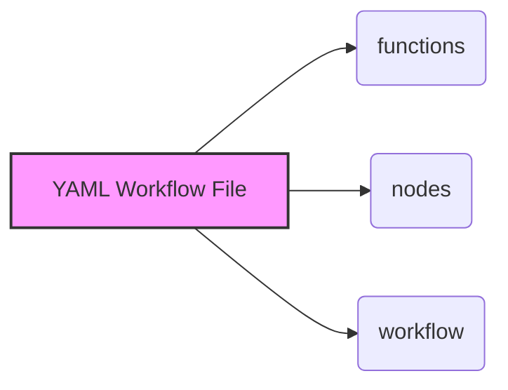
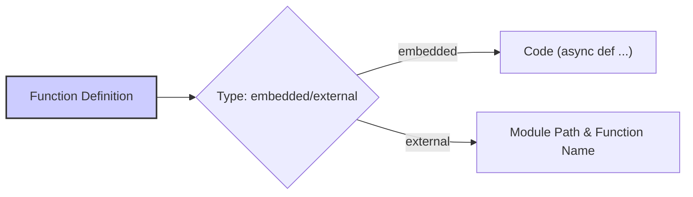
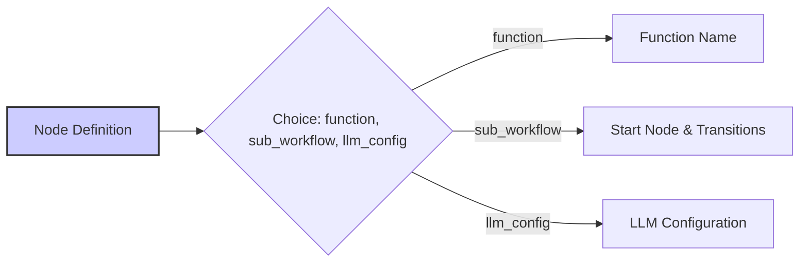
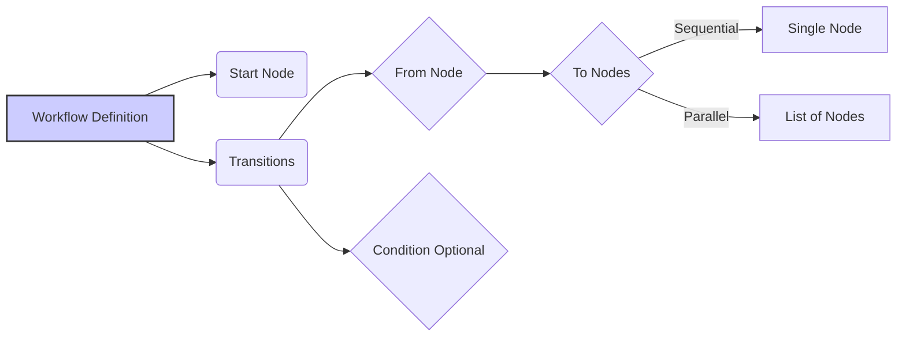
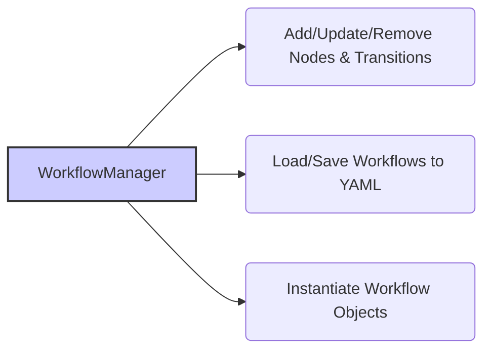
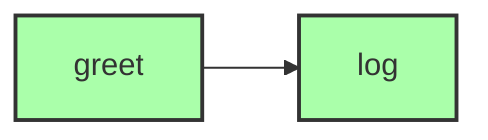
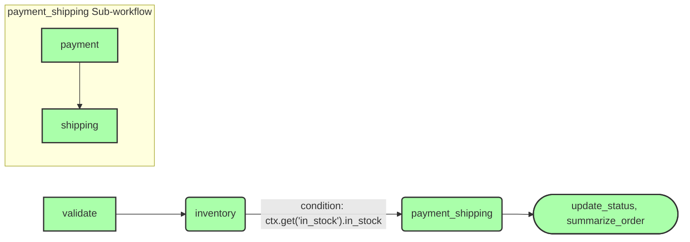

# Quantalogic Flow YAML DSL Specification

## 1. Introduction

The Quantalogic Flow YAML DSL (Domain Specific Language) provides a human-readable format for defining workflows. Key features include:

*   Execution of embedded or external asynchronous Python functions.
*   Support for sequential, conditional, and parallel node transitions.
*   Nesting of workflows as sub-workflows within nodes.
*   LLM (Large Language Model) node integration, offering configurable system prompts and advanced parameters. This includes both plain text output (`llm_node`) and structured output (`structured_llm_node`) capabilities.
*   Context management for maintaining workflow state.
*   Retry and timeout configurations for robust execution.
*   Programmatic workflow management through the `WorkflowManager` class.

This specification reflects the system's implementation as of February 23, 2025. It leverages the `Nodes` class from `flow.py` for defining LLM nodes, ensuring consistency and reducing code duplication.

## 2. Workflow Structure

A YAML workflow file consists of three primary sections:

*   `functions`: Defines the Python functions that will be executed by nodes within the workflow.
*   `nodes`: Configures individual nodes, specifying their execution details, including references to functions, sub-workflows, or LLM configurations.
*   `workflow`: Defines the overall flow of execution, including the starting node and the transitions between nodes.

```yaml
functions:
  # Function definitions
nodes:
  # Node configurations
workflow:
  # Start node and transitions
```



## 3. Functions

The `functions` section maps function names to their corresponding implementations. These implementations can be embedded directly within the YAML file or referenced externally as modules.

### Fields

*   `type` (string, required): Specifies the function type. Valid values are `"embedded"` for inline code and `"external"` for module references.
*   `code` (string, optional): Multi-line asynchronous Python code. Required when `type: embedded`.
*   `module` (string, optional): The module path (e.g., a GitHub URL or a Python module). Required when `type: external`.
*   `function` (string, optional): The function name within the specified module. Required when `module` is specified.

### Rules

*   Functions must be asynchronous (defined using `async def`).
*   For embedded functions, the function name must match the dictionary key.
*   Use either `code` or `module` + `function`; do not use both.

### Examples

#### Embedded Function

```yaml
functions:
  validate_order:
    type: embedded
    code: |
      async def validate_order(order: dict) -> bool:
          await anyio.sleep(1)
          return bool(order.get("customer"))
```

#### External Function

```yaml
functions:
  fetch_data:
    type: external
    module: "https://github.com/user/repo/blob/main/data.py"
    function: "fetch_data"
```



## 4. Nodes

Nodes represent individual tasks within the workflow. They can be linked to functions, sub-workflows, or LLM configurations. Nodes can be defined in the YAML file or programmatically using `Nodes.define`, `Nodes.validate_node`, `Nodes.llm_node`, or `Nodes.structured_llm_node` decorators in code.

### Fields

*   `function` (string, optional): The name of the linked function. Mutually exclusive with `sub_workflow` and `llm_config`.
*   `sub_workflow` (object, optional): The definition of a nested workflow. Mutually exclusive with `function` and `llm_config`.
    *   `start` (string, required): The starting node of the sub-workflow.
    *   `transitions` (list): Transition rules within the sub-workflow (see Workflow section).
*   `llm_config` (object, optional): Configuration for an LLM node. Mutually exclusive with `function` and `sub_workflow`.
    *   `model` (string, optional, default: `"gpt-3.5-turbo"`): The LLM model to use (e.g., `"gemini/gemini-2.0-flash"`, `"gro k/xai"`).
    *   `system_prompt` (string, optional): The system prompt defining the LLM's role or context.
    *   `prompt_template` (string, required): The user prompt template with Jinja2 placeholders (e.g., `"Summarize {{ text }}"`).
    *   `temperature` (float, optional, default: `0.7`): Controls randomness of the LLM output (range: `0.0` to `1.0`).
    *   `max_tokens` (integer, optional, default: `2000`): Maximum number of tokens in the response.
    *   `top_p` (float, optional, default: `1.0`): Nucleus sampling parameter for response diversity (range: `0.0` to `1.0`).
    *   `presence_penalty` (float, optional, default: `0.0`): Encourages new topics by penalizing repetition (range: `-2.0` to `2.0`).
    *   `frequency_penalty` (float, optional, default: `0.0`): Reduces word repetition (range: `-2.0` to `2.0`).
    *   `stop` (list of strings, optional): Sequences where generation stops (e.g., `["\n"]`).
    *   `response_model` (string, optional): The Pydantic model for structured output (e.g., `"path.to.module:OrderDetails"`). If present, uses `structured_llm_node`; otherwise, uses `llm_node`.
    *   `api_key` (string, optional): Custom API key for the LLM provider.
*   `output` (string, optional): The context key to store the result of the function, sub-workflow, or LLM node. Defaults to `"{node_name}_result"` if unspecified for functions or LLM nodes.
*   `retries` (int, optional, default: `3`): The number of retry attempts in case of failure.
*   `delay` (float, optional, default: `1.0`): The delay in seconds between retry attempts.
*   `timeout` (float/null, optional, default: `null`): The maximum execution time in seconds. A value of `null` indicates no timeout.
*   `parallel` (bool, optional, default: `false`): Whether to allow parallel execution of the node.

### Rules

*   A node must specify exactly one of `function`, `sub_workflow`, or `llm_config`.
*   For sub-workflows, the `output` is optional if the sub-workflow sets multiple context keys; inputs are derived from the sub-workflow’s start node.
*   For LLM nodes, `prompt_template` is required, and inputs are automatically derived from Jinja2 placeholders (e.g., `{{ text }}` implies an input named `text`). If `response_model` is specified, the node uses `structured_llm_node`; otherwise, it uses `llm_node`.

### Examples

#### Function Node

```yaml
nodes:
  validate:
    function: validate_order
    output: is_valid
    retries: 2
    delay: 0.5
    timeout: 5.0
```

#### Sub-Workflow Node

```yaml
nodes:
  payment_shipping:
    sub_workflow:
      start: process_payment
      transitions:
        - from: payment
          to: ship_order
          condition: "ctx.get('payment_success')"
    output: shipping_confirmation
```

#### Plain LLM Node

```yaml
nodes:
  summarize:
    llm_config:
      model: "gro k/xai"
      system_prompt: "You are a concise summarizer."
      prompt_template: "Summarize this text: {{ text }}"
      temperature: 0.5
      max_tokens: 50
      top_p: 0.9
      presence_penalty: 0.5
      frequency_penalty: 0.5
    output: summary
```

#### Structured LLM Node

```yaml
nodes:
  check_inventory:
    llm_config:
      model: "gemini/gemini-2.0-flash"
      system_prompt: "Check inventory for items."
      prompt_template: "Check if {{ items }} are in stock."
      response_model: "my_module:InventoryStatus"
      temperature: 0.7
      max_tokens: 2000
    output: inventory_status
```



## 5. Workflow

The `workflow` section defines the top-level flow of execution, including the starting node and the transitions between nodes.

### Fields

*   `start` (string, required): The name of the starting node.
*   `transitions` (list, required): A list of transition rules.

### Transition Fields

*   `from` (string, required): The source node for the transition.
*   `to` (string/list, required): The target node(s) for the transition. Use a string for sequential execution and a list for parallel execution.
*   `condition` (string, optional): A Python expression using `ctx` to access the context (e.g., `"ctx.get('in_stock')"`). The transition will only occur if the condition evaluates to `True`.

### Examples

#### Sequential Transition

```yaml
workflow:
  start: validate
  transitions:
    - from: validate
      to: inventory
```

#### Conditional Transition

```yaml
workflow:
  start: inventory
  transitions:
    - from: inventory
      to: payment
      condition: "ctx.get('in_stock')"
```

#### Parallel Transition

```yaml
workflow:
  start: ship
  transitions:
    - from: ship
      to: [update_status, send_email]
```



## 6. Context

The context (`ctx`) is a dictionary that stores node outputs and is shared across the main workflow and any sub-workflows. For example:

*   A plain LLM node might set `ctx["summary"] = "Brief text"`.
*   A structured LLM node might set `ctx["inventory_status"] = InventoryStatus(items=["item1"], in_stock=True)`.


## 7. Execution Flow

The `WorkflowEngine` executes the workflow as follows:

1.  Starts at the node specified by `workflow.start`.
2.  Executes nodes, storing their outputs in the `ctx` dictionary:
    *   Function nodes directly set their output key in the context using the linked function’s result.
    *   Sub-workflow nodes execute their internal flow, updating the context with their results.
    *   LLM nodes use either:
        *   `Nodes.llm_node` for plain text output via `litellm.acompletion`.
        *   `Nodes.structured_llm_node` for structured output via `instructor.from_litellm`, based on the `response_model`.
3.  Evaluates transitions:
    *   If a transition has a condition, the condition is checked against the current context.
4.  Schedules the target node(s) for execution, either sequentially or in parallel, based on the `to` field.
5.  Continues until no transitions remain to be executed.


## 8. WorkflowManager

The `WorkflowManager` class provides programmatic control over workflows:

*   Add, update, and remove nodes and transitions.
*   Load and save workflows to and from YAML files.
*   Instantiate `Workflow` objects, integrating nested workflows and LLM nodes using `Nodes.llm_node` and `Nodes.structured_llm_node`.

### Example

```python
manager = WorkflowManager()
manager.add_function("validate", "embedded", code="async def validate(order): return bool(order)")
manager.add_node("start", function="validate", output="is_valid")
manager.add_node("summarize", llm_config={"model": "gro k/xai", "system_prompt": "You are a summarizer", "prompt_template": "Summarize: {{ text }}"}, output="summary")
manager.add_node("inventory", llm_config={"model": "gemini/gemini-2.0-flash", "prompt_template": "Check {{ items }}", "response_model": "my_module:InventoryStatus"}, output="stock")
manager.set_start_node("start")
manager.save_to_yaml("workflow.yaml")
```



## 9. Examples

### Example 1: Simple Sequential Workflow

```yaml
functions:
  greet_user:
    type: embedded
    code: |
      async def greet_user(name: str) -> str:
          await anyio.sleep(1)
          return f"Hello, {name}!"
  log_message:
    type: embedded
    code: |
      async def log_message(message: str) -> bool:
          print(f"Logged: {message}")
          return True
nodes:
  greet:
    function: greet_user
    output: greeting
  log:
    function: log_message
    output: logged
workflow:
  start: greet
  transitions:
    - from: greet
      to: log
```

Execution with `ctx = {"name": "Alice"}`:

1.  `greet` → `ctx["greeting"] = "Hello, Alice!"`.
2.  `log` → `ctx["logged"] = True`.



### Example 2: E-commerce Workflow with Nested Flow and LLM Nodes

```yaml
functions:
  validate_order:
    type: embedded
    code: |
      async def validate_order(order: dict) -> bool:
          await anyio.sleep(1)
          return bool(order.get("customer"))
  process_payment:
    type: embedded
    code: |
      async def process_payment(order: dict) -> bool:
          await anyio.sleep(1)
          return order["customer"] == "John Doe"
  ship_order:
    type: embedded
    code: |
      async def ship_order(order: dict) -> str:
          await anyio.sleep(1)
          return "Shipped"
  update_order_status:
    type: embedded
    code: |
      async def update_order_status(order: dict) -> bool:
          await anyio.sleep(1)
          return True
nodes:
  validate:
    function: validate_order
    output: is_valid
  inventory:
    llm_config:
      model: "gemini/gemini-2.0-flash"
      system_prompt: "Check inventory status."
      prompt_template: "Are {{ items }} in stock?"
      response_model: "my_module:InventoryStatus"
    output: in_stock
  payment_shipping:
    sub_workflow:
      start: payment
      transitions:
        - from: payment
          to: shipping
          condition: "ctx.get('payment_success')"
    output: shipping_confirmation
  payment:
    function: process_payment
    output: payment_success
  shipping:
    function: ship_order
    output: shipping_confirmation
  update_status:
    function: update_order_status
    output: order_status_updated
  summarize_order:
    llm_config:
      model: "gro k/xai"
      system_prompt: "You are an order summary expert."
      prompt_template: "Summarize order: {{ order }}"
      temperature: 0.5
      max_tokens: 50
      top_p: 0.9
      presence_penalty: 0.5
      frequency_penalty: 0.5
    output: order_summary
workflow:
  start: validate
  transitions:
    - from: validate
      to: inventory
    - from: inventory
      to: payment_shipping
      condition: "ctx.get('in_stock').in_stock"
    - from: payment_shipping
      to: [update_status, summarize_order]
```

Execution with `ctx = {"order": {"items": ["item1"], "customer": "John Doe"}}`:

1.  `validate` → `ctx["is_valid"] = True`.
2.  `inventory` → `ctx["in_stock"] = InventoryStatus(items=["item1"], in_stock=True)` (assuming `my_module.InventoryStatus`).
3.  `payment_shipping` (sub-workflow):
    *   `payment` → `ctx["payment_success"] = True`.
    *   `shipping` → `ctx["shipping_confirmation"] = "Shipped"`.
4.  Parallel:
    *   `update_status` → `ctx["order_status_updated"] = True`.
    *   `summarize_order` → `ctx["order_summary"] = "Order for John Doe with 1 item shipped."`.



## 10. Conclusion

The Quantalogic Flow YAML DSL offers a powerful and flexible approach to defining workflows. As of February 23, 2025, it fully supports LLM nodes by integrating `Nodes.llm_node` for plain text output and `Nodes.structured_llm_node` for structured output, reusing the robust implementations from `flow.py`. The DSL seamlessly integrates with the `Workflow`, `WorkflowEngine`, and `WorkflowManager` classes, supporting a wide range of use cases—from simple sequential processes to complex hierarchical flows with AI-driven nodes—with minimal boilerplate code.