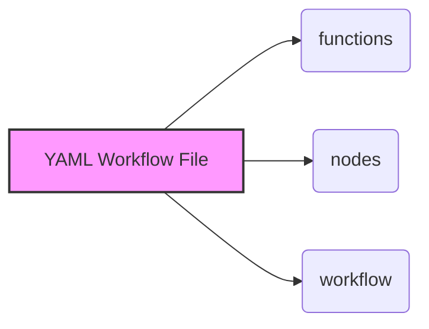
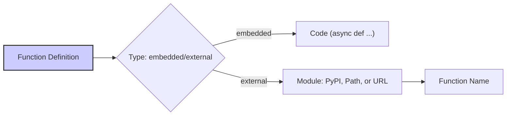
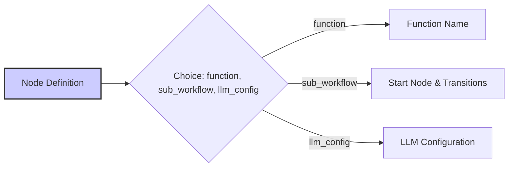
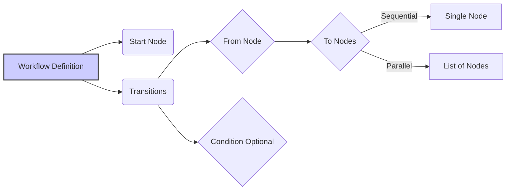
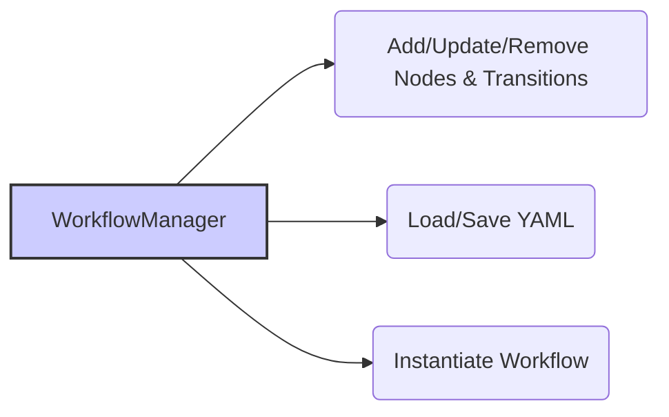
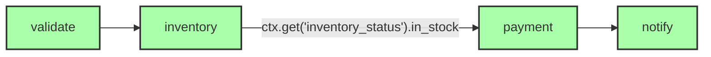

# Quantalogic Flow YAML DSL Specification

## 1. Introduction

The Quantalogic Flow YAML DSL (Domain Specific Language) offers a structured and human-readable way to define workflows. As of February 23, 2025, it provides a rich set of features for complex automation, including:

*   **Function Execution**: Executes asynchronous Python functions, either embedded directly or sourced from PyPI packages, local files, or remote URLs.
*   **Execution Flow**: Supports sequential, conditional, and parallel transitions between nodes.
*   **Sub-Workflows**: Enables hierarchical workflows through nested sub-workflows.
*   **LLM Integration**: Incorporates Large Language Model (LLM) nodes with plain text (`llm_node`) or structured output (`structured_llm_node`), using configurable prompts and parameters.
*   **Context Management**: Maintains state across nodes using a shared context dictionary.
*   **Robustness**: Provides configurable retries and timeouts for fault-tolerant execution.
*   **Programmatic Control**: Managed via the `WorkflowManager` class for dynamic creation and execution.

This DSL seamlessly integrates with the `Workflow`, `WorkflowEngine`, and `WorkflowManager` classes from the `quantalogic.flow` package, and it leverages the `Nodes` class for LLM functionality to minimize redundancy.

## 2. Workflow Structure

A YAML workflow file consists of three main sections:

*   **`functions`**: Defines Python functions used by nodes, supporting both inline code and external modules.
*   **`nodes`**: Configures individual tasks, linking to functions, sub-workflows, or LLM setups.
*   **`workflow`**: Specifies the execution flow, including the start node and transitions.

```yaml
functions:
  # Function definitions
nodes:
  # Node configurations
workflow:
  # Start node and transitions
```



## 3. Functions

The `functions` section maps function names to their implementations, which can be embedded in the YAML or sourced externally from Python modules.

**Fields**

*   `type` (string, required): Specifies the function source. Options:
    *   `"embedded"`: Inline Python code.
    *   `"external"`: Module-based function.
*   `code` (string, optional): Multi-line asynchronous Python code for embedded functions. Required if `type: embedded`.
*   `module` (string, optional): Source of the external module for external functions. Can be:
    *   A PyPI package name (e.g., `"requests"`, `"numpy"`).
    *   A local file path (e.g., `"/path/to/module.py"`).
    *   A remote URL (e.g., `"https://example.com/module.py"`). Required if `type: external`.
*   `function` (string, optional): Name of the function within the module for external functions. Required if `type: external`.

**Rules**

*   Embedded functions must be asynchronous (using `async def`) and match the dictionary key name.
*   External functions require both `module` and `function` fields; `code` must not be present.
*   For PyPI modules, ensure the package is installed in the Python environment (e.g., via `pip install <module>`).

**Examples**

*   **Embedded Function**

```yaml
functions:
  validate_order:
    type: embedded
    code: |
      async def validate_order(order: dict) -> bool:
          await asyncio.sleep(1)
          return bool(order.get("items"))
```

*   **External Function from PyPI**

```yaml
functions:
  fetch_data:
    type: external
    module: requests
    function: get
```

Note: Requires `pip install requests` if not already installed.

*   **External Function from Local File**

```yaml
functions:
  process_data:
    type: external
    module: /path/to/my_module.py
    function: process
```

*   **External Function from URL**

```yaml
functions:
  analyze:
    type: external
    module: https://example.com/analyze.py
    function: analyze_data
```



## 4. Nodes

Nodes represent individual tasks within the workflow, configurable as function executions, sub-workflows, or LLM operations.

**Fields**

*   `function` (string, optional): References a function from the `functions` section. Mutually exclusive with `sub_workflow` and `llm_config`.
*   `sub_workflow` (object, optional): Defines a nested workflow. Mutually exclusive with `function` and `llm_config`.
    *   `start` (string, required): Starting node of the sub-workflow.
    *   `transitions` (list): Transition rules (see Workflow section).
*   `llm_config` (object, optional): Configures an LLM-based node. Mutually exclusive with `function` and `sub_workflow`.
    *   `model` (string, optional, default: `"gpt-3.5-turbo"`): LLM model (e.g., `"gemini/gemini-2.0-flash"`, `"gro k/xai"`).
    *   `system_prompt` (string, optional): Defines the LLM’s role or context.
    *   `prompt_template` (string, required, default: `"{{ input }}"`): Jinja2 template for the user prompt (e.g., `"Summarize {{ text }}"`).
    *   `temperature` (float, optional, default: `0.7`): Randomness control (`0.0` to `1.0`).
    *   `max_tokens` (integer, optional, default: `2000`): Maximum response tokens.
    *   `top_p` (float, optional, default: `1.0`): Nucleus sampling (`0.0` to `1.0`).
    *   `presence_penalty` (float, optional, default: `0.0`): Penalizes repetition (`-2.0` to `2.0`).
    *   `frequency_penalty` (float, optional, default: `0.0`): Reduces word repetition (`-2.0` to `2.0`).
    *   `stop` (list of strings, optional): Stop sequences (e.g., `["\n"]`).
    *   `response_model` (string, optional): Pydantic model path for structured output (e.g., `"my_module:OrderDetails"`). If present, uses `structured_llm_node`; otherwise, uses `llm_node`.
    *   `api_key` (string, optional): Custom API key for the LLM provider.
*   `output` (string, optional): Context key for the node’s result. Defaults to `"<node_name>_result"` for function or LLM nodes if unspecified.
*   `retries` (integer, optional, default: `3`): Number of retry attempts on failure (≥ `0`).
*   `delay` (float, optional, default: `1.0`): Delay between retries in seconds (≥ `0`).
*   `timeout` (float or null, optional, default: `null`): Execution timeout in seconds (≥ `0` or `null` for no timeout).
*   `parallel` (boolean, optional, default: `false`): Enables parallel execution with other nodes.

**Rules**

*   Each node must specify exactly one of `function`, `sub_workflow`, or `llm_config`.
*   For `sub_workflow`, `output` is optional if the sub-workflow sets multiple context keys; inputs are derived from the start node’s requirements.
*   For `llm_config`, inputs are extracted from `prompt_template` placeholders (e.g., `{{ text }}` implies `text` as an input).

**Examples**

*   **Function Node**

```yaml
nodes:
  validate:
    function: validate_order
    output: is_valid
    retries: 2
    delay: 0.5
    timeout: 5.0
```

*   **Sub-Workflow Node**

```yaml
nodes:
  payment_shipping:
    sub_workflow:
      start: payment
      transitions:
        - from: payment
          to: shipping
    output: shipping_confirmation
```

*   **Plain LLM Node**

```yaml
nodes:
  summarize:
    llm_config:
      model: "gro k/xai"
      system_prompt: "You are a concise summarizer."
      prompt_template: "Summarize this text: {{ text }}"
      temperature: 0.5
      max_tokens: 50
    output: summary
```

*   **Structured LLM Node**

```yaml
nodes:
  check_inventory:
    llm_config:
      model: "gemini/gemini-2.0-flash"
      system_prompt: "Check inventory status."
      prompt_template: "Are {{ items }} in stock?"
      response_model: "my_module:InventoryStatus"
    output: inventory_status
```



## 5. Workflow

The `workflow` section defines the top-level execution flow.

**Fields**

*   `start` (string, optional): Name of the starting node.
*   `transitions` (list, required): List of transition rules.

**Transition Fields**

*   `from` (string, required): Source node.
*   `to` (string or list, required): Target node(s). String for sequential, list for parallel execution.
*   `condition` (string, optional): Python expression using `ctx` (e.g., `"ctx.get('in_stock')"`). Transition occurs if `True`.

**Examples**

*   **Sequential Transition**

```yaml
workflow:
  start: validate
  transitions:
    - from: validate
      to: check_inventory
```

*   **Conditional Transition**

```yaml
workflow:
  start: check_inventory
  transitions:
    - from: check_inventory
      to: payment_shipping
      condition: "ctx.get('inventory_status').in_stock"
```

*   **Parallel Transition**

```yaml
workflow:
  start: payment_shipping
  transitions:
    - from: payment_shipping
      to: [update_status, notify_customer]
```



## 6. Context

The context (`ctx`) is a dictionary shared across the workflow and sub-workflows, storing node outputs. Examples:

*   Function node: `ctx["is_valid"] = True`.
*   Plain LLM node: `ctx["summary"] = "Brief text"`.
*   Structured LLM node: `ctx["inventory_status"] = InventoryStatus(items=["item1"], in_stock=True)`.

## 7. Execution Flow

The `WorkflowEngine` executes the workflow as follows:

1.  Begins at `workflow.start`.
2.  Executes nodes, updating `ctx`:
    *   **Function Nodes**: Calls the referenced function, storing the result in `output`.
    *   **Sub-Workflow Nodes**: Runs the nested workflow, merging its context into the parent’s.
    *   **LLM Nodes**: Uses `Nodes.llm_node` for text output or `Nodes.structured_llm_node` for structured output via `litellm` and `instructor`.
3.  Evaluates transitions:
    *   Conditions (if present) are checked against `ctx`.
4.  Executes the next node(s) sequentially or in parallel based on `to`.
5.  Continues until no further transitions remain.

## 8. WorkflowManager

The `WorkflowManager` class provides programmatic control over workflows:

*   **Node Management**: Add, update, or remove nodes.
*   **Transition Management**: Define execution flow.
*   **Function Registration**: Embed or link to external functions.
*   **YAML I/O**: Load/save workflows from/to YAML files.
*   **Instantiation**: Builds a `Workflow` object with support for PyPI modules.

**Example**

```python
manager = WorkflowManager()
manager.add_function("fetch", "external", module="requests", function="get")
manager.add_node("start", function="fetch", output="response")
manager.set_start_node("start")
manager.save_to_yaml("workflow.yaml")
```

If `requests` is missing, the manager raises:

```text
Failed to import module 'requests': No module named 'requests'. This may be a PyPI package. Ensure it is installed using 'pip install requests' or check if the module name is correct.
```



## 9. Examples

**Example 1: Simple Workflow with PyPI Module**

```yaml
functions:
  fetch_page:
    type: external
    module: requests
    function: get
nodes:
  fetch:
    function: fetch_page
    output: page_content
workflow:
  start: fetch
  transitions: []
```

Execution with `ctx = {"url": "https://example.com"}`:

`fetch` → `ctx["page_content"] = <Response object>` (assuming `requests` is installed).

**Example 2: E-commerce Workflow**

```yaml
functions:
  validate_order:
    type: embedded
    code: |
      async def validate_order(order: dict) -> bool:
          await asyncio.sleep(1)
          return bool(order.get("items"))
  process_payment:
    type: external
    module: stripe
    function: create_charge
nodes:
  validate:
    function: validate_order
    output: is_valid
  inventory:
    llm_config:
      model: "gemini/gemini-2.0-flash"
      system_prompt: "Check inventory."
      prompt_template: "Are {{ items }} in stock?"
      response_model: "my_module:InventoryStatus"
    output: inventory_status
  payment:
    function: process_payment
    output: payment_status
  notify:
    llm_config:
      prompt_template: "Notify: Order {{ order_id }} processed."
    output: notification
workflow:
  start: validate
  transitions:
    - from: validate
      to: inventory
    - from: inventory
      to: payment
      condition: "ctx.get('inventory_status').in_stock"
    - from: payment
      to: notify
```

Execution with `ctx = {"order": {"items": ["item1"], "order_id": "123"}}`:

*   `validate` → `ctx["is_valid"] = True`.
*   `inventory` → `ctx["inventory_status"] = InventoryStatus(...)`.
*   `payment` → `ctx["payment_status"] = <Stripe response>` (requires `pip install stripe`).
*   `notify` → `ctx["notification"] = "Notify: Order 123 processed."`.



## 10. Conclusion

The Quantalogic Flow YAML DSL, as of February 23, 2025, provides a flexible and powerful framework for defining workflows. Enhanced support for PyPI modules via the `module` field in `functions` ensures seamless integration with external libraries, with clear error messages guiding users to install missing packages (e.g., `pip install requests`). Combined with sub-workflows, LLM nodes, and robust execution controls, it supports a wide range of applications, from simple tasks to complex, AI-driven processes, all manageable through the `WorkflowManager`.