# Quantalogic Flow YAML DSL Specification 🚀

## 1. Introduction 🌟

> **Note (March 2, 2025)**: The transition parameters have been updated from `from`/`to` to `from_node`/`to_node` for improved clarity and consistency.

Welcome to the **Quantalogic Flow YAML DSL**—a powerful, human-readable way to craft workflows with the `quantalogic.flow` package! As of **March 1, 2025**, this DSL brings a suite of exciting features to automate complex tasks with ease:

- **Function Execution** ⚙️: Run async Python functions—embedded or sourced from PyPI, local files, or URLs.
- **Execution Flow** ➡️: Define sequential, conditional, and parallel transitions.
- **Sub-Workflows** 🌳: Build hierarchical workflows for modularity.
- **LLM Integration** 🤖: Leverage Large Language Models with plain text or structured outputs.
- **Context Management** 📦: Share state across nodes via a dynamic context.
- **Robustness** 🛡️: Add retries, delays, and timeouts for reliability.
- **Observers** 👀: Monitor execution with custom event handlers.
- **Programmatic Power** 🧑‍💻: Control everything via the `WorkflowManager`.

This DSL integrates seamlessly with `Workflow`, `WorkflowEngine`, and `Nodes` classes, powering everything from simple scripts to AI-driven workflows. Let’s dive in! 🎉

```mermaid
graph TD
    A[YAML Workflow File] -->|Defines| B[functions ⚙️]
    A -->|Configures| C[nodes 🧩]
    A -->|Orchestrates| D[workflow 🌐]
    style A fill:#f9f9ff,stroke:#333,stroke-width:2px,stroke-dasharray:5
    style B fill:#e6f3ff,stroke:#0066cc
    style C fill:#e6ffe6,stroke:#009933
    style D fill:#fff0e6,stroke:#cc3300
```



## 2. Workflow Structure 🗺️

A workflow YAML file is split into three core sections:

- **`functions`**: Your toolbox of Python functions.
- **`nodes`**: The building blocks (tasks) of your workflow.
- **`workflow`**: The roadmap tying it all together.

Here’s the skeleton:

```yaml
functions:
  # Your Python magic ✨
nodes:
  # Tasks to execute 🎯
workflow:
  # Flow control 🚦
```

## 3. Functions ⚙️

The `functions` section defines reusable Python code—either embedded in the YAML or pulled from external sources.

### Fields 📋

- `type` (string, required): `"embedded"` (inline code) or `"external"` (module-based).
- `code` (string, optional): Multi-line Python code for `embedded`. Use `|` for readability!
- `module` (string, optional): Source for `external`. Options:
  - PyPI package (e.g., `"requests"`).
  - Local path (e.g., `"/path/to/module.py"`).
  - URL (e.g., `"https://example.com/script.py"`).
- `function` (string, optional): Function name in the module (for `external`).

### Rules ✅

- Embedded functions must be `async def` and match their dictionary key.
- External functions need `module` and `function`; no `code` allowed.
- PyPI modules must be installed (e.g., `pip install requests`).

### Examples 🌈

#### Embedded Function
```yaml
functions:
  greet:
    type: embedded
    code: |
      async def greet(name: str) -> str:
          return f"Hello, {name}!"
```

#### External from PyPI
```yaml
functions:
  fetch:
    type: external
    module: requests
    function: get
```
*Note*: Run `pip install requests` first!

#### Local File
```yaml
functions:
  analyze:
    type: external
    module: ./utils/analyze.py
    function: process_data
```

#### Remote URL
```yaml
functions:
  compute:
    type: external
    module: https://example.com/compute.py
    function: calculate
```


## 4. Nodes 🧩

Nodes are the heartbeat of your workflow—each one’s a task, powered by functions, sub-workflows, or LLMs.

### Fields 📋

- `function` (string, optional): Links to a `functions` entry.
- `sub_workflow` (object, optional): Nested workflow definition.
  - `start` (string): Starting node.
  - `transitions` (list): Flow rules (see Workflow section).
- `llm_config` (object, optional): LLM setup.
  - `model` (string, default: `"gpt-3.5-turbo"`): e.g., `"gemini/gemini-2.0-flash"`.
  - `system_prompt` (string, optional): LLM’s role.
  - `prompt_template` (string, default: `"{{ input }}"`): Jinja2 template (e.g., `"Summarize {{ text }}"`).
  - `temperature` (float, default: `0.7`): Randomness (0.0–1.0).
  - `max_tokens` (int, optional): Token limit (e.g., `2000`).
  - `top_p` (float, default: `1.0`): Nucleus sampling (0.0–1.0).
  - `presence_penalty` (float, default: `0.0`): Topic repetition (-2.0–2.0).
  - `frequency_penalty` (float, default: `0.0`): Word repetition (-2.0–2.0).
  - `response_model` (string, optional): Structured output model (e.g., `"my_module:OrderDetails"`).
- `output` (string, optional): Context key for results (defaults to `<node_name>_result` for function/LLM nodes).
- `retries` (int, default: `3`): Retry attempts (≥ 0).
- `delay` (float, default: `1.0`): Seconds between retries (≥ 0).
- `timeout` (float/null, default: `null`): Max runtime in seconds.
- `parallel` (bool, default: `false`): Run concurrently?

### Rules ✅

- Exactly one of `function`, `sub_workflow`, or `llm_config` per node.
- LLM inputs come from `prompt_template` placeholders (e.g., `{{ text }}` → `text`).

### Examples 🌈

#### Function Node
```yaml
nodes:
  validate:
    function: validate_order
    output: is_valid
    retries: 2
    timeout: 5.0
```

#### Sub-Workflow Node
```yaml
nodes:
  payment_flow:
    sub_workflow:
      start: pay
      transitions:
        - from_node: pay
          to_node: ship
    output: shipping_status
```

#### Plain LLM Node
```yaml
nodes:
  summarize:
    llm_config:
      model: "gro k/xai"
      system_prompt: "You’re a concise summarizer."
      prompt_template: "Summarize: {{ text }}"
      temperature: 0.5
    output: summary
```

#### Structured LLM Node
```yaml
nodes:
  inventory_check:
    llm_config:
      model: "gemini/gemini-2.0-flash"
      system_prompt: "Check stock."
      prompt_template: "Items: {{ items }}"
      response_model: "inventory:StockStatus"
    output: stock
```


## 5. Workflow 🌐

The `workflow` section maps out how nodes connect and flow.

### Fields 📋

- `start` (string, optional): First node to run.
- `transitions` (list): Flow rules.
  - `from_node` (string): Source node.
  - `to_node` (string/list): Target(s)—string for sequential, list for parallel.
  - `condition` (string, optional): Python expression (e.g., `"ctx['stock'].available"`).

### Examples 🌈

#### Sequential Flow
```yaml
workflow:
  start: validate
  transitions:
    - from_node: validate
      to_node: process
```

#### Conditional Flow
```yaml
workflow:
  start: inventory_check
  transitions:
    - from_node: inventory_check
      to_node: payment_flow
      condition: "ctx['stock'].available"
```

#### Parallel Flow
```yaml
workflow:
  start: payment_flow
  transitions:
    - from_node: payment_flow
      to_node: [update_db, send_email]
```


## 6. Workflow Validation 🕵️‍♀️

The `validate_workflow_definition()` function provides comprehensive workflow integrity checks to ensure your workflow is well-formed and executable. This validation helps catch potential issues before runtime, improving workflow reliability and preventing unexpected errors.

### Validation Checks 🔍

The validation process examines multiple aspects of your workflow definition:

- **Node Connectivity**: Verifies that all nodes are reachable from the start node.
- **Circular References**: Detects intentional and unintentional circular transitions.
- **Undefined Nodes**: Identifies transitions to nodes that are not defined in the workflow.
- **Missing Start Node**: Ensures the workflow has a valid start node.
- **Transition Integrity**: Checks that transitions are properly configured.

### Return Value 📦

The function returns a list of `WorkflowIssue` objects, each containing:
- `node_name`: The name of the node with an issue (or `None` for workflow-level issues)
- `description`: A human-readable explanation of the problem

### Example Usage 🚀

```python
issues = validate_workflow_definition(workflow)
if issues:
    for issue in issues:
        print(f"Node '{issue.node_name}': {issue.description}")
```

By leveraging `validate_workflow_definition()`, you can catch and address workflow design issues early, ensuring more robust and reliable workflow execution. 🛡️

## 7. Observers 👀

Add observers to watch workflow events (e.g., node start, completion, failures). Define them in `functions` and list them under `observers`.

### Example
```yaml
functions:
  log_event:
    type: embedded
    code: |
      async def log_event(event):
          print(f"{event.event_type}: {event.node_name}")
nodes:
  task:
    function: greet
workflow:
  start: task
  transitions: []
observers:
  - log_event
```

## 8. Context 📦

The `ctx` dictionary carries data across nodes:
- `greet` → `ctx["greeting"] = "Hello, Alice!"`
- `inventory_check` → `ctx["stock"] = StockStatus(...)`

## 9. Execution Flow 🏃‍♂️

The `WorkflowEngine` runs it all:
1. Starts at `workflow.start`.
2. Executes nodes, updating `ctx`.
3. Follows transitions based on conditions or parallel rules.
4. Notifies observers of events.
5. Stops when no transitions remain.

## 10. Converting Between Python and YAML 🔄

The `quantalogic.flow` package provides tools to bridge Python-defined workflows and YAML definitions, making your workflows portable and standalone.

### From Python to YAML with `flow_extractor.py` 📜
Want to turn a Python workflow (using `Nodes` and `Workflow`) into a YAML file? Use `quantalogic/flow/flow_extractor.py`! The `extract_workflow_from_file` function parses a Python file, extracting nodes, transitions, functions, and globals into a `WorkflowDefinition`. Then, `WorkflowManager` saves it as YAML. This is perfect for sharing or archiving workflows defined programmatically.

#### How It Works
1. **Parse**: `WorkflowExtractor` uses Python’s `ast` module to analyze the file, identifying `@Nodes` decorators (e.g., `define`, `llm_node`) and `Workflow` chaining.
2. **Extract**: It builds a `WorkflowDefinition` with nodes, transitions, embedded functions, and observers.
3. **Save**: `WorkflowManager.save_to_yaml` writes it to a YAML file.

#### Example
```python
# story_generator.py
from quantalogic.flow import Nodes, Workflow

@Nodes.define(output="greeting")
async def say_hello(name: str) -> str:
    return f"Hello, {name}!"

workflow = Workflow("say_hello")

# Convert to YAML
from quantalogic.flow.flow_extractor import extract_workflow_from_file
from quantalogic.flow.flow_manager import WorkflowManager

wf_def, globals = extract_workflow_from_file("story_generator.py")
manager = WorkflowManager(wf_def)
manager.save_to_yaml("story_workflow.yaml")
```
**Output (`story_workflow.yaml`)**:
```yaml
functions:
  say_hello:
    type: embedded
    code: |
      @Nodes.define(output="greeting")
      async def say_hello(name: str) -> str:
          return f"Hello, {name}!"
nodes:
  say_hello:
    function: say_hello
    output: greeting
    retries: 3
    delay: 1.0
workflow:
  start: say_hello
  transitions: []
```

### From YAML to Standalone Python with `flow_generator.py` 🐍
Need a self-contained Python script from a `WorkflowDefinition`? `quantalogic/flow/flow_generator.py` has you covered with `generate_executable_script`. It creates an executable file with embedded functions, dependencies, and a `main` function—ready to run anywhere with `uv run`.

#### How It Works
1. **Generate**: Takes a `WorkflowDefinition` and global variables.
2. **Structure**: Adds a shebang (`#!/usr/bin/env -S uv run`), dependencies, globals, functions, and workflow chaining.
3. **Execute**: Sets permissions to make it runnable.

#### Example
```python
from quantalogic.flow.flow_manager import WorkflowManager
from quantalogic.flow.flow_generator import generate_executable_script

manager = WorkflowManager()
manager.load_from_yaml("story_workflow.yaml")
generate_executable_script(manager.workflow, {}, "standalone_story.py")
```
**Output (`standalone_story.py`)**:
```python
#!/usr/bin/env -S uv run
# /// script
# requires-python = ">=3.12"
# dependencies = ["loguru", "litellm", "pydantic>=2.0", "anyio", "quantalogic>=0.35", "jinja2", "instructor[litellm]"]
# ///
import anyio
from loguru import logger
from quantalogic.flow import Nodes, Workflow

@Nodes.define(output="greeting")
async def say_hello(name: str) -> str:
    return f"Hello, {name}!"

workflow = Workflow("say_hello")

async def main():
    initial_context = {"name": "World"}
    engine = workflow.build()
    result = await engine.run(initial_context)
    logger.info(f"Workflow result: {result}")

if __name__ == "__main__":
    anyio.run(main)
```
Run it with `./standalone_story.py`—no extra setup needed (assuming `uv` is installed)!


## 11. WorkflowManager 🧑‍💻

The `WorkflowManager` lets you build workflows programmatically:
- Add nodes, transitions, functions, and observers.
- Load/save YAML.
- Instantiate a `Workflow` object.

### Example
```python
manager = WorkflowManager()
manager.add_function("say_hi", "embedded", code="async def say_hi(name): return f'Hi, {name}!'")
manager.add_node("start", function="say_hi")
manager.set_start_node("start")
manager.save_to_yaml("hi.yaml")
```

## 12. Full Example: Order Processing 📦🤖

```yaml
functions:
  validate:
    type: embedded
    code: |
      async def validate(order: dict) -> str:
          return "valid" if order["items"] else "invalid"
  track_usage:
    type: embedded
    code: |
      def track_usage(event):
          if event.usage:
              print(f"{event.node_name}: {event.usage['total_tokens']} tokens")
nodes:
  validate_order:
    function: validate
    output: validity
  check_stock:
    llm_config:
      model: "gemini/gemini-2.0-flash"
      system_prompt: "Check inventory."
      prompt_template: "Items: {{ items }}"
      response_model: "shop:Stock"
    output: stock
  notify:
    llm_config:
      prompt_template: "Order {{ order_id }} status: {{ validity }}"
    output: message
workflow:
  start: validate_order
  transitions:
    - from_node: validate_order
      to_node: check_stock
      condition: "ctx['validity'] == 'valid'"
    - from_node: check_stock
      to_node: notify
observers:
  - track_usage
```

### Execution
With `ctx = {"order": {"items": ["book"], "order_id": "123"}}`:
1. `validate_order` → `ctx["validity"] = "valid"`
2. `check_stock` → `ctx["stock"] = Stock(...)`
3. `notify` → `ctx["message"] = "Order 123 status: valid"`
4. `track_usage` prints token usage for LLM nodes.


## 13. Conclusion 🎉

The Quantalogic Flow YAML DSL (March 1, 2025) is your go-to for crafting workflows—simple or sophisticated. With tools like `flow_extractor.py` and `flow_generator.py`, you can switch between Python and YAML effortlessly, making workflows portable and standalone. Add PyPI support, sub-workflows, LLM nodes, and observers, and you’ve got a versatile framework for automation and AI tasks. Pair it with `WorkflowManager` for maximum flexibility! 🚀
