# Quantalogic Flow YAML DSL Specification 🚀


## 1. Introduction 🌟

The **Quantalogic Flow YAML DSL** is a human-readable, declarative language for defining workflows within the `quantalogic.flow` Python package. As of **March 2, 2025**, it empowers developers to automate tasks with a rich feature set:

- **Function Execution** ⚙️: Run async Python functions from embedded code, PyPI, local files, or URLs.
- **Execution Flow** ➡️: Support sequential, conditional, and parallel transitions.
- **Sub-Workflows** 🌳: Enable hierarchical, modular designs.
- **LLM Integration** 🤖: Harness Large Language Models for text or structured outputs.
- **Context Management** 📦: Share state dynamically across nodes.
- **Robustness** 🛡️: Include retries, delays, and timeouts.
- **Observers** 👀: Monitor execution with custom handlers.
- **Programmatic Control** 🧑‍💻: Manage workflows via `WorkflowManager`.

This DSL integrates with `Workflow`, `WorkflowEngine`, and `Nodes` classes, making it ideal for everything from simple scripts to AI-driven workflows. To illustrate, we’ll use a **Story Generator Workflow** as a running example, derived from `examples/qflow/story_generator_agent.py`. Let’s dive in! 🎉

```mermaid
graph TD
    A[YAML Workflow File] -->|Defines| B[functions ⚙️]
    A -->|Configures| C[nodes 🧩]
    A -->|Orchestrates| D[workflow 🌐]
    style A fill:#f9f9ff,stroke:#333,stroke-width:2px,stroke-dasharray:5
    style B fill:#e6f3ff,stroke:#0066cc
    style C fill:#e6ffe6,stroke:#009933
    style D fill:#fff0e6,stroke:#cc3300
```



---

## 2. Workflow Structure 🗺️

A workflow YAML file is divided into three core sections:

- **`functions`**: Python code definitions.
- **`nodes`**: Task specifications.
- **`workflow`**: Flow orchestration.

Here’s the skeleton:

```yaml
functions:
  # Python magic ✨
nodes:
  # Tasks 🎯
workflow:
  # Flow control 🚦
observers:
  # Event watchers 👀 (optional)
```

### Story Generator Example
Imagine a workflow that generates a multi-chapter story. We’ll build it step-by-step, starting with its Python form (`story_generator_agent.py`), then its YAML equivalent.

---

## 3. Case Study: Story Generator Workflow 📖

### Python Version (`story_generator_agent.py`)

This script generates a story outline and chapters iteratively:

```python
#!/usr/bin/env python
from quantalogic.flow import Nodes, Workflow
import anyio

MODEL = "gemini/gemini-2.0-flash"
DEFAULT_LLM_PARAMS = {"model": MODEL, "temperature": 0.7, "max_tokens": 1000}

@Nodes.llm_node(system_prompt="You are a creative writer skilled at generating stories.", 
                prompt_template="Create a story outline for a {genre} story with {num_chapters} chapters.", 
                output="outline", **DEFAULT_LLM_PARAMS)
def generate_outline(genre, num_chapters):
    return {}

@Nodes.llm_node(system_prompt="You are a creative writer.", 
                prompt_template="Write chapter {chapter_num} for this story outline: {outline}. Style: {style}.", 
                output="chapter", **DEFAULT_LLM_PARAMS)
def generate_chapter(outline, chapter_num, style):
    return {}

@Nodes.define(output="updated_context")
async def update_progress(**context):
    chapters = context.get('chapters', [])
    completed_chapters = context.get('completed_chapters', 0)
    chapter = context.get('chapter', '')
    updated_chapters = chapters + [chapter]
    return {**context, "chapters": updated_chapters, "completed_chapters": completed_chapters + 1}

@Nodes.define(output="continue_generating")
async def check_if_complete(completed_chapters=0, num_chapters=0, **kwargs):
    return completed_chapters < num_chapters

workflow = (
    Workflow("generate_outline")
    .then("generate_chapter")
    .then("update_progress")
    .then("check_if_complete")
    .then("generate_chapter", condition=lambda ctx: ctx.get("continue_generating", False))
    .then("update_progress")
    .then("check_if_complete")
)

def story_observer(event_type, data=None):
    print(f"Event: {event_type} - Data: {data}")
workflow.add_observer(story_observer)

if __name__ == "__main__":
    async def main():
        initial_context = {
            "genre": "science fiction",
            "num_chapters": 3,
            "chapters": [],
            "completed_chapters": 0,
            "style": "descriptive"
        }
        engine = workflow.build()
        result = await engine.run(initial_context)
        print(f"Completed chapters: {result.get('completed_chapters', 0)}")
    anyio.run(main)
```

### YAML Version (`story_generator_workflow.yaml`)

Here’s the equivalent YAML:

```yaml
functions:
  generate_outline:
    type: embedded
    code: |
      async def generate_outline(genre: str, num_chapters: int) -> str:
          return ""
  generate_chapter:
    type: embedded
    code: |
      async def generate_chapter(outline: str, chapter_num: int, style: str) -> str:
          return ""
  update_progress:
    type: embedded
    code: |
      async def update_progress(**context):
          chapters = context.get('chapters', [])
          completed_chapters = context.get('completed_chapters', 0)
          chapter = context.get('chapter', '')
          return {**context, "chapters": chapters + [chapter], "completed_chapters": completed_chapters + 1}
  check_if_complete:
    type: embedded
    code: |
      async def check_if_complete(completed_chapters=0, num_chapters=0, **kwargs):
          return completed_chapters < num_chapters
  story_observer:
    type: embedded
    code: |
      def story_observer(event_type, data=None):
          print(f"Event: {event_type} - Data: {data}")

nodes:
  generate_outline:
    llm_config:
      model: "gemini/gemini-2.0-flash"
      system_prompt: "You are a creative writer skilled at generating stories."
      prompt_template: "Create a story outline for a {genre} story with {num_chapters} chapters."
      temperature: 0.7
      max_tokens: 1000
    output: outline
  generate_chapter:
    llm_config:
      model: "gemini/gemini-2.0-flash"
      system_prompt: "You are a creative writer."
      prompt_template: "Write chapter {chapter_num} for this story outline: {outline}. Style: {style}."
      temperature: 0.7
      max_tokens: 1000
    output: chapter
  update_progress:
    function: update_progress
    output: updated_context
  check_if_complete:
    function: check_if_complete
    output: continue_generating

workflow:
  start: generate_outline
  transitions:
    - from_node: generate_outline
      to_node: generate_chapter
    - from_node: generate_chapter
      to_node: update_progress
    - from_node: update_progress
      to_node: check_if_complete
    - from_node: check_if_complete
      to_node: generate_chapter
      condition: "ctx['continue_generating']"

observers:
  - story_observer
```

### Mermaid Diagram: Story Generator Flow


#### Execution
With `initial_context = {"genre": "science fiction", "num_chapters": 3, "chapters": [], "completed_chapters": 0, "style": "descriptive"}`:
1. `generate_outline` creates an outline.
2. `generate_chapter` writes a chapter.
3. `update_progress` updates the chapter list and count.
4. `check_if_complete` loops back if more chapters are needed.

---

## 4. Functions ⚙️

The `functions` section defines Python code for reuse.

### Fields 📋
- `type` (string, required): `"embedded"` or `"external"`.
- `code` (string, optional): Inline code for `embedded`.
- `module` (string, optional): Source for `external` (PyPI, path, URL).
- `function` (string, optional): Function name in `module`.

### Rules ✅
- Embedded: Use `async def`, name matches key.
- External: Requires `module` and `function`, no `code`.

### Examples 🌈
From the story generator:
```yaml
functions:
  update_progress:
    type: embedded
    code: |
      async def update_progress(**context):
          chapters = context.get('chapters', [])
          completed_chapters = context.get('completed_chapters', 0)
          chapter = context.get('chapter', '')
          return {**context, "chapters": chapters + [chapter], "completed_chapters": completed_chapters + 1}
```
External example:
```yaml
functions:
  fetch:
    type: external
    module: requests
    function: get
```


---

## 5. Nodes 🧩

Nodes are the tasks, powered by functions, sub-workflows, or LLMs.

### Fields 📋
- `function` (string, optional): Links to `functions`.
- `sub_workflow` (object, optional):
  - `start` (string)
  - `transitions` (list)
- `llm_config` (object, optional):
  - `model` (string, default: `"gpt-3.5-turbo"`)
  - `system_prompt` (string, optional)
  - `prompt_template` (string, default: `"{{ input }}"`)
  - `temperature` (float, default: `0.7`)
  - `max_tokens` (int, optional)
  - `top_p` (float, default: `1.0`)
  - `presence_penalty` (float, default: `0.0`)
  - `frequency_penalty` (float, default: `0.0`)
  - `response_model` (string, optional)
- `output` (string, optional): Context key.
- `retries` (int, default: `3`)
- `delay` (float, default: `1.0`)
- `timeout` (float/null, default: `null`)
- `parallel` (bool, default: `false`)

### Rules ✅
- One of `function`, `sub_workflow`, or `llm_config` per node.
- LLM inputs come from `prompt_template`.

### Examples 🌈
From the story generator:
```yaml
nodes:
  generate_outline:
    llm_config:
      model: "gemini/gemini-2.0-flash"
      system_prompt: "You are a creative writer skilled at generating stories."
      prompt_template: "Create a story outline for a {genre} story with {num_chapters} chapters."
      temperature: 0.7
      max_tokens: 1000
    output: outline
```


---

## 6. Workflow 🌐

The `workflow` section defines execution order.

### Fields 📋
- `start` (string, optional): First node.
- `transitions` (list):
  - `from_node` (string)
  - `to_node` (string/list)
  - `condition` (string, optional)

### Example 🌈
From the story generator:
```yaml
workflow:
  start: generate_outline
  transitions:
    - from_node: generate_outline
      to_node: generate_chapter
    - from_node: generate_chapter
      to_node: update_progress
    - from_node: update_progress
      to_node: check_if_complete
    - from_node: check_if_complete
      to_node: generate_chapter
      condition: "ctx['continue_generating']"
```


---

## 7. Workflow Validation 🕵️‍♀️

`validate_workflow_definition()` ensures integrity:
- Checks node connectivity, circular references, undefined nodes, and missing start.
- Returns `WorkflowIssue` objects (`node_name`, `description`).

### Example
```python
issues = validate_workflow_definition(workflow)
if issues:
    for issue in issues:
        print(f"Node '{issue.node_name}': {issue.description}")
```

---

## 8. Observers 👀

Monitor events like node starts or failures.

### Example
From the story generator:
```yaml
observers:
  - story_observer
```

---

## 9. Context 📦

The `ctx` dictionary shares data:
- `generate_outline` → `ctx["outline"]`
- `update_progress` → `ctx["chapters"]`, `ctx["completed_chapters"]`

---

## 10. Execution Flow 🏃‍♂️

The `WorkflowEngine`:
1. Starts at `workflow.start`.
2. Executes nodes, updates `ctx`.
3. Follows transitions based on conditions.
4. Notifies observers.
5. Ends when transitions are exhausted.

---

## 11. Converting Between Python and YAML 🔄

### Python to YAML (`flow_extractor.py`)
```python
from quantalogic.flow.flow_extractor import extract_workflow_from_file
from quantalogic.flow.flow_manager import WorkflowManager

wf_def, globals = extract_workflow_from_file("story_generator_agent.py")
WorkflowManager(wf_def).save_to_yaml("story_generator_workflow.yaml")
```

### YAML to Python (`flow_generator.py`)
```python
from quantalogic.flow.flow_generator import generate_executable_script

manager = WorkflowManager().load_from_yaml("story_generator_workflow.yaml")
generate_executable_script(manager.workflow, {}, "standalone_story.py")
```


---

## 12. WorkflowManager 🧑‍💻

Programmatic workflow creation:
```python
manager = WorkflowManager()
manager.add_node("start", llm_config={"model": "grok/xai", "prompt_template": "Say hi"})
manager.set_start_node("start")
manager.save_to_yaml("hi.yaml")
```

---

## 13. Conclusion 🎉

The Quantalogic Flow YAML DSL (March 2, 2025) is a powerful tool for workflow automation, exemplified by the Story Generator case study. With support for LLMs, flexible flows, and conversion tools, it bridges Python and YAML seamlessly. Whether you’re crafting stories or processing orders, this DSL, paired with `WorkflowManager`, is your key to efficient, scalable workflows. 🚀

