```mermaid
graph TD
    A[YAML Workflow File] -->|Defines| B[functions ⚙️]
    A -->|Configures| C[nodes 🧩]
    A -->|Orchestrates| D[workflow 🌐]
    style A fill:#f9f9ff,stroke:#333,stroke-width:2px,stroke-dasharray:5
    style B fill:#e6f3ff,stroke:#0066cc
    style C fill:#e6ffe6,stroke:#009933
    style D fill:#fff0e6,stroke:#cc3300
```

# Quantalogic Flow YAML DSL Specification 🚀

## 1. Introduction 🌟

The **Quantalogic Flow YAML DSL** is a human-readable, declarative language for defining workflows within the `quantalogic.flow` Python package. As of **March 5, 2025**, it offers a robust feature set for task automation:

- **Function Execution** ⚙️: Run async Python functions from embedded code, PyPI, local files, or URLs.
- **Execution Flow** ➡️: Support sequential, conditional, parallel, branching, and converging transitions.
- **Sub-Workflows** 🌳: Enable hierarchical, modular designs.
- **LLM Integration** 🤖: Harness Large Language Models for text or structured outputs.
- **Context Management** 📦: Share state dynamically across nodes.
- **Robustness** 🛡️: Include retries, delays, and timeouts.
- **Observers** 👀: Monitor execution with custom handlers.
- **Programmatic Control** 🧑‍💻: Manage workflows via `WorkflowManager`.

This DSL integrates with `Workflow`, `WorkflowEngine`, and `Nodes` classes, making it versatile for simple scripts to complex AI-driven workflows. We’ll use an updated **Story Generator Workflow** as a running example, derived from `examples/flow/simple_story_generator/story_generator_agent.py`, now enhanced with branching and convergence. Let’s dive in! 🎉



---

## 2. Workflow Structure 🗺️

A workflow YAML file comprises five core sections:

- **`functions`**: Python code definitions.
- **`nodes`**: Task specifications.
- **`workflow`**: Flow orchestration with branching and convergence.
- **`dependencies`**: Python module dependencies.
- **`observers`**: Event monitoring.

Here’s the skeleton:

```yaml
functions:
  # Python magic ✨
nodes:
  # Tasks 🎯
workflow:
  # Flow control with branches & convergence 🚦
dependencies:
  # Python module dependencies (optional)
observers:
  # Event watchers 👀 (optional)
```

### Story Generator Example
We’ll evolve the Story Generator to include branching (e.g., based on story tone) and convergence (e.g., finalizing the story), showcasing the new features step-by-step.

---

## 3. Case Study: Story Generator Workflow 📖

### Python Version (`story_generator_agent.py`)

This updated script generates a story with tone-based branching and convergence:

```python
#!/usr/bin/env python
from quantalogic.flow import Nodes, Workflow
import anyio

MODEL = "gemini/gemini-2.0-flash"
DEFAULT_LLM_PARAMS = {"model": MODEL, "temperature": 0.7, "max_tokens": 1000}

@Nodes.llm_node(system_prompt="You are a creative writer skilled at generating stories.", 
                prompt_template="Create a story outline for a {genre} story with {num_chapters} chapters.", 
                output="outline", **DEFAULT_LLM_PARAMS)
async def generate_outline(genre: str, num_chapters: int):
    return ""

@Nodes.llm_node(system_prompt="You are a creative writer.", 
                prompt_template="Analyze the tone of this outline: {outline}.", 
                output="tone", **DEFAULT_LLM_PARAMS)
async def analyze_tone(outline: str):
    return ""

@Nodes.llm_node(system_prompt="You are a creative writer.", 
                prompt_template="Write chapter {chapter_num} for this story outline: {outline}. Style: {style}.", 
                output="chapter", **DEFAULT_LLM_PARAMS)
async def generate_chapter(outline: str, chapter_num: int, style: str):
    return ""

@Nodes.llm_node(system_prompt="You are a dramatic writer.", 
                prompt_template="Write a dramatic chapter {chapter_num} for this outline: {outline}.", 
                output="chapter", **DEFAULT_LLM_PARAMS)
async def generate_dramatic_chapter(outline: str, chapter_num: int):
    return ""

@Nodes.define(output="updated_context")
async def update_progress(**context):
    chapters = context.get('chapters', [])
    completed_chapters = context.get('completed_chapters', 0)
    chapter = context.get('chapter', '')
    updated_chapters = chapters + [chapter]
    return {**context, "chapters": updated_chapters, "completed_chapters": completed_chapters + 1}

@Nodes.define(output="continue_generating")
async def check_if_complete(completed_chapters: int = 0, num_chapters: int = 0, **kwargs):
    return completed_chapters < num_chapters

@Nodes.define(output="final_story")
async def finalize_story(chapters: list):
    return "\n".join(chapters)

workflow = (
    Workflow("generate_outline")
    .then("analyze_tone")
    .branch([
        ("generate_chapter", lambda ctx: ctx.get("tone") == "light"),
        ("generate_dramatic_chapter", lambda ctx: ctx.get("tone") == "dark")
    ])
    .then("update_progress")
    .then("check_if_complete")
    .then("generate_chapter", condition=lambda ctx: ctx.get("continue_generating", False))
    .then("update_progress")
    .then("check_if_complete")
    .converge("finalize_story")
)

def story_observer(event):
    print(f"Event: {event.event_type.value} - Node: {event.node_name}")
workflow.add_observer(story_observer)

if __name__ == "__main__":
    async def main():
        initial_context = {
            "genre": "science fiction",
            "num_chapters": 3,
            "chapters": [],
            "completed_chapters": 0,
            "style": "descriptive"
        }
        engine = workflow.build()
        result = await engine.run(initial_context)
        print(f"Final Story:\n{result.get('final_story', '')}")
    anyio.run(main)
```

### YAML Version (`story_generator_workflow.yaml`)

Here’s the updated YAML with branching and convergence:

```yaml
functions:
  update_progress:
    type: embedded
    code: |
      async def update_progress(**context):
          chapters = context.get('chapters', [])
          completed_chapters = context.get('completed_chapters', 0)
          chapter = context.get('chapter', '')
          updated_chapters = chapters + [chapter]
          return {**context, "chapters": updated_chapters, "completed_chapters": completed_chapters + 1}
  check_if_complete:
    type: embedded
    code: |
      async def check_if_complete(completed_chapters=0, num_chapters=0, **kwargs):
          return completed_chapters < num_chapters
  finalize_story:
    type: embedded
    code: |
      async def finalize_story(chapters):
          return "\n".join(chapters)
  story_observer:
    type: embedded
    code: |
      def story_observer(event):
          print(f"Event: {event.event_type.value} - Node: {event.node_name}")

nodes:
  generate_outline:
    llm_config:
      model: "gemini/gemini-2.0-flash"
      system_prompt: "You are a creative writer skilled at generating stories."
      prompt_template: "Create a story outline for a {genre} story with {num_chapters} chapters."
      temperature: 0.7
      max_tokens: 1000
    output: outline
  analyze_tone:
    llm_config:
      model: "gemini/gemini-2.0-flash"
      system_prompt: "You are a creative writer."
      prompt_template: "Analyze the tone of this outline: {outline}."
      temperature: 0.7
      max_tokens: 1000
    output: tone
  generate_chapter:
    llm_config:
      model: "gemini/gemini-2.0-flash"
      system_prompt: "You are a creative writer."
      prompt_template: "Write chapter {chapter_num} for this story outline: {outline}. Style: {style}."
      temperature: 0.7
      max_tokens: 1000
    output: chapter
  generate_dramatic_chapter:
    llm_config:
      model: "gemini/gemini-2.0-flash"
      system_prompt: "You are a dramatic writer."
      prompt_template: "Write a dramatic chapter {chapter_num} for this outline: {outline}."
      temperature: 0.7
      max_tokens: 1000
    output: chapter
  update_progress:
    function: update_progress
    output: updated_context
  check_if_complete:
    function: check_if_complete
    output: continue_generating
  finalize_story:
    function: finalize_story
    output: final_story

workflow:
  start: generate_outline
  transitions:
    - from_node: generate_outline
      to_node: analyze_tone
    - from_node: analyze_tone
      to_node:
        - to_node: generate_chapter
          condition: "ctx['tone'] == 'light'"
        - to_node: generate_dramatic_chapter
          condition: "ctx['tone'] == 'dark'"
    - from_node: generate_chapter
      to_node: update_progress
    - from_node: generate_dramatic_chapter
      to_node: update_progress
    - from_node: update_progress
      to_node: check_if_complete
    - from_node: check_if_complete
      to_node: generate_chapter
      condition: "ctx['continue_generating']"
  convergence_nodes:
    - finalize_story

observers:
  - story_observer
```

### Mermaid Diagram: Updated Story Generator Flow


#### Execution
With `initial_context = {"genre": "science fiction", "num_chapters": 3, "chapters": [], "completed_chapters": 0, "style": "descriptive"}`:
1. `generate_outline` creates an outline.
2. `analyze_tone` determines the story’s tone.
3. Branches to `generate_chapter` (light tone) or `generate_dramatic_chapter` (dark tone).
4. `update_progress` updates chapters and count.
5. `check_if_complete` loops back if more chapters are needed.
6. Converges at `finalize_story` to compile the final story.

---

## 4. Functions ⚙️

The `functions` section defines reusable Python code.

### Fields 📋
- `type` (string, required): `"embedded"` or `"external"`.
- `code` (string, optional): Inline code for `embedded`.
- `module` (string, optional): Source for `external` (PyPI, path, URL).
- `function` (string, optional): Function name in `module`.

### Rules ✅
- Embedded: Use `async def` (if async), name matches key.
- External: Requires `module` and `function`, no `code`.

### Examples 🌈
From the story generator:
```yaml
functions:
  finalize_story:
    type: embedded
    code: |
      async def finalize_story(chapters):
          return "\n".join(chapters)
```
External example:
```yaml
functions:
  fetch:
    type: external
    module: requests
    function: get
```


---

## 5. Dependencies 🐍

The `dependencies` section lists required Python modules.

### Fields 📋
- `dependencies` (list, optional): PyPI packages (e.g., `requests>=2.28.0`), local paths (e.g., `/path/to/module.py`), or URLs (e.g., `https://example.com/module.py`).

### Example 🌈
```yaml
dependencies:
  - requests>=2.28.0
  - /path/to/my_custom_module.py
  - https://example.com/another_module.py
```

---

## 6. Nodes 🧩

Nodes define tasks, powered by functions, sub-workflows, or LLMs.

### Fields 📋
- `function` (string, optional): Links to `functions`.
- `sub_workflow` (object, optional):
  - `start` (string)
  - `transitions` (list)
  - `convergence_nodes` (list, optional)
- `llm_config` (object, optional):
  - `model` (string, default: `"gpt-3.5-turbo"`)
  - `system_prompt` (string, optional)
  - `prompt_template` (string, default: `"{{ input }}"`)
  - `prompt_file` (string, optional): Path to a Jinja2 template file.
  - `temperature` (float, default: `0.7`)
  - `max_tokens` (int, optional)
  - `top_p` (float, default: `1.0`)
  - `presence_penalty` (float, default: `0.0`)
  - `frequency_penalty` (float, default: `0.0`)
  - `response_model` (string, optional)
- `output` (string, optional): Context key.
- `retries` (int, default: `3`)
- `delay` (float, default: `1.0`)
- `timeout` (float/null, default: `null`)
- `parallel` (bool, default: `false`)

### Rules ✅
- Exactly one of `function`, `sub_workflow`, or `llm_config`.
- LLM inputs derived from `prompt_template` or `prompt_file`.

### Examples 🌈
Using an external Jinja2 template:
```yaml
nodes:
  generate_email:
    llm_config:
      model: "gpt-4"
      prompt_file: "templates/email.j2"
      temperature: 0.7
    output: email
```
(`templates/email.j2`: `Write an email to {{ recipient }} about {{ event }}.`)

From the story generator:
```yaml
nodes:
  analyze_tone:
    llm_config:
      model: "gemini/gemini-2.0-flash"
      system_prompt: "You are a creative writer."
      prompt_template: "Analyze the tone of this outline: {outline}."
      temperature: 0.7
      max_tokens: 1000
    output: tone
```


---

## 7. Workflow 🌐

The `workflow` section orchestrates execution, now with branching and convergence.

### Fields 📋
- `start` (string, optional): First node.
- `transitions` (list):
  - `from_node` (string)
  - `to_node` (string or list):
    - String: Sequential or parallel transition.
    - List of objects: Branching with `to_node` and `condition`.
  - `condition` (string, optional): For sequential transitions.
- `convergence_nodes` (list, optional): Nodes where branches merge.

### Example 🌈
From the story generator:
```yaml
workflow:
  start: generate_outline
  transitions:
    - from_node: generate_outline
      to_node: analyze_tone
    - from_node: analyze_tone
      to_node:
        - to_node: generate_chapter
          condition: "ctx['tone'] == 'light'"
        - to_node: generate_dramatic_chapter
          condition: "ctx['tone'] == 'dark'"
    - from_node: generate_chapter
      to_node: update_progress
    - from_node: generate_dramatic_chapter
      to_node: update_progress
    - from_node: update_progress
      to_node: check_if_complete
    - from_node: check_if_complete
      to_node: generate_chapter
      condition: "ctx['continue_generating']"
  convergence_nodes:
    - finalize_story
```


---

## 8. Workflow Validation 🕵️‍♀️

`validate_workflow_definition()` ensures integrity:
- Checks node connectivity, circular references, undefined nodes, missing start.
- Validates branch conditions and convergence points (at least two incoming transitions).
- Returns `NodeError` objects (`node_name`, `description`).

### Example
```python
issues = validate_workflow_definition(workflow)
if issues:
    for issue in issues:
        print(f"Node '{issue.node_name}': {issue.description}")
```

---

## 9. Observers 👀

Monitor events like node starts, completions, or failures.

### Example
From the story generator:
```yaml
observers:
  - story_observer
```

---

## 10. Context 📦

The `ctx` dictionary shares data:
- `generate_outline` → `ctx["outline"]`
- `analyze_tone` → `ctx["tone"]`
- `finalize_story` → `ctx["final_story"]`

---

## 11. Execution Flow 🏃‍♂️

The `WorkflowEngine`:
1. Starts at `workflow.start`.
2. Executes nodes, updates `ctx`.
3. Follows transitions (sequential, parallel, or branching) based on conditions.
4. Converges at specified nodes.
5. Notifies observers.
6. Ends when transitions are exhausted.

---

## 12. Converting Between Python and YAML 🔄

### Python to YAML (`flow_extractor.py`)
```python
from quantalogic.flow.flow_extractor import extract_workflow_from_file
from quantalogic.flow.flow_manager import WorkflowManager

wf_def, globals = extract_workflow_from_file("story_generator_agent.py")
WorkflowManager(wf_def).save_to_yaml("story_generator_workflow.yaml")
```

### YAML to Python (`flow_generator.py`)
```python
from quantalogic.flow.flow_generator import generate_executable_script

manager = WorkflowManager()
manager.load_from_yaml("story_generator_workflow.yaml")
generate_executable_script(manager.workflow, {}, "standalone_story.py")
```


---

## 13. WorkflowManager 🧑‍💻

Programmatic workflow creation:
```python
manager = WorkflowManager()
manager.add_node("start", llm_config={"model": "grok/xai", "prompt_template": "Say hi"})
manager.set_start_node("start")
manager.add_transition("start", "end")
manager.add_convergence_node("end")
manager.save_to_yaml("hi.yaml")
```

---

## 14. Conclusion 🎉

The Quantalogic Flow YAML DSL (March 5, 2025) is a powerful, flexible tool for workflow automation, exemplified by the updated Story Generator case study. With new support for branching and convergence, alongside LLMs, sub-workflows, and conversion tools, it seamlessly bridges Python and YAML. Whether crafting dynamic stories or managing complex processes, this DSL, paired with `WorkflowManager`, unlocks efficient, scalable workflows. 🚀
