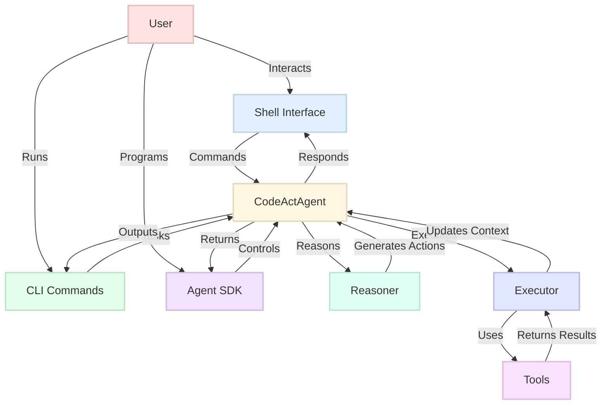
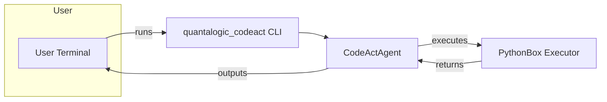
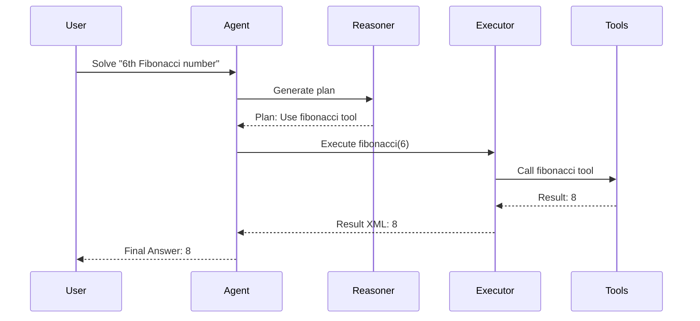

# Quantalogic CodeAct

Quantalogic CodeAct is a powerful, modular framework designed to create and manage AI agents capable of reasoning, acting, and interacting with users through intuitive interfaces. Built on the ReAct (Reasoning and Acting) paradigm, it integrates language models (via `litellm`), a robust tool system, and a structured reasoning engine to tackle complex tasks—from mathematical problem-solving to conversational interactions. This documentation outlines the motivations, components, and practical usage of CodeAct, preserving the original details while enhancing clarity and structure.

## Table of Contents
- [Why CodeAct?](#why-codeact)
- [What is CodeAct?](#what-is-codeact)
  - [CodeAct Module Overview](#codeact-module-overview)
  - [CodeAct Principle, ReAct, and the CodeAct Paper](#codeact-principle-react-and-the-codeact-paper)
  - [ReAct Agent](#react-agent)
  - [Architecture](#architecture)
- [How to Use CodeAct](#how-to-use-codeact)
  - [Installation](#installation)
  - [Quick Start](#quick-start)
    - [Interactive Shell](#interactive-shell)
    - [Command-Line Interface](#command-line-interface)
  - [Using the Agent SDK](#using-the-agent-sdk)
  - [Commands](#commands)
    - [Shell Commands](#shell-commands)
    - [CLI Commands](#cli-commands)
  - [Examples](#examples)
  - [Configuration](#configuration)
- [Contributing](#contributing)
- [License](#license)

---

## Why CodeAct?

AI agents need to go beyond simple responses to solve complex, multi-step tasks, adapt to diverse contexts, and provide user-friendly interactions. CodeAct addresses these challenges by offering:

- **Robust Task Solving**: Breaks down intricate problems into iterative reasoning and action steps, enabling precise solutions.
- **Modularity and Extensibility**: Supports plug-and-play components like tools, reasoners, and executors, allowing customization for specific domains.
- **Accessible Interfaces**: Provides CLI, shell, and SDK interfaces, catering to both end-users and developers.
- **Scalability**: Handles a wide range of applications, from mathematical computations to conversational dialogues.

Whether you're a developer building intelligent systems, a researcher exploring AI reasoning, or a user seeking an interactive assistant, CodeAct provides the tools and flexibility to meet your needs.

---

## What is CodeAct?

Quantalogic CodeAct is a framework within the Quantalogic ecosystem that enables the creation of AI agents capable of reasoning and acting using the ReAct paradigm. It integrates language models, extensible tools, and interactive interfaces (CLI, shell, and SDK) to empower users to solve tasks, engage in conversations, and customize agent behavior.

### CodeAct Module Overview
The CodeAct module (located at `quantalogic_codeact/codeact`) provides the core components for building intelligent agents:

```text
quantalogic_codeact/
└── codeact/
    ├── agent.py          # Core agent implementing the ReAct loop (CodeActAgent)
    ├── reasoner.py       # Generates reasoning steps or code using LLMs
    ├── executor.py       # Safely executes Python code and tool calls
    ├── tools/            # Built-in and extensible tool integrations
    ├── history.py        # Manages conversational and execution history
    ├── config.py         # Loads and validates YAML-based configuration
    └── utils.py          # Helper functions for logging and error handling
```

Each component follows single-responsibility design, making it easy to extend or replace parts (e.g., swap in custom executors or toolsets) to fit your domain.

### CodeAct Principle, ReAct, and the CodeAct Paper

CodeAct is inspired by the *["ReAct: Synergizing Reasoning and Acting in Language Models"](https://arxiv.org/abs/2210.03629)* paper (Yao et al., 2022), and further formalized and empirically validated in the recent work *"Executable Code Actions Elicit Better LLM Agents"* ([Yang et al., 2024](https://arxiv.org/html/2402.01030v4)).

The ReAct paradigm combines reasoning (generating plans or thoughts) with acting (executing actions) in an iterative loop. CodeAct extends this concept by making **executable code**—specifically Python—the primary action and communication format between agent and environment. This approach leverages language models' extensive code pre-training, allowing agents to:

- **Reason**: Analyze tasks and generate plans or code based on context and history.
- **Act**: Emit Python code as actions, which are executed in the environment; the agent receives outputs (including errors) as observations.
- **Iterate**: Repeat the cycle, incorporating feedback from code execution until the task is resolved or a limit is reached.

#### Why Executable Code Actions?
Empirical results from the CodeAct paper show that using code as the action format leads to better tool-use performance for LLM agents—especially open-source models—compared to JSON or text-based tool calls. This is attributed to LLMs' familiarity with code and Python's rich ecosystem for task decomposition, control flow, and error handling.

A critical component that makes CodeAct's executable code actions possible is the [quantalogic-pythonbox](https://github.com/quantalogic/quantalogic-pythonbox) project. PythonBox provides a secure, sandboxed environment for executing Python code, ensuring that agent-generated code can be run safely, with resource limits and isolation from the host system. This robust execution backend enables the CodeAct agent to interact with its environment confidently, handling both standard outputs and errors, and supports advanced features such as multi-turn tool use and dynamic package installation.

CodeAct thus provides a natural, powerful, and extensible interface for building robust LLM agents that can solve complex, multi-step tasks using code.

#### Example: CodeAct Agent Interaction
A CodeAct agent typically emits actions in the form of executable Python code blocks. For example:

```
<execute>
print("Hello, World!")
</execute>
```

The agent receives the result of this execution (output or errors) and uses it for further reasoning and actions. This loop continues until the agent determines the task is complete.

For more details and example prompts, see Appendix E of the [CodeAct paper](https://arxiv.org/html/2402.01030v4).

### ReAct Agent

The `CodeActAgent` is the core of CodeAct, implementing the ReAct loop:

1. **Task Input**: Receives a task (e.g., "Solve 2 + 2").
2. **Reasoning Phase**: Uses a `Reasoner` to generate a plan or code, leveraging language models.
3. **Action Phase**: Employs an `Executor` to run the code or invoke tools.
4. **Evaluation**: Checks if the task is complete, iterating if necessary.

The agent maintains context through a history manager and supports tools for specialized tasks, making it ideal for multi-step problem-solving.

### Architecture

CodeAct’s architecture is designed for modularity and scalability, as shown below:



- **Agent (`CodeActAgent`)**: Orchestrates the ReAct loop, managing state and history.
- **Reasoner**: Generates reasoning steps or code using language models (e.g., Gemini, DeepSeek).
- **Executor**: Executes actions, handling code execution and tool interactions.
- **Tools**: Modular functions for specific tasks (e.g., `math_tools` for calculations).
- **Interfaces**: Shell, CLI, and SDK provide user and programmatic access.

---

## How to Use CodeAct

### Installation

#### Prerequisites
- Python 3.12 or higher
- Poetry (`pip install poetry`)
- Valid API keys for language models (e.g., `GEMINI_API_KEY`)

#### Install
1. Clone the repository:
   ```bash
   git clone https://github.com/your-org/quantalogic-codeact.git
   cd quantalogic-codeact
   ```
2. Install dependencies:
   ```bash
   poetry install
   ```
Alternatively, install CodeAct via pip:
```bash
pip install quantalogic-codeact
```
3. Set environment variables:
   ```bash
   export GEMINI_API_KEY="your-api-key"
   ```
4. Verify installation:
   ```bash
   poetry run quantalogic_codeact shell
   ```
   or
   ```bash
   quantalogic_codeact --help
   ```

### Quick Start

CodeAct supports two primary interaction modes: an interactive shell and a command-line interface (CLI).

#### Interactive Shell
Start the shell for real-time interaction:
```bash
poetry run quantalogic_codeact shell
```
Inside the shell, use commands like `/help` to explore options, `/solve` for tasks, or `/chat` for conversations. Example:
```
[cfg:config.yaml] [Agent] [codeact]> /solve "What is 2 + 2?"
[Step 1 Result]
- Status: Success
- Value: 4
- Execution Time: 0.12 seconds
- Completed: True
[Final Answer]
4
```

#### Command-Line Interface
Run tasks directly from the terminal:
```bash
poetry run quantalogic_codeact task "Solve 2 + 2" --streaming
```
List available tools or models:
```bash
poetry run quantalogic_codeact list-toolboxes
poetry run quantalogic_codeact list-models
```

#### CLI Usage
The `quantalogic_codeact` CLI offers the following core commands:
```bash
quantalogic_codeact task "TASK_DESCRIPTION" [options]
quantalogic_codeact shell [options]
quantalogic_codeact list-toolboxes
quantalogic_codeact list-models
quantalogic_codeact config
```
**Commands & Options:**
- `task`: Solve a task directly.
  - `--streaming` for real-time output.
  - `--model MODEL_NAME` to select an LLM (e.g., `deepseek/deepseek-chat`).
  - `--timeout SECONDS` to set execution timeout.
- `shell`: Start interactive shell (supports `/help`, `/solve`, `/chat`).
- `list-toolboxes` & `list-models`: Show available tools and models.
- `config`: View or edit CLI configuration.

**Example:**
```bash
quantalogic_codeact task "Calculate factorial of 5" --model deepseek/deepseek-chat --timeout 60 --streaming
```
**Usage Diagram:**


### Using the Agent SDK

The Agent SDK enables developers to programmatically create and control agents, offering fine-grained control over reasoning, execution, and tool integration. Below is an example demonstrating task-solving, progress monitoring, and custom tool integration.

```python
from quantalogic_codeact.codeact.agent import Agent
from quantalogic_codeact.codeact.agent_config import AgentConfig
from quantalogic_toolbox import create_tool, Tool

# Define a custom tool
@create_tool
async def fibonacci(n: int) -> int:
    """Calculate the nth Fibonacci number."""
    if n < 0:
        raise ValueError("Fibonacci is not defined for negative numbers")
    a, b = 0, 1
    for _ in range(n):
        a, b = b, a + b
    return a

# Initialize agent with configuration
config = AgentConfig(
    model="deepseek/deepseek-chat",
    max_iterations=5,
    enabled_toolboxes=["math_tools"],
    tools=[fibonacci],
    personality={"traits": ["logical", "concise"]}
)
agent = Agent(config=config)

# Define an observer to monitor progress
def monitor_event(event):
    if event.event_type == "StepStarted":
        print(f"Step {event.step_number} started")
    elif event.event_type == "ActionExecuted":
        print(f"Step {event.step_number} result: {event.result_xml}")
    elif event.event_type == "TaskCompleted":
        print(f"Task completed with answer: {event.final_answer}")

agent.add_observer(monitor_event, ["StepStarted", "ActionExecuted", "TaskCompleted"])

# Solve a task synchronously
task = "Calculate the 6th Fibonacci number"
result = agent.sync_solve(task)
final_answer = result[-1].get("result", "No result")
print(f"Final Answer: {final_answer}")

# Chat asynchronously
async def run_chat():
    response = await agent.chat("Explain the Fibonacci sequence")
    print(f"Explanation: {response}")

import asyncio
asyncio.run(run_chat())
```

#### Example Output
```
Step 1 started
Step 1 result: <ExecutionResult><Status>Success</Status><Value>8</Value>...</ExecutionResult>
Task completed with answer: 8
Final Answer: 8
Explanation: The Fibonacci sequence starts with 0, 1, and each subsequent number is the sum of the previous two (0, 1, 1, 2, 3, 5, 8, ...). The 6th number is 8.
```

#### ReAct Loop Visualization
The SDK executes the ReAct loop as follows:



#### SDK Features
- **Custom Configuration**: Set model, tools, iterations, and personality via `AgentConfig`.
- **Event Monitoring**: Track events like `StepStarted`, `TaskCompleted` using observers.
- **Dynamic Tools**: Register custom tools (e.g., `fibonacci`) at runtime.
- **Sync/Async Support**: Use `sync_solve`/`sync_chat` for synchronous calls or `solve`/`chat` for asynchronous operations.

### Commands

#### Shell Commands

Below is a comprehensive list of shell commands:

| Command              | Description                                      | Example Usage                       |
|----------------------|--------------------------------------------------|-------------------------------------|
| `/help [command]`    | Show available commands or help for a specific one | `/help chat`                       |
| `/chat <message>`    | Send a chat message to the agent                | `/chat How are you?`               |
| `/solve <task>`      | Ask the agent to solve a task                   | `/solve Integrate x^2 from 0 to 1` |
| `/mode [react\|codeact]` | Switch between chat and task-solving modes  | `/mode codeact`                    |
| `/stream [on\|off]`  | Toggle streaming output                         | `/stream on`                       |
| `/exit`              | Exit the shell                                  | `/exit`                            |
| `/history [n]`       | Show last `n` messages (default: all)           | `/history 5`                       |
| `/clear`             | Clear conversation history                      | `/clear`                           |
| `/agent <name>`      | Switch to or show agent details                 | `/agent MathBot`                   |
| `/set <field> <value>` | Set a config field and create a new agent     | `/set model deepseek/deepseek-chat` |
| `/config show`       | Display current configuration                   | `/config show`                     |
| `/config save <file>` | Save config to a file                          | `/config save myconfig.yaml`       |
| `/config load <file>` | Load config from a file                        | `/config load myconfig.yaml`       |
| `/toolbox install <name>` | Install a toolbox                          | `/toolbox install math_tools`      |
| `/toolbox uninstall <name>` | Uninstall a toolbox                      | `/toolbox uninstall math_tools`    |
| `/toolbox tools <name>` | List tools in a toolbox                    | `/toolbox tools math_tools`        |
| `/toolbox doc <name> <tool>` | Show tool documentation              | `/toolbox doc math_tools integrate`|
| `/listmodels`        | List available models                           | `/listmodels`                      |
| `/version`           | Show package version                            | `/version`                         |
| `/tutorial`          | Display a tutorial for new users                 | `/tutorial`                        |
| `/inputmode [single\|multi]` | Toggle single-line or multiline input   | `/inputmode multi`                 |
| `/contrast [on\|off]` | Toggle high-contrast mode for accessibility    | `/contrast on`                     |
| `/setmodel <model>`  | Set model and switch to a new agent             | `/setmodel deepseek/deepseek-chat` |
| `/debug [on\|off]`   | Toggle debug mode for detailed logging          | `/debug on`                        |
| `/save <filename>`   | Save conversation history to a file             | `/save history.json`               |
| `/load <filename>`   | Load conversation history from a file           | `/load history.json`               |
| `/compose`           | Compose input in an external editor             | `/compose`                         |
| `/edit [n]`          | Edit the nth user message (default: last)       | `/edit 1`                          |

#### CLI Commands
```bash
Usage: quantalogic_codeact [OPTIONS] COMMAND [ARGS]...

Set custom config path for all commands.

Options:
  --config, -c PATH        Path to the configuration file to use [default: None]
  --loglevel, -l TEXT      Override the log level: DEBUG|INFO|WARNING|ERROR|CRITICAL [default: None]
  --install-completion     Install completion for the current shell.
  --show-completion        Show completion for the current shell.
  --help                   Show this message and exit.

Commands:
  shell                  Start the interactive shell.
  task                   Run the Agent with detailed event monitoring.
  create-toolbox         Create a starter toolbox project with the given name using Jinja2 templates.
  config-load            Load a configuration from a file into the default config location.
  list-models            List all available LLM models and their details.
  list-toolboxes         List installed toolboxes, optionally with detailed tool information.
  list-reasoners         List all available reasoners.
  list-executor          List all available executors.
  tool-info              Display information about a specific tool.
  install-toolbox        Install a toolbox, update the global config, and enable it in the global config.
  uninstall-toolbox      Uninstall a toolbox and update the config file.
  config [OPTIONS]       Configuration commands (use `quantalogic_codeact config --help` for more).
  toolbox [OPTIONS]      Toolbox commands (use `quantalogic_codeact toolbox --help` for more).

Examples:
  quantalogic_codeact shell
  quantalogic_codeact task "Solve 2 + 2" --streaming
  quantalogic_codeact create-toolbox my_toolbox
  quantalogic_codeact config-load ./myconfig.yaml
  quantalogic_codeact list-models
  quantalogic_codeact list-toolboxes
  quantalogic_codeact install-toolbox math_tools
  quantalogic_codeact uninstall-toolbox math_tools
```

### Examples

For a detailed guide on agent configuration, see [examples/README.md](examples/README.md). A sample configuration is provided in [examples/agent_sample.yaml](examples/agent_sample.yaml):
```yaml
model: "deepseek/deepseek-chat"
max_iterations: 5
max_history_tokens: 2000
```

Example CLI usage:
```bash
poetry run quantalogic_codeact task "Calculate the square root of 16" --model gemini/gemini-2.0-flash
```

Example SDK usage for a custom task:
```python
from quantalogic_codeact.codeact.agent import Agent

agent = Agent()
result = agent.sync_solve("What is the square root of 16?")
print(result[-1].get("result", "No result"))
```

### Configuration

CodeAct uses a YAML-based configuration system, typically stored at `~/.quantalogic/config.yaml`. Example:
```yaml
model: "gemini/gemini-2.0-flash"
max_iterations: 5
max_history_tokens: 2000
enabled_toolboxes:
  - math_tools
reasoner:
  name: "default"
  config:
    temperature: 0.7
executor:
  name: "default"
profile: "math_expert"
personality:
  traits:
    - witty
    - helpful
tools_config:
  - name: math_tools
    enabled: true
    config:
      precision: "high"
```

Use `/config save` or `/config load` in the shell to manage configurations, or modify the file directly.

---

## Contributing

Contributions are welcome! Please see [CONTRIBUTING.md](CONTRIBUTING.md) for code style, testing, and workflow guidelines.

## References

- Yang, J., et al. (2024). "Executable Code Actions Elicit Better LLM Agents." arXiv preprint [arXiv:2402.01030v4](https://arxiv.org/html/2402.01030v4).
- Yao, S., et al. (2022). "ReAct: Synergizing Reasoning and Acting in Language Models." arXiv preprint [arXiv:2210.03629](https://arxiv.org/abs/2210.03629).

## License

Quantalogic CodeAct is licensed under the Apache License, Version 2.0. See [LICENSE](LICENSE) for more information.