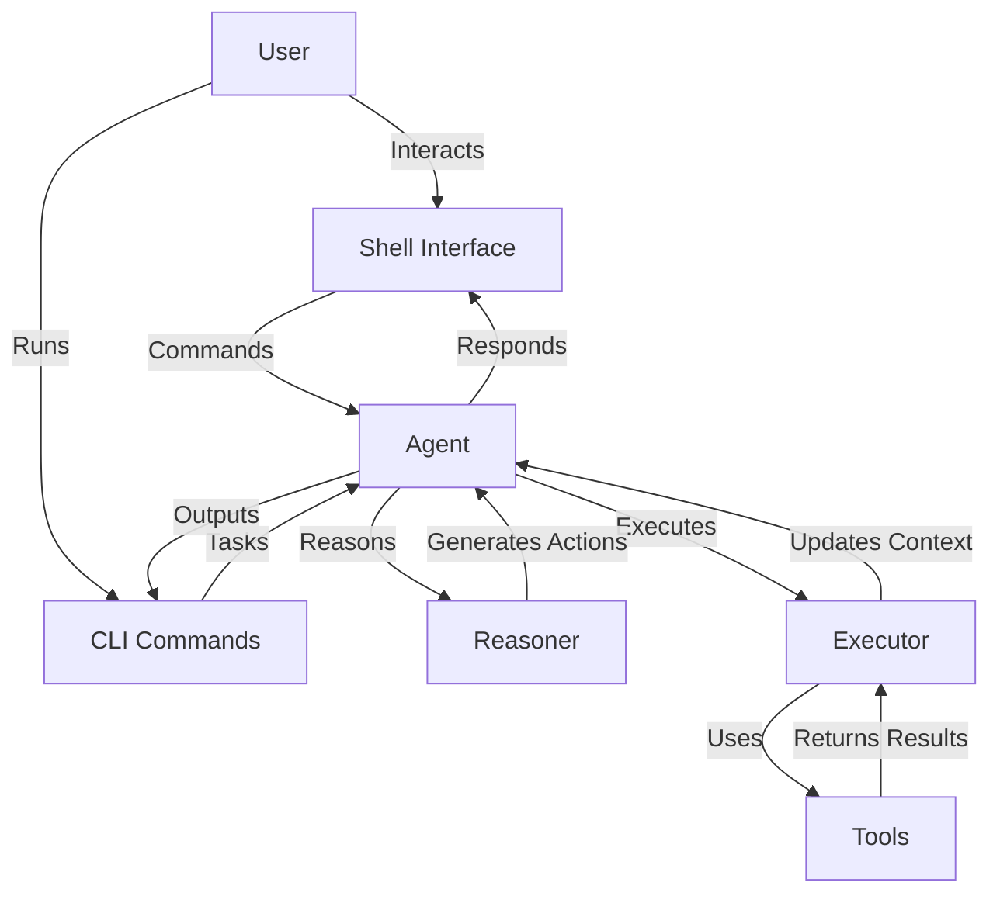

# Quantalogic

Quantalogic is a powerful, modular framework designed to create and manage AI agents capable of reasoning, acting, and interacting with users through an intuitive shell interface or command-line interface (CLI). Built with flexibility and extensibility in mind, it integrates language models (via the `litellm` library), a robust tool system, and a ReAct-based reasoning engine to tackle complex tasks—from mathematical problem-solving to conversational interactions.

Whether you're a developer looking to build custom AI agents or a user seeking an interactive AI assistant, Quantalogic provides the tools and structure to make it happen.

## Table of Contents

- [Purpose](#purpose)
- [Key Features](#key-features)
- [Architecture](#architecture)
- [Installation](#installation)
  - [Prerequisites](#prerequisites)
  - [Install](#install)
- [Quick Start](#quick-start)
  - [Interactive Shell](#interactive-shell)
  - [Command-Line Interface](#command-line-interface)
- [Commands](#commands)
  - [Shell Commands](#shell-commands)
  - [CLI Commands](#cli-commands-1)
- [Examples](#examples)
- [Configuration](#configuration)
- [Contributing](#contributing)
- [License](#license)

## Purpose

Quantalogic aims to bridge the gap between advanced AI capabilities and user-friendly interaction. It empowers users to:

- **Solve Tasks**: Leverage AI to perform multi-step reasoning and execute actions, such as solving math problems or generating content.
- **Interact Seamlessly**: Engage with agents via a shell or CLI, switching between chat and task-solving modes.
- **Customize Behavior**: Define agent personalities, integrate custom tools, and configure reasoning strategies to suit specific needs.

## Key Features

- **Modular Design**: Plug-and-play components like reasoners, executors, and tools.
- **Language Model Integration**: Supports multiple models through `litellm` (e.g., Gemini, DeepSeek). 
- **Tool System**: Extensible toolbox architecture for adding domain-specific functionality.
- **Interactive Shell**: Real-time interaction with streaming output and command autocompletion.
- **CLI Flexibility**: Manage agents, toolboxes, and tasks from the command line.
- **Configurable Agents**: Define personalities, backstories, and operating procedures via YAML.
- **Event-Driven**: Observers monitor agent progress, providing detailed feedback.

## Architecture

Quantalogic’s architecture is designed for modularity and scalability. Here’s a high-level overview:



- **Agent**: The core entity orchestrating reasoning and action.
- **Reasoner**: Generates actions based on task context and history.
- **Executor**: Executes actions using tools and manages context variables.
- **Tools**: Modular functions performing specific tasks (e.g., `math_tools`).
- **Shell/CLI**: User interfaces for interaction and control.

## Installation

### Prerequisites
- Python 3.12 or higher
- Poetry (https://python-poetry.org)
- Valid API keys for language models (e.g., `GEMINI_API_KEY`)

### Install
1. Clone the repository:
   ```bash
   git clone https://github.com/your-org/quantalogic-codeact.git
   cd quantalogic-codeact
   ```
2. Install dependencies:
   ```bash
   poetry install
   ```
3. Set environment variables:
   ```bash
   export GEMINI_API_KEY="your-api-key"
   ```
4. Verify installation:
   ```bash
   poetry run quantalogic_codeact shell
   ```

## Quick Start

Use either the interactive shell or the CLI for tasks:

### Interactive Shell
Start the shell:
```bash
poetry run quantalogic_codeact shell
```
Switch modes and commands inside shell (use `/help` for guidance).

### Command-Line Interface
Run tasks directly:
```bash
poetry run quantalogic_codeact task "Solve 2 + 2" --streaming
```
List available tools and models:
```bash
poetry run quantalogic_codeact list-toolboxes
poetry run quantalogic_codeact list-models
```

## Commands

### Shell Commands

Here’s a comprehensive list of shell commands:

| Command              | Description                                      | Example Usage                       |
|----------------------|--------------------------------------------------|-------------------------------------|
| `/help [command]`    | Show available commands or help for a specific one | `/help chat`                       |
| `/chat <message>`    | Send a chat message to the agent                | `/chat How are you?`               |
| `/solve <task>`      | Ask the agent to solve a task                   | `/solve Integrate x^2 from 0 to 1` |
| `/mode [react\|codeact]` | Switch between chat and task-solving modes  | `/mode codeact`                    |
| `/stream [on\|off]`  | Toggle streaming output                         | `/stream on`                       |
| `/exit`              | Exit the shell                                  | `/exit`                            |
| `/history [n]`       | Show last `n` messages (default: all)           | `/history 5`                       |
| `/clear`             | Clear conversation history                      | `/clear`                           |
| `/agent <name>`      | Switch to or show agent details                 | `/agent MathBot`                   |
| `/set <field> <value>` | Set a config field and create a new agent     | `/set model deepseek/deepseek-chat` |
| `/config show`       | Display current configuration                   | `/config show`                     |
| `/config save <file>` | Save config to a file                          | `/config save myconfig.yaml`       |
| `/config load <file>` | Load config from a file                        | `/config load myconfig.yaml`       |
| `/toolbox install <name>` | Install a toolbox                          | `/toolbox install math_tools`      |
| `/toolbox uninstall <name>` | Uninstall a toolbox                      | `/toolbox uninstall math_tools`    |
| `/toolbox tools <name>` | List tools in a toolbox                    | `/toolbox tools math_tools`        |
| `/toolbox doc <name> <tool>` | Show tool documentation              | `/toolbox doc math_tools integrate`|

### CLI Commands
```bash
Usage: quantalogic_codeact [OPTIONS] COMMAND [ARGS]...

Set custom config path for all commands.

Options:
  --config, -c PATH        Path to the configuration file to use [default: None]
  --loglevel, -l TEXT      Override the log level: DEBUG|INFO|WARNING|ERROR|CRITICAL [default: None]
  --install-completion     Install completion for the current shell.
  --show-completion        Show completion for the current shell.
  --help                   Show this message and exit.

Commands:
  shell                  Start the interactive shell.
  task                   Run the Agent with detailed event monitoring.
  create-toolbox         Create a starter toolbox project with the given name using Jinja2 templates.
  config-load            Load a configuration from a file into the default config location.
  list-models            List all available LLM models and their details.
  list-toolboxes         List installed toolboxes, optionally with detailed tool information.
  list-reasoners         List all available reasoners.
  list-executor          List all available executors.
  tool-info              Display information about a specific tool.
  install-toolbox        Install a toolbox, update the global config, and enable it in the global config.
  uninstall-toolbox      Uninstall a toolbox and update the config file.
  config [OPTIONS]       Configuration commands (use `quantalogic_codeact config --help` for more).
  toolbox [OPTIONS]      Toolbox commands (use `quantalogic_codeact toolbox --help` for more).

Examples:
  quantalogic_codeact shell
  quantalogic_codeact task "Solve 2 + 2" --streaming
  quantalogic_codeact create-toolbox my_toolbox
  quantalogic_codeact config-load ./myconfig.yaml
  quantalogic_codeact list-models
  quantalogic_codeact list-toolboxes
  quantalogic_codeact install-toolbox math_tools
  quantalogic_codeact uninstall-toolbox math_tools
```

## Examples

For a detailed guide on agent configuration, see [examples/README.md](examples/README.md).
The file [examples/agent_sample.yaml](examples/agent_sample.yaml) provides a sample configuration:
```yaml
model: "deepseek/deepseek-chat"
max_iterations: 5
max_history_tokens: 2000
```


## Contributing

Contributions are welcome! Please see [CONTRIBUTING.md](CONTRIBUTING.md) for code style, testing, and workflow guidelines.

## License

Quantalogic is licensed under the MIT License. See [LICENSE](LICENSE) for more information.

---