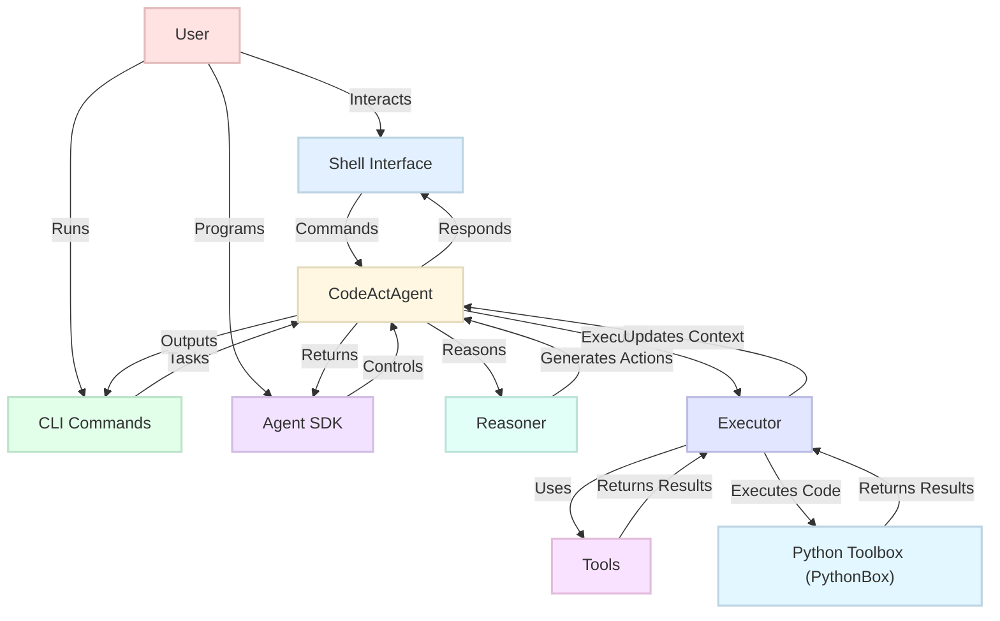
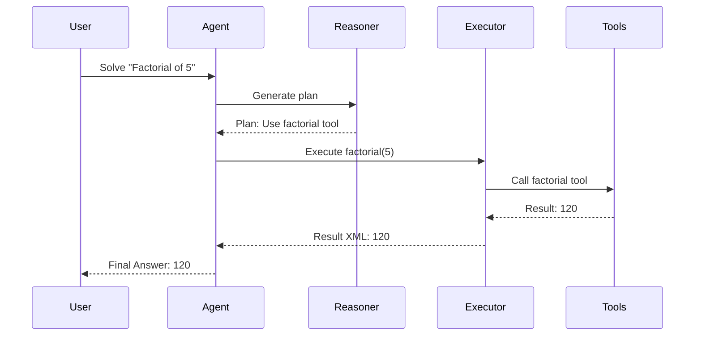

# Quantalogic CodeAct

**Quantalogic CodeAct** is a powerful, modular framework for building AI agents that solve complex tasks through iterative reasoning and action. Built on the ReAct (Reasoning and Acting) paradigm, it integrates language models (via `litellm`), a robust tool ecosystem, and a secure Python execution environment powered by [quantalogic-pythonbox](https://github.com/quantalogic/quantalogic-pythonbox). With intuitive interfaces (CLI, interactive shell, and SDK), CodeAct supports a wide range of applications—from mathematical problem-solving to conversational interactions—making it ideal for developers, researchers, and end-users.

## Table of Contents
- [Why CodeAct?](#why-codeact)
- [What is CodeAct?](#what-is-codeact)
  - [Core Modules](#core-modules)
  - [CodeAct Principle and ReAct Paradigm](#codeact-principle-and-react-paradigm)
  - [ReAct Agent](#react-agent)
  - [Architecture](#architecture)
- [How to Use CodeAct](#how-to-use-codeact)
  - [Installation](#installation)
  - [Quick Start](#quick-start)
    - [Interactive Shell](#interactive-shell)
    - [Command-Line Interface (CLI)](#command-line-interface-cli)
  - [Using the Agent SDK](#using-the-agent-sdk)
  - [Commands](#commands)
    - [Shell Commands](#shell-commands)
    - [CLI Commands](#cli-commands)
  - [Examples](#examples)
  - [Configuration](#configuration)
  - [Toolbox System](#toolbox-system)
  - [Memory Systems](#memory-systems)
  - [Troubleshooting](#troubleshooting)
- [Contributing](#contributing)
- [References](#references)
- [License](#license)

---

## Why CodeAct?

Modern AI agents must tackle intricate, multi-step tasks, adapt to diverse contexts, and provide seamless user experiences. CodeAct meets these demands by offering:

- **Robust Task Solving**: Decomposes complex problems into iterative reasoning and executable actions for precise solutions.
- **Modularity and Extensibility**: Supports plug-and-play components like tools, reasoners, and executors for domain-specific customization.
- **Accessible Interfaces**: Provides CLI, interactive shell, and SDK, catering to both casual users and developers.
- **Scalability**: Handles applications from simple calculations to advanced automation and conversational workflows.

Whether you're automating processes, conducting AI research, or seeking an intelligent assistant, CodeAct delivers flexibility and power.

---

## What is CodeAct?

Quantalogic CodeAct is a framework within the Quantalogic ecosystem that enables the creation of AI agents capable of reasoning and acting using executable Python code as the primary action mechanism. It leverages the ReAct paradigm, integrating language models, extensible tools, and secure execution environments to solve tasks, engage in dialogues, and support custom workflows.

### Core Modules

CodeAct’s modular design ensures each component has a clear responsibility, making it easy to extend or customize:

- **`agent.py`**: Implements the `CodeActAgent`, orchestrating the ReAct loop.
- **`agent_config.py`**: Manages agent configuration via YAML files.
- **`reasoner.py`**: Generates reasoning steps and code using language models.
- **`executor.py`**: Safely executes Python code and tool calls using PythonBox.
- **`tools_manager.py`**: Registers and manages tools and toolboxes.
- **`tools/`**: Includes built-in tools (e.g., `AgentTool`, `RetrieveMessageTool`).
- **`conversation_manager.py`**: Tracks conversation history for context-aware interactions.
- **`working_memory.py`**: Manages task-specific execution history.
- **`completion_evaluator.py`**: Evaluates task completion using LLM verification.
- **`events.py`**: Defines event and result models with Pydantic.
- **`constants.py`**: Stores project constants (e.g., default model, token limits).
- **`cli.py` & `cli_commands/`**: Provides CLI entry points and subcommands.
- **`templates/` & `prompts/`**: Jinja2 templates for LLM prompts and responses.
- **`plugin_manager.py`**: Enables dynamic loading of plugins and toolboxes.
- **`xml_utils.py`**: Handles XML formatting for results and actions.
- **`llm_util.py`**: Manages LLM completion with streaming support.

### CodeAct Principle and ReAct Paradigm

CodeAct is inspired by the **ReAct paradigm** from ["ReAct: Synergizing Reasoning and Acting in Language Models"](https://arxiv.org/abs/2210.03629) (Yao et al., 2022) and advanced in ["Executable Code Actions Elicit Better LLM Agents"](https://arxiv.org/abs/2402.01030) (Yang et al., 2024).

#### ReAct Paradigm
ReAct combines **reasoning** (generating plans or thoughts) with **acting** (executing actions) in an iterative loop:
1. **Reason**: Analyze the task and plan actions using an LLM.
2. **Act**: Execute actions (e.g., code, tool calls) in the environment.
3. **Iterate**: Incorporate feedback from actions to refine reasoning until task completion.

This synergy reduces errors, improves adaptability, and enhances interpretability by producing explicit reasoning traces alongside actions.

#### CodeAct Enhancement
CodeAct builds on ReAct by using **executable Python code** as the action format, leveraging LLMs’ code-generation capabilities. Key benefits include:
- **Unified Action Space**: Python code allows flexible tool composition, control flow, and error handling.
- **Secure Execution**: Powered by [quantalogic-pythonbox](https://github.com/quantalogic/quantalogic-pythonbox), ensuring safe code execution with resource limits.
- **Empirical Superiority**: The CodeAct paper demonstrates up to 20% higher success rates compared to JSON or text-based actions.

**Example**:
```plaintext
Task: "Calculate 3 + 5"
Reasoning: "I’ll write a Python script to perform the addition."
Action:
<execute>
result = 3 + 5
print(result)
</execute>
Result: "8"
```

### ReAct Agent

The `CodeActAgent` is the heart of CodeAct, implementing the ReAct loop:
1. **Task Input**: Receives a task (e.g., "Calculate the factorial of 5").
2. **Reasoning Phase**: Uses a `Reasoner` to generate a plan or Python code.
3. **Action Phase**: Employs an `Executor` to run the code or invoke tools.
4. **Evaluation**: Checks task completion via `CompletionEvaluator`, iterating if needed.

It maintains context through `WorkingMemory` and `ConversationManager`, supporting multi-step tasks and dialogues.

### Architecture

CodeAct’s architecture is modular and scalable, as shown below:



- **Agent**: Orchestrates the ReAct loop, managing state and history.
- **Reasoner**: Generates code or plans using LLMs (e.g., Gemini, DeepSeek).
- **Executor**: Executes actions securely with PythonBox.
- **Tools**: Modular functions for specialized tasks.
- **PythonBox**: Provides a sandboxed environment for safe code execution.

---

## How to Use CodeAct

### Installation

#### Prerequisites
- **Python**: 3.12 or higher
- **Poetry**: Install via `pip install poetry`
- **API Keys**: Required for LLMs (e.g., `GEMINI_API_KEY` for Gemini models)

#### Installation Steps
1. **Clone the Repository**:
   ```bash
   git clone https://github.com/quantalogic/quantalogic-codeact.git
   cd quantalogic-codeact
   ```
2. **Install Dependencies**:
   ```bash
   poetry install
   ```
   Alternatively, install via pip:
   ```bash
   pip install quantalogic-codeact
   ```
3. **Set Environment Variables**:
   ```bash
   export GEMINI_API_KEY="your-api-key"
   ```
4. **Verify Installation**:
   ```bash
   poetry run quantalogic_codeact --help
   ```

### Quick Start

CodeAct offers two primary interaction modes: an **interactive shell** for real-time engagement and a **CLI** for direct task execution.

#### Interactive Shell
Start the shell:
```bash
poetry run quantalogic_codeact shell
```
Interact using commands like `/solve` for tasks or `/chat` for conversations. Example:
```
[cfg:config.yaml] [Agent] [codeact]> /solve "Calculate 2 + 2"
[Step 1 Result]
- Status: Success
- Value: 4
- Execution Time: 0.12 seconds
- Completed: True
[Final Answer]
4
```

#### Command-Line Interface (CLI)
Run tasks directly:
```bash
poetry run quantalogic_codeact task "Calculate 3 * 4" --streaming
```
List available resources:
```bash
poetry run quantalogic_codeact list-toolboxes
poetry run quantalogic_codeact list-models
```

### Using the Agent SDK

The Agent SDK enables programmatic control over agents, ideal for developers building custom applications. Below is an example integrating a custom tool and monitoring task progress.

```python
from quantalogic_codeact.codeact.agent import Agent
from quantalogic_codeact.codeact.agent_config import AgentConfig
from quantalogic_toolbox import create_tool, Tool

# Define a custom tool
@create_tool
async def factorial(n: int) -> int:
    """Calculate the factorial of a number."""
    if n < 0:
        raise ValueError("Factorial is not defined for negative numbers")
    result = 1
    for i in range(1, n + 1):
        result *= i
    return result

# Configure agent
config = AgentConfig(
    model="deepseek/deepseek-chat",
    max_iterations=5,
    enabled_toolboxes=["math_tools"],
    tools=[factorial],
    personality={"traits": ["logical", "precise"]}
)
agent = Agent(config=config)

# Monitor progress
def monitor_event(event):
    if event.event_type == "StepStarted":
        print(f"Step {event.step_number} started")
    elif event.event_type == "ActionExecuted":
        print(f"Step {event.step_number} result: {event.result.to_summary()}")
    elif event.event_type == "TaskCompleted":
        print(f"Task completed with answer: {event.final_answer}")

agent.add_observer(monitor_event, ["StepStarted", "ActionExecuted", "TaskCompleted"])

# Solve a task
result = agent.sync_solve("Calculate the factorial of 5")
final_answer = result[-1].get("result", "No result")
print(f"Final Answer: {final_answer}")

# Chat asynchronously
async def run_chat():
    response = await agent.chat("Explain factorials")
    print(f"Explanation: {response}")

import asyncio
asyncio.run(run_chat())
```

**Example Output**:
```
Step 1 started
Step 1 result: - Status: Success
- Task Status: completed
- Result: 120
- Execution Time: 0.15 seconds
Task completed with answer: 120
Final Answer: 120
Explanation: A factorial of a non-negative integer n, denoted n!, is the product of all positive integers less than or equal to n. For example, 5! = 5 * 4 * 3 * 2 * 1 = 120.
```

**ReAct Loop Visualization**:


### Commands

#### Shell Commands
Below is a comprehensive list of shell commands:

| Command                     | Description                                           | Example Usage                             |
|-----------------------------|-------------------------------------------------------|-------------------------------------------|
| `/help [command]`           | Show help for commands or a specific command          | `/help solve`                             |
| `/chat <message>`           | Send a chat message to the agent                     | `/chat How are you?`                      |
| `/solve <task>`             | Solve a task                                         | `/solve Calculate 2 + 2`                  |
| `/mode [chat|codeact]`      | Switch between chat and task-solving modes           | `/mode codeact`                           |
| `/stream [on|off]`          | Toggle streaming output                              | `/stream on`                              |
| `/exit`                     | Exit the shell                                       | `/exit`                                   |
| `/history [n]`              | Show last `n` messages (default: all)                | `/history 5`                              |
| `/clear`                    | Clear conversation history                           | `/clear`                                  |
| `/agent <name>`             | Switch or show agent details                         | `/agent MathBot`                          |
| `/set <field> <value>`      | Set a config field and create new agent              | `/set model deepseek/deepseek-chat`       |
| `/set temperature <value>`  | Set or show LLM temperature (0 to 1)                 | `/set temperature 0.7`                    |
| `/config show`              | Display current configuration                        | `/config show`                            |
| `/config save <file>`       | Save config to a file                                | `/config save myconfig.yaml`              |
| `/config load <file>`       | Load config from a file                              | `/config load myconfig.yaml`              |
| `/toolbox install <name>`   | Install a toolbox                                    | `/toolbox install math_tools`             |
| `/toolbox uninstall <name>` | Uninstall a toolbox                                  | `/toolbox uninstall math_tools`           |
| `/toolbox enable <name>`    | Enable a toolbox                                     | `/toolbox enable math_tools`              |
| `/toolbox disable <name>`   | Disable a toolbox                                    | `/toolbox disable math_tools`             |
| `/toolbox installed`        | Show installed toolboxes                             | `/toolbox installed`                      |
| `/toolbox tools <name>`     | List tools in a toolbox                              | `/toolbox tools math_tools`               |
| `/toolbox doc <name> <tool>` | Show tool documentation                             | `/toolbox doc math_tools integrate`       |
| `/listmodels`               | List available models                                | `/listmodels`                             |
| `/version`                  | Show package version                                 | `/version`                                |
| `/tutorial`                 | Display a tutorial for new users                     | `/tutorial`                               |
| `/inputmode [single|multi]` | Toggle single-line or multiline input                | `/inputmode multi`                        |
| `/contrast [on|off]`        | Toggle high-contrast mode for accessibility          | `/contrast on`                            |
| `/setmodel <model>`         | Set model and switch to a new agent                  | `/setmodel deepseek/deepseek-chat`        |
| `/loglevel [level]`         | Set log level (DEBUG|INFO|WARNING|ERROR|CRITICAL)    | `/loglevel DEBUG`                         |
| `/save <filename>`          | Save conversation history to a file                  | `/save history.json`                      |
| `/load <filename>`          | Load conversation history from a file                | `/load history.json`                      |
| `/compose`                  | Compose input in an external editor                  | `/compose`                                |
| `/edit [INDEX_OR_ID]`       | Edit a previous user message                         | `/edit 3`                                 |

#### CLI Commands
```bash
Usage: quantalogic_codeact [OPTIONS] COMMAND [ARGS]...

Options:
  --config, -c PATH        Path to the configuration file to use
  --loglevel, -l TEXT      Override log level: DEBUG|INFO|WARNING|ERROR|CRITICAL
  --install-completion     Install shell completion
  --show-completion        Show shell completion script
  --help                   Show this message and exit

Commands:
  shell                  Start the interactive shell
  task                   Run a task with event monitoring
  create-toolbox         Create a new toolbox project
  config-load            Load a configuration file
  list-models            List available LLM models
  list-toolboxes         List installed toolboxes
  list-reasoners         List available reasoners
  list-executors         List available executors
  tool-info              Display tool information
  install-toolbox        Install a toolbox
  uninstall-toolbox      Uninstall a toolbox
  config                 Manage configuration (subcommands: show, reset)
  toolbox                Manage toolboxes (subcommands: install, uninstall, tools, doc)
```

**Tip**: Use `--config` to specify a custom configuration file:
```bash
quantalogic_codeact task "Solve 2 + 2" -c ./myconfig.yaml
```

### Examples

#### Shell
```plaintext
[cfg:config.yaml] [Agent] [codeact]> /chat Tell me a joke
Why did the computer go to art school? Because it wanted to learn how to draw a better "byte"!
```

#### CLI
```bash
poetry run quantalogic_codeact task "Calculate the square root of 16" --model gemini/gemini-2.0-flash
```
**Output**:
```
[Final Answer]
4
```

#### SDK
```python
from quantalogic_codeact.codeact.agent import Agent
agent = Agent()
result = agent.sync_solve("What is 3 * 5?")
print(result[-1]["result"])  # Output: 15
```

### Configuration

CodeAct uses a YAML configuration file, typically at `~/.quantalogic/config.yaml`. Example:
```yaml
model: "gemini/gemini-2.0-flash"
max_iterations: 5
max_history_tokens: 2000
enabled_toolboxes:
  - math_tools
reasoner:
  name: "default"
  config:
    temperature: 0.7
executor:
  name: "default"
personality:
  traits:
    - witty
    - helpful
tools_config:
  - name: math_tools
    enabled: true
    config:
      precision: "high"
```

Manage configurations in the shell with `/config save` or `/config load`, or edit the file directly.

### Toolbox System

Toolboxes extend CodeAct’s functionality with modular, reusable tools. Built-in toolboxes include `math_tools` for calculations. Create custom toolboxes with:

```bash
poetry run quantalogic_codeact create-toolbox my_toolbox
```

This generates a project structure with a `tools.py` file for defining tools. Example:
```python
@create_tool
async def echo_tool(message: str) -> str:
    """Echoes the input message."""
    return f"Echo: {message}"
```

For detailed guidance, see [Toolbox Documentation](quantalogic_codeact/docs/01-quantalogic-toolbox.md), covering toolbox creation, tool registration, and management.

### Memory Systems

CodeAct employs two memory systems:
- **WorkingMemory**: Tracks task-specific steps, thoughts, actions, and results.
- **ConversationManager**: Stores user-agent interaction history for context-aware dialogues.

These systems enable multi-step reasoning and persistent conversations. See [Memory Systems Documentation](quantalogic_codeact/docs/02-quantalogic-codeagent-memory.md) for implementation details and examples.

### Troubleshooting

- **API Key Issues**: Verify `GEMINI_API_KEY` or other LLM keys are set.
- **Dependency Errors**: Run `poetry install` to ensure all packages are installed.
- **Timeout Errors**: Increase `--timeout` in CLI or `timeout` in SDK config.
- **Tool Failures**: Use `/toolbox doc <toolbox> <tool>` to check tool arguments.
- **Logging**: Enable debug mode with `/loglevel DEBUG` for detailed logs.

---

## Contributing

Contributions are welcome! Please follow [CONTRIBUTING.md](../../CONTRIBUTING.md) for guidelines on code style, testing, and workflows.

## References

- Yao, S., et al. (2022). "ReAct: Synergizing Reasoning and Acting in Language Models." [arXiv:2210.03629](https://arxiv.org/abs/2210.03629).
- Yang, J., et al. (2024). "Executable Code Actions Elicit Better LLM Agents." [arXiv:2402.01030](https://arxiv.org/abs/2402.01030).
- Quantalogic PythonBox: [github.com/quantalogic/quantalogic-pythonbox](https://github.com/quantalogic/quantalogic-pythonbox).

## License

Quantalogic CodeAct is licensed under the **Apache License, Version 2.0**. See [LICENSE](../../LICENSE) for details.