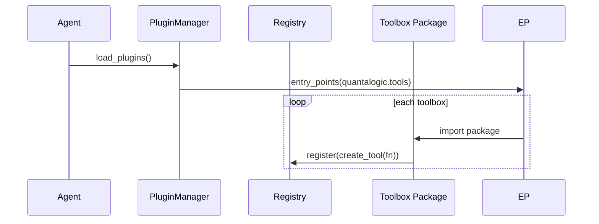

# Quantalogic Toolbox Documentation

The Quantalogic Toolbox system empowers developers to extend AI agents with modular, type-safe, and self-documenting tools written in Python. By defining tools as Python functions with type hints and docstrings, you enable automatic discovery, input/output validation, and rich documentation generation. Toolboxes are ideal for adding capabilities like file operations, API integrations, or custom business logic to AI agents without modifying their core functionality.

## Table of Contents
- [Why Use a Toolbox?](#why-use-a-toolbox)
- [Anatomy of a Toolbox](#anatomy-of-a-toolbox)
  - [Declaring Your Tools](#declaring-your-tools)
  - [Managing Dependencies](#managing-dependencies)
  - [Toolbox Structure](#toolbox-structure)
- [Discovery and Registration](#discovery-and-registration)
- [Tool Definition and Execution](#tool-definition-and-execution)
  - [Defining Tools](#defining-tools)
  - [Executing Tools](#executing-tools)
  - [Error Handling](#error-handling)
- [Automatic Documentation](#automatic-documentation)
- [Installing and Managing Toolboxes](#installing-and-managing-toolboxes)
  - [CLI Mode](#cli-mode)
  - [Shell Mode](#shell-mode)
  - [Key Differences](#key-differences)
- [Using Custom Configurations](#using-custom-configurations)
  - [Global Configuration](#global-configuration)
  - [Project-Specific Configuration](#project-specific-configuration)
  - [Tool-Specific Configuration](#tool-specific-configuration)
  - [Working Example: Injected Configuration](#working-example-injected-configuration)
- [Best Practices](#best-practices)
  - [Structured Returns](#structured-returns)
  - [Pagination and Limiting](#pagination-and-limiting)
  - [Environment Variables](#environment-variables)
  - [Tool Versioning](#tool-versioning)
- [Security Considerations](#security-considerations)
- [Performance Optimization](#performance-optimization)
- [Testing Your Tools](#testing-your-tools)
- [Frequently Asked Questions (FAQ)](#frequently-asked-questions-faq)

---

## Why Use a Toolbox?

Quantalogic Toolboxes provide a modular framework for extending AI agents, simplifying the integration of complex functionalities such as file I/O, external APIs, or domain-specific logic. Key benefits include:

- **Decoupled Logic**: Separates domain-specific code from the agent’s core, improving maintainability.
- **Independent Development**: Enables teams to build, test, and publish toolboxes independently.
- **Type Safety**: Leverages Python type hints for automatic validation of inputs and outputs.
- **Hot-Pluggable Features**: Allows adding or updating tools without redeploying the agent.
- **Rich Documentation**: Generates detailed documentation automatically from code metadata.

**Example Use Case**: A team wants an AI agent to read and process text files. Instead of modifying the agent’s core, they create a `file_toolbox` with a `read_file` tool, which can be installed and used immediately.

---

## Anatomy of a Toolbox

A toolbox is a self-contained Python package with a standardized structure, designed for easy creation and integration.

### Declaring Your Tools

Tools are defined in a `tools.py` file as Python functions, which can be synchronous or asynchronous. Each tool must include type hints and a docstring to enable automatic validation and documentation generation.

**Example: Synchronous and Asynchronous Tools**

```python
# my_toolbox/tools.py
def sync_tool(x: int) -> str:
    """Convert an integer to string."""
    return str(x)

async def read_file(path: str) -> str:
    """Read a local file and return its contents.

    Args:
        path: Path to the file.

    Returns:
        File contents as a string.
    """
    with open(path, 'r') as f:
        return f.read()
```

### Managing Dependencies

Dependencies are specified in the `pyproject.toml` file to ensure tools have access to required libraries.

**Example: Adding a Dependency**

```toml
# my_toolbox/pyproject.toml
[tool.poetry.dependencies]
python = "^3.10"
requests = "^2.28.0"  # For HTTP requests in tools
```

### Toolbox Structure

A typical toolbox has the following structure:

```
my_toolbox/
├── pyproject.toml     # Metadata and entry-point declaration
├── my_toolbox/
│   ├── __init__.py    # Exports get_tools()
│   └── tools.py       # Tool functions
└── README.md          # Optional user guide
```

Expose tools in `__init__.py`:

```python
# my_toolbox/__init__.py
from .tools import sync_tool, read_file

def get_tools():
    return [sync_tool, read_file]
```

Declare the toolbox in `pyproject.toml`:

```toml
[tool.poetry]
name = "my-toolbox"
version = "0.1.0"
description = "A custom toolbox for Quantalogic"
authors = ["Your Name <you@example.com>"]
packages = [{ include = "my_toolbox" }]

[tool.poetry.dependencies]
python = "^3.10"
quantalogic = ">0.60.0"

[build-system]
requires = ["poetry-core>=1.0.0"]
build-backend = "poetry.core.masonry.api"

[tool.poetry.plugins."quantalogic.tools"]
my_toolbox = "my_toolbox"
```

---

## Discovery and Registration

At startup, the Quantalogic agent uses the `PluginManager` to discover and register toolboxes:

1. Scans Python entry points under the `quantalogic.tools` group using `importlib.metadata.entry_points`.
2. Imports each toolbox package.
3. Calls the `get_tools()` function to retrieve tool functions.
4. Registers tools in a central `ToolRegistry` for invocation.

**Sequence Diagram**



**Note**: Only toolboxes listed in `enabled_toolboxes` in the configuration file are loaded, enabling selective activation.

---

## Tool Definition and Execution

### Defining Tools

Tools are Python functions wrapped as `Tool` instances via the `create_tool` function. Each tool includes:

- **Metadata**: Name, description, arguments, return type, etc.
- **Execution Methods**: `execute` (synchronous) and `async_execute` (asynchronous).

**Example: Complex Tool with Structured Return**

```python
from dataclasses import dataclass
from typing import List
import os

@dataclass
class FileInfo:
    name: str
    size: int

async def list_files(path: str) -> List[FileInfo]:
    """List files in a directory.

    Args:
        path: Directory path.

    Returns:
        List of FileInfo objects containing file names and sizes.
    """
    files = os.listdir(path)
    return [FileInfo(name=f, size=os.path.getsize(os.path.join(path, f))) for f in files]
```

### Executing Tools

Tools are executed within the agent’s task-solving process or programmatically, not as direct CLI commands.

- **Programmatic Invocation**:
  ```python
  from quantalogic_codeact.codeact.tools_manager import ToolRegistry
  registry = ToolRegistry()
  result = await registry.get("read_file").async_execute(path="./data.txt")
  ```

- **Shell Task Solving**:
  Tools are invoked indirectly when solving tasks in the interactive shell:
  ```bash
  /solve "Read the contents of ./data.txt"
  ```
  This triggers the agent to use tools like `read_file` from registered toolboxes, managed by the `Executor` class.

**Note**: Direct CLI invocation of tools (e.g., `quantalogic_codeagent toolbox read_file --path ./data.txt`) is not supported. Instead, tools are used within task-solving or programmatic contexts.

### Error Handling

Tools should handle errors to prevent agent crashes. Use try-except blocks to manage exceptions:

```python
async def read_file(path: str) -> str:
    """Read a file or return an error message."""
    try:
        with open(path, 'r') as f:
            return f.read()
    except FileNotFoundError:
        return "Error: File not found"
    except Exception as e:
        return f"Error: {str(e)}"
```

---

## Automatic Documentation

Each `Tool` instance carries a specification, enabling programmatic documentation generation:

- **`to_markdown()`**: Generates a Markdown page with tables for arguments, return schemas, and examples.
- **`to_docstring()`**: Produces a Python docstring for use in Sphinx or IDEs.
- **`to_json()`**: Yields a machine-readable schema for validation or tooling.

**Example: Generating Markdown**

```python
from quantalogic_codeact.codeact.tools_manager import ToolRegistry
registry = ToolRegistry()
for tool in registry.get_tools():
    print(tool.to_markdown())
```

**Sample Output for `read_file`**

```markdown
`read_file`:
- **Description**: Read a local file and return its contents.

- **Parameters**:
  - `path`: (string, required)
    Path to the file.

- **Usage**:
```xml
<read_file>
  <path>./data.txt</path>
</read_file>
```

- **Returns**: `string` - File contents as a string.
- **Example Return Value**: `"Hello, Quantalogic!"`
```

---

## Installing and Managing Toolboxes

Toolboxes are managed via the command-line interface (CLI) or interactive shell, using shared logic.

### CLI Mode

Use the CLI for scripting or automation:

```bash
# Install from PyPI
quantalogic_codeagent toolbox install quantalogic-toolbox-files

# Install from a local wheel file
quantalogic_codeagent toolbox install ./dist/my_toolbox-1.0.0-py3-none-any.whl

# Uninstall a toolbox
quantalogic_codeagent toolbox uninstall quantalogic-toolbox-files

# List installed toolboxes
quantalogic_codeagent toolbox installed
```

### Shell Mode

Use `/toolbox` commands in the interactive shell for dynamic management:

```bash
/toolbox install quantalogic-toolbox-files
/toolbox uninstall quantalogic-toolbox-files
/toolbox installed
/toolbox tools quantalogic_toolbox_files  # List tools
/toolbox doc quantalogic_toolbox_files read_file  # Show tool documentation
```

### Key Differences

| Feature                | CLI Mode                          | Shell Mode                              |
|------------------------|-----------------------------------|-----------------------------------------|
| **Scope**              | System/global                    | Current session + global                |
| **Immediate Refresh**  | No (requires agent restart)      | Yes (tools available instantly)         |
| **Scripting**          | Yes                              | No                                      |
| **Feedback**           | Limited (stdout)                 | Rich, contextual in-shell output        |

---

## Using Custom Configurations

The Quantalogic agent supports flexible configuration through YAML files. Configurations define settings like installed toolboxes, enabled toolboxes, logging levels, and tool-specific overrides.

### Global Configuration

The default configuration is stored at `~/.quantalogic/config.yaml`, specifying installed and enabled toolboxes, logging levels, and other settings.

**Example: Global Config**

```yaml
log_level: ERROR
installed_toolboxes:
  - name: quantalogic_toolbox_files
    package: quantalogic-toolbox-files
    version: 0.1.0
enabled_toolboxes:
  - quantalogic_toolbox_files
```

### Project-Specific Configuration

Start the agent with a custom config file to isolate settings for a project:

```bash
quantalogic_codeagent --config ./my_project_config.yaml
```

**Behavior**:
- Loads settings and toolboxes from the specified file.
- Updates (e.g., install/uninstall) affect only this file.
- Supports multiple configs for different environments (e.g., `config-dev.yaml`, `config-prod.yaml`).

### Tool-Specific Configuration

Override tool settings using a `tools_config` list in the configuration file. Each entry specifies a tool’s name and properties like `enabled`, `timeout`, or `default`, which are applied to the `Tool` instance during registration.

**Example: Tool-Specific Config**

```yaml
tools_config:
  - name: read_file
    enabled: true
    timeout: 10
    default: "./README.md"
    return_example: "# README\nThis is an example file."
  - name: write_file
    enabled: false
  - name: list_files
    timeout: 30
```

**CLI Usage**:

```bash
# Direct YAML string
quantalogic_codeagent toolbox --tools-config "tools_config: [{name: read_file, timeout: 10}]"

# From file
quantalogic_codeagent toolbox --tools-config "$(cat my_tools.yaml)"
```

**How It Works**:
1. Registers all static and plugin tools.
2. Filters tools based on `enabled_toolboxes` in the config.
3. Applies `tools_config` overrides to matching tools by setting attributes on `Tool` instances.
4. Returns the final list of available tools for the agent.

### Working Example: Injected Configuration

To illustrate configuration injection, consider a scenario where a team develops a `weather_toolbox` with a `get_weather` tool that fetches weather data from an external API. The tool requires an API key and a timeout, specified in a YAML config file and injected during execution.

#### Step 1: Define the Tool

Create a `weather_toolbox` with a `get_weather` tool:

```python
# weather_toolbox/weather_toolbox/tools.py
import aiohttp

async def get_weather(city: str, api_key: str, timeout: int = 5) -> dict:
    """Fetch weather data for a city.

    Args:
        city: Name of the city (e.g., "London").
        api_key: API key for the weather service.
        timeout: Request timeout in seconds (default: 5).

    Returns:
        Dictionary containing weather data (e.g., temperature, description).
    """
    try:
        async with aiohttp.ClientSession() as session:
            async with session.get(
                f"https://api.weather.example.com/data?city={city}&key={api_key}",
                timeout=timeout
            ) as response:
                return await response.json()
    except Exception as e:
        return {"error": str(e)}

def get_tools():
    return [get_weather]
```

#### Step 2: Create the YAML Config File

Define a project-specific configuration file (`weather_config.yaml`):

```yaml
log_level: INFO
installed_toolboxes:
  - name: weather_toolbox
    package: weather-toolbox
    version: 0.1.0
enabled_toolboxes:
  - weather_toolbox
tools_config:
  - name: get_weather
    enabled: true
    api_key: "{{ env.WEATHER_API_KEY }}"  # Resolved from environment variable
    timeout: 8
    return_example: '{"city": "London", "temperature": 15, "description": "Cloudy"}'
```

**Environment Setup**:
Set the environment variable for the API key:
```bash
export WEATHER_API_KEY="your-api-key-here"
```

#### Step 3: Install the Toolbox

Install the `weather_toolbox` using the CLI:

```bash
quantalogic_codeagent toolbox install weather-toolbox
```

#### Step 4: Run the Agent with the Config

Start the agent with the custom config file:

```bash
quantalogic_codeagent --config ./weather_config.yaml
```

In the interactive shell, solve a task that uses the `get_weather` tool:

```bash
/toolbox installed
# Output: weather_toolbox

/solve "Get the weather for London"
```

**Execution Flow**:
1. The agent loads `weather_config.yaml`, registering the `weather_toolbox` and applying `tools_config` overrides.
2. The `get_weather` tool is configured with `api_key="your-api-key-here"` (resolved from `WEATHER_API_KEY`) and `timeout=8`.
3. The task `/solve "Get the weather for London"` triggers the agent to generate code that calls `get_weather`:
   ```python
   async def main():
       result = await weather_toolbox.get_weather(city="London", api_key=context_vars.get('weather_api_key', ''), timeout=8)
       return {'status': 'completed', 'result': str(result)}
   ```
4. The `context_vars` dictionary includes the `weather_api_key` from the config, injected during execution.
5. The tool executes, fetching weather data and returning it to the agent.

**Sample Output**:
```bash
Final Answer: {"city": "London", "temperature": 15, "description": "Cloudy"}
```

#### Step 5: Verify Tool Documentation

Check the tool’s documentation to confirm the injected configuration:

```bash
/toolbox doc weather_toolbox get_weather
```

**Sample Output**:

```markdown
`get_weather`:
- **Description**: Fetch weather data for a city.

- **Parameters**:
  - `city`: (string, required)
    Name of the city (e.g., "London").
  - `api_key`: (string, required, default: your-api-key-here)
    API key for the weather service.
  - `timeout`: (integer, optional, default: 8)
    Request timeout in seconds.

- **Returns**: `dict` - Dictionary containing weather data.
- **Example Return Value**: `{"city": "London", "temperature": 15, "description": "Cloudy"}`
```

This example demonstrates how a YAML config file injects an API key and timeout into a tool, enabling seamless integration with the agent’s task-solving process.

---

## Best Practices

### Structured Returns

Use Python dataclasses for structured outputs, which are serialized as dictionaries automatically:

```python
from dataclasses import dataclass
from typing import List
import os

@dataclass
class FileInfo:
    name: str
    size: int

async def list_files(path: str) -> List[FileInfo]:
    """List files in a directory."""
    files = os.listdir(path)
    return [FileInfo(name=f, size=os.path.getsize(os.path.join(path, f))) for f in files]
```

**Reconstructing Dataclass**:

```python
data = {"name": "example.txt", "size": 1024}
file_info = FileInfo(**data)
print(file_info.name, file_info.size)  # example.txt 1024
```

**Accessing Fields with `.get()`**:

```python
from dataclasses import asdict
d = asdict(file_info)
print(d.get("name"))  # example.txt
```

### Pagination and Limiting

Add `limit` and `offset` parameters for large datasets:

```python
async def list_items(limit: int = 10, offset: int = 0) -> List[str]:
    """List items with pagination."""
    all_items = fetch_all_items()
    return all_items[offset:offset + limit]
```

### Environment Variables

Use `os.getenv` or Pydantic `BaseSettings` for managing secrets:

```python
import os
API_KEY = os.getenv("API_KEY")

async def fetch_data(query: str) -> dict:
    """Fetch data using an API key."""
    response = http_call(query, api_key=API_KEY)
    return response.json()
```

**Using Pydantic**:

```python
from pydantic import BaseSettings

class Settings(BaseSettings):
    api_key: str
    timeout: int = 5
    class Config:
        env_prefix = 'MYTOOL_'

settings = Settings()

async def fetch_data(query: str) -> dict:
    return http_call(query, api_key=settings.api_key, timeout=settings.timeout)
```

### Tool Versioning

Use semantic versioning in `pyproject.toml` to ensure compatibility:

```toml
[tool.poetry]
version = "0.1.0"
```

Document changes in `README.md` or a changelog to communicate updates.

---

## Security Considerations

Secure tool development is critical to prevent vulnerabilities:

- **Input Validation**: Prevent injection attacks by validating inputs:
  ```python
  async def safe_tool(input: str) -> str:
      """Process alphanumeric input only."""
      if not input.isalnum():
          raise ValueError("Input must be alphanumeric")
      return input
  ```

- **Avoid Unsafe Operations**: Do not use `eval()`, `exec()`, or similar functions.
- **Sanitize File Paths**: Prevent directory traversal:
  ```python
  import os
  async def read_file(path: str) -> str:
      """Read a file with path sanitization."""
      safe_path = os.path.normpath(os.path.join(os.getcwd(), path))
      if not safe_path.startswith(os.getcwd()):
          raise ValueError("Invalid file path")
      with open(safe_path, 'r') as f:
          return f.read()
  ```

- **Limit Resource Access**: Restrict tools to specific directories or APIs using permissions.

---

## Performance Optimization

Optimize tools to ensure efficient execution:

- **Use Async I/O**: For network or file operations, leverage asynchronous libraries:
  ```python
  import aiohttp
  async def fetch_data(url: str) -> str:
      """Fetch data asynchronously."""
      async with aiohttp.ClientSession() as session:
          async with session.get(url) as resp:
              return await resp.text()
  ```

- **Cache Results**: Use `functools.lru_cache` for expensive computations:
  ```python
  from functools import lru_cache
  @lru_cache(maxsize=100)
  async def compute_expensive(value: int) -> int:
      """Cache expensive computation."""
      return value * 2
  ```

- **Limit Resource Usage**: Set timeouts for long-running operations:
  ```python
  async def long_running_task() -> str:
      """Run task with timeout."""
      async with asyncio.timeout(10):
          return "Done"
  ```

---

## Testing Your Tools

Test tools independently using `pytest` and `pytest-asyncio` to ensure reliability:

**Example: Testing a File Reader**

```python
# tests/test_tools.py
import pytest
from my_toolbox.tools import read_file

@pytest.mark.asyncio
async def test_read_file(tmp_path):
    file_path = tmp_path / "test.txt"
    file_path.write_text("Hello, Quantalogic!")
    result = await read_file(str(file_path))
    assert result == "Hello, Quantalogic!"
```

**Running Tests**:

```bash
pytest --asyncio-mode=auto
```

---

## Frequently Asked Questions (FAQ)

- **Q: How do I debug a tool that fails silently?**
  - **A**: Enable debug logging with `quantalogic_codeagent --loglevel DEBUG` or `/loglevel DEBUG` to capture detailed logs.

- **Q: Can I use synchronous tools?**
  - **A**: Yes, synchronous tools are supported and executed via `asyncio.to_thread` for compatibility.

- **Q: How do I access variables from previous steps?**
  - **A**: Use `context_vars` in executed code (not directly in tools):
    ```python
    previous_result = context_vars.get('step1_result', '')
    ```

- **Q: What if a toolbox installation fails?**
  - **A**: Check the error message in the CLI output to ensure the package is available on PyPI or the wheel file is valid.

- **Q: How do I update a toolbox?**
  - **A**: Reinstall with `quantalogic_codeagent toolbox install my_toolbox --force` to update to the latest version.

- **Q: Can I invoke tools directly from the CLI?**
  - **A**: No, tools are used within task-solving (e.g., `/solve "Read ./data.txt"`) or programmatically, not as direct CLI commands.

---

*Document last updated: 2025-04-24*