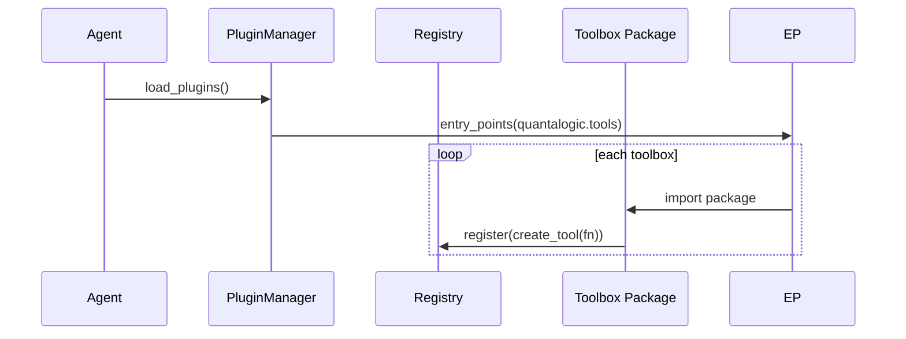

# 01. Quantalogic Toolbox Overview

Quantalogic’s toolbox system provides a modular, type-safe, and self-documenting way to extend your AI agent with new capabilities. By writing plain Python functions—annotated with type hints and docstrings—you get:

- **Automatic discovery** via Python entry points
- **Validation** of inputs and outputs
- **Rich documentation** generated from your code
- **Seamless sync/async execution** under the hood

---

## 1. Why Use a Toolbox?

AI agents grow complex when handling file I/O, external APIs, or custom business logic. Toolboxes solve this by:

- Keeping domain logic decoupled from core agent flow
- Allowing teams to build, test, and publish independently
- Providing clear contracts (types + examples) for each tool
- Enabling hot-plugging of new features without redeploying the core agent


## 2. Anatomy of a Toolbox

A toolbox is a self-contained Python package with three main parts:

```text
my_file_toolbox/
├─ pyproject.toml     # metadata + entry-point declaration
├─ my_file_toolbox/   # Python package
│   ├─ __init__.py    # exports get_tools()
│   └─ tools.py       # your async tool functions
└─ README.md          # optional user guide
```

### 2.1 Declaring Your Tools

In `tools.py`, define async or sync functions with type hints and docstrings:

```python
async def read_file(path: str) -> str:
    """
    Read a local file and return its contents.

    Args:
        path: Path to the file.

    Returns:
        File contents as a string.
    """
    with open(path, 'r') as f:
        return f.read()
```

Then expose them in `__init__.py`:

```python
from importlib.metadata import entry_points
from quantalogic_toolbox.tool import create_tool

# discover and register tools in this package

def get_tools():
    return [read_file]
```

`pyproject.toml` needs an entry point under `quantalogic.tools`:

```toml
[project.entry-points.quantalogic.tools]
my_file_toolbox = "my_file_toolbox"
```


## 3. Discovery & Registration

At startup, the core agent uses **PluginManager** to scan Python entry points:

1. Calls `importlib.metadata.entry_points(group="quantalogic.tools")`
2. For each entry: imports the toolbox package
3. Executes its `get_tools()` to register all [Tool](#) instances
4. Stores them in a central **ToolRegistry** for invocation




## 4. Tool Definition & Execution

Under the hood, `create_tool(func)` uses:

- **AST + inspect** to read function signature, defaults, and docstring
- **Pydantic** (`ToolArgument`) to validate & describe each parameter
- A dynamic subclass of **ToolDefinition** with:
  - `.execute(...)` & `.async_execute(...)` methods
  - Full metadata: names, types, descriptions, examples, return schemas

Once registered, invoking a tool is as simple as:

```python
result = await registry.get("read_file").async_execute(path="./data.txt")
```  

or via the Quantalogic CLI:

```bash
/toolbox tools             # list all tools
/toolbox read_file ./data
```


## 5. Automatic Documentation

Every Tool instance carries its own spec. You can generate docs programmatically:

```python
for tool in registry.get_tools():
    md = tool.to_markdown()
    print(md)
```

- **to_markdown()** emits a Markdown page with tables for arguments, return schemas, and usage examples
- **to_docstring()** gives a Python docstring you can embed in Sphinx or IDEs
- **to_json()** yields a machine-readable schema for tooling and validation


## 6. Tips & Best Practices

### 6.1 Using dataclasses for structured returns

You can return Python `@dataclass` instances; the toolbox will serialize them as dictionaries automatically:

```python
from dataclasses import dataclass
@dataclass
class FileInfo:
    name: str
    size: int

async def list_files(path: str) -> list[FileInfo]:
    import os
    files = os.listdir(path)
    return [FileInfo(name=f, size=os.path.getsize(os.path.join(path, f))) for f in files]
```

#### Reconstructing dataclass from dict

When tools return dictionaries (e.g. via JSON or CLI), you can recreate your `@dataclass`:

```python
data = {"name": "example.txt", "size": 1024}
file_info = FileInfo(**data)
print(file_info.name, file_info.size)
```

This allows you to work with structured objects in your agent code while relying on dict-based transport under the hood.

#### 6.1.1 Accessing fields and using `.get()`

While dataclasses use direct attribute access (`file_info.name`), you can also:

- Convert to `dict` and call `.get()`:
  ```python
  from dataclasses import asdict
  d = asdict(file_info)
  d.get("name")
  ```
- Add a helper method on your dataclass:
  ```python
  @dataclass
  class FileInfo:
      name: str
      size: int
      def get(self, key, default=None):
          return getattr(self, key, default)
  ```
Direct attribute access remains the most idiomatic, but these patterns give you `.get()`-style flexibility.

### 6.2 Pagination & limiting results

For tools that return large lists, add `limit` and `offset` parameters:

```python
async def list_items(limit: int = 10, offset: int = 0) -> list[str]:
    all_items = fetch_all_items()
    return all_items[offset: offset + limit]
```

### 6.3 Environment variables & configuration

Read secrets or settings via `os.getenv` or Pydantic `BaseSettings`:

```python
import os

API_KEY = os.getenv("API_KEY")

async def fetch_data(query: str) -> dict:
    response = http_call(query, api_key=API_KEY)
    return response.json()
```

### 6.4 End-to-End Toolbox Example

1. Scaffold a new toolbox:
   ```bash
   quantalogic-toolbox create my_toolbox
   cd my_toolbox
   ```
2. Define tools in `tools.py`:
   ```python
   from quantalogic_toolbox.tool import create_tool

   async def echo(msg: str, count: int = 1) -> str:
       """Repeat a message a given number of times."""
       return msg * count
   ```
3. Register in `__init__.py`:
   ```python
   from .tools import echo
   from quantalogic_toolbox.tool import create_tool

   def get_tools():
       return [echo]
   ```
4. Add entry point in `pyproject.toml`:
   ```toml
   [project.entry-points.quantalogic.tools]
   my_toolbox = "my_toolbox"
   ```
5. Install and test via CLI:
   ```bash
   /toolbox echo "hi" --count 3
   ```

### 6.5 Configuration & Secrets Injection

The agent loads global (and project) settings from YAML (`~/.quantalogic/config.yaml`) and injects them into every tool’s execution namespace as the `context_vars` dictionary.

> **Note:** You do _not_ need to declare `context_vars` in your function signature—it is available as a global variable in the execution namespace. If you prefer explicit injection, set `need_variables=True` when creating your tool to have `context_vars` passed as an argument.

For example:
```python
async def call_api(endpoint: str) -> dict:
    # read from config or env
    api_key = context_vars.get('API_KEY')
    import os
    api_key = api_key or os.getenv('API_KEY')

    response = http_call(endpoint, headers={'Authorization': api_key})
    return response.json()
```

Alternatively, use Pydantic `BaseSettings` in your toolbox for cleaner env handling:

```python
from pydantic import BaseSettings

class Settings(BaseSettings):
    api_key: str
    timeout: int = 5
    class Config:
        env_prefix = 'MYTOOL_'

settings = Settings()

async def fetch_data(query: str) -> dict:
    return http_call(query, api_key=settings.api_key, timeout=settings.timeout)
```

### 6.6 Tool-specific YAML Configuration (tools_config)

You can fine-tune or override settings on a per-tool basis by passing a `tools_config` list of mappings (JSON/YAML) to your agent. Each entry should include:
- `name`: the tool’s `name` or `toolbox_name`
- `enabled`: `true` (default) or `false` to disable the tool
- Any other ToolDefinition property (e.g., `need_variables`, `timeout`, `default`, `return_example`)

#### Example `tools_config` (YAML)

```yaml
# List of tool overrides
tools_config:
  - name: read_file            # Tool name or toolbox_name
    enabled: true              # Enable this tool (default: true)
    need_variables: true       # Inject context_vars as argument
    timeout: 10                # Set a custom timeout (seconds)
    default: "./README.md"     # Default value for the 'path' argument
    return_example: |
      "# README\nThis is an example file."
  - name: write_file
    enabled: false             # Disable this tool
  - name: summarize_text
    timeout: 30                # Override only the timeout
```

You can use any property from the ToolDefinition schema for overrides.

---
**CLI Usage**

You can supply `tools_config` either directly as a YAML/JSON string or by loading from a file:

```bash
# Direct YAML string
/toolbox --tools-config "tools_config: [{name: read_file, need_variables: true}]"

# From file
config=$(<my_tools.yaml)
/toolbox --tools-config "$config"
```

---
### How `tools_config` Works

When you provide a `tools_config`, the agent:

1. **Registers all static and plugin tools**
2. **Filters plugin tools** by `enabled_toolboxes` (if provided)
3. **Applies your overrides** by setting attributes (like `need_variables`, `timeout`, etc.) on each matching `Tool` instance
4. **Returns the final list** of tools that will be available to the agent

This allows you to customize, enable, or disable tools for each run—without modifying code.


---

## 7. Installing and Managing Toolboxes: CLI vs Shell

Quantalogic supports toolbox management via both the **command-line interface (CLI)** and the **interactive shell**. Both modes ultimately call the same core logic, but they differ in usage and context:

### CLI Mode

Use the CLI for scripting, automation, or when working outside the agent shell. Toolbox commands are run directly in your terminal:

```bash
# Install a toolbox from PyPI
quantalogic_codeagent toolbox install my_toolbox_package

# Install from a local wheel file
quantalogic_codeagent toolbox install ./dist/my_toolbox-1.0.0-py3-none-any.whl

# Uninstall a toolbox by name or package
quantalogic_codeagent toolbox uninstall my_toolbox_package

# List installed toolboxes
quantalogic_codeagent toolbox installed
```

- **Effect:** Updates the global configuration (`~/.quantalogic/config.yaml`).
- **When to use:** For system-wide or automated toolbox management.

### Shell Mode

Inside the Quantalogic agent shell, use `/toolbox` commands for immediate, interactive changes:

```shell
/toolbox install my_toolbox_package
/toolbox uninstall my_toolbox_package
/toolbox installed
```

- **Effect:** Also updates the global config, but additionally refreshes the current agent’s in-memory config and tool registry on the fly.
- **When to use:** For dynamic, session-based toolbox management while working interactively with an agent.

#### Key Differences

| Feature                | CLI Mode                                 | Shell Mode                                 |
|------------------------|------------------------------------------|--------------------------------------------|
| Scope                  | System/global                            | Current agent session + global             |
| Immediate tool refresh | No (restart agent to reload)             | Yes (tools available instantly)            |
| Scripting/automation   | Yes                                      | No                                         |
| Interactive feedback   | Limited (stdout)                         | Rich, contextual in-shell output           |

**Tip:** Both modes share the same backend logic—use whichever fits your workflow!


---

## 8. Using a Custom Config File at Startup

You can start the Quantalogic agent with a specific YAML config file, rather than the default (`~/.quantalogic/config.yaml`). This enables project-based or environment-specific isolation of toolboxes and settings.

### What Happens When You Specify a Config File

- **The agent loads all settings, toolboxes, and secrets from your chosen config file.**
    - Only toolboxes listed as installed/enabled in this file are available.
    - API keys, environment variables, and custom settings are loaded from this file.
- **Toolbox management commands** (install/uninstall/list) will update the specified config file, not the default.
- **Session behavior:**
    - In CLI mode: all changes affect only the chosen config file.
    - In shell mode: the agent session uses this config, and all interactive changes persist to it.
- **You can maintain multiple config files** for different projects, users, or environments (e.g., `config-dev.yaml`, `config-prod.yaml`).
- **If no config is specified,** the default global config is used.

### Example Usage

```bash
# Start agent with a project-specific config
quantalogic_codeagent --config ./my_project_config.yaml

# All toolbox operations now affect this file
quantalogic_codeagent toolbox install my_toolbox
quantalogic_codeagent toolbox uninstall my_toolbox
quantalogic_codeagent toolbox installed
```

**Summary:**
Specifying a config file at startup gives you full control over toolboxes and settings, lets you isolate environments, and ensures all changes are made to the config file you choose.


---

*Document last updated: 2025-04-24*
